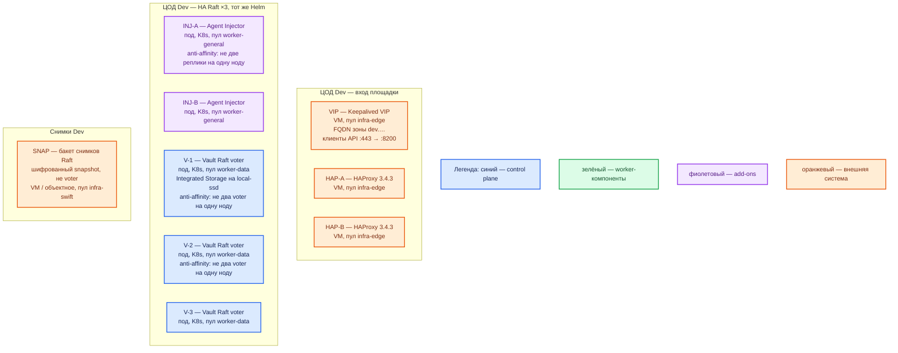

# HashiCorp Vault Community 2.0.4 — развёртывание, контур Dev

Тот же вид инсталляции, что Prod: Helm-чарт `hashicorp/vault` **0.34.1**, Vault Community **2.0.4**, режим **HA + Integrated Storage (Raft)**. Уменьшена ёмкость (CPU/RAM/диск) и число voter **5 → 3**, не механизм. Это **не** standalone+file, не `vault server -dev`, не Docker Compose и не один процесс «на VM по квикстарту».

**Helm** — программа, которая по шаблону ставит объекты в Kubernetes. **Raft** — протокол согласия: запись подтверждает большинство. У трёх voter кворум **2 из 3**; схема «2 пода» — другой класс системы (отказ одного = нет большинства).

## Допущения

- Один прикладной ЦОД. Kubernetes, пара HAProxy 3.4.3 + Keepalived + VIP, StorageClass с теми же именами (`local-ssd`, `shared-fs`), CoreDNS / `cluster.local`, зона `dev.…` — уже есть, меньше CPU/RAM/тома.
- Способ установки и роль-модель **как в Prod**: тот же чарт, HA+Raft, Injector, Shamir, снимки во внешний бакет. Не дефолт `helm install` (standalone + file — Security Warning HashiCorp). Не `-dev`.
- Второго прикладного ЦОДа и отдельного ЦОДа бэкапов нет: Injector с `externalVaultAddr` на чужой зал и бакет «за три площадки» на Dev **не** повторяем. Снимки — тем же `vault operator raft snapshot` в **меньший** бакет **этого** ЦОДа, чтобы остался тот же класс восстановления.
- Кворум не ужимаем до 1–2: **3** маленьких voter. «Один под Vault» не воспроизводит выборы лидера, join, forwarding **8201** и anti-affinity.
- Нагрузка не боевая. Цифр «хватит N ядер под Dev» в мануале **нет**.
- Учебные секреты и `tls_disable = 1` из раздела «Учебный стенд» `HashiCorp Vault.install.md` **не** копировать сюда как «почти бой». Для Dev — свои доли Shamir и токены контура, не git.

## Схема инстансов

Потоков данных на схеме нет. Состав ролей совпадает с Prod (минус второй зал); меньше ресурсы, **3** voter вместо 5.

ОС — свойство платформы, не пода. Один стандарт Linux на всех нодах контура.

Исключение вендора: HashiCorp для production рекомендует **Linux**; официальной матрицы дистрибутивов нет. В контейнере для Raft — `disable_mlock = true` (чарт дописывает сам).

| Имя пула | Роль | Зачем выделен |
|---|---|---|
| `infra-edge` | edge-VM | Та же пара HAProxy + VIP, что в Prod; меньше CPU/RAM у VM |
| `worker-general` | general | Два Injector; пул ≥ 2 нод |
| `worker-data` | data-localdisk | Три маленьких voter на `local-ssd`; пул ≥ 3 нод |
| `infra-swift` | vendor / object | Бакет снимков; не диск Raft |

Смысл цветов: **синий** — голосующие Raft; **зелёный** — отдельных data-only узлов нет; **фиолетовый** — Injector; **оранжевый** — VIP, HAProxy, бакет.

## Комментарии к схеме

### Чем Dev упрощает Prod (и чем не упрощает)

| Меняем | Не меняем |
|---|---|
| CPU/RAM/PVC меньше | Чарт **0.34.1**, образ **2.0.4**, HA+Raft |
| 3 voter вместо 5 (tolerance 1, не 2) | Нечётное число голосующих, не 2 и не 1 |
| Один ЦОД, один SoT | Init, Shamir, unseal каждого пода, join по 8200, Raft на **8201** |
| Тома меньше, те же имена StorageClass | `local-ssd` RWO, не NFS, не standalone |
| Нет Injector «на чужой зал» | Injector ×2, anti-affinity |
| Снимок в бакет этого ЦОДа | Тот же `raft snapshot save/restore`, не «PVC = бэкап» |

Так воспроизводятся ошибки вида инсталляции (накат чарта, печать, выборы лидера, forwarding, anti-affinity), которые `-dev` и один файл **не** показывают.

### VIP, HAP-A/B — вход

- **Функционал.** Как в Prod: FQDN зоны `dev.…` на VIP, HAProxy на API **8200**. **8201** клиентам не нужен.
- **Критично.** Health — `/v1/sys/health`, не TCP. Не публиковать 8200/8201 с VIP в интернет. Пара HAProxy остаётся парой. Kafka `:9092` сюда не публикуем. Для отладки TLS можно ослабить **только** в закрытом Dev; это уже не копия боя — помечать явно. Не использовать учебный port-forward как единственный вход контура.

### V-1..3 — маленькие Raft voter

- **Функционал.** Те же процессы `vault` 2.0.4, `storage "raft" { path = "/vault/data" }`. Три пода: кворум 2 из 3, один active, два standby с forwarding. Init один раз, unseal каждого, `raft join` на `vault-0.vault-internal:8200`.
- **Критично.** Не схлопывать в один под и не ставить `replicas: 2`: нет большинства при отказе — это не уменьшенный Prod. Anti-affinity чарта required: в пуле `worker-data` реально ≥ 3 нод, иначе планировщик не разместит три пода (или все окажутся на kind-одной-машине — устойчивость не доказать). PVC **`local-ssd`**, RWO; не `shared-fs`. Дефолт чарта 10Gi можно оставить как нижнюю границу Dev или чуть поднять; ориентир HashiCorp small (100+ ГБ) — для боя, не обязательный размер Dev. Ресурсы порядка **меньше Prod**: не обещать small 8–16 ГиБ как смету Dev; в доке минимума «чтобы контейнер встал» нет (чарт `resources: {}`; закомментированные 256Mi/250m — не гарантия). Уточняется замером. Тег **2.0.4**, не `latest`. Consul нет.

### INJ-A/B — Injector

- **Функционал.** Тот же webhook, что в Prod. Дефолт чарта — **1** реплика; на Dev ставим **2** (правило stateless: минимум две реплики на двух нодах), чтобы ловить балансировку webhook и отказ ноды.
- **Критично.** Не подменять Injector «приложение само ходит в `-dev`». Не включать CSI provider «на всякий». VSO на старте нет.

### SNAP — снимки

- **Функционал.** Тот же ручной snapshot Community, меньший бакет. Нужен, чтобы на Dev отрабатывали save/restore, а не только «данные на PVC».
- **Критично.** Не класть единственную копию снимка на тот же `local-ssd`, что Raft. Снимок ≠ второй voter. Community автоснимков не даёт.

## Путь роста

На Dev рост не планируем как боевой. Если не хватает места — увеличить PVC / RAM **этих же** трёх voter, не переходить на standalone/`-dev`. Пять voter — только если сознательно копируем Prod-эксперимент на этом же чарте. Stretch и второй живой кластер на Dev не добавляем.

## Сильные и слабые места

- **Сильная сторона.** Тот же Helm HA+Raft, что Prod: можно поймать сбой наката, печати, join, выборов и anti-affinity. Кворум трёх маленьких voter остаётся кворумом.
- **Слабая сторона.** Tolerance 1 (не 2, как у Prod×5). Малая ёмкость: OOM и полный диск наступят раньше. Один Dev-ЦОД: падение зала = нет секретов. Без auto-unseal рестарт пода = sealed.
- **Критичные условия.** Не standalone, не `-dev`, не Compose, не 1–2 voter. Не NFS как диск Raft. Не `latest`. Не unseal keys / root в git. 8200/8201 не в интернет. Учебный YAML из `HashiCorp Vault.install.md` (`tls_disable = 1`) сюда не переносить как целевой контур без пометки. Audit, если включить и некуда писать, остановит API.

## Источники

Те же, что у Prod:

- Релиз 2.0.4: https://github.com/hashicorp/vault/releases/tag/v2.0.4
- Helm 0.34.1, Security Warning standalone, k8s 1.32–1.36: https://developer.hashicorp.com/vault/docs/deploy/kubernetes/helm
- HA + Raft: https://developer.hashicorp.com/vault/docs/deploy/kubernetes/helm/examples/ha-with-raft
- values 0.34.1 (HA replicas 3, injector 1, PVC 10Gi): https://github.com/hashicorp/vault-helm/blob/v0.34.1/values.yaml
- 5 vs 3 voter, порты, small sizing: https://developer.hashicorp.com/vault/tutorials/day-one-raft/raft-reference-architecture
- Кворум / failure tolerance: https://developer.hashicorp.com/vault/docs/internals/integrated-storage
- Нет PR/DR в Community: https://developer.hashicorp.com/vault/tutorials/get-started/available-editions
- Снимки: https://developer.hashicorp.com/vault/docs/commands/operator/raft
- Учебный контур (именно **не** слепо копировать): `Out/Безопасность/HashiCorp Vault/HashiCorp Vault.install.md`
- Карточка: `Out/Безопасность/HashiCorp Vault/HashiCorp Vault.md`

**В доке вендора нет:** порог RTT ваших залов; готовая смета ядер под Dev; минимум CPU/RAM «чтобы контейнер встал».
