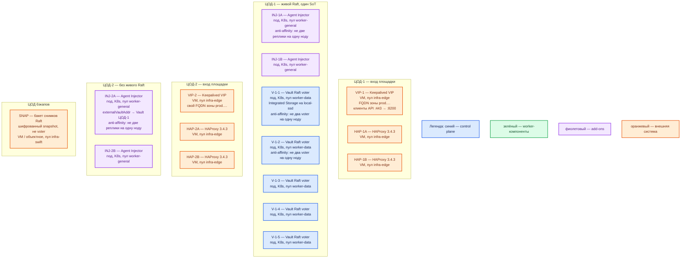

# HashiCorp Vault Community 2.0.4 — развёртывание, контур Prod

Хранилище секретов и ключей (пароли БД, сертификаты, короткие токены). **Community 2.0.4**, официальный Helm-чарт `hashicorp/vault` **0.34.1**. Это не Enterprise (`vault-enterprise`), не `vault server -dev` и не дефолт чарта (standalone + файловый бэкенд).

**Helm** — программа, которая по шаблону (чарт) ставит объекты в Kubernetes. **Raft / Integrated Storage** — встроенное хранилище Vault: журнал состояния копируется между подами, запись подтверждает большинство. **Active** — текущий лидер Raft (единственный, кто пишет). **Standby** — остальные голосующие: держат копию и в Community почти всегда **пересылают** запрос лидеру. **Seal / unseal** — после старта файлы на диске есть, мастер-ключа в памяти нет, API почти не обслуживает, пока не снимут печать.

## Допущения

- Площадки: два прикладных ЦОДа + один ЦОД под бэкапы. RTT между залами **не измерен**.
- На каждом прикладном ЦОДе уже есть Kubernetes **1.36.4** (чарт вендор проверяет на **1.32–1.36**), пара HAProxy **3.4.3** + Keepalived + VIP, StorageClass `local-ssd` (RWO) и `shared-fs` (RWX), CoreDNS / `cluster.local`, зона `prod.…`.
- Один живой Raft = **один ЦОД**. Порты **8200/TCP** (API и join узла) и **8201/TCP** (Raft, forwarding, mTLS узлов) **не** открываем между ЦОДами как «один кластер». Порог HashiCorp «RTT &lt; 8 мс» — между зонами облака, не лицензия на stretch.
- Community **не** даёт Performance Replication и DR replication. Второй живой Vault в ЦОД-2 — **вторая правда** секретов, не реплика. Источник истины — кластер ЦОД-1; ЦОД-2 и ЦОД бэкапов хранят **снимки**.
- Клиенты ЦОД-2 ходят на API ЦОД-1 по FQDN зоны `prod.…` (HTTPS **8200**). Это клиентский доступ, не join Raft.
- Consul как storage-backend **не** ставим. Docker Compose и пакеты на VM — не этот контур (запасной боевой путь, если Helm/K8s нет: systemd на Linux-VM, не Compose).
- Нагрузка не замерена. Ниже — минимальная отказоустойчивая топология и порядок величины, не смета «хватит на терабайты». Нагрузка Vault — число запросов к секретам, не объём озера. Терабайты персоналки в KV **не** кладём.
- Облачного KMS и HSM в исходных материалах платформы нет. PKCS#11 auto-unseal — **Enterprise**. На старте — Shamir (5 долей, порог 3) + runbook распечатки; auto-unseal (Cloud KMS / Transit) — путь роста, не выдуманный KMS.

## Схема инстансов

Имена — роли, не обязательные DNS. Потоков данных на схеме нет. Планировщик двигает поды по пулу; «под на ноде 3» не фиксируем.

ОС — свойство платформы, не пода. Один стандарт Linux на всех нодах контура.

Исключение вендора: HashiCorp для production рекомендует **Linux**; официальной матрицы дистрибутивов на страницах Helm и production-hardening **нет**. В контейнере чарта для Raft обязательно `disable_mlock = true` (чарт дописывает сам).

| Имя пула | Роль | Зачем выделен |
|---|---|---|
| `infra-edge` | edge-VM | Пара HAProxy + Keepalived + VIP: край HTTP(S) площадки и ControlPlaneEndpoint Kubernetes. Kafka `:9092` сюда не публикуем |
| `worker-general` | general | Agent Injector (stateless webhook). Без локального SSD под Raft |
| `worker-data` | data-localdisk | Пять подов Vault: PVC Integrated Storage на `local-ssd` (RWO). Пул ≥ 5 нод из-за anti-affinity |
| `infra-swift` | vendor / object | Бакет снимков Raft в ЦОДе бэкапов; не CSI-диск пода Vault |

Смысл цветов: **синий** — голосующие Raft (active и standby — одна роль, лидер выбирается); **зелёный** — отдельных data-only узлов у Community нет (данные на тех же voter); **фиолетовый** — Injector; **оранжевый** — VIP, HAProxy, бакет снимков.

## Комментарии к схеме

### VIP-1 / HAP-1A/B — вход ЦОД-1

- **Функционал.** VIP — виртуальный IP Keepalived: одно имя `prod.…` для клиентов API. HAProxy 3.4.3 — край HTTP(S). Клиенты (микросервисы, воркеры Camunda, интеграционное API, CLI/UI) ходят на **8200** по FQDN, не на Pod IP. **8201** на VIP не публикуем.
- **Критично.** Health check — `GET /v1/sys/health`, не «TCP 8200 открыт»: **200** active, **429** standby, **503** sealed, **501** не init. Standby в Community обслуживает через forwarding на **8201** — балансировщик может слать на оба живых. TLS **end-to-end**: не обрывать TLS на HAProxy/Ingress и дальше plaintext до пода (production-hardening). Дефолт чарта `tls_disable = 1` и `global.tlsDisable: true` в бой не копировать. **8200/8201** в интернет не публиковать. Kafka `:9092` через этот HAProxy не публикуем.

### V-1-1…V-1-5 — Raft voter, ЦОД-1

- **Функционал.** Процесс `vault` 2.0.4, storage `raft`, путь `/vault/data`. Пять голосующих: кворум **3 из 5**, отказ **двух** узлов переживается (ориентир HashiCorp для боя; минимум HA — 3 voter / отказ 1). Один active принимает запись; остальные standby. Добавление узлов **не** ускоряет запись. Образ `hashicorp/vault:2.0.4` по digest, не `latest`.
- **Критично.** Установка: Helm `hashicorp/vault` **0.34.1**, `server.ha.enabled=true`, `server.ha.raft.enabled=true`, `server.ha.replicas: 5`. Дефолт `helm install` без values = standalone + file — Security Warning HashiCorp, **не** бой. Чарт **не** делает `init`, unseal, бэкап. Init **один раз** на первом поде (`vault operator init`): 5 долей Shamir, порог 3, Initial Root Token — в сейф, **не** в git/ConfigMap/чат. Каждый под после рестарта запечатан, пока не unseal. Join остальных: `vault operator raft join` на внутренний DNS чарта (`vault-0.vault-internal:8200`), порт **8201** только внутри ЦОД-1. Anti-affinity чарта — **required** по hostname: пул `worker-data` ≥ 5 нод, иначе поды не встанут. PVC — StorageClass **`local-ssd`**, RWO, свой на под; **не** `shared-fs`, **не** NFS как `path` Raft (данные Integrated Storage на той же машине, что процесс; NFS в validated designs — приёмник **снимков**). Дефолт PVC чарта **10Gi** для боя мал: ориентир HashiCorp *small* — **100+ ГБ SSD**, от 3000 IOPS / 75 МБ/с. Ёмкость процесса — порядок **2–4 CPU, 8–16 ГиБ RAM** (small); пример в Kubernetes-гайде: requests **2000m / 8Gi**, limit CPU **2000m**, memory **16Gi**. Это starting point вендора, **не** смета этой платформы; уточняется замером. Consul не подключаем. После настройки auth отозвать root.

### INJ-1A/B — Agent Injector, ЦОД-1

- **Функционал.** Mutating admission webhook (`vault-k8s`): по аннотации добавляет в под Vault Agent (init/sidecar). Сам секреты приложений не хранит. Образ чарта 0.34.1: `hashicorp/vault-k8s:1.7.6`.
- **Критично.** Дефолт чарта `injector.replicas: 1`. Для паритета и отказа ноды ставим **2** на `worker-general`; anti-affinity чарта — required по hostname. Sidecar не обязателен: приложение может ходить в API само (Kubernetes JWT / AppRole). Падение Vault само по себе **не** убивает под приложения. CSI provider чарта (`csi.enabled`) по умолчанию **false** — на старте не включаем. Vault Secrets Operator — **отдельный** продукт: кладёт секрет в Kubernetes Secret (etcd); без encryption-at-rest etcd это base64 ≠ шифр Vault. VSO на старте не ставим.

### VIP-2 / HAP-2* и INJ-2A/B — ЦОД-2 без Raft

- **Функционал.** Вход площадки тот же класс (пара + VIP). Injector в Kubernetes ЦОД-2 ставится **тем же чартом 0.34.1** без серверов: `global.externalVaultAddr` на HTTPS FQDN Vault ЦОД-1 (поле отключает деплой server). Поды ЦОД-2 получают sidecar так же, как в ЦОД-1, но ходят в единственный SoT.
- **Критично.** Не поднимать второй `server.ha.raft` в ЦОД-2 «для симметрии»: без PR/DR это два независимых кластера и разъезд политик/ключей. Не открывать **8201** в ЦОД-1. Клиентский **8200** с ЦОД-2 — только на VIP ЦОД-1 по FQDN. Падение ЦОД-1 = нет выдачи секретов, пока restore снимка в этом (или другом) зале.

### SNAP — снимки Raft

- **Функционал.** Community снимает снимок **вручную**: `vault operator raft snapshot save` / `restore`. Автоснимки по расписанию — Enterprise. Файл шифрованный; хранить в ЦОДе бэкапов (S3-совместимый API / Swift), не на PVC тех же voter.
- **Критично.** Снимок — **не** шестой voter и не DR-реплика. RPO = интервал копирования. Restore — отдельная процедура (новый кластер + unseal), не «подхватит сам». Копию снимка не держать только в ЦОД-1.

### Чего на схеме нет специально

- Standalone + file, `server.dev.enabled`, Docker Compose, `latest`.
- Второй живой Raft в ЦОД-2 и stretch 8201.
- Consul storage, VSO, CSI secrets provider, performance standby (Enterprise).
- Учебный `tls_disable = 1` как целевой бой.

## Путь роста

Не включать сразу. Когда замер покажет упор:

1. Вертикаль **active**: CPU/RAM и IOPS `local-ssd`, не «ещё +10 voter». Лишние голосующие запись не ускоряют.
2. Увеличить PVC (`server.dataStorage.size`, нужен `allowVolumeExpansion` у `local-ssd`).
3. Пик admission — реплики Injector (уже 2; дальше по замеру webhook).
4. Auto-unseal (Cloud KMS или Transit другого Vault), если появится провайдер: иначе каждый reschedule = ручной Shamir.
5. Второй audit device (если включённый device не может писать — Vault **отказывается** обслуживать запрос).
6. Межплощадочный горячий SoT — только Enterprise PR/DR и лицензия; в Community этого нет. Авария зала — restore снимка, не stretch.

Следующий нечётный размер кворума после 5 — 7, только если нужна большая failure tolerance; это не масштабирование RPS.

## Сильные и слабые места

- **Сильная сторона.** Официальный Helm HA+Raft, тот же механизм, что Dev. Пять voter в одном зале: отказ двух подов/нод при живом кворуме. Снимки живут вне зала. Клиенты ЦОД-2 не плодят вторую правду секретов.
- **Слабая сторона.** Падение ЦОД-1 останавливает выдачу секретов до restore (RPO = снимок). Community не масштабирует чтение performance standby и не реплицирует кластер на другой зал. Без auto-unseal Kubernetes-рестарт = sealed. Ёмкость без замера неизвестна.
- **Критичные условия.** Не stretch 8200/8201 как один кластер. Не standalone/`-dev`/Compose в бой. Не `latest`. Не NFS/`shared-fs` как диск Raft. Не unseal keys и root в git. Не три независимых Vault «как единые ключи». Не публиковать 8200/8201 в интернет. Не считать TCP-health достаточным. После init включить audit осознанно (нет записи → отказ API). Не класть озеро в KV.

## Источники

- Релиз 2.0.4: https://github.com/hashicorp/vault/releases/tag/v2.0.4
- Helm 0.34.1, app 2.0.4, k8s 1.32–1.36, Helm 3.6+, Security Warning standalone: https://developer.hashicorp.com/vault/docs/deploy/kubernetes/helm
- HA + Raft (init, unseal, join, list-peers): https://developer.hashicorp.com/vault/docs/deploy/kubernetes/helm/examples/ha-with-raft
- `helm install --version`, run: https://developer.hashicorp.com/vault/docs/deploy/kubernetes/helm/run
- values 0.34.1 (tag 2.0.4, HA replicas 3, injector replicas 1, PVC 10Gi RWO, CSI off, `externalVaultAddr`): https://github.com/hashicorp/vault-helm/blob/v0.34.1/values.yaml
- 5 узлов, RTT &lt; 8 мс, порты 8200/8201, small 2–4 CPU / 8–16 ГБ / 100+ ГБ, запись не масштабируется узлами, `/v1/sys/health` на LB: https://developer.hashicorp.com/vault/tutorials/day-one-raft/raft-reference-architecture
- Пример requests 8Gi / 2000m: https://developer.hashicorp.com/vault/tutorials/kubernetes/kubernetes-raft-deployment-guide
- Кворум, 5 voter = tolerance 2, Autopilot: https://developer.hashicorp.com/vault/docs/internals/integrated-storage
- Нет PR/DR в Community; Cloud KMS auto-unseal есть, HSM auto-unseal нет: https://developer.hashicorp.com/vault/tutorials/get-started/available-editions
- Снимки Community вручную: https://developer.hashicorp.com/vault/docs/commands/operator/raft
- Audit: нет записи → отказ API: https://developer.hashicorp.com/vault/docs/audit
- Production hardening (TLS e2e, не root, короткий TTL, Linux): https://developer.hashicorp.com/vault/docs/concepts/production-hardening
- `disable_mlock` при Integrated Storage: https://developer.hashicorp.com/vault/docs/configuration#disable_mlock · https://developer.hashicorp.com/vault/docs/configuration/storage/raft
- Listener 8200 / cluster 8201: https://developer.hashicorp.com/vault/docs/configuration/listener/tcp
- Коды `/v1/sys/health`: https://developer.hashicorp.com/vault/api-docs/system/health
- Agent Injector: https://developer.hashicorp.com/vault/docs/deploy/kubernetes/injector
- Карточка / install (учебный контур не копировать в бой): `Out/Безопасность/HashiCorp Vault/HashiCorp Vault.md`, `HashiCorp Vault.install.md`

**В доке вендора нет (не выдумано):** минимум CPU/RAM «чтобы контейнер просто встал»; IOPS/RPS этой платформы; RTT между вашими ЦОДами; логин/пароль по умолчанию; прямой запрет NFS одной фразой на странице Raft (есть «данные на хосте процесса» и RWO PVC).
