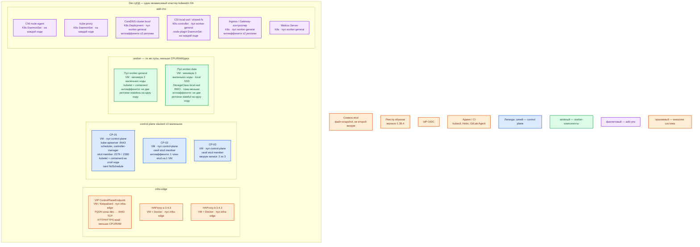

# Kubernetes 1.36.4 — Dev

Vanilla Kubernetes **1.36.4**, сборка **kubeadm**, CRI **containerd**. Контур: **Dev**. Это **уменьшенный Prod**, не другой вид инсталляции: тот же stacked HA, тот же ControlPlaneEndpoint на VIP, те же пулы и те же StorageClass. Не kind, не minikube, не k3d, не одна нода.

**kubeadm** — официальная программа сборки кластера. **containerd** — CRI на каждой ноде (не Docker Engine). **etcd** — база состояния API; кворум — большинство членов (2 из 3). **ControlPlaneEndpoint** — FQDN VIP, не IP одной VM.

## Допущения

- Один прикладной ЦОД. Stretch нет.
- Виртуализация есть. Сеть в деталях вне рамок.
- Та же пара **HAProxy 3.4.3 + Keepalived + VIP**, меньше CPU/RAM у VM входа. VIP = `:6443` TCP passthrough и край HTTP(S). Kafka `:9092` не через этот HAProxy.
- Те же имена StorageClass: `local-ssd` (RWO), `shared-fs` (RWX только как исключение). Тома меньше, имена классов те же. NFS — не диск etcd.
- DNS: внутри CoreDNS / `cluster.local`; снаружи зона `dev.…`. Клиенты по FQDN, не Pod IP.
- CNI не зафиксирован, обязан уметь NetworkPolicy. CSI-продукт не зафиксирован. Windows-ноды не ставим.
- Нагрузка не замерена. Уменьшаем ёмкость VM и дисков, **не** число голосующих etcd и не механизм установки.
- Учебный однонодовый сценарий из `Kubernetes.install.md` (снятие taint со всех, init без `--control-plane-endpoint`) — **не** этот контур. Команды пакетов, containerd и пин 1.36.4 — те же.
- PSA: namespace разработки с `pod-security.kubernetes.io/enforce=baseline`.
- Снимки etcd можно класть на ту же площадку или в контурный бэкап; живого «второго ЦОДа etcd» нет.

## Схема инстансов

Без потоков данных. Роль-модель совпадает с Prod: 3 маленьких control-plane, не 1 и не 2.



ОС — свойство платформы, не пода. Один стандарт Linux на всех нодах контура.

Исключение вендора: тот же, что Prod — glibc (Debian / Ubuntu / RHEL-подобные), не Alpine. **cgroup v2**. Не подменять ноду кластера kind-кластером на ноутбуке.

| Имя пула | Роль | Зачем выделен |
|---|---|---|
| `control-plane` | control-plane | Три маленьких stacked-ноды. Схема «1 нода» или «2 ноды» — другой класс системы: нет переживания отказа / нет большинства |
| `worker-general` | general | Stateless и add-ons. Минимум 3 ноды, чтобы ≥2 реплики сидели на разных машинах и оставался запас на отказ одной |
| `worker-data` | data-localdisk | Те же `local-ssd` / `shared-fs`, меньшие тома. Не hostPath «потому что Dev» |
| `infra-edge` | edge-VM | Та же пара HAProxy + VIP, меньше CPU/RAM. Иначе ошибка «у нас API на IP первой VM» на Prod не воспроизведётся |

## Комментарии к схеме

### VIP + пара HAProxy — `infra-edge`

- **Функционал.** ControlPlaneEndpoint Dev и HTTP(S) край. FQDN зоны `dev.…`.
- **Критично.** Не упрощать до «ходим на :6443 первой CP-VM». Без VIP не проверяются SAN сертификата, failover API и тот же join-флаг, что в Prod. TCP passthrough `:6443`, не TLS-терминация API. Пара нужна: один контейнер HAProxy — учебный стенд HAProxy, не этот контур.

### CP-01…CP-03 — три маленьких control-plane

- **Функционал.** Тот же stacked набор: kube-apiserver, scheduler, controller-manager, локальный etcd, kubelet, containerd.
- **Критично.** Нечётное число голосующих **3**, не 2 и не 1. Две CP-ноды — не уменьшенный Prod: отказ одной = нет кворума или split-brain. Taint control-plane **не** снимать, иначе Dev начнёт сажать прикладные поды на etcd-машины, а Prod — нет; обновления и PDB поедут по-разному. etcd на локальном диске VM, не NFS. Пакеты **1.36.4** + hold. CRI containerd до init.

Ёмкость: не ниже официального минимума kubeadm **2 CPU / 2 ГиБ** на машину. Это пол «чтобы kubeadm init прошёл», не гарантия удобной работы stacked HA. Typical 8 ГиБ RAM из гайда etcd — ориентир боя; на Dev можно меньше, но **не** ценой удаления членов кворума. Точную цифру вендор для «маленький stacked Dev» не даёт — замер.

Init тот же, что Prod:

```text
kubeadm init --kubernetes-version=v1.36.4 --control-plane-endpoint "<FQDN-VIP-dev>:6443" --upload-certs
```

Сразу CNI. Второй и третий CP — `kubeadm join --control-plane`. Ключ `--certificate-key` — 2 часа. Без `--control-plane-endpoint` этот кластер в HA не дорастёт.

### Пул `worker-general`

- **Функционал.** Stateless платформы и Dev-сервисы.
- **Критично.** Минимум **2 реплики на 2 нодах** для шлюза/UI/веба; пул стартуем с **3 маленьких** нод, как «Before you begin» HA kubeadm и чтобы отказ одной ноды не схлопывал обе реплики. Схема «1 worker» не ловит антиаффинити и балансировку Service.

### Пул `worker-data`

- **Функционал.** Те же stateful-операторы, что в Prod, на `local-ssd`.
- **Критично.** Не заменять CSI учебным hostPath: WaitForFirstConsumer, привязка PVC к ноде и restore на Dev должны совпадать по механизму. Уменьшаем размер тома, не класс хранилища. Для кворумных приложений (Patroni, Kafka KRaft, …) на Dev оставляют 3 маленьких голосующих пода на разных нодах этого пула — это требование паритета, не «два пода на одной VM».

### CNI, kube-proxy, CoreDNS, CSI, Ingress, Metrics Server

- **Функционал.** Тот же набор add-ons, что Prod.
- **Критично.** Без CNI нет Ready. CoreDNS и Ingress — ≥2 реплики, разные ноды. Имена StorageClass те же (`local-ssd`, `shared-fs`). kubeadm CSI и Ingress сам не ставит — ставим те же продукты, что в Prod, меньшими репликами/ресурсами, не «skip на Dev».

### Снимок etcd

- **Функционал.** Проверка backup/restore тем же `etcdctl snapshot save`, что в Prod.
- **Критично.** Не считать Dev-кластер «живым кворумом Prod». Не хранить `admin.conf` / join-токен в git. Токен join по умолчанию **24 ч**.

Чего этот контур **ещё не доказывает:** отказ целого прикладного ЦОДа Prod, межплощадочную репликацию приложений, нагрузку терабайт. Он **доказывает** то, чего нет у kind/одной VM: выборы лидера etcd, ControlPlaneEndpoint, отказ одной CP-ноды, две реплики на двух worker, CSI не hostPath.

## Путь роста

Совпадает с Prod, только ёмкость меньше:

1. Не добавлять четвёртый etcd «для верности» и не схлопывать до одной ноды.
2. Сначала requests подов, потом ещё маленькие worker-ноды тех же пулов.
3. Upgrade тем же правилом skew: без пропуска minor, не `latest`.
4. Когда Dev начнёт врать из-за нехватки CPU — увеличить VM, не сменить дистрибутив на k3s/minikube.

## Сильные и слабые места

**Сильная сторона.** Тот же kubeadm HA 1.36.4 и те же роли, что Prod: ошибка из-за вида инсталляции (один etcd, Compose, kind) на этом стенде воспроизводится. Отказ одной маленькой CP-ноды оставляет кворум.

**Слабая сторона.** Маленькие VM быстрее упираются в CPU/RAM; etcd чувствителен к медленному диску даже на Dev. Два контура всё равно два kubeconfig / два endpoint.

**Критичные условия**

- Не kind / minikube / k3d / одна VM «потому что Dev».
- Не 2 control-plane. Не снимать taint CP. Не dockerd как CRI.
- Не NFS для etcd. Не другой StorageClass «по-простому».
- Не публиковать `:6443` в интернет. Не `latest`.
- Не копировать в Prod учебные пароли и YAML стенда — заводского веб-пароля kubeadm нет; учётка = клиентский сертификат в kubeconfig.

## Источники

Те же страницы, что Prod; Dev не имеет отдельного «официального маленького HA».

- Релиз 1.36.4: https://github.com/kubernetes/kubernetes/releases/tag/v1.36.4
- HA kubeadm: https://v1-36.docs.kubernetes.io/docs/setup/production-environment/tools/kubeadm/high-availability/
- Минимум 3 stacked CP: https://v1-36.docs.kubernetes.io/docs/setup/production-environment/tools/kubeadm/ha-topology/
- Минимум 2 CPU / 2 ГиБ, пин 1.36.4: https://v1-36.docs.kubernetes.io/docs/setup/production-environment/tools/kubeadm/install-kubeadm/
- Init без ControlPlaneEndpoint нельзя дорастить до HA; один etcd = нет переживания ноды: https://v1-36.docs.kubernetes.io/docs/setup/production-environment/tools/kubeadm/create-cluster-kubeadm/
- CRI containerd: https://v1-36.docs.kubernetes.io/docs/setup/production-environment/container-runtimes/
- PSA baseline: https://v1-36.docs.kubernetes.io/docs/concepts/security/pod-security-admission/
- kind (не этот контур): https://kind.sigs.k8s.io/docs/user/quick-start/
- etcd: один ЦОД когда возможно, SSD, не NFS: https://etcd.io/docs/v3.6/op-guide/hardware/
- Учебный однонодовый путь (не Dev-паритет): `Out/Платформенная инфра/Kubernetes/Kubernetes.install.md`

**В доке вендора нет:** цифра «столько RAM хватит трём маленьким stacked CP»; разрешение собрать Dev на одной ноде; порог RTT.
