# Kubernetes 1.36.4 — Prod

Vanilla Kubernetes **1.36.4**, сборка **kubeadm**, CRI **containerd**. Контур: **Prod**. Два прикладных ЦОДа — два независимых кластера. ЦОД-бэкапы — хранилище снимков, **без** живых членов etcd.

**kubeadm** — официальная программа, которая собирает кластер из Linux-машин. **CRI / containerd** — демон на каждой ноде; kubelet просит его запускать контейнеры через локальный сокет, не через Docker Engine. **etcd** — база состояния API (объекты, настройки, Secrets); прикладные терабайты в ней не живут. **ControlPlaneEndpoint** — постоянное DNS-имя API, указывает на VIP пары HAProxy, а не на одну VM.

## Допущения

- Виртуализация есть: все ноды и пара входа — Linux-VM. VLAN/IP-план вне рамок.
- Прикладных ЦОДов два; третий — только бэкапы. RTT между ЦОДами **не измерен**.
- Stretch одного etcd / одного Kubernetes на 2–3 ЦОДа **нет**: порога RTT в документации Kubernetes нет, etcd просит класть членов в один дата-центр, когда возможно.
- На каждом прикладном ЦОДе уже (или будет) пара **HAProxy 3.4.3 + Keepalived + VIP**. VIP = ControlPlaneEndpoint `:6443` (TCP passthrough) и край HTTP(S). Kafka `:9092` через этот HAProxy не публикуем.
- Топология control plane — **stacked etcd** (вариант kubeadm по умолчанию): член etcd на каждой control-plane-VM. External etcd (ещё три машины) не берём на старте.
- Конкретный CNI в карточке **не** зафиксирован. Обязателен один CNI с **NetworkPolicy**. Flannel для этой платформы не брать.
- CSI-продукт в карточке Kubernetes **не** зафиксирован. Имена классов задаёт платформа: `local-ssd` (RWO) и `shared-fs` (RWX, только по списку исключений). NFS — не диск etcd.
- Нагрузка не замерена. Ниже — минимальная отказоустойчивая топология и порядок величины, не смета «хватит на терабайты».
- Реестр: `registry.k8s.io` или зеркало с образами **1.36.4**. Windows-ноды эта инструкция не ставит.
- Людей в API пускаем через IdP (OIDC), не раздаём `admin.conf` на отдел.
- ЦОД-бэкапы **не** поднимает третий живой кластер и **не** входит в etcd-кворум площадок. Туда копируют снимки etcd (`etcdctl snapshot save`) и прочие бэкапы контура. Продукт объектного хранилища в этой карточке не фиксируем.

## Схема инстансов

Без потоков данных. ЦОД-1 и ЦОД-2 — две копии одной роль-модели, разные PKI, разные CIDR, разные VIP.

```mermaid
flowchart TB
  subgraph DC1["ЦОД-1 — независимый кластер kubeadm"]
    subgraph E1["infra-edge"]
      VIP1["VIP-1 ControlPlaneEndpoint<br/>VM / Keepalived · пул infra-edge<br/>FQDN зоны prod.… :6443 TCP<br/>HTTP/HTTPS край"]
      HAP1A["HAProxy-1a 3.4.3<br/>VM + Docker · пул infra-edge"]
      HAP1B["HAProxy-1b 3.4.3<br/>VM + Docker · пул infra-edge"]
    end
    subgraph C1["control-plane stacked x3"]
      CP11["CP-01<br/>VM · пул control-plane<br/>kube-apiserver :6443<br/>scheduler, controller-manager<br/>etcd member :2379 / :2380<br/>kubelet + containerd на этой ноде<br/>taint NoSchedule"]
      CP12["CP-02<br/>VM · пул control-plane<br/>те же процессы, свой etcd member<br/>антиаффинити: 1 член etcd на 1 VM"]
      CP13["CP-03<br/>VM · пул control-plane<br/>те же процессы, свой etcd member<br/>кворум записи: 2 из 3"]
    end
    subgraph W1["worker"]
      WG1["Пул worker-general<br/>VM · минимум 3 ноды<br/>kubelet + containerd<br/>антиаффинити: не две реплики stateless на одну ноду"]
      WD1["Пул worker-data<br/>VM · минимум 3 ноды · local SSD<br/>StorageClass local-ssd RWO<br/>антиаффинити: не две реплики stateful на одну ноду"]
    end
    subgraph A1["add-ons"]
      CNI1["CNI node-agent<br/>K8s DaemonSet · на каждой ноде"]
      KPX1["kube-proxy<br/>K8s DaemonSet · на каждой ноде"]
      DNS1["CoreDNS cluster.local<br/>K8s Deployment · пул worker-general<br/>антиаффинити ≥2 реплики"]
      CSI1["CSI local-ssd / shared-fs<br/>K8s controller · пул worker-general<br/>node-plugin DaemonSet · на каждой ноде"]
      ING1["Ingress / Gateway-контроллер<br/>K8s · пул worker-general<br/>антиаффинити ≥2 реплики"]
      MET1["Metrics Server<br/>K8s · пул worker-general"]
    end
  end

  subgraph DC2["ЦОД-2 — независимый кластер kubeadm"]
    subgraph E2["infra-edge"]
      VIP2["VIP-2 ControlPlaneEndpoint<br/>VM / Keepalived · пул infra-edge<br/>свой FQDN зоны prod.… :6443"]
      HAP2A["HAProxy-2a 3.4.3<br/>VM + Docker · пул infra-edge"]
      HAP2B["HAProxy-2b 3.4.3<br/>VM + Docker · пул infra-edge"]
    end
    subgraph C2["control-plane stacked x3"]
      CP21["CP-01<br/>VM · пул control-plane"]
      CP22["CP-02<br/>VM · пул control-plane"]
      CP23["CP-03<br/>VM · пул control-plane"]
    end
    subgraph W2["worker"]
      WG2["Пул worker-general<br/>VM · минимум 3 ноды<br/>антиаффинити stateless"]
      WD2["Пул worker-data<br/>VM · минимум 3 ноды · local SSD<br/>антиаффинити stateful"]
    end
    subgraph A2["add-ons"]
      CNI2["CNI + kube-proxy<br/>K8s DaemonSet · на каждой ноде"]
      DNS2["CoreDNS<br/>K8s · пул worker-general · ≥2 реплики"]
      CSI2["CSI local-ssd / shared-fs<br/>K8s · controller + DaemonSet"]
      ING2["Ingress / Gateway<br/>K8s · пул worker-general · ≥2 реплики"]
    end
  end

  subgraph BKP["ЦОД-бэкапы — без живого etcd-кворума"]
    SNAP["Снимки etcd ЦОД-1 и ЦОД-2<br/>файл snapshot, не член Raft<br/>VM или объектное хранилище контура"]
  end

  REG["Реестр образов<br/>Harbor / зеркало 1.36.4"]
  IDP["IdP OIDC"]
  ADM["Админ / GitOps / CI<br/>kubectl, Helm, GitLab Agent"]

  LEGCORE["Легенда: синий — control plane"]
  LEGWORK["зелёный — worker-компоненты"]
  LEGADD["фиолетовый — add-ons"]
  LEGEXT["оранжевый — внешняя система"]

  classDef core fill:#dbeafe,stroke:#2563eb,color:#172554,stroke-width:2px;
  classDef worker fill:#dcfce7,stroke:#16a34a,color:#14532d,stroke-width:2px;
  classDef addon fill:#f3e8ff,stroke:#9333ea,color:#581c87,stroke-width:2px;
  classDef external fill:#ffedd5,stroke:#ea580c,color:#7c2d12,stroke-width:2px;

  class CP11,CP12,CP13,CP21,CP22,CP23,LEGCORE core;
  class WG1,WD1,WG2,WD2,LEGWORK worker;
  class CNI1,KPX1,DNS1,CSI1,ING1,MET1,CNI2,DNS2,CSI2,ING2,LEGADD addon;
  class VIP1,HAP1A,HAP1B,VIP2,HAP2A,HAP2B,SNAP,REG,IDP,ADM,LEGEXT external;
```



ОС — свойство платформы, не пода. Один стандарт Linux на всех нодах контура.

Исключение вендора: kubeadm из коробки рассчитан на glibc (Debian / Ubuntu / RHEL-подобные). Alpine как ОС ноды не берём. Ядро с **cgroup v2**.

| Имя пула | Роль | Зачем выделен |
|---|---|---|
| `control-plane` | control-plane | Три stacked-ноды с kube-apiserver, scheduler, controller-manager и членом etcd. Не пул прикладных подов |
| `worker-general` | general | Stateless-приложения, CoreDNS, Ingress, CSI-controller. Без ставки на локальный SSD |
| `worker-data` | data-localdisk | Stateful-операторы на `local-ssd` (RWO, CSI). Локальный SSD, не NFS |
| `infra-edge` | edge-VM | Пара HAProxy + Keepalived + VIP. Вне кластера: ControlPlaneEndpoint и HTTP(S) край |

## Комментарии к схеме

### VIP + HAProxy-a/b — `infra-edge` (каждый прикладной ЦОД)

- **Функционал.** Стабильный адрес API и вход HTTP(S) площадки. Клиенты и kubelet ходят на FQDN зоны `prod.…`, не на IP одной control-plane-VM и не на Pod IP.
- **Критично.** Балансировщик API — **TCP forwarding** на `:6443`, health check — TCP до kube-apiserver. TLS API **не** терминировать на HAProxy: сертификат kubeadm выписан на ControlPlaneEndpoint. Адрес LB должен совпадать с `--control-plane-endpoint` ещё на `kubeadm init`. Kafka `:9092` сюда не публиковать. `:6443` не с интернета.

### CP-01…CP-03 — `control-plane`

- **Функционал.** Управление кластером этой площадки. **kube-apiserver** — HTTPS API (`:6443`). **kube-scheduler** выбирает ноду новому поду. **kube-controller-manager** доводит фактическое состояние до желаемого. **etcd** хранит состояние и согласует запись протоколом Raft (`:2379` клиент, `:2380` обмен членов).
- **Критично.** Минимум **три** stacked-ноды: отказ одной VM = потеря и API-инстанса, и члена etcd; при трёх членах кворум записи остаётся (2 из 3). Чётвёртый антипаттерн: etcd только в первом ЦОДе, воркеры везде — смерть первого ЦОДа оставляет воркеры без API. etcd только на **локальном SSD**, каталог kubeadm `/var/lib/etcd`, не NFS и не `shared-fs`. Между членами etcd балансировщик не ставить. Taint `node-role.kubernetes.io/control-plane:NoSchedule` **не** снимать (это не учебный однонодовый стенд). Пакеты `kubelet`/`kubeadm`/`kubectl` пинить **1.36.4**, hold; `--kubernetes-version=v1.36.4` обязателен (дефолт kubeadm — `stable-1`, не этот патч). CRI — containerd **до** init; `dockerd` как CRI не используем.

Ёмкость control-plane (порядок величины, уточняется замером): официальный минимум kubeadm — **2 CPU и 2 ГиБ RAM** на машину, это «чтобы завелось», не HA. Для etcd typical — **8 ГиБ RAM**, SSD, для нагруженных контуров ориентир **500 sequential IOPS**; typical CPU etcd — 2–4 ядра. Отдельной цифры «итого на stacked-VM вместе с kube-apiserver» в доке Kubernetes **нет**. Квота etcd по умолчанию **2 ГиБ**, обычный потолок **8 ГиБ** — только метаданные кластера, не терабайты приложений.

Heartbeat etcd завод **100 ms**, election **1000 ms**; election ≥ 10× RTT. Порога RTT у Kubernetes нет — члены одного etcd не разносим по ЦОДам.

### Пул `worker-general`

- **Функционал.** CPU/RAM для stateless-подов и части add-ons. На каждой ноде: kubelet, containerd, kube-proxy (или замена в выбранном CNI).
- **Критично.** Стартуем с **минимум 3 нод** (так в «Before you begin» HA kubeadm). Антиаффинити / topologySpread: две реплики одного Deployment не на одну ноду. Requests у подов обязательны, иначе BestEffort выкинут первыми. Цифр «N worker на терабайты» в доке **нет** — терабайты в PVC/Kafka/БД.

### Пул `worker-data`

- **Функционал.** Ноды с локальным SSD под CSI `local-ssd` (RWO) для stateful-операторов.
- **Критично.** PVC `local-ssd` привязан к ноде: потеря ноды ≠ «под просто переехал с диском». Репликацию данных делает сам продукт (Kafka, Postgres, …), не Kubernetes. `shared-fs` (RWX) — только по явно названному исключению, не StorageClass по умолчанию. Swift — свои диски, не CSI этого пула. На старте минимум 3 ноды, чтобы кворумные приложения могли разъехаться; размер дисков — порядок величины, замер позже.

### CNI и kube-proxy — DaemonSet, на каждой ноде

- **Функционал.** Сеть подов и правила Service.
- **Критично.** Без CNI сразу после `kubeadm init` нода не станет `Ready`, CoreDNS не станет Running. Один CNI на кластер. NetworkPolicy без реализации в CNI — декорация. Pod CIDR, если его требует CNI, задаётся **на init**, не после. CIDR подов и Service **разных** кластеров (ЦОД-1 и ЦОД-2) не пересекаются. Service CIDR дефолт kubeadm `10.96.0.0/12`, DNS-домен `cluster.local`.

### CoreDNS

- **Функционал.** DNS внутри кластера: `*.svc.cluster.local`. Снаружи имена зоны `prod.…` на VIP и сервисы.
- **Критично.** ≥2 реплики, не на одной ноде. Клиенты — по FQDN, не по Pod IP.

### CSI `local-ssd` / `shared-fs`

- **Функционал.** Заказ и монтирование томов. kubeadm CSI сам не ставит.
- **Критично.** etcd на CSI/NFS не класть. Учебный hostPath / local-path в бой не копировать.

### Ingress / Gateway-контроллер

- **Функционал.** HTTP(S) с VIP края до Service/подов. Объекты Ingress/Gateway без контроллера трафик не обслуживают.
- **Критично.** Продукт контроллера в карточке Kubernetes не зафиксирован. ≥2 реплики на разных нодах `worker-general`. LoadBalancer «из облачного гайда» на железе сам не появится.

### Metrics Server

- **Функционал.** Метрики CPU/RAM подов для HPA. kubeadm его не ставит.
- **Критично.** Опциональный add-on; без него HPA по ресурсам не заработает. Не путать с Prometheus.

### ЦОД-бэкапы (`SNAP`)

- **Функционал.** Периодические снимки etcd каждого прикладного кластера + проверка restore. Каталог данных etcd на площадке — `/var/lib/etcd`.
- **Критично.** Снимок — файл, **не** четвёртый член Raft и не «etcd в бэкап-ЦОДе голосует». Восстановление — отдельная процедура площадки; приложения сами PVC в чужой ЦОД не перевезут. `admin.conf` / `super-admin.conf` / bootstrap-токены в git и на снимок «как секрет в открытую» не класть. Сертификаты kubeadm по умолчанию живут **1 год**.

### Реестр и IdP

- Образы control plane фиксировать: `kubeadm config images list --kubernetes-version=v1.36.4`.
- `super-admin.conf` обходит RBAC — в сейф, не в повседневный kubectl. Secrets в etcd по умолчанию **plaintext**, пока нет EncryptionConfiguration.

Первый control-plane площадки:

```text
kubeadm init --kubernetes-version=v1.36.4 --control-plane-endpoint "<FQDN-VIP>:6443" --upload-certs
```

Затем сразу CNI. Остальные CP — `kubeadm join --control-plane` по одному; ключ `--certificate-key` живёт **2 часа**. Кластер, собранный **без** `--control-plane-endpoint`, kubeadm в HA не конвертирует. Учебный `kubectl taint nodes --all node-role.kubernetes.io/control-plane-` в Prod не делать.

## Путь роста

Не включать сразу.

1. Сначала requests/limits подов и HPA (нужен Metrics Server или адаптер).
2. Потом добавлять ноды `worker-general`, затем `worker-data` (диски под фактический PVC).
3. Давление на API/etcd растёт вместе с числом нод — это вторая ось, не «ещё один брокер».
4. Следующий нечётный размер etcd — 5 членов, только после замера; не растягивать их на второй ЦОД.
5. Upgrade без пропуска minor (1.36 → 1.37, не через версию). RC/latest не брать. На дату соседнего install.md v1.37.0 GA не было.

Добавление пода stateful-продукта само по себе не увеличивает ёмкость его данных.

## Сильные и слабые места

**Сильная сторона.** Официальный HA kubeadm (stacked, минимум 3 CP), тот же плейбук 1.36.4, что и Dev. Blast radius = площадка: отказ ЦОД-1 не ломает etcd ЦОД-2. TCP VIP переживает отказ одной HAProxy-машины и одной CP-ноды.

**Слабая сторона.** Два кластера = два PKI, два upgrade, два CIDR. Приложение само активно на двух кластерах не становится. Stacked: падение CP-VM бьёт сразу по API и по etcd-члену. Без GitOps манифесты разъедутся.

**Критичные условия**

- Не stretch etcd / Kubernetes на 2–3 ЦОДа и не «etcd только в ЦОД-1».
- Не один control-plane и не kind/minikube «чуть подкрученный» в бой.
- Не `latest`, не skip minor, не dockerd как CRI, не без CNI, не без NetworkPolicy-реализации.
- Не NFS как диск etcd. Не публиковать `:6443` и kubelet `:10250` в интернет.
- Не копировать учебный стенд: taint CP снять, один etcd, без ControlPlaneEndpoint.
- EncryptionConfiguration до боевых Secret. Не класть `admin.conf` в git.

## Источники

- Релиз 1.36.4: https://github.com/kubernetes/kubernetes/releases/tag/v1.36.4
- HA kubeadm, LB TCP :6443, `--control-plane-endpoint`, `--upload-certs`, join CP по одному, ключ 2 часа: https://v1-36.docs.kubernetes.io/docs/setup/production-environment/tools/kubeadm/high-availability/
- Stacked vs external, минимум 3 stacked CP: https://v1-36.docs.kubernetes.io/docs/setup/production-environment/tools/kubeadm/ha-topology/
- install-kubeadm: 2 CPU / 2 ГиБ, уникальные hostname/MAC/`product_uuid`, pkgs.k8s.io v1.36, hold: https://v1-36.docs.kubernetes.io/docs/setup/production-environment/tools/kubeadm/install-kubeadm/
- create-cluster: init, admin.conf, CNI до Ready, без `--control-plane-endpoint` нет пути в HA: https://v1-36.docs.kubernetes.io/docs/setup/production-environment/tools/kubeadm/create-cluster-kubeadm/
- CRI containerd, не dockershim: https://v1-36.docs.kubernetes.io/docs/setup/production-environment/container-runtimes/
- Порты 6443, 2379–2380, 10250, 10257, 10259: https://v1-36.docs.kubernetes.io/docs/reference/networking/ports-and-protocols/
- DNS Service/Pod, `cluster.local`: https://v1-36.docs.kubernetes.io/docs/concepts/services-networking/dns-pod-service/
- Запрет skip minor: https://kubernetes.io/docs/releases/version-skew-policy/
- cgroup v2: https://kubernetes.io/docs/concepts/architecture/cgroups/
- Шифрование Secrets в etcd: https://kubernetes.io/docs/tasks/administer-cluster/encrypt-data/
- etcd hardware, SSD, не NFS, члены в одном ЦОДе когда возможно, typical 8 ГиБ / 2–4 ядра / 500 sequential IOPS: https://etcd.io/docs/v3.6/op-guide/hardware/
- etcd heartbeat 100 ms, election 1000 ms, election ≥ 10× RTT: https://etcd.io/docs/v3.6/tuning/
- Квота 2 ГиБ по умолчанию, ориентир потолка 8 ГиБ: https://etcd.io/docs/v3.6/faq/
- Снимок etcd: https://etcd.io/docs/v3.6/op-guide/maintenance/
- Компоненты и порты площадки: `Out/Платформенная инфра/Kubernetes/Kubernetes.md`
- Учебный стенд (не копировать в бой): `Out/Платформенная инфра/Kubernetes/Kubernetes.install.md`

**В доке вендора нет (не выдумано):** порог RTT «здорового» etcd между ЦОДами; смета worker-нод и дисков под терабайты; итоговый RAM stacked-VM; конкретный CNI и его YAML; патч containerd; продукт Ingress-контроллера и CSI; заводской веб-пароль kubeadm.
