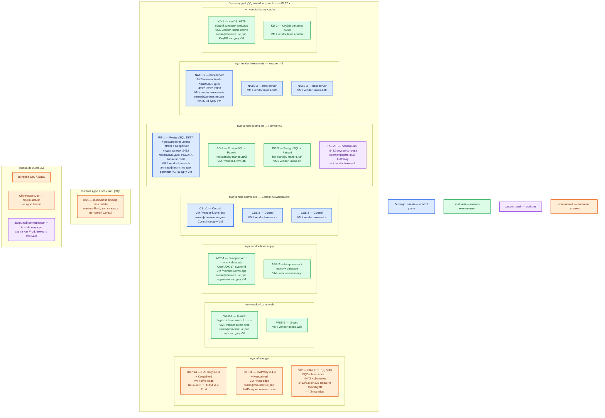

# Luxms BI 12.x — развёртывание Dev

Упрощение Prod: **тот же** вид инсталляции и та же роль-модель. Пакеты Linux на VM острова (PostgreSQL 15/17 + расширения Luxms, Patroni, Consul ×3, NATS ×3, KeyDB, ≥2 web, ≥2 appserver). Уменьшаем CPU/RAM/диск, не механизм. Это **не** официальный одноузловой **quickstart** (`bi-setup` на одной VM) и не Docker Compose: такой стенд не воспроизводит выборы Patroni, кворум Consul, кластер NATS и отказ одного веб-узла.

Линейка **12**; точный номер пакета — договор и закрытый репозиторий (портал — **12.1.0**, notes — **12.0.2**). Публичного Helm 12.x нет.

## Допущения

1. Dev — **один** ЦОД. Второго прикладного ЦОДа и отдельного ЦОДа бэкапов нет: холодный ЦОД-2 и «бэкап за три площадки» **не** повторяем. Снимки ядра PostgreSQL — тем же классом (dump/base backup) в **меньший** бакет **этого** ЦОДа, чтобы остался тот же класс восстановления.
2. Вход: та же пара HAProxy **3.4.3** + Keepalived + VIP, меньше CPU/RAM. HTTPS Luxms на VIP; **5432 / 6379 / 4222 на VIP не публикуем.** Kafka `:9092` тоже нет.
3. DNS: внутри CoreDNS / `cluster.local` (для прочих продуктов площадки). Снаружи зона `dev.…`. Клиенты Luxms — FQDN на VIP, не IP VM.
4. Кворум **не** ужимаем до двух: Consul **3**, Patroni **3**, NATS **3**. Stateless: **2** `bi-web` и **2** appserver на разных VM. «Одна VM как в sample» — другой класс системы.
5. ОС острова — та же матрица вендора, что Prod (Astra SE 1.7/1.8, РЕД ОС 7.3/8.x, Альт СП 10, Rocky 9, MosOS Arbat 15.5). Не Ubuntu вне списка. Kubernetes / Compose для Luxms не ставим.
6. PostgreSQL **15 или 17** по матрице ОС × пакет репозитория; расширения только из пакетов Luxms. На ОС с пустой ячейкой 17 — **15**. PostgreSQL 13 нет. ([postgresql](https://luxmsbi.ru/docs/12.1.0/overviews/compatibility/postgresql))
7. Ёмкость меньше Prod. Цифры tech-info **4 CPU / 6 ГиБ / 200 ГиБ** — тест **одной** VM ~1 млн строк, **не** эта схема и не разрешение схлопнуть кворум. На Dev они лишь показывают, что вендор допускает маленькие машины; число ролей как в Prod. ([tech-info](https://luxmsbi.ru/docs/12.1.0/overviews/general-overview/tech-info))
8. Лицензия DEVL / непродуктовая — если есть в договоре. Учебные пароли `adm`/`luxmsbi` и `bi`/`bi` **не** класть в общие секреты; для Dev — свои секреты контура, не git. ([planning](https://luxmsbi.ru/docs/12.1.0/guides/sysadm-guide/planning))
9. Ansible — после согласования схемы (для Dev можно с поставщиком упростить ёмкость, не роль-модель). Не подменять согласованный HA сценарием `book-deploy-bi.yml` с `local-inv.yml`.
10. CSI `local-ssd` / `shared-fs` к острову не относятся. PGDATA и `/opt/nats` — локальный диск VM, тома меньше Prod. NFS нет. NTP обязателен.
11. ИИ-модуль выкл. Data Boring не обязателен. TLS на HAProxy, не на `bi-web`.
12. Не подменять сертифицированную **11.0.x** линейкой 12.

## Схема инстансов

На схеме нет потоков данных. Антиаффинити — текстом на блоке. Планировщик гипервизора двигает VM по пулу; «VM на хосте 3» не фиксируем.

ОС — свойство платформы, не пода. Один стандарт Linux на всех нодах контура.

Исключение вендора: VM острова Luxms — **только** Astra Linux SE 1.7/1.8, РЕД ОС 7.3/8.x, Альт СП 10, Rocky Linux 9 или MosOS Arbat 15.5. Не ноды Kubernetes. Windows не заявлен. ([planning](https://luxmsbi.ru/docs/12.1.0/guides/sysadm-guide/planning))

| Имя пула | Роль | Зачем выделен |
|---|---|---|
| `infra-edge` | edge-VM | Та же пара HAProxy + VIP, что в Prod; меньше CPU/RAM. Не путь к Postgres/KeyDB/NATS. |
| `vendor-luxms-web` | vendor | Два маленьких `bi-web`. Не схлопывать в одну VM. |
| `vendor-luxms-app` | vendor | Два маленьких appserver. |
| `vendor-luxms-dcs` | vendor | Три маленьких Consul. Не 2 и не «Consul на той же VM, что единственный Postgres». |
| `vendor-luxms-db` | data-localdisk | Три маленьких Patroni+PostgreSQL, локальный PGDATA. |
| `vendor-luxms-nats` | data-localdisk | Три маленьких NATS, `/opt/nats` меньше Prod, не NFS. |
| `vendor-luxms-cache` | vendor | Два KeyDB, общий писатель для web. |
| `infra-swift` | object storage | Меньший бакет снимков ядра в этом же ЦОДе. |

Смысл цветов: **синий** — Consul, лидер Patroni/PostgreSQL, кластер NATS; **зелёный** — web, appserver, standby PG, KeyDB; **фиолетовый** — Ansible/репозиторий и PG-VIP; **оранжевый** — HAProxy/VIP, витрина, ClickHouse, снимки.

## Комментарии к схеме

Роли совпадают с Prod; здесь — только отличия ёмкости и то, чего нельзя «упростить».

### HAP-1a / HAP-1b и VIP

- **Функционал.** Как в Prod: край HTTP(S) и `:6443`. FQDN зоны `dev.…`.
- **Критично.** Пара обязательна (stateless-паритет). Не один контейнер HAProxy. TLS здесь, не на `bi-web`. 5432/6379/NATS на VIP нет.

### WEB-1 / WEB-2 и APP-1 / APP-2

- **Функционал.** Те же пакеты `bi-web` и `bi-appserver-mono` (или split вашей сборки).
- **Критично.** Минимум **2+2** на разных VM. Оба web → один KeyDB и PG-VIP. `bicfg.lua` / `application.properties` — секреты Dev, не `localhost` одной машины quickstart и не `nats://localhost:4222` без списка трёх узлов. Демо-атлас `bi-pg-demo174` допустим на Dev, если пакет есть в репозитории; в Prod его не копировать как эталон карточек.

### CSL-1..3 — Consul

- **Функционал.** Кворум DCS для Patroni, как в Prod.
- **Критично.** **Три** маленьких VM, не два и не один Consul «на учебном Postgres». Все в этом ЦОДе. Версия — пакет репозитория (карточка: **1.16.1**). Пошагового Consul в открытой доке 12 нет — playbook поставщика, не выдуманный `bootstrap_expect`.

### PG-1..3 и PG-VIP

- **Функционал.** Ядро `mi` / `bidata` + Patroni. Клиенты только через PG-VIP `:5432`.
- **Критично.** `instances` не ужимать до 1–2. Локальный диск, не NFS. Расширения из пакетов Luxms. Пароль роли `bi` свой для Dev. Учебный `initdb` на одной VM из `.install.md` — не этот контур. Реплика не заменяет снимок ядра в бакете этого ЦОДа.

### NATS-1..3

- **Функционал.** Кластер, блок `cluster` **включён**, порты 4222/6222/8888.
- **Критично.** Не оставлять NATS одним процессом «как в этапе 5 install». `server_name` уникален. Учебные `x`/`y` сменить даже на Dev, если на витрине не игрушечный CSV. `/opt/nats` — отдельный маленький том (старт вендора 10 ГиБ можно не раздувать, но раздел лучше не смешивать с корнем).

### KD-1 / KD-2 — KeyDB

- **Функционал.** Общие сессии двух web.
- **Критично.** Не один KeyDB на loopback quickstart. Не `protected-mode no` в интернет. Открытая дока не описывает кворум KeyDB — два узла, как в Prod.

### Снимки ядра

- **Функционал.** Проверить restore на Dev тем же классом, что Prod (не «достаточно реплики Patroni»).
- **Критично.** Бакет меньше, но **не** нулевой. Не класть дампы в git.

## Ёмкость (меньше Prod, тот же вид)

Не копировать строку «тест 4/6/200» на **одну** VM этой схемы. Порядок величины на **роль** (уточняется замером):

| Пул | Dev относительно Prod |
|---|---|
| `vendor-luxms-db` | 4–8 vCPU / 16–32 ГиБ; PGDATA — **десятки…сотни ГиБ**, не ТиБ озера |
| `vendor-luxms-nats` | 2–4 vCPU / 4–8 ГиБ; `/opt/nats` от нескольких ГиБ, не меньше отдельного раздела |
| `vendor-luxms-dcs` | 1–2 vCPU / 2–4 ГиБ |
| `vendor-luxms-cache` | 2 vCPU; RAM — небольшой набор сессий |
| `vendor-luxms-web` / `vendor-luxms-app` | 4–8 vCPU / 8–16 ГиБ на VM |
| `infra-edge` | меньше Prod, но **две** VM |

Planning «от 8 vCPU / 32 ГиБ на один хост» — про совмещение ролей на **одной** машине; у нас роли разнесены, поэтому одна Dev-VM db/web может быть ниже этой строки. Не обещать «хватит 50 одновременным» без замера.

## Путь роста

Как в Prod, но сначала вертикаль маленьких VM, потом число web/app. **Не** схлопывать Consul/Patroni/NATS «чтобы проще». Кворум 3 уже заложен. ClickHouse — когда понадобится живой JDBC, не в день 1.

## Сильные и слабые места; критичные условия

**Сильное:** ошибки вида инсталляции (пакетный HA vs quickstart) и ошибки «на Prod три голоса, на Dev один процесс» воспроизводятся; смена лидера Patroni и отказ одного web проверяются до боя.

**Слабое:** остров на Dev дороже одной VM sample; нет второго зала — отказ ЦОДа Dev не тренирует promote; KeyDB без описанного вендором кворума — как в Prod.

**Критично:**

- Не `bi-setup` / Ansible `local-inv.yml` одной машины вместо этой схемы.
- Не 2 Consul / 2 Patroni / 2 NATS «для экономии».
- Не Compose, не Helm, не сертифицированная 11.
- Не NFS; не 5432/6379 в интернет; не `latest`.
- Не учебный `luxmsbi` в общем Vault.
- Не stretch (на одном ЦОДе не к чему).

## Источники

Те же страницы, что у Prod:

| Факт | Страница |
|---|---|
| Документация 12.1.0 | https://luxmsbi.ru/docs/ |
| tech-info (4/6/200 — не эта схема) | https://luxmsbi.ru/docs/12.1.0/overviews/general-overview/tech-info |
| PostgreSQL 15/17, матрица ОС | https://luxmsbi.ru/docs/12.1.0/overviews/compatibility/postgresql |
| planning: ОС, NTP, пароль `adm`, Patroni+Consul | https://luxmsbi.ru/docs/12.1.0/guides/sysadm-guide/planning |
| Quickstart одной VM (не этот контур) | https://luxmsbi.ru/docs/12.1.0/guides/sysadm-guide/quick-setup |
| Dev-схема вендора без HA (не паритет платформы) | https://luxmsbi.ru/docs/12.1.0/guides/sysadm-guide/deploy-types |
| NATS кластер ≥3 | https://luxmsbi.ru/docs/12.1.0/guides/sysadm-guide/appendix/nats/ |
| SSL на LB | https://luxmsbi.ru/docs/12.1.0/guides/sysadm-guide/appendix/ssl |
| Карточка / install / схемы / консультант | `Out/Поиск и аналитика/Luxms BI/Luxms BI.md`, `Luxms BI.install.md`, `Luxms BI.shema.md`, `Luxms BI.consultant.md` |
| Sample (одна VM — не Dev-контур платформы) | `sample/Luxms BI.md` |

**В доке вендора нет:** порог RTT; пошаговый Patroni/Consul 12 без согласованного Ansible; кластер KeyDB; разрешение считать quickstart «официальным Dev» для паритета с боем — вендор рисует одноузловую среду разработки, платформа его **не** берёт, чтобы не ловить ошибки вида инсталляции.
