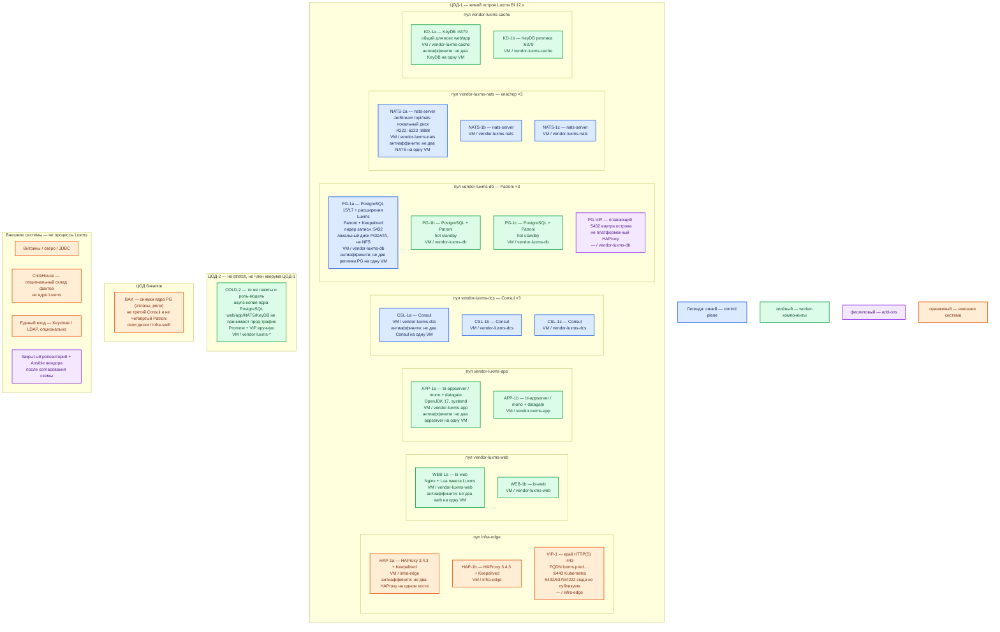

# Luxms BI 12.x — развёртывание Prod

Коммерческая платформа бизнес-аналитики (**BI** — просмотр и анализ уже подготовленных данных в браузере). Линейка **12**; точный номер пакета — договор и закрытый репозиторий заказчика (портал документации на дату сверки — **12.1.0**, публичные notes — **12.0.2**). Это **остров вендора**: пакеты Linux на отдельных VM (`dnf` / `apt` / `zypper` + systemd), не поды Kubernetes и не Docker Compose. Публичного Helm 12.x и образа на Docker Hub **нет**.

**Остров** — свой инсталлятор, свои версии PostgreSQL/NATS/KeyDB и белый список ОС. Живой «мозг» (PostgreSQL + Patroni + Consul + NATS + KeyDB + веб/Java) — **в одном** прикладном ЦОДе.

## Допущения

1. Контур Prod: **2 прикладных ЦОДа** + **1 ЦОД под бэкапы**. RTT между площадками **не измерен**. Порога допустимой задержки для Consul / Patroni / NATS в документации Luxms **нет** → stretch одного живого кластера на 2–3 ЦОДа **нет**.
2. ЦОД-1 — единственный живой остров. ЦОД-2 — **холодные пакеты** и **async**-копия ядра PostgreSQL, **не** член кворума Consul ЦОД-1. ЦОД бэкапов — снимки ядра (атласы, роли), не третий голос Consul и не четвёртый Patroni.
3. Два независимых «живых» Luxms в двух ЦОДах = **две правды атласов**, не HA. Веб в чужом зале без того же KeyDB = «то залогинен, то нет».
4. Способ установки — **пакеты вендора на Linux-VM**. Ansible боя — **после согласования схемы с поставщиком** ([deploy-types](https://luxmsbi.ru/docs/12.1.0/guides/sysadm-guide/deploy-types)). Официальный одноузловой **quickstart** (`bi-setup` + `book-deploy-bi.yml`) — учебный путь без отказоустойчивости; в бой **не** копировать ([quick-setup](https://luxmsbi.ru/docs/12.1.0/guides/sysadm-guide/quick-setup)). Не Compose, не Helm 12.x.
5. ОС острова — **только** матрица поставщика: Astra Linux SE **1.7 / 1.8**, РЕД ОС **7.3 / 8.x**, Альт СП **10**, Rocky Linux **9**, MosOS Arbat **15.5**. Windows-сервер не заявлен. «Любой Ubuntu» — нет. ([planning](https://luxmsbi.ru/docs/12.1.0/guides/sysadm-guide/planning))
6. Ядро — **PostgreSQL 15 или 17** (или совместимый вариант из таблицы: Postgres Pro 15/17, Tantor 15, Jatoba 5) + расширения **из пакетов Luxms**, не с GitHub: `http 1.7`, `plv8 3.2`, `redis_pubsub 1.0`, `redis_fdw 1.0`. PostgreSQL **13** поставщик не сопровождает с **01.12.2025**. Для Astra 1.8 / Альт СП 10 / Rocky 9 / MosOS в матрице пакетов ячейка PostgreSQL **17** пустая — на этих ОС стартуем с **15**, пока ваш репозиторий явно не отдаст 17. ([postgresql](https://luxmsbi.ru/docs/12.1.0/overviews/compatibility/postgresql))
7. Patroni + Consul — схема HA PostgreSQL, которую вендор рекомендует для кластера БД. NATS для боя — **нечётный кластер, минимум 3**. KeyDB — общий для всех веб-узлов (сессии); схему кластера KeyDB открытая дока 12 **не** описывает — ниже фиксируем разнос на **2** VM (как «разнос по машинам» в гайде), не выдуманный Sentinel. ([planning](https://luxmsbi.ru/docs/12.1.0/guides/sysadm-guide/planning), [NATS](https://luxmsbi.ru/docs/12.1.0/guides/sysadm-guide/appendix/nats/))
8. Нагрузка платформы **не замерена**. Терабайты фактов — во **внешнем** ClickHouse / озере, не в единственном PostgreSQL ядра. Цифры tech-info (4/6/200; 8/24/500; 16/32/1 ТиБ) даны для **~1 млн строк** фактов — ориентир вендора, **не** смета «хватит терабайтам». Ёмкость ниже — **порядок величины**, уточняется замером. ([tech-info](https://luxmsbi.ru/docs/12.1.0/overviews/general-overview/tech-info))
9. Лицензия **Enterprise Cluster UL** в прайсе — формулировка про **2 промышленных сервера** и потолок **1000** одновременных сессий. Число VM кворума (Consul/Patroni/NATS) **больше двух** — это роли HA, не SKU. Третью площадку и отдельный ClickHouse согласовать с продавцом отдельно. Не подменять сертифицированную сборку **11.0.x** (ФСТЭК № 5055) линейкой 12. ([tech-info](https://luxmsbi.ru/docs/12.1.0/overviews/general-overview/tech-info), [ФСТЭК](https://luxmsbi.ru/products/fstek/))
10. На каждом прикладном ЦОДе уже есть пара HAProxy **3.4.3** + Keepalived + VIP: ControlPlaneEndpoint Kubernetes `:6443` и край HTTP(S). Через этот HAProxy публикуем **HTTPS Luxms** (`luxms.prod.…` → `bi-web`). **Не** публикуем: PostgreSQL **5432**, KeyDB **6379**, NATS **4222/6222/8888**, Consul, Kafka **:9092**. Клиенты — по FQDN зоны `prod.…`, не по IP VM.
11. Диски Kubernetes (`local-ssd` / `shared-fs`) к острову **не относятся**: CSI не монтируем. PGDATA и `/opt/nats` — **локальный диск VM**, не NFS. NTP обязателен.
12. Модуль «ИИ-аналитик», Data Boring и HTTPS на самих `bi-web` в первом бою **выкл**. TLS — на HAProxy площадки; между LB и веб-узлами во внутренней сети — HTTP, как рекомендует вендор для высокой нагрузки. ([SSL](https://luxmsbi.ru/docs/12.1.0/guides/sysadm-guide/appendix/ssl))
13. Раздел «Бой» в `Luxms BI.install.md` отсутствует (файл — учебная одна VM). Боевой путь — карточка, роль консультанта, схемы и официальные страницы 12.1.0.

## Схема инстансов

На схеме нет потоков данных. Конкретная «VM номер 3» не фиксируется: антиаффинити — текстом на блоке.

**Patroni** — программа, которая следит за узлом PostgreSQL и выбирает, кто сейчас принимает запись. **Consul** — хранилище служебного состояния для этих выборов (DCS). **NATS** — внутренняя шина сообщений и файлов Luxms, не платформенная Kafka. **KeyDB** — сервер данных в памяти (протокол как у Redis) для сессий. **Атлас** — аналитическое приложение (дэшборды, права) внутри Luxms.

ОС — свойство платформы, не пода. Один стандарт Linux на всех нодах контура.

Исключение вендора: VM острова Luxms — **только** Astra Linux SE 1.7/1.8, РЕД ОС 7.3/8.x, Альт СП 10, Rocky Linux 9 или MosOS Arbat 15.5. Это не ноды Kubernetes и не «любой Ubuntu». Windows-сервер не заявлен. ([planning](https://luxmsbi.ru/docs/12.1.0/guides/sysadm-guide/planning))

| Имя пула | Роль | Зачем выделен |
|---|---|---|
| `infra-edge` | edge-VM | Пара HAProxy 3.4.3 + Keepalived + VIP площадки: край HTTP(S) и ControlPlaneEndpoint Kubernetes. Не путь к 5432/6379/NATS. |
| `vendor-luxms-web` | vendor | Процессы `bi-web` (свой Nginx пакета). Stateless: минимум 2 VM, антиаффинити. |
| `vendor-luxms-app` | vendor | Java `bi-appserver` / `mono`, datagate, headless Chrome. Не колоцировать с PGDATA. |
| `vendor-luxms-dcs` | vendor | Три Consul: кворум выборов Patroni. Без тяжёлого диска БД. |
| `vendor-luxms-db` | data-localdisk | Три PostgreSQL+Patroni: локальный диск PGDATA, не NFS, не CSI. |
| `vendor-luxms-nats` | data-localdisk | Три `nats-server`, раздел `/opt/nats` (JetStream — хранилище сообщений и файлов на диске). Вендор рекомендует выделенные хосты. |
| `vendor-luxms-cache` | vendor | KeyDB сессий: все web/app смотрят на один писатель. |
| `infra-swift` | object storage | Снимки ядра в ЦОДе бэкапов. Не диск Patroni. |

Смысл цветов для Luxms BI: **синий** — Consul, действующий лидер Patroni/PostgreSQL, кластер NATS (голосующие/управляющие); **зелёный** — web, appserver, standby PostgreSQL, KeyDB, холодный ЦОД-2; **фиолетовый** — Ansible/репозиторий поставщика и внутренний PG-VIP; **оранжевый** — платформенный HAProxy/VIP, витрины, ClickHouse, IdP, ЦОД бэкапов.

## Комментарии к схеме

### HAP-1a / HAP-1b и VIP-1

- **Функционал.** Пара входа площадки. VIP — FQDN `luxms.prod.…`: браузеры на **443/TCP**. Тот же VIP в платформе обслуживает Kubernetes `:6443`.
- **Критично.** Две VM, не один хост. TLS **терминировать здесь**, на `bi-web` HTTPS в первом бою не включать (вендор: HTTPS на веб-узлах бьёт CPU при высокой нагрузке). Backend — HTTP на оба `bi-web`. Health-check — HTTP веб-узла, не порт Postgres. На VIP **не** вешать 5432, 6379, 4222, 6222, 8888, порты Consul. Kafka `:9092` не публиковать. Клиенты по FQDN, не по IP VM. Липкость к appserver из гайда **9.2** (`hash $upstream_cookie`) **не** считать контрактом 12, пока её не подтвердит sysadm-guide **вашей** сборки. ([SSL](https://luxmsbi.ru/docs/12.1.0/guides/sysadm-guide/appendix/ssl))

### WEB-1a / WEB-1b — `bi-web`

- **Функционал.** Веб-сервис продукта: отдаёт UI и проксирует запросы к Java и ядру. Пакет `bi-web` — **свой** Nginx + Lua, не системный nginx ОС. Юнит `bi-web.service`. Слушает **80/TCP** (URL без номера порта). ([quick-setup](https://luxmsbi.ru/docs/12.1.0/guides/sysadm-guide/quick-setup), [planning](https://luxmsbi.ru/docs/12.1.0/guides/sysadm-guide/planning))
- **Критично.** Минимум **2** VM, антиаффинити. Оба узла ходят в **один** KeyDB и в **PG-VIP**, иначе сессии и запись разъедутся. `bicfg.lua`: хост БД = PG-VIP, пароль роли `bi` — не пример `"bi"`. Порт 80/443 **не в интернет** мимо HAProxy. Не `latest`.

### APP-1a / APP-1b — `bi-appserver` / `mono`

- **Функционал.** Java-сервер API (OpenJDK 17 ставится зависимостью). Вариант `mono` может объединять серверные функции; точный состав — сборка в договоре. Datagate — JDBC к витринам, **не** интеграционное API к ведомствам. `bi-headless-chrome` — отрисовка PNG, в интернет не открывать.
- **Критично.** Минимум **2** VM. `application.properties`: JDBC на PG-VIP `:5432`, база `mi`, пользователь `bi`; `bi.nats.servers` — список **трёх** NATS `:4222`, не `localhost`. Имена пакетов линейки 12: `bi-appserver-mono` и т.п., не `luxmsbi-*` сертифицированной 11. Порты 8080/8200/8889 из гайда **9.2** не считать контрактом 12. Data Boring (`bi-etl`, порт **1880**) на старте не обязателен.

### CSL-1a / CSL-1b / CSL-1c — Consul

- **Функционал.** Три сервера Consul = нечётный кворум. Patroni читает отсюда, кто лидер PostgreSQL. Карточка платформы указывает Consul **1.16.1**; фактический пакет — ваш репозиторий (таблица tech-info по ОС может отличаться).
- **Критично.** **3** VM, не 2: два голоса — другой класс системы (нет большинства; отказ одного = тупик или split-brain). Все три **в ЦОД-1**. Узел ЦОД-2 в gossip **не** добавлять. NTP обязателен. Порты 8300/8301/8500/8600 только внутри острова. Точная схема агент/сервер — закрытое руководство сборки; в открытой доке 12 пошагового Consul **нет** — не выдумывать `bootstrap_expect` «на глаз», брать playbook поставщика после согласования схемы.

### PG-1a / PG-1b / PG-1c, PG-VIP — PostgreSQL + Patroni

- **Функционал.** Ядро Luxms живёт **внутри** PostgreSQL: базы `mi` (конфиг) и `bidata` (данные после импорта файлов), логика PL/pgSQL, права. Patroni наблюдает узел и при отказе лидера повышает standby. Клиенты острова (web, appserver, расширения) подключаются на **PG-VIP :5432**, не на hostname текущего лидера. Карточка: Patroni **3.2.x** — сверять с пакетом репозитория.
- **Критично.**
  - Три узла Patroni в **одном** ЦОДе. Схема «2 узла» — не уменьшенный Prod.
  - Каталог данных — **локальный диск** (LVM + EXT4, `noatime`; старт раздела от **10 ГиБ**, для боя — сотни ГиБ порядка величины). **Не NFS**, не `shared-fs`, не CSI.
  - Расширения **только** из пакетов Luxms (`bi-pg-sql15` / `bi-pg-sql17` / `bi-pg-pro15` и аналоги на вашей ОС). Не собирать `plv8` с GitHub.
  - Роль приложения — `bi`, не суперпользователь `postgres`. Пароли `bi` / `bireader` / `bidata` сменить; учебные значения **запрещены** в продуктовых системах. Секреты — Vault, не git.
  - Реплика Patroni **не** заменяет backup ядра: `DROP` уедет на копии. Вендор **не рекомендует** копить архив WAL как единственную защиту (пакетные загрузки; риск забить диск). Снимки ядра в ЦОД бэкапов — обязательны политикой платформы (атласы/роли не пересчитаешь из озера). ([planning](https://luxmsbi.ru/docs/12.1.0/guides/sysadm-guide/planning))
  - PG-VIP — Keepalived (или внутренний HAProxy острова) **на пуле db**, не bind `:5432` на платформенный VIP края.
  - **5432 не в интернет.**

### NATS-1a / NATS-1b / NATS-1c

- **Функционал.** Кластер `nats-server` из пакета поставщика. Клиенты Java — **4222/TCP**; маршруты между узлами — **6222/TCP**; WebSocket примера — **8888/TCP**; монитор — **8222/TCP** (опционально). JetStream пишет в `/opt/nats`. Вендор: для продуктовых сред один инстанс **не** рекомендует; минимум **3**, нечётное число. Совмещение с другими компонентами возможно, выделенные хосты — рекомендация. Старт раздела **10 ГиБ**. ([NATS](https://luxmsbi.ru/docs/12.1.0/guides/sysadm-guide/appendix/nats/))
- **Критично.** Включить блок `cluster` (в quickstart его как раз **не** включают — другой класс системы). `server_name` = уникальный FQDN каждой VM, иначе кластер не соберётся. Пример конфига `user: "x", pass: "y"`, `no_tls: true`, `no_auth_user: "be"` — **демо**, в бою сменить и не тащить `no_tls` без решения ИБ. Маршруты **6222 только внутри ЦОД-1**. Не открывать 4222/8888 в интернет. Версия бинарника — пакет (в примере гайда встречается `v2.10.22`; таблица tech-info — линия 2.12/2.14 по ОС).

### KD-1a / KD-1b — KeyDB

- **Функционал.** Сессии, антибрут, pub/sub для расширений PostgreSQL. Порт **6379/TCP**. Карточка: KeyDB **6.x** в стеке — сверять с пакетом.
- **Критично.** Все `bi-web` и appserver (и FDW/pubsub ядра) смотрят на **один** писатель. Две VM — разнос по машинам (гайд: `protected-mode no` и снятие `bind 127.0.0.1` как раз для разноса, **не** для одной VM). Открытая документация 12 **не** описывает Sentinel/кластер KeyDB — третий узел и «кворум KeyDB» не выдумываем. Слабое место: отказ писателя без описанного автофейловера. `protected-mode no` на опубликованный в интернет порт **не** тащить; **6379 не в интернет**. Учебный bind только localhost на одной VM — не эта схема.

### COLD-2 — ЦОД-2

- **Функционал.** Те же пакеты и те же роли, чтобы после аварии ЦОД-1 не оказаться на quickstart. Async-реплика или регулярный restore ядра PostgreSQL. Пользовательский HTTPS в штате сюда **не** режем.
- **Критично.** Узлы ЦОД-2 **не** входить в Consul/NATS/Patroni ЦОД-1. Автоfailover между залами **нет**. Promote — ручной/регламентный, затем свой кворум Consul+Patroni+NATS **внутри** ЦОД-2. Без согласованного KeyDB веб «на всякий случай» в ЦОД-2 не включать.

### BAK — ЦОД бэкапов

- **Функционал.** Проверенные снимки ядра (атласы, роли, `mi`/`bidata`). Витрины пересчитает озеро; метаданные BI — нет.
- **Критично.** Не член кворума. Restore **репетировать**. Срок хранения вендор ориентирует **3–7 дней** ежедневных копий — это рекомендация, не запрет политике контура.

### Внешние: витрины, ClickHouse, IdP, репозиторий

- Цифры дэшбордов — JDBC/FDW в озеро или ClickHouse, которые наполнил **интеграционный контур**. Luxms **не ходит** в ведомства.
- ClickHouse — отдельный продукт, не ядро. Тест 12.x для источника ClickHouse: **25.3.2.39** ([dbms](https://luxmsbi.ru/docs/12.1.0/overviews/compatibility/dbms)).
- Учётка UI по умолчанию **`adm` / `luxmsbi`** — только закрытый стенд; в бою сменить сразу, пароль в Vault. ([planning](https://luxmsbi.ru/docs/12.1.0/guides/sysadm-guide/planning))
- Логин/пароль `bi.repo` не коммитить.

## Ёмкость (порядок величины, не обещание «хватит терабайтов»)

В мануале **нет** сметы «N ядер на терабайты платформы». Есть ориентиры вендора для **~1 млн строк** фактов и одноузловой виртуализации:

| Ориентир вендора | CPU | RAM | Диск | Откуда |
|---|---|---|---|---|
| Тест / демо (не бой) | 4 ядра ≥ 2 ГГц | 6 ГиБ | 200 ГиБ | [tech-info](https://luxmsbi.ru/docs/12.1.0/overviews/general-overview/tech-info) |
| Минимум до 50 одновременных | 8 ядер ≥ 2 ГГц | 24 ГиБ | 500 ГиБ | та же страница |
| Рекомендация на 50 одновременных | 16 ядер ≥ 2 ГГц | 32 ГиБ | 1 ТиБ | та же страница |
| Один хост в виртуализации (planning) | от 8 vCPU | от 32 ГиБ | точки монтирования | [planning](https://luxmsbi.ru/docs/12.1.0/guides/sysadm-guide/planning) |

Точки монтирования **старта** (не смета): `/opt/bi` **2 ГиБ**, `/opt/nats` **10 ГиБ**, PGDATA **10 ГиБ**, `/var/log` **8 ГиБ**. Для боя на пулах:

| Пул | Порядок величины на старте | Пометка |
|---|---|---|
| `vendor-luxms-db` | 8–16 vCPU / 32–64 ГиБ; PGDATA — **сотни ГиБ** локального диска | Ядро — метаданные, не озеро. Терабайты фактов сюда не класть. |
| `vendor-luxms-nats` | 4–8 vCPU / 8–16 ГиБ; `/opt/nats` от 10 ГиБ с запасом под отчёты | Выделенный раздел, чтобы переполнение не убило ОС. |
| `vendor-luxms-dcs` | 2–4 vCPU / 4–8 ГиБ | Не масштабирует зрителей. |
| `vendor-luxms-cache` | 4 vCPU; RAM — рабочий набор сессий (ГиБ…десятки) | Уточняется замером сессий. |
| `vendor-luxms-web` / `vendor-luxms-app` | от 8 vCPU / 16–32 ГиБ на VM | Рост зрителей — сюда, не в Consul. |

Уточняется замером. Потолок лицензии UL — **1000** одновременных сессий, не «безлимит CPU».

## Путь роста

Не включать в день 1.

1. **Зрители / CPU web+Java** — добавить VM `bi-web` / `bi-appserver` за тем же HAProxy. Потолок — лицензия сессий.
2. **Живой JDBC / self-service** — усилить datagate и **источник**, не ещё один Nginx.
3. **Терабайты фактов** — ClickHouse / озеро; ядро остаётся PostgreSQL метаданных. Не раздувать PGDATA «под озеро».
4. **Диск NATS** — расширить `/opt/nats` (LVM), не NFS.
5. **Диск ядра** — расширить PGDATA; не архив WAL «на всякий» вопреки рекомендации вендора, пока политика PITR явно не заказана.
6. **ЦОД-2** — после promote сначала собрать **свой** кворум 3+3+3 в этом зале, потом открывать HTTPS. Не догонять кворум ЦОД-1.

## Сильные и слабые места; критичные условия

**Сильное:** тот же пакетный HA, что будет на Dev — воспроизводятся выборы Patroni, кластер NATS и отказ одного web; кворум Consul локален в ЦОД-1 (нет зависимости от межЦОДового RTT); TLS на краю; факты в озере, ядро отдельно.

**Слабое:** смерть ЦОД-1 = простой BI до ручного promote; RPO > 0 на async; открытая дока 12 не даёт пошагового Consul/Patroni (завязка на Ansible поставщика); KeyDB на двух узлах без описанного кворума; SKU «2 промышленных сервера» не совпадает с числом VM кворума — согласовать с продавцом; нет публичного оператора K8s.

**Критично:**

- Не quickstart одной VM и не Compose «как у Grafana».
- Не stretch Consul / Patroni / NATS / KeyDB на 2–3 ЦОДа.
- Не два живых острова «для HA» (две правды атласов).
- Не NFS как диск PGDATA / не единственный диск ядра.
- Не PostgreSQL 13; не расширения с GitHub; не сертифицированная 11 вместо 12.
- Не публиковать 5432/6379/4222 в интернет; не учебные пароли `adm`/`luxmsbi` и `bi`/`bi`.
- Не веб в чужом ЦОДе без того же KeyDB.
- Не `latest`; не модуль ИИ в первом бою.
- Реплика ≠ backup ядра.

## Источники

| Факт | Страница |
|---|---|
| Портал документации 12.1.0 | https://luxmsbi.ru/docs/ |
| Железо, лицензии, реестр 3366, SKU Cluster = 2 сервера, 1000 сессий | https://luxmsbi.ru/docs/12.1.0/overviews/general-overview/tech-info |
| PostgreSQL 15/17, конец пакетов 13, расширения, матрица ОС | https://luxmsbi.ru/docs/12.1.0/overviews/compatibility/postgresql |
| СУБД-источники, ClickHouse 25.3.2.39 в тестах 12 | https://luxmsbi.ru/docs/12.1.0/overviews/compatibility/dbms |
| ОС, NTP, `adm`/`luxmsbi`, 8 vCPU/32 ГиБ, точки монтирования, Patroni+Consul, выделенные уровни | https://luxmsbi.ru/docs/12.1.0/guides/sysadm-guide/planning |
| Quickstart одной VM (не бой) | https://luxmsbi.ru/docs/12.1.0/guides/sysadm-guide/quick-setup |
| Ansible боя после согласования схемы; минимальная продуктовая конфигурация | https://luxmsbi.ru/docs/12.1.0/guides/sysadm-guide/deploy-types |
| NATS: кластер ≥3, порты 4222/6222/8222/8888, `/opt/nats` 10 ГиБ | https://luxmsbi.ru/docs/12.1.0/guides/sysadm-guide/appendix/nats/ |
| TLS на LB, не на web при высокой нагрузке | https://luxmsbi.ru/docs/12.1.0/guides/sysadm-guide/appendix/ssl |
| Релизы 12 | https://luxmsbi.ru/products/relizy/ |
| Сертифицированная 11.0.x | https://luxmsbi.ru/products/fstek/ |
| Карточка, порты, состав | `Out/Поиск и аналитика/Luxms BI/Luxms BI.md` |
| Учебный стенд (не копировать в бой) | `Out/Поиск и аналитика/Luxms BI/Luxms BI.install.md` |
| Мозг в одном ЦОДе, без stretch | `Out/Поиск и аналитика/Luxms BI/Luxms BI.shema.md` |
| Роль консультанта | `Out/Поиск и аналитика/Luxms BI/Luxms BI.consultant.md` |
| Ресурсы sample (одна VM — не этот контур) | `sample/Luxms BI.md` |

**В доке вендора нет (не выдумано):** порог RTT для stretch; пошаговый Patroni/Consul для линейки 12 (есть рекомендация «Patroni + Consul» и Ansible после схемы); схема кластера/Sentinel KeyDB; однозначная ячейка Rocky 9 + PostgreSQL 17 в матрице; смета ядер «на терабайты фактов»; публичный Helm/Docker Hub 12.x; обязанность HTTPS на `bi-web`.
