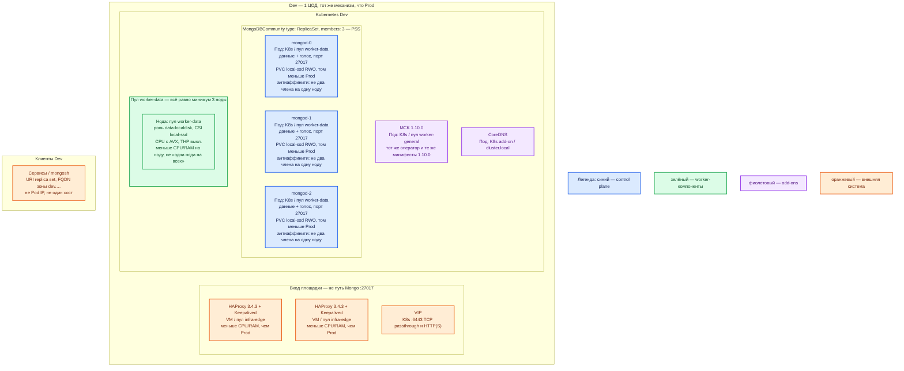

# MongoDB Community Server 7.0.40 — Dev

Оператор: **MCK 1.10.0**. Контур: **Dev** (1 ЦОД). Упрощение Prod: меньше CPU/RAM/диск, **тот же** вид инсталляции.

Это **не** учебный Docker-quickstart из `MongoDB 7.install.md` (один `mongod` на loopback). Один процесс не воспроизводит выборы primary, `w: majority` и отказ члена — на Prod ошибка из-за replica set на Dev «не поймается».

## Допущения

1. Те же, что Prod, кроме географии: один ЦОД, зона DNS `dev.…`, VIP и тома меньше.
2. Юристы приняли **SSPL** (тот же сервер, та же лицензия).
3. Kubernetes + MCK **1.10.0** + `MongoDBCommunity` `type: ReplicaSet`, `members: 3`. Не Compose, не один `mongod`, не PSA с arbiter.
4. Имена StorageClass те же: `local-ssd` / `shared-fs`. Mongo — только `local-ssd`, тома меньше.
5. Пара HAProxy 3.4.3 + Keepalived + VIP на площадке есть, с меньшим CPU/RAM. Mongo `:27017` через неё не публикуем.
6. Голосующих всё равно **три** маленьких члена на **трёх** нодах пула `worker-data`. Схема «2 узла» или «1 mongod» — другой класс системы, не уменьшенный Prod.
7. Нагрузка не замерена. Ёмкость — ориентир стенда, не смета боя.

## Схема инстансов

Цвета как на Prod: синий — голосующие `mongod`; зелёный — пул нод под данные; фиолетовый — оператор MCK и DNS кластера; оранжевый — VIP/HAProxy и клиенты. В легенде — только пояснение к цвету.

ОС — свойство платформы, не пода. Один стандарт Linux на всех нодах контура.

| Имя пула | Роль | Зачем выделен |
|---|---|---|
| `infra-edge` | edge-VM | Та же пара HAProxy + VIP, меньше CPU/RAM. Не путь Mongo `:27017`. |
| `worker-general` | general | Тот же оператор MCK 1.10.0. |
| `worker-data` | data-localdisk | Три маленьких голосующих `mongod` на `local-ssd`. Три ноды обязательны из-за антиаффинити и кворума. |

## Комментарии к схеме

### Чем Dev меньше Prod

| | Prod | Dev |
|---|---|---|
| Механизм | K8s + MCK 1.10.0 + `MongoDBCommunity` ReplicaSet | **то же** |
| Голосующие члены | 3 PSS, один ЦОД | **3 PSS**, один ЦОД, меньше CPU/RAM/PVC |
| ЦОД-2 / ЦОД бэкапов | есть (без голоса Mongo / снимки) | нет второго ЦОДа |
| `cacheSizeGB` | явно, меньше limit, размер по замеру | явно **0.256–0.5** ГБ (нижняя граница вендора — 256 МБ) |

Не уменьшать «до одного пода на одной ноде»: тогда нет большинства голосов (2 из 3) и нет отказа ноды.

### HAProxy + VIP

Та же роль, что на Prod, меньше железо. Клиенты Mongo на VIP `:27017` не сажаем.

### MCK 1.10.0

Те же манифесты тега **1.10.0**, тот же `spec.type: ReplicaSet`, `spec.members: 3`, `spec.version: "7.0.40"`. Не «оператор только на Prod, а Dev — `docker run`».

### Три маленьких `mongod`

Тот же PSS: выборы, oplog, majority. Primary не пинить на схему.

Критично (как Prod, ёмкость меньше):

- Антиаффинити: не два члена на одну ноду → минимум 3 ноды `worker-data`.
- PVC `local-ssd` RWO, не NFS, не `shared-fs`. XFS предпочтителен и на Dev — та же ФС, что будем отлаживать.
- AVX на CPU; THP выкл. на нодах.
- `cacheSizeGB` явно 256–512 МБ и **меньше** memory limit пода. Дефолт от RAM хоста в Kubernetes нельзя.
- SCRAM + TLS, как на Prod (иначе другой класс системы). Пароли — свои секреты Dev, не строки `stand-admin-only` из учебного файла.
- URI replica set, FQDN `dev.…` / `cluster.local`, `{ w: "majority" }` + `wtimeout`.
- Порт 27017 не на `0.0.0.0` офисной сети.

Ёмкость (ориентир, **не** расчёт Prod; в доке нет минимума ГБ RAM/диска):

| Ресурс | Порядок на член | Опора |
|---|---|---|
| CPU | 2 vCPU | пол вендора «два ядра или один многоядерный»; ориентир стенда в `sample/MongoDB 7.md` |
| RAM | 2 ГиБ на под `mongod` (+ sidecar agent отдельно) | ориентир стенда; кэш 0.256–0.5 ГБ внутри лимита |
| PVC `local-ssd` | десятки ГБ, не терабайты Prod | имена классов те же |

### Что этот Dev доказывает и чего нет

Доказывает: установку тем же CR, выборы primary, отказ **одного** члена/ноды, `w: majority`, антиаффинити, WiredTiger cache в контейнере, SCRAM/TLS.

Не доказывает: отказ целого ЦОДа, терабайты, шарды, межЦОДовый RTT, нагрузку боя.

## Путь роста

Тот же, что Prod, но на Dev не включают шарды «чтобы было как в рекламе». Сначала вырастить CPU/RAM/диск членов и снять замер. Шарды — не этим CR.

## Сильные и слабые места

**Сильное:** тот же оператор, те же 3 голоса, те же имена StorageClass — ошибка вида инсталляции и ошибка кворума воспроизводятся.

**Слабое:** маленькие тома и RAM не показывают IOPS/cache miss боя; нет второй площадки, восстановление из ЦОДа бэкапов на Dev не тренируется само по себе.

**Критичные условия:** не схлопывать до одного `mongod`; не arbiter; не Compose; не `latest`; SSPL; AVX; `cacheSizeGB` явно; 27017 не в интернет.

## Источники

Те же URL, что в `MongoDB 7.prod.md`. Учебный Docker-стенд (`MongoDB 7.install.md`) — только объяснение «как не делать Dev-контур», не инструкция этого файла.

- Спецификация `MongoDBCommunity`: https://www.mongodb.com/docs/kubernetes/current/reference/k8s-operator-community-specification/
- Манифесты MCK 1.10.0: https://github.com/mongodb/mongodb-kubernetes/tree/1.10.0/public
- Кворум / нечётные голосующие: https://www.mongodb.com/docs/v7.0/core/replica-set-architectures/
- WiredTiger cache в контейнере: https://www.mongodb.com/docs/v7.0/core/wiredtiger/
- AVX: https://www.mongodb.com/docs/v7.0/tutorial/install-mongodb-community-with-docker/ и https://www.mongodb.com/docs/v7.0/administration/production-notes/
