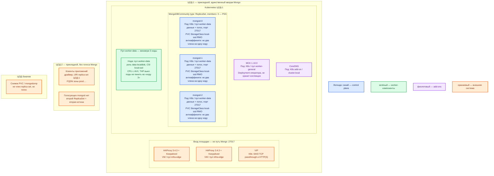

# MongoDB Community Server 7.0.40 — Prod

Оператор: **MCK 1.10.0**. Контур: **Prod** (2 прикладных ЦОДа + 1 ЦОД бэкапов).

**Replica set** — группа процессов `mongod` (сервер СУБД), которые держат одни и те же данные и выбирают **primary** (единственный писатель). **Шард** — уже другая схема (несколько таких групп + маршрутизатор `mongos`); объект `MongoDBCommunity` её **не** описывает.

## Допущения

1. Юристы приняли лицензию сервера **SSPL**. Без этого Community 7.0 не ставим. Оператор MCK — Apache 2.0 и **не** меняет лицензию сервера.
2. В каждом прикладном ЦОДе уже есть независимый Kubernetes и пара **HAProxy 3.4.3 + Keepalived + VIP** (ControlPlaneEndpoint `:6443` и край HTTP(S)). Kafka `:9092` и MongoDB `:27017` через этот HAProxy **не** публикуем.
3. В Kubernetes два StorageClass: `local-ssd` (RWO, локальный SSD, CSI) и `shared-fs` (RWX) только по исключению. Для Mongo — **только** `local-ssd`. NFS как диск данных не используем.
4. DNS: внутри кластера — CoreDNS / `cluster.local`; снаружи — зона `prod.…`. Клиенты ходят по **FQDN**, не по Pod IP.
5. Голосующие члены replica set — **один ЦОД** (ЦОД-1). Stretch кворума на 2–3 площадки нет: RTT не измерен, порога RTT в документации вендора нет. Вендорская схема «разнести голосующих по ЦОДам» здесь **не** целевая.
6. Нагрузка не замерена. Стартуем минимальной отказоустойчивой топологией PSS×3, не шардами и не «всем, что умеет вендор». Цифр «хватит N ядер / терабайтов» в мануале нет.
7. Путь размещения: официальный оператор под наш Kubernetes, сырые кольца дисков не нужны → **Kubernetes**, не пакеты на VM и не Docker Compose. Docker-страница Community рекомендует Enterprise-оператор для боя — это **не** наш путь; платформа фиксирует Community + MCK 1.10.0.
8. ЦОД-2 не получает второй голосующий replica set «для HA»: это была бы вторая истина. Скрытая копия без голоса в чужом кластере этим CR на старте **не** ставится.
9. Роль озера эталонных карточек за Mongo **не** закреплена. Шина — Kafka, кэш — Redis/Valkey, не Mongo.

## Схема инстансов

Цвета для этого продукта: синий — голосующие `mongod`; зелёный — пул нод под данные; фиолетовый — оператор MCK и DNS кластера; оранжевый — VIP/HAProxy, другой ЦОД, бэкапы, клиенты. В легенде — только пояснение к цвету.

ОС — свойство платформы, не пода. Один стандарт Linux на всех нодах контура.

| Имя пула | Роль | Зачем выделен |
|---|---|---|
| `infra-edge` | edge-VM | Пара HAProxy + Keepalived + VIP площадки. Не публикует Mongo `:27017`. |
| `worker-general` | general | Оператор MCK (stateless Deployment). |
| `worker-data` | data-localdisk | Три голосующих `mongod` на `local-ssd`; антиаффинити требует минимум 3 ноды пула. |

## Комментарии к схеме

### HAProxy + Keepalived + VIP (`infra-edge`)

Платформенный вход ЦОДа: Kubernetes API `:6443` и HTTP(S). **Не** балансировать `mongod:27017` как HTTP-пул: драйвер сам находит текущий primary по replica set URI. Иначе запись может уйти на secondary.

### MCK 1.10.0 (`worker-general`)

Оператор (контроллер Kubernetes): следит за объектом `MongoDBCommunity` и создаёт StatefulSet, Service, секреты. Коллекции не хранит. Старый Community Operator — EOL; манифесты пинить **1.10.0** (`public/crds.yaml` и `public/mongodb-kubernetes.yaml` тега 1.10.0), не `latest` и не пример «current» с 1.11.0. Падение оператора не роняет уже запущенные `mongod`, но останавливает согласование.

### Три пода `mongod` — PSS (`worker-data`)

Один **primary** принимает запись, два **secondary** копируют **oplog** (журнал операций) и голосуют. Роль primary плавает — на схеме не фиксировать «этот под всегда primary».

Критично:

- CR: `kind: MongoDBCommunity`, `spec.type: ReplicaSet` (единственное допустимое значение), `spec.members: 3`, `spec.version: "7.0.40"`. Шарды этим CR не ставятся.
- Не PSA (два диска + **arbiter** — голос без данных): при arbiter заводская формула дефолтного write concern даёт `{ w: 1 }`. В PSS majority = 2 из 3 копий с данными; отказ одного члена ещё оставляет запись с majority.
- Антиаффинити: не два члена на одну ноду. Планировщик двигает поды по пулу `worker-data`.
- Диск: PVC RWO, StorageClass `local-ssd`. Не `emptyDir`, не NFS, не `shared-fs`. Вендор для данных WiredTiger на Linux **настоятельно** рекомендует XFS.
- **AVX** на CPU нод пула (требование MongoDB 5.0+). Без AVX процесс 7.0 не стартует.
- **THP выкл.** на нодах пула (host, не «настройка пода»).
- Кэш WiredTiger (`cacheSizeGB` / `--wiredTigerCacheSizeGB`) задать **явно** и **меньше** memory limit контейнера `mongod`. Иначе процесс считает RAM **хоста** и ловит OOM. Дефолт — max(50% × (RAM − 1 ГБ), 256 МБ), диапазон 0.256–10000 ГБ. Точное поле CR — по спецификации оператора 1.10.0, не оставлять дефолт.
- В StatefulSet два контейнера: `mongod` и sidecar `mongodb-agent`. Лимиты — на оба.
- Порт **27017/TCP** (клиенты и члены обычного replica set). 27018/27019 — шард/config; этим CR не используются.
- Имена членов — DNS-имена (headless Service `*.svc.cluster.local` и/или FQDN `prod.…`), не Pod IP. С MongoDB 5.0 член, заданный только IP, не проходит startup validation.
- Клиент: URI с `replicaSet=` и несколькими seed-хостами; писать `{ w: "majority" }` и ненулевым `wtimeout`. Без `wtimeout` недостижимый concern может ждать бесконечно.
- SCRAM включён; учётки приложения — в Secret, не в git. TLS на клиентах и между членами — включить в CR (`spec.security.tls`). Keyfile/X.509 между узлами: **проверить**, что оператор закрыл, не считать «само».
- PDB: не снимать 2 из 3 сразу.
- Авторизация в исходном `mongod` выкл. — в бой так не оставлять. Учебные пароли стенда не копировать.

Ёмкость (порядок, **уточняется замером**; в доке нет «хватит N»):

| Ресурс | Порядок | Опора |
|---|---|---|
| CPU на `mongod` | Не ниже пола вендора: два реальных ядра **или** один многоядерный CPU. Для боя с большим объёмом — больше, по замеру | [Production Notes](https://www.mongodb.com/docs/v7.0/administration/production-notes/) |
| RAM на член | Кэш WT явно < limit; сверху — sidecar, FS cache, ОС. Порядок единиц–десятков ГиБ на член, не смета | В доке нет минимума ГБ «чтобы стартовал» |
| PVC `local-ssd` | Каждый член — **полная** копия: данные + oplog + индексы. Терабайты на старте = терабайтные тома **×3**, не шарды | Копия не делит объём и не ускоряет запись |

Пример YAML в спецификации CR (cpu 1–2, memory 1–2Gi) — **иллюстрация полей**, не размер боя.

### Пул `worker-data`

Ноды с локальным SSD и CSI. Одна нода пула ≠ один конкретный под. Минимум **три** ноды, иначе антиаффинити трёх членов не выполняется.

### ЦОД-2

Приложения могут работать здесь и ходить в replica set ЦОД-1 по FQDN зоны `prod.…` (задержка сети — вне рамок VLAN). Голосующих `mongod` нет. Независимый `MongoDBCommunity` в ЦОД-2 — второй источник истины, пока приложение/Kafka его не склеит. Скрытый член (`priority: 0`, `votes: 0`) в другом кластере — отдельный DR-шаг, не стартовая топология этого CR.

### ЦОД бэкапов

Снимок тома или `mongodump`/`mongorestore`. Реплика **не** бэкап: `dropDatabase` уедет на все secondary. Скрытый/отложенный член с голосом не класть: иначе выборы ждут чужой RTT.

## Путь роста

Не включать сразу.

1. Вертикаль primary (и **тех же** размеров на всех трёх членах): CPU, RAM/`cacheSizeGB`, IOPS/`local-ssd`. Secondary не ускоряет запись.
2. Индексы под запросы; горячий документ 16 МБ резать или уносить в object storage (GridFS/отдельное хранилище).
3. Скрытый неголосующий член для бэкапа/отчётов (до 50 членов, голосующих не больше 7) — только когда кворум ЦОД-1 стабилен.
4. Шарды — когда **доказали** упор записи/объёма **и** есть пригодный shard key. Установщик шардов — **не** `MongoDBCommunity`.

## Сильные и слабые места

**Сильное:** официальный минимум боя — три члена с данными; MCK перекладывает primary после выборов; `w: majority` в PSS переживает отказ одного члена; тот же CR, что на Dev.

**Слабое:** один writer на replica set; смерть ЦОД-1 = нет записи до restore/ручного reconfigure (RPO между площадками > 0); SSPL; нет шардов в Community CR; в Community нет серверного аудита, LDAP, нативного at-rest WiredTiger.

**Критичные условия:**

- SSPL — решение юристов до установки.
- Не stretch голосующих на 2–3 ЦОДа.
- Не arbiter в бою.
- Не один `mongod` и не Docker Compose «как Dev».
- Не `latest`, не прыжок на другой патч, пока его нет в Release Notes 7.0 **и** в тегах образа.
- Не NFS/`shared-fs` как диск данных; не HAProxy на `:27017`.
- Не оставлять `cacheSizeGB` по умолчанию в Kubernetes.
- 27017 не в интернет. Нет заводской учётки Community.

## Источники

- Патч 7.0.40 (11 Aug 2026): https://www.mongodb.com/docs/manual/release-notes/7.0/ и https://www.mongodb.com/docs/v7.0/release-notes/7.0/
- `MongoDBCommunity` только `ReplicaSet`, `members`: https://www.mongodb.com/docs/kubernetes/current/reference/k8s-operator-community-specification/
- Установка MCK; манифесты 1.10.0 (релиз 30 Jul 2026): https://www.mongodb.com/docs/kubernetes/current/tutorial/install-k8s-operator/ · https://github.com/mongodb/mongodb-kubernetes/tree/1.10.0/public · https://www.mongodb.com/docs/kubernetes/current/release-notes/
- Архитектура replica set, PSS×3: https://www.mongodb.com/docs/v7.0/core/replica-set-architectures/
- Выборы: heartbeat 2 с, `electionTimeoutMillis` 10 с, медиана failover ~12 с при дефолтах: https://www.mongodb.com/docs/v7.0/core/replica-set-elections/
- Write concern, формула arbiter → `{ w: 1 }`, majority в PSS = 2: https://www.mongodb.com/docs/v7.0/reference/write-concern/
- Production Notes: CPU-пол, AVX, XFS, NFS, THP: https://www.mongodb.com/docs/v7.0/administration/production-notes/
- WiredTiger cache, контейнер ≠ RAM хоста: https://www.mongodb.com/docs/v7.0/core/wiredtiger/
- Порт 27017: https://www.mongodb.com/docs/v7.0/reference/default-mongodb-port/
- SSPL: https://www.mongodb.com/legal/licensing/server-side-public-license
- Образ/AVX (учебный путь, не этот контур): https://www.mongodb.com/docs/v7.0/tutorial/install-mongodb-community-with-docker/
- Карточки платформы: `Out/БД и хранилища/MongoDB 7/MongoDB 7.md`, `MongoDB 7.install.md`, `MongoDB 7.shema.md`, `MongoDB 7.consultant.md`; вход из `sample/MongoDB 7.md`

**В доке вендора этого нет:** минимум RAM/диска в ГБ «чтобы `mongod` стартовал»; порог RTT для растяжки replica set; заводская учётка Community; смета «хватит терабайтов».
