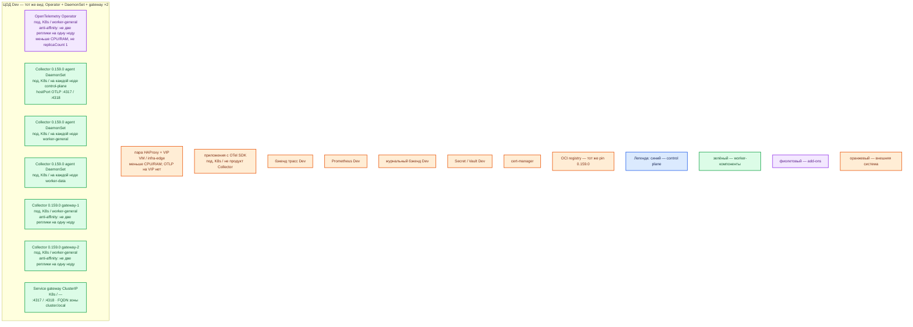

# OpenTelemetry Collector 0.159.0 — контур Dev

**OpenTelemetry Collector** 0.159.0. Контур **Dev**. Это **уменьшенный Prod**, не другой вид: тот же Operator, тот же agent **DaemonSet на каждой ноде**, тот же gateway **Deployment ≥2 реплики**. Не один контейнер, не Compose, не «Collector только на worker».

Не путать с **OpenTelemetry SDK** (`sample/Open Telemetry.md`): SDK живёт в приложении и **создаёт** сигналы; Collector их принимает и экспортирует.

## Допущения

+ Контур **Dev**: 1 ЦОД. Тот же механизм установки и та же роль-модель, что Prod. Меньше CPU/RAM/диск за счёт **меньших нод и лимитов**, не за счёт смены вида инсталляции.
+ **Не** один под Collector, **не** только gateway `replicas: 1`, **не** quickstart `docker run otel/opentelemetry-collector:0.159.0` на одной VM, **не** Docker Compose. Один процесс на Dev не воспроизведёт: taint control-plane, параллельные агенты, балансировку gateway, отказ одной ноды gateway.
+ Stretch не применим (одна площадка). Кворума у Collector нет — уменьшать нечего.
+ Та же пара HAProxy **3.4.3** + Keepalived + VIP, меньше CPU/RAM. Kafka :9092 через этот HAProxy не публикуем. OTLP 4317/4318 на VIP не выводим.
+ Тот же Kubernetes **1.36.4** / те же имена StorageClass (`local-ssd`, `shared-fs`). Collector PVC на старте не берёт; тома классов на агента не влияют.
+ DNS: CoreDNS / `cluster.local`; снаружи зона `dev.…`. Агенты — по FQDN Service gateway, не Pod IP.
+ Stateless gateway: **минимум 2 реплики на 2 нодах** `worker-general`. Operator — тоже ≥2 маленьких реплики, anti-affinity (как Prod).
+ Источник состава — `sample/Open Telemetry Collector.md`. `IT-landscape.md` не использовался. Карточки `Out/Платформенная инфра/Open Telemetry Collector/` — только факты этого продукта. `Open Telemetry Collector.install.md` нет.
+ Тот же пин образа **0.159.0** (Core или тот же dist, что Prod, после manifest). Не `latest`. Автоинструментация Operator **выключена** — это SDK.
+ Tail sampling / Target Allocator / `file_storage` PVC — не включать «пока на Dev проще»: иначе Dev и Prod разъедутся. Учебный `debug` exporter — только закрытый контур, не с боевым PII.
+ Windows-ноды не покрываются.

## Схема инстансов

Без потоков. У Collector нет голосующей роли: синий control plane продукта не рисуется, только легенда.

ОС — свойство платформы, не пода. Один стандарт Linux на всех нодах контура.

Исключение вендора: только Linux-ноды. Windows на Dev так же не покрывается. Не подменять кластер kind/minikube с одним Collector.

### Пулы нод

| Имя пула | Роль | Зачем выделен |
|---|---|---|
| `control-plane` | control-plane | Три маленьких stacked control-plane Dev (кворум etcd **платформы**, не Collector). DaemonSet agent — **на каждой** из них, с tolerations. Не «Collector только на worker». |
| `worker-general` | general | ≥2 ноды: Operator и **две** реплики gateway с anti-affinity, плюс agent DaemonSet на каждой. |
| `worker-data` | data-localdisk | Те же имена классов, меньшие тома приложений. Agent на каждой data-ноде, иначе ошибка «нет OTLP с брокера» на Dev не воспроизводится. |
| `infra-edge` | edge-VM | Та же пара HAProxy + VIP. Не ноды Kubernetes, DaemonSet их не видит. |

## Комментарии к схеме

### Почему не один docker collector

- **Функционал:** Dev нужен, чтобы поймать ошибку **вида инсталляции** и ошибку «агент не на всех нодах / gateway в одном экземпляре».
- **Критично:** схема «1 VM, `docker run otel/opentelemetry-collector:0.159.0`, порты 4317/4318/55679» — учебный quickstart sample, **другой класс системы**. Не воспроизводятся: DaemonSet rolling update, taint control-plane, две реплики gateway, TLS agent→gateway, PDB, секрет в Secret. Паритет: те же CR `mode: daemonset` + `mode: deployment` / `replicas: 2` / образ **0.159.0**. Helm без Operator допустим только если Prod тоже без Operator; иначе Dev и Prod разъедутся.

### OpenTelemetry Operator ×2

- **Функционал:** тот же контроллер CR, телеметрию не несёт. cert-manager нужен так же, как в Prod.
- **Критично:** не схлопывать в одну реплику Operator «потому что Dev». Не манифест `.../latest/download/opentelemetry-operator.yaml`. Автоинструментацию SDK не включать в этом файле. Kubernetes Dev тот же 1.36.4.

### DaemonSet agent — на каждой Linux-ноде Dev

- **Функционал:** тот же локальный OTLP **4317/4318**, тот же `memory_limiter` + `batch`, тот же экспорт на Service gateway.
- **Критично:** покрытие tainted control-plane обязательно. **Не резать CPU/RAM limit агента** «чтобы влезло на маленькую ноду» до нуля очереди — получите refused/dropped, которых в Prod нет, или спрячете нехватку Prod. Уменьшение ёмкости = меньше нод в пулах и меньшие **requests** после замера, не другой контроллер (не Deployment «агент ×1»). Не включать zPages «для удобства» на VIP. hostPort / локальный endpoint ноды — как в Prod, чтобы SDK на Dev ходил так же.

Ориентир sample (VM, не смета K8s): **1 vCPU, 1 ГБ RAM, 5 ГБ** под конфиг/журналы. На Dev можно ниже после замера, но не меняя роль DaemonSet.

### Gateway ×2

- **Функционал:** тот же централизованный экспорт в бэкенды Dev. Порты **4317/4318** только внутри кластера.
- **Критично:** минимум **2** реплики на **2** нодах. Одна реплика не покажет потерю при выкате и отказ ноды. Не схлопывать в `replicas: 1`. Не включать `tail_sampling` на Dev, если в Prod его нет (и наоборот: если позже включите в Prod — Dev обязан получить `loadbalancing` exporter, не round-robin). PDB и anti-affinity — как Prod. `debug` exporter на закрытом Dev допустим **без** персональных данных; в Prod его нет — не оставлять включённым в общем Git-манифесте.

### Service gateway и VIP

- **Функционал:** FQDN `cluster.local` для агентов; VIP — только API/HTTP края.
- **Критично:** не публиковать 4317/4318/8888/13133/55679 на VIP «чтобы телеметрить с ноутбука». Для отладки — `kubectl port-forward` или telemetrygen **внутри** кластера.

### SDK и бэкенды Dev

- **Функционал:** приложения по-прежнему шлют в **agent ноды**, не напрямую в Tempo. Бэкенды Dev могут быть меньшей ёмкости — это не повод убрать слой Collector.
- **Критично:** успешный debug-вывод на одном поде не доказывает HA gateway и покрытие DaemonSet.

## Путь роста

Сначала больше нод в существующих пулах (DaemonSet сам добавит агентов) и наблюдение `otelcol_*`. Не переходить на один docker collector и не схлопывать gateway в 1. Ручки роста — те же, что Prod: реплики gateway, затем (после решения Prod) loadbalancing / tail sampling, затем `file_storage` на `local-ssd`. Не включать HPA и Target Allocator «пока на Dev».

## Сильные и слабые места

+ **Сильная сторона:** тот же Operator, тот же DaemonSet, те же ≥2 gateway, тот же пин 0.159.0, что Prod — ошибка наката конфига, taint и отказ реплики воспроизводится.
+ **Слабая сторона:** Dev-кластер всё равно должен иметь несколько Linux-нод (control-plane ×3 платформы + ≥2 worker). Это дороже «одного docker run», и это плата за паритет.
+ **Критично:** Collector по-прежнему не хранилище и не SDK. Не считать успешный telemetrygen на localhost доказательством ёмкости gateway на worker-data. Не использовать kind/minikube с одним Collector как замену этой инструкции. Не `latest`. Не OTLP в интернет.

## Источники

+ Collector overview: https://opentelemetry.io/docs/collector/
+ Релиз 0.159.0: https://github.com/open-telemetry/opentelemetry-collector-releases/releases/tag/v0.159.0
+ Quickstart (учебный один процесс — **не** этот контур): https://opentelemetry.io/docs/collector/quick-start/
+ Agent-to-gateway: https://opentelemetry.io/docs/collector/deploy/other/agent-to-gateway/
+ Operator: https://opentelemetry.io/docs/platforms/kubernetes/operator/
+ Дистрибутивы: https://opentelemetry.io/docs/collector/distributions/
+ sample: `sample/Open Telemetry Collector.md` (ориентир VM 1 vCPU / 1 ГБ / 5 ГБ; путь «если приложения в Kubernetes — Kubernetes + Helm»)
+ Карточки: `Out/Платформенная инфра/Open Telemetry Collector/Open Telemetry Collector.md`, `Open Telemetry Collector.consultant.md`

**В доке вендора нет (не угадано):** отдельная «Dev-смета» ядер; разрешение схлопнуть DaemonSet в один под или gateway в `replicas: 1`; порог, когда `debug` exporter без PII считается безопасным вне закрытого кластера.
