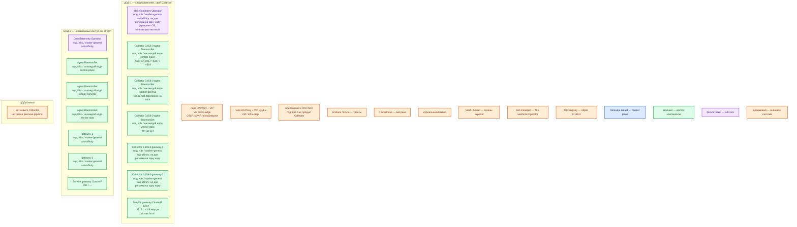

# OpenTelemetry Collector 0.159.0 — контур Prod

**OpenTelemetry Collector** (далее Collector) — отдельный процесс: принимает телеметрию, обрабатывает и экспортирует. Это **не** SDK внутри приложения (`sample/Open Telemetry.md`), **не** Tempo/Prometheus/OpenSearch и **не** бесконечная очередь. Пин: **0.159.0**, не `latest`.

**Agent** — роль Collector рядом с источником (здесь DaemonSet на каждой ноде). **Gateway** — роль централизованного Collector за Service. Один бинарник, две конфигурации.

## Допущения

+ Контур **Prod**: 2 прикладных ЦОДа + 1 ЦОД под бэкапы. Stretch одного «кластера Collector» между ЦОДами **нет**: у Collector нет кворума, Raft и лидера. RTT не измерен. Два Kubernetes = две независимые установки agent+gateway; бэкенды могут быть общими, процессы — нет.
+ На каждом прикладном ЦОДе: пара HAProxy **3.4.3** + Keepalived + VIP. VIP = ControlPlaneEndpoint Kubernetes (**6443/TCP**, TCP passthrough) и край HTTP(S). **Kafka :9092 через этот HAProxy не публикуем.** OTLP **4317/4318** на этот VIP **не** выводим.
+ Kubernetes **1.36.4**, kubeadm, CRI **containerd**; **1 кластер на прикладной ЦОД**. StorageClass: `local-ssd` (RWO) и `shared-fs` (RWX только по списку исключений). Collector на старте **не** заказывает PVC: очередь exporter — память процесса. NFS как диск Collector вендор не описывает.
+ DNS: внутри CoreDNS / `cluster.local`. Снаружи зона `prod.…`. Агенты ходят на FQDN Service gateway, не на Pod IP. Приложения — на локальный agent ноды, не на VIP.
+ Нагрузка (spans / metric points / log records в секунду) **не замерена**. Ёмкость CPU/RAM — порядок величины, уточняется метриками `otelcol_*`. Не включаем «все тумблеры масштабирования» (HPA, Target Allocator, tail sampling на старте).
+ Источник состава ПО — `sample/Open Telemetry Collector.md`. Карточки `Out/Платформенная инфра/Open Telemetry Collector/` — факты **этого** продукта. Файла `Open Telemetry Collector.install.md` **нет**. `integrations/IT-landscape.md` **не** использовался. Карточка SDK (`Open Telemetry.md`) — другой продукт, в эту установку не входит.
+ Приложения платформы живут в Kubernetes → официальный **OpenTelemetry Operator** + два CR `OpenTelemetryCollector`: `mode: daemonset` (agent) и `mode: deployment` (gateway, **≥2** реплики). Helm-чарт Collector без Operator — тот же вид (DS + Deployment), запасной путь. **Не** Docker Compose, **не** один `docker run` на VM, **не** только gateway без agent.
+ Образ стартовый из sample: `otel/opentelemetry-collector:0.159.0` (Core). Если в pipeline нужны модули, которых нет в Core (например `k8sattributes`, `loadbalancing`) — Kubernetes dist `otelcol-k8s` **0.159.0** после сверки `manifest.yaml`. `prometheus` / `prometheusremotewrite` exporters в `otelcol-k8s` 0.159.0 **нет** (есть в contrib). Свою сборку через Builder — только если готовый dist не подходит; ответственность за SBOM и обновления на нас.
+ Трассы — в Tempo, метрики — в Prometheus-совместимый бэкенд, логи — в журнальный бэкенд (OpenSearch или иной). Конкретный exporter — только если он есть в выбранном dist. Секреты бэкендов — Kubernetes Secret / Vault, не git и не ConfigMap.
+ Tail sampling и Target Allocator **на старте выключены**. Gateway stateless: обычный Service (round-robin). `debug` exporter и zPages (**55679/TCP**) в бою выключены.
+ Windows-ноды эта установка не покрывает.

## Схема инстансов

Без потоков данных. ЦОД-1 и ЦОД-2 — две копии одной роль-модели. У Collector **нет** голосующей роли: синий control plane продукта на схеме не рисуется, только легенда.

ОС — свойство платформы, не пода. Один стандарт Linux на всех нодах контура.

Исключение вендора: официального списка ОС Collector нет. Образ Linux. Windows-ноды этой установкой не покрываются.

### Пулы нод

| Имя пула | Роль | Зачем выделен |
|---|---|---|
| `control-plane` | control-plane | kube-apiserver, etcd, scheduler, controller-manager. Taint `NoSchedule`. DaemonSet agent сюда **обязан** сесть через tolerations — иначе control plane без локального OTLP и без съёма ноды. |
| `worker-general` | general | Stateless: Operator и **≥2** реплики gateway. Anti-affinity: две gateway-реплики не на одну ноду. Agent DaemonSet — на каждой. |
| `worker-data` | data-localdisk | Поды с `local-ssd` (Kafka, СУБД и т.п.). Agent здесь же: иначе шумные ноды без локального приёма. PVC Collector на старте не берёт. |
| `infra-edge` | edge-VM | Пара HAProxy + Keepalived. Это **не** ноды Kubernetes: DaemonSet agent их не покрывает. OTLP на VIP нет. |

Если появится выделенный tainted-пул (`worker-kafka` и аналоги), его **не** исключают из DaemonSet: те же tolerations.

## Комментарии к схеме

### ЦОД-1 и ЦОД-2 — две установки, не один Collector

- **Функционал:** на каждой площадке свой Kubernetes, свой Operator, свой agent DaemonSet и свой gateway. Agent принимает OTLP **своей** ноды; gateway экспортирует с этой площадки в бэкенды.
- **Критично:** нет глобального кластера Collector и нечего растягивать на 2 ЦОДа. Отказ ЦОД-1 = нет телеметрии этой площадки в момент отказа (очередь в памяти процесса конечна). ЦОД-2 продолжает независимо. Не обещать exactly-once и «без потерь».

### OpenTelemetry Operator (add-on)

- **Функционал:** контроллер Kubernetes: смотрит CR `OpenTelemetryCollector` и создаёт DaemonSet / Deployment / Service. Поток телеметрии через Operator **не** проходит. Тот же Operator умеет автоинструментацию SDK — **в этой инструкции выключена** (это продукт OpenTelemetry SDK, не Collector).
- **Критично:** getting started вендора тянет манифест с тегом **`latest`** — в бой не копировать. Версия Operator в карточках продукта **не зафиксирована** — пинить конкретный релиз Operator и CRD, не `latest`. Для webhook Operator нужен **cert-manager** (отдельный продукт). Дефолт `spec.replicas` у CR Deployment — **1**; для gateway это ломаем на **≥2**. Число реплик самого Operator в источниках продукта нет; контроллер stateless — держим **≥2** на разных `worker-general`, чтобы выкат Operator не оставлял кластер без применения CR. Не путать Operator с процессом Collector.

### Agent DaemonSet — на каждой Linux-ноде

- **Функционал:** один под Collector на ноду: приём OTLP с приложений этой машины, лёгкая обработка (`memory_limiter` первым, затем `batch`), отправка на gateway площадки. Роль **agent**, не отдельный продукт.
- **Критично:** два CR, не один: `spec.mode: daemonset`. **Deployment с `replicas: N` вместо DaemonSet не использовать** — это другой вид: часть нод без локального агента, ошибка «нет телеметрии с ноды X» на Dev не воспроизведётся. Один под на ноду; второй процесс на той же ноде поток не делит. Образ пинить **0.159.0**. Порты **4317/TCP** (OTLP/gRPC) и **4318/TCP** (OTLP/HTTP), если включены в config. Публикация — **hostPort** (или эквивалент «локальный endpoint ноды»), чтобы SDK ходил на IP ноды / localhost, не на Pod IP агента и не на VIP. `hostNetwork: true` из примеров Operator включать только если без этого нет приёма; это расширяет поверхность. TLS между приложением и agent — по политике площадки; между agent и gateway — **OTLP+TLS**. Токены gateway — Secret. Tolerations на taint control-plane и dedicated data-пулы. PVC / `shared-fs` агенту не нужны. zPages и `debug` exporter выключены.

Ёмкость агента (порядок величины, **не** смета вендора): в sample для **VM-роли** ориентир **1 vCPU, 1 ГБ RAM, 5 ГБ** локального SSD (конфиг и журналы, не озеро данных). Официального CPU/RAM Collector нет. В примере agent-to-gateway `memory_limiter` агента — **512 MiB**. Уточняется замером `otelcol_process_*`, accepted/refused/dropped, queue size. Жёсткий CPU/RAM limit «чтобы не мешал» → отказ приёма (backpressure) → дыры в телеметрии.

### Gateway ×2 — Deployment, пул `worker-general`

- **Функционал:** централизованный приём от агентов, пакеты, лимит памяти, экспорт в Tempo / Prometheus-совместимый бэкенд / журнальный бэкенд. Stateless на старте: реплики взаимозаменяемы.
- **Критично:** `spec.mode: deployment`, **`replicas: 2`** (минимум консультанта и паритет stateless). Anti-affinity / topologySpread: не две реплики на одну ноду. PDB (у Operator по умолчанию часто `maxUnavailable: 1` — проверить, что при двух репликах выкат не обнуляет приём). Service **ClusterIP** (не LoadBalancer в интернет, не NodePort в мир, не VIP HAProxy). Агенты — на FQDN вида `*.svc.cluster.local:4317`. Обычный Service **не** клеит спаны одного Trace ID на одну реплику — для стартового stateless это нормально. `memory_limiter` первым, sending queue ограничена. Exporter в бэкенд — TLS; секреты не в git. Собственные метрики Collector (**8888/TCP** в типовых примерах, только если endpoint включён) — только внутреннему Prometheus, не в интернет. Health (**13133/TCP**, если `health_check` включён) — probes Kubernetes. Не запускать два одинаковых scrape/receiver, если это даст дубли, без явного анализа.

Ёмкость gateway: в примере вендора `memory_limiter` **2048 MiB** — пример, не наша смета. Нагрузка не замерена. Терабайты озёр живут в Tempo/Prometheus/OpenSearch, не в Collector.

### Service gateway

- **Функционал:** стабильное имя перед репликами gateway. Это объект Kubernetes, не процесс Collector.
- **Критично:** порты **4317** и **4318** только во внутренней сети. Headless Service — не на старте (нужен для `loadbalancing` exporter / tail sampling).

### Пара HAProxy + VIP (`infra-edge`)

- **Функционал:** вход Kubernetes API и HTTP(S) края площадки. К Collector не относится.
- **Критично:** 4317/4318/8888/13133/55679 на этот VIP не выводить. Kafka :9092 сюда не вешать.

### ЦОД-бэкапы

- **Функционал:** снимки платформы. Живого Collector здесь нет: нечего выбирать лидером и нечего реплицировать. Телеметрия хранится в бэкендах, не в Collector.
- **Критично:** не делать «третий docker collector без Kubernetes». Если на площадке бэкапов появится свой Linux-кластер — это **отдельная** установка Operator+DS+gateway, не член контура ЦОД-1.

### Приложения (OTel SDK) и бэкенды

- **Функционал:** SDK **создаёт** телеметрию внутри приложения. Tempo/Prometheus/OpenSearch **хранят**. Collector только маршрутизирует.
- **Критично:** не ставить SDK «вместо Collector» и не считать Collector заменой хранилища. Endpoint SDK — локальный agent ноды, не Pod IP gateway и не публичный VIP. Vault/Secret — единственное место токенов exporter.

## Путь роста

Не включать сразу.

1. Сначала замер `otelcol_process_*`, accepted/refused/dropped, queue, exporter failures. Потом requests/limits подов.
2. Агенты масштабируются **числом нод** (DaemonSet сам добавит под), не вторым процессом на ноду. Вертикально — лимиты агента после замера.
3. Gateway без tail sampling: добавить реплики Deployment за тем же Service (round-robin). Следить за **single-writer** метрик: две реплики не должны писать одну и ту же серию в Prometheus без согласованного ключа.
4. Tail sampling / `cumulativetodelta`: тогда agent с `loadbalancing` exporter по Trace ID (или иному ключу) + headless Service gateway. Обычный round-robin **нельзя**. Смена состава gateway перераспределяет ключи — отдельный отказный тест.
5. Постоянная очередь `file_storage`: том `local-ssd` (RWO) на gateway, не NFS и не `shared-fs`. Это буфер, не замена бэкенда.
6. Target Allocator / HPA — после профиля нагрузки, не «на всякий случай».
7. Смена dist (Core → k8s → contrib) — только после сверки manifest нужных receivers/exporters.

Не растягивать pipeline на два ЦОДа. Не публиковать OTLP в интернет.

## Сильные и слабые места

+ **Сильная сторона:** официальный Operator, тот же DaemonSet agent и ≥2 gateway на обеих площадках; отказ одной не глушит другую; RTT между ЦОДами на pipeline не влияет; приложения не знают адреса Tempo/Prometheus.
+ **Слабая сторона:** падение пода agent = **эта нода без локального приёма**, пока под не встал; очередь в RAM конечна — недоступность бэкенда дольше очереди = потери; два ЦОДа = два выката конфига.
+ **Критично:** Collector **не** база и **не** Kafka. Не обещать exactly-once. Не ставить Deployment вместо DaemonSet «для HA агента». Не один docker collector. Не `latest`. Не копировать учебный `debug` exporter с боевым payload. Не открывать OTLP/zPages/metrics миру. Не масштабировать tail sampling round-robin. Не класть токены в git/ConfigMap. Не путать с SDK.

## Источники

+ Collector overview: https://opentelemetry.io/docs/collector/
+ Релиз 0.159.0: https://github.com/open-telemetry/opentelemetry-collector-releases/releases/tag/v0.159.0
+ Дистрибутивы и manifest: https://opentelemetry.io/docs/collector/distributions/
+ Manifest Kubernetes dist 0.159.0: https://github.com/open-telemetry/opentelemetry-collector-releases/blob/v0.159.0/distributions/otelcol-k8s/manifest.yaml
+ Manifest Contrib 0.159.0: https://github.com/open-telemetry/opentelemetry-collector-releases/blob/v0.159.0/distributions/otelcol-contrib/manifest.yaml
+ Конфигурация: https://opentelemetry.io/docs/collector/configuration/
+ Deployment patterns: https://opentelemetry.io/docs/collector/deployment/
+ Agent-to-gateway: https://opentelemetry.io/docs/collector/deploy/other/agent-to-gateway/
+ Масштабирование: https://opentelemetry.io/docs/collector/scaling/
+ Operator (CR, modes daemonset/deployment/statefulset/sidecar; запрет latest из getting started): https://opentelemetry.io/docs/platforms/kubernetes/operator/
+ Helm Operator: DaemonSet vs Deployment: https://github.com/open-telemetry/opentelemetry-helm-charts/blob/main/charts/opentelemetry-operator/README.md
+ sample: `sample/Open Telemetry Collector.md`
+ Карточки: `Out/Платформенная инфра/Open Telemetry Collector/Open Telemetry Collector.md`, `Open Telemetry Collector.consultant.md`
+ **Нет файла** `Open Telemetry Collector.install.md`

**В доке вендора / карточках нет (не угадано):** пин версии OpenTelemetry Operator под Collector 0.159.0; минимум CPU/RAM «чтобы процесс поднялся» сверх ориентира sample и примеров `memory_limiter`; порог RTT между ЦОД; NFS как том Collector; отдельная смета ядер «на терабайты озёр» (озёра не в Collector).
