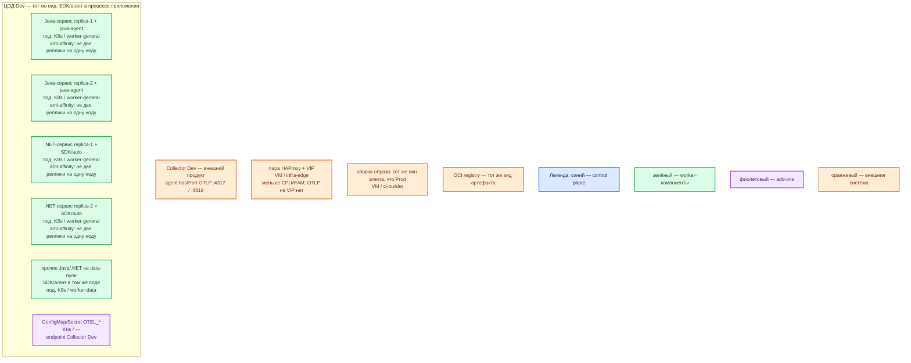

# OpenTelemetry (API/SDK/агент в процессе) — контур Dev

Тот же механизм, что Prod: **API/SDK/агент внутри процесса приложения** в Kubernetes, тот же пин JAR/пакетов в OCI-образе, те же имена `OTEL_*`, экспорт **OTLP** на Collector площадки (**4317/4318**). Dev **уменьшает CPU/RAM** подов приложений, не меняет вид инструментирования.

Это **не** учебный `java -jar` / `dotnet run` + скрипт `latest`, не console/Zipkin exporter «пока Dev», не один под без агента. Иначе ошибка вида инсталляции (endpoint hostIP, выкат образа с агентом, две реплики) на Dev не воспроизводится.

Не путать с Collector (`sample/Open Telemetry Collector.md`).

## Допущения

+ Контур **Dev**: 1 ЦОД. Stretch не применим. Кворума у SDK нет — уменьшать нечего.
+ Уже есть: VM, Kubernetes этого ЦОДа, пара HAProxy **3.4.3** + Keepalived + VIP (меньше CPU/RAM, чем Prod), StorageClass с теми же именами `local-ssd` / `shared-fs` (SDK PVC не берёт), зона `dev.…`, **тот же вид** Collector (agent DaemonSet с hostPort :4317/:4318).
+ Паритет с Prod: тот же способ (агент/пакеты **в образе**, не Operator injection, пока Prod так), те же языки **Java** и **.NET**, тот же протокол OTLP. Stateless-приложения — минимум **2 реплики на 2 нодах** `worker-general` (это требование приложений; SDK едет с ними).
+ Не Docker Compose, не один процесс на VM, не «на Dev агент выключен чтобы быстрее». Не слать с Dev напрямую в Tempo/Prometheus «минуя Collector».
+ Нагрузка не замерена. Оверхед — доля того же пода, **меньше Prod** после замера, не нулевой limit «чтобы влезло».
+ Источник состава — `sample/Open Telemetry.md`. `IT-landscape.md` не использовался. Карточки `Out/Платформенная инфра/Open Telemetry/`. `Open Telemetry.install.md` нет. Пин версии в sample **нет** — всё равно не `latest`, тот же пин, что Prod.
+ Windows-ноды не целевые.

## Схема инстансов

Без потоков. У SDK нет голосующей роли: синий control plane продукта не рисуется, только легенда.

ОС — свойство платформы, не пода. Один стандарт Linux на всех нодах контура.

Исключения вендора по ОС нет: тот же Linux-контейнер, что в Prod. Сборка на `ci-builder` может идти с JDK/.NET SDK на Linux/Windows/macOS — это не ОС рабочих нод.

### Пулы нод

| Имя пула | Роль | Зачем выделен |
|---|---|---|
| `worker-general` | general | ≥2 ноды: две реплики Java и две .NET с anti-affinity. Не схлопывать в 1 под «без агента». |
| `worker-data` | data-localdisk | Те же имена классов, меньшие тома приложений. Java/.NET здесь — тот же агент в поде; иначе ошибка «с data-пода нет OTLP» на Dev не ловится. |
| `infra-edge` | edge-VM | Та же пара HAProxy + VIP, меньше CPU/RAM. Java-agent сюда не ставим. |
| `ci-builder` | ci | Та же вшивка пина в образ, что Prod; не замена рантайму `mvn`/`dotnet run`. |

Смысл цветов: синий — control plane продукта (у SDK нет); зелёный — поды приложений с SDK/агентом; фиолетовый — ConfigMap/Secret; оранжевый — Collector, VIP, CI, реестр.

От Prod схема отличается так: один ЦОД, нет второго зала и нет блока ЦОД-бэкапов; число **реплик приложений не режем до 1**.

## Комментарии к схеме

### Почему не quickstart на одной VM

- **Функционал.** Dev нужен, чтобы поймать ошибку **вида** (агент в образе vs «просто запустили JAR»), ошибку endpoint (`localhost:4317` в поде) и ошибку «одна реплика / один язык».
- **Критично.** Схемы «`curl …/latest/download` + `dotnet run` + console exporter» и «Zipkin на 9411» из getting started — **другой класс**. Паритет: тот же пин агента, `OTEL_EXPORTER_OTLP_ENDPOINT` на **hostIP:4317** (или :4318 при HTTP), тот же `OTEL_EXPORTER_OTLP_PROTOCOL`. Не выключать агент на Dev «для скорости».

### Java-сервис ×2 + java-agent

- **Функционал.** Тот же `-javaagent:` / `JAVA_TOOL_OPTIONS`, что Prod. Две реплики на двух нодах — требование stateless-приложения; агент внутри каждого процесса.
- **Критично.** Не `replicas: 1`. Не другой JAR, чем Prod. `OTEL_JAVAAGENT_DEBUG` не держать включённым в общем манифесте (шум и PII в логах). Ёмкость: меньше request/limit **пода**, не «агент отдельным контейнером Compose». PVC нет.

### .NET-сервис ×2 + SDK/auto

- **Функционал.** Тот же вариант, что Prod (пакеты **или** auto-instrumentation — как на бою, не смесь контуров).
- **Критично.** Не подменять auto на «только console». Не копировать Java-флаги. Если в Dev одна worker-нода — это **другой класс** стенда, не уменьшенный Prod.

### Прочие Java/.NET на `worker-data`

- **Функционал.** Тот же агент в процессе, если такие приложения есть.
- **Критично.** Не заменять это DaemonSet Collector и не «инструментировать только general».

### ConfigMap/Secret и Collector Dev

- **Функционал.** `OTEL_SERVICE_NAME`, resource attributes с `deployment.environment.name=dev`, endpoint на agent ноды Dev.
- **Критично.** Имена переменных как в Prod; другие значения (зона `dev.…`, environment). Не писать в env адреса Tempo/Prometheus. TLS — как приняли для Prod (не «plaintext только на Dev», если бой с TLS: иначе ошибка сертификата не воспроизведётся). Секреты заголовков — Secret. Debug exporter Collector — не повод слать payload с PII с приложений.

### Пара HAProxy + VIP

- **Функционал.** Та же роль-модель края, меньше CPU/RAM.
- **Критично.** OTLP на VIP нет. Kafka :9092 сюда не публикуем.

### `ci-builder` / реестр

- **Функционал.** Тот же конвейер образа. Тег может быть `dev`, способ поставки — тот же.
- **Критично.** Не кормить контур «агентом с ноутбука». Пин = Prod.

## Путь роста

Как в Prod, только на меньших лимитах после замера: реплики приложения, head sampling, очередь SDK. Не включать на Dev tail sampling в SDK (его нет в SDK как полноценного хвоста — хвост у Collector). Если Prod позже сменит вид (например Operator injection) — Dev **обязан** сменить тот же вид, не остаться на JAR «потому что проще».

## Сильные и слабые места; критичные условия

**Сильная сторона.** Тот же агент и тот же контракт OTLP, что Prod: баг выката образа, hostIP и anti-affinity ловятся здесь.

**Слабая сторона.** Искушение выключить агент или уйти в console exporter. Маленький limit пода маскирует или наоборот усиливает дропы очереди относительно Prod.

**Критичные условия**

- Не Compose, не `latest`, не один под, не другой exporter, чем Prod.
- Не прямой путь в бэкенды. Не 4317/4318 на VIP.
- Не Java-флаги на .NET. Не PII в attributes.
- Не обещать нулевую потерю при kill пода.

## Источники

| Факт | URL / файл |
|---|---|
| Что такое OpenTelemetry | https://opentelemetry.io/docs/what-is-opentelemetry/ |
| OTLP 4317 / 4318 | https://opentelemetry.io/docs/specs/otlp/ |
| `OTEL_EXPORTER_OTLP_*` | https://opentelemetry.io/docs/languages/sdk-configuration/otlp-exporter/ |
| Java agent | https://opentelemetry.io/docs/zero-code/java/agent/getting-started/ |
| .NET zero-code (учебный `latest` в контур не копировать) | https://opentelemetry.io/docs/zero-code/dotnet/getting-started/ |
| .NET auto config | https://github.com/open-telemetry/opentelemetry-dotnet-instrumentation/blob/main/docs/config.md |
| Состав sample | `sample/Open Telemetry.md` |
| Карточки | `Out/Платформенная инфра/Open Telemetry/` |
| **Нет файла** | `Open Telemetry.install.md` |

**В источниках нет:** пин версии агента; смета CPU/RAM SDK; порог RTT.
