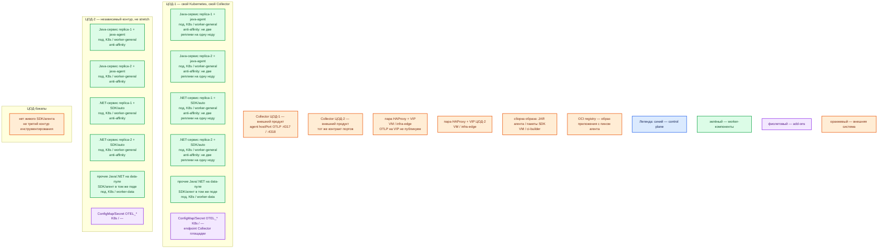

# OpenTelemetry (API/SDK/агент в процессе) — контур Prod

**OpenTelemetry** (далее OTel) — спецификации, API, SDK, инструментация и протокол OTLP. Это **не** хранилище, **не** дашборд и **не** отдельный сервер. В этом контуре OTel живёт **внутри процесса приложения** (библиотеки SDK и/или zero-code агент). Отдельных VM/подов «кластера OpenTelemetry» нет.

Не путать с **OpenTelemetry Collector** (`sample/Open Telemetry Collector.md`): Collector — отдельный процесс, принимает OTLP. Java-agent (`-javaagent:`) — не DaemonSet Collector.

Пин версии JAR/NuGet в `sample/Open Telemetry.md` и карточках **не зафиксирован**. Ставить **не** `latest`: конкретный релиз пинить в образе приложения. Файла `Open Telemetry.install.md` **нет**.

## Допущения

+ Контур **Prod**: 2 прикладных ЦОДа + 1 ЦОД под бэкапы. Stretch «кластера OTel» между ЦОДами **нет**: у SDK нет кворума, Raft и лидера. RTT не измерен. Два Kubernetes = два независимых набора приложений со своим Collector площадки.
+ На каждом прикладном ЦОДе: пара HAProxy **3.4.3** + Keepalived + VIP. VIP = ControlPlaneEndpoint Kubernetes (**6443/TCP**, TCP passthrough) и край HTTP(S). **Kafka :9092 через этот HAProxy не публикуем.** OTLP **4317/4318** на этот VIP **не** выводим: порты слушает Collector, SDK сам **не** слушает.
+ Kubernetes **1.36.4**, kubeadm, CRI **containerd**; **1 кластер на прикладной ЦОД**. StorageClass: `local-ssd` (RWO) и `shared-fs` (RWX только по списку исключений). SDK **не** заказывает PVC: очередь exporter — память процесса приложения. NFS как диск OTel вендор не описывает.
+ DNS: внутри CoreDNS / `cluster.local`. Снаружи зона `prod.…`. Клиенты приложений — по FQDN. Endpoint Collector для SDK — **не** Pod IP Collector и **не** VIP; в топологии Collector площадки — локальный agent ноды (**hostPort :4317 / :4318**).
+ Языки состава из `sample/Open Telemetry.md`: **Java** и **.NET**. Флаги Java-agent на .NET (и наоборот) не переносить. Другие языки — только после сверки документации **этого** языка и реестра инструментации.
+ Два равноправных способа в одном процессе (можно сочетать): **SDK instrumentation** (библиотеки в приложении) и **zero-code / automatic instrumentation** (Java-agent / .NET Automatic Instrumentation). Вид инсталляции: агент/пакеты **вшиты в OCI-образ** приложения + переменные `OTEL_*` в поде. Не Docker Compose, не `java -jar` на одной VM, не `dotnet run` + скрипт `latest` с GitHub.
+ Автоинструментация OpenTelemetry Operator (injection sidecar/init) в карточке SDK **не** описана; у Collector она **выключена**. Не включать injection на одной площадке и JAR в образе на другой — это разные виды.
+ Приложение шлёт OTLP на **ближайший Collector**, не напрямую в Tempo / Prometheus / журнальный бэкенд. Адреса и секреты хранилищ в код и в `OTEL_*` приложения не кладём.
+ Нагрузка (спаны / точки метрик / записи логов в секунду) **не замерена**. Оверхед CPU/RAM — доля ресурсов **того же** пода приложения, порядок величины, уточняется замером. Не включать «все тумблеры» (always_on на всём трафике, прямой экспорт во все бэкенды).
+ Источник состава — `sample/Open Telemetry.md`. Карточки `Out/Платформенная инфра/Open Telemetry/` — факты **этого** продукта. `integrations/IT-landscape.md` **не** использовался.
+ Windows-ноды этим контуром не целевые: рантайм приложений — Linux-контейнеры кластера.

## Схема инстансов

Без потоков данных. ЦОД-1 и ЦОД-2 — две копии одной роль-модели. У SDK **нет** голосующей роли: синий control plane продукта на схеме не рисуется, только легенда. «Инстанс OTel» = процесс приложения с SDK/агентом внутри, не отдельный под.

ОС — свойство платформы, не пода. Один стандарт Linux на всех нодах контура.

Исключение вендора по ОС рантайма в карточках SDK нет: процесс — Linux-контейнер приложения. Сборка на `ci-builder` может идти на Linux/Windows/macOS с JDK/.NET SDK — это машина CI, не ОС пода.

### Пулы нод

| Имя пула | Роль | Зачем выделен |
|---|---|---|
| `worker-general` | general | Stateless Java/.NET сервисы с SDK/агентом в процессе. Anti-affinity — свойство **приложения** (минимум 2 реплики на 2 нодах), не отдельный «кластер OTel». |
| `worker-data` | data-localdisk | Поды с `local-ssd`. Если здесь крутится **наше** Java/.NET приложение — тот же агент/SDK в этом поде, не DaemonSet «OTel на каждой ноде». |
| `infra-edge` | edge-VM | Пара HAProxy + Keepalived + VIP. Это **не** ноды Kubernetes и не место java-agent. |
| `ci-builder` | ci | Вшивка пина `opentelemetry-javaagent.jar` / пакетов .NET в OCI-образ. Не рантайм боя. |

Смысл цветов: синий — управляющие/голосующие роли продукта (у SDK их нет); зелёный — рабочие инстансы = поды приложений с SDK/агентом внутри; фиолетовый — ConfigMap/Secret `OTEL_*`; оранжевый — внешнее (Collector, VIP, CI, реестр, ЦОД-бэкапы).

## Комментарии к схеме

### Почему нет отдельных серверов OTel

- **Функционал.** API, SDK, инструментация и OTLP exporter исполняются в JVM / CLR приложения. Спецификации сами по себе не разворачиваются.
- **Критично.** Не ставить Deployment/StatefulSet/DaemonSet «OpenTelemetry SDK». DaemonSet на каждой ноде — это **Collector agent** (другой продукт) или путаница с java-agent. Нет официального оператора «кластера SDK» в источниках этого продукта.

### Java: zero-code агент в том же контейнере

- **Функционал.** JAR агента подключается к JVM: `-javaagent:path/to/opentelemetry-javaagent.jar` или `JAVA_TOOL_OPTIONS`. Автоинструментация покрывает известные библиотеки; ручные спаны — через API в коде.
- **Критично.** JAR кладётся **в образ** (или read-only volume образа), путь стабилен. Скачивать агент с `releases/latest` в бою нельзя. Не копировать getting started с Zipkin-exporter: экспорт — **OTLP** на Collector. Конфиг агента — env / `-D`, не отдельный сервер. `OTEL_JAVAAGENT_DEBUG=true` в бою не оставлять.

### .NET: SDK-пакеты или Automatic Instrumentation

- **Функционал.** Вариант 1: пакеты SDK + `OpenTelemetry.Exporter.OpenTelemetryProtocol` в приложении. Вариант 2: OpenTelemetry .NET Automatic Instrumentation (профайлер/скрипт инструментации) без правки каждого вызова.
- **Критично.** Не переносить `JAVA_TOOL_OPTIONS` и `-javaagent` на CLR. Учебный getting started тянет скрипт с **`latest`** и console exporter — в контур не копировать: пин релиза в образ, exporter **OTLP**. `dotnet run` на VM — не этот контур.

### Endpoint: OTLP на Collector :4317 / :4318

- **Функционал.** SDK **исходящий** клиент. Стандарт: **4317/TCP** OTLP/gRPC, **4318/TCP** OTLP/HTTP (`/v1/traces`, `/v1/metrics`, `/v1/logs` на HTTP). Дефолт документации exporter: gRPC `http://localhost:4317`, HTTP `http://localhost:4318`.
- **Критично.** В поде `localhost` — это **сам под**, не агент ноды. Контракт с Collector площадки: agent слушает **hostPort** :4317/:4318 → `OTEL_EXPORTER_OTLP_ENDPOINT` на **IP ноды** (`status.hostIP` Downward API), не Pod IP Collector, не Service gateway, не VIP HAProxy. Протокол задать явно (`OTEL_EXPORTER_OTLP_PROTOCOL=grpc` или `http/protobuf`) так, чтобы порт и путь совпали. Для gRPC **не** дописывать `/v1/traces`. TLS/mTLS до agent — политика площадки (для боя консультант требует TLS). Заголовки с секретами — Kubernetes Secret, не ConfigMap и не git.

### Resource и сигналы

- **Функционал.** `OTEL_SERVICE_NAME` (обязательное имя сервиса) и `OTEL_RESOURCE_ATTRIBUTES` (версия, `deployment.environment.name=prod`, при необходимости атрибуты Kubernetes). Head sampling — в SDK; tail sampling — в Collector, не в приложении.
- **Критично.** Не класть в attributes, span events, logs и baggage: токены, тела запросов, карточки клиентов, секреты. Не делать label/attribute метрики из `user_id`, UUID, Trace ID или иного unbounded-ключа. «Подключили агент» ≠ данные дошли, безопасны и полезны. Очередь SDK конечна: убитый под теряет неотправлённое; нулевую потерю вендор не обещает.

### ConfigMap / Secret `OTEL_*`

- **Функционал.** Одинаковые имена переменных на все реплики сервиса площадки; отличается endpoint (нода/зона) и `deployment.environment`.
- **Критично.** Не хардкодить в образе URL Tempo/Prometheus/OpenSearch. Смена бэкенда — конфиг Collector, не выкат всех приложений.

### Пара HAProxy + VIP

- **Функционал.** Вход API Kubernetes и HTTP(S) края. К SDK не относится.
- **Критично.** 4317/4318 на VIP не публиковать. SDK в интернет OTLP не отдаёт.

### ЦОД-бэкапы

- **Функционал.** Живого SDK нет: бэкапить нечего (состояние — в образе и Git, телеметрия — в бэкендах за Collector).
- **Критично.** Не строить «третий зал java-agent» на бэкап-площадке.

### `ci-builder` и реестр

- **Функционал.** Сборка OCI-образа приложения с пином агента/пакетов. Оба ЦОДа тянут тот же вид артефакта.
- **Критично.** Пин digest/тега, не `latest`. Сборка ≠ рантайм контура.

## Путь роста

Не включать сразу. После замера объёма сигналов и ошибок экспорта:

1. Добавить реплики **приложения** (SDK копируется с подом). Это рост приложения, не «кластера OTel».
2. Поднять request/limit **того же** пода, если агент жрёт CPU/RAM; отдельный под OTel не создавать.
3. Head sampling в SDK (`OTEL_TRACES_SAMPLER` / аргумент доли) — после профиля, не `always_on` «на всякий случай» на всём Prod.
4. Очередь batch span processor (`OTEL_BSP_*` и аналоги языка) — только после дропов; это не диск и не Kafka.
5. Новый язык/фреймворк — реестр и документация **этого** языка, не копипаст Java.
6. Прямой OTLP в бэкенд без Collector — не целевой путь платформы (адреса хранилищ утекут в приложения).

Не растягивать один SDK-конфиг на два ЦОДа как «HA». Не публиковать OTLP с приложения в интернет.

## Сильные и слабые места; критичные условия

**Сильная сторона.** Нет лишней роль-модели серверов: отказ «узла OTel» = отказ того же пода приложения, который и так чинит Kubernetes. Приложения не знают Tempo/Prometheus. Тот же JAR/пакеты и те же `OTEL_*` на обеих площадках.

**Слабая сторона.** Падение процесса = потеря буфера SDK. Автоинструментация не знает бизнес-смысл. Ошибка endpoint (`localhost` вместо hostIP) даёт тишину без падения приложения. Два ЦОДа = два выката env. Пин версии агента в sample нет — риск уехать на `latest`.

**Критичные условия**

- Не Collector, не DaemonSet java-agent, не Compose, не один под «чтобы проще».
- Не `latest` JAR/скрипт/NuGet. Не копировать Java-флаги в .NET.
- Не слать SDK напрямую во все бэкенды. Не вешать 4317/4318 на VIP.
- Не injection Operator на Prod и «JAR в образе» на Dev (и наоборот), пока это не принято **обоими** контурами.
- Не PII/секреты в telemetry. Не unbounded cardinality в метриках.
- Не обещать exactly-once и сохранность спанов после SIGKILL.

## Источники

| Факт | URL / файл |
|---|---|
| Что такое OpenTelemetry (не бэкенд) | https://opentelemetry.io/docs/what-is-opentelemetry/ |
| Компоненты | https://opentelemetry.io/docs/concepts/components/ |
| OTLP, порты 4317 / 4318 | https://opentelemetry.io/docs/specs/otlp/ |
| `OTEL_EXPORTER_OTLP_*` | https://opentelemetry.io/docs/languages/sdk-configuration/otlp-exporter/ |
| Java agent getting started (`-javaagent`, `JAVA_TOOL_OPTIONS`) | https://opentelemetry.io/docs/zero-code/java/agent/getting-started/ |
| Репозиторий Java instrumentation | https://github.com/open-telemetry/opentelemetry-java-instrumentation |
| Конфигурация Java SDK | https://opentelemetry.io/docs/languages/java/configuration/ |
| .NET zero-code getting started | https://opentelemetry.io/docs/zero-code/dotnet/getting-started/ |
| .NET auto config | https://github.com/open-telemetry/opentelemetry-dotnet-instrumentation/blob/main/docs/config.md |
| .NET OTLP exporter (sample; зеркало netlify) | https://www.nuget.org/packages/opentelemetry.exporter.opentelemetryprotocol/ |
| Семантические соглашения | https://opentelemetry.io/docs/specs/semconv/ |
| Реестр инструментации | https://opentelemetry.io/ecosystem/registry/ |
| Состав, порты, два варианта установки | `sample/Open Telemetry.md` |
| Карточка и роль консультанта | `Out/Платформенная инфра/Open Telemetry/Open Telemetry.md`, `Open Telemetry.consultant.md` |
| **Нет файла** | `Open Telemetry.install.md` |

**В доке вендора / карточках нет (не угадано):** пин версии `opentelemetry-javaagent.jar` и .NET auto/SDK для этого контура; официальная смета CPU/RAM «на агент»; порог RTT; отдельный Helm/оператор именно SDK; требование PVC.
