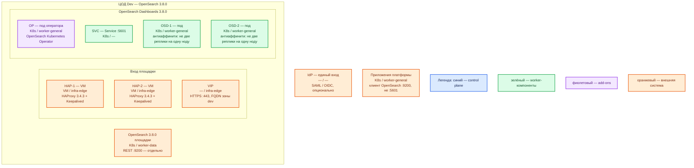

# OpenSearch Dashboards 3.8.0 — Dev

Веб-интерфейс (процесс Node.js, порт **5601/TCP**) к кластеру OpenSearch **3.8.0**. Тот же механизм, что Prod: секция `spec.dashboards` оператора в Kubernetes. Dev уменьшает CPU/RAM/диск, не меняет вид инсталляции.

## Допущения

- Контур: **1 ЦОД**. Stretch между залами нет.
- Живой OpenSearch **3.8.0** в этом же ЦОДе (свой оператор, не `discovery.type=single-node` и не один Docker «для удобства»). UI смотрит только на **его** 9200.
- Паритет с Prod: тот же оператор, та же роль-модель (две реплики UI, Service, край HAProxy+VIP), не quickstart Docker на одной VM и не Docker Compose. Учебный `docker run` из `.install.md` этот контур **не** описывает.
- Stateless: **минимум 2 реплики на 2 нодах** `worker-general`, антиаффинити. Одна реплика на Dev запрещена правилом паритета (иначе не воспроизвести отказ ноды и балансировку).
- На ЦОДе: пара HAProxy **3.4.3** + Keepalived + VIP (меньше CPU/RAM, чем Prod); те же имена StorageClass `local-ssd` / `shared-fs` (подам UI тома не нужны); DNS внутри `cluster.local`, снаружи зона `dev.…`.
- Нагрузка не замерена. Ёмкость — меньше Prod, порядок величины, уточняется замером.
- Приложения ходят в OpenSearch на **9200** напрямую, не через Dashboards.
- Единый вход опционален; на Dev достаточно парольного входа Security plugin. Учебные demo-пароли в git и в «почти бой» не копировать.

## Схема инстансов

Имена — роли, не обязательные DNS. Потоков и стрелок нет. Пул нод — класс машин для планировщика, не «под на ноде 3».

ОС — свойство платформы, не пода. Один стандарт Linux на всех нодах контура.

Вендор для пути оператора/Helm отдельную ОС под Dashboards не требует (в Docker-гайде ОС тоже не фиксирует).

| Пул | Роль | Зачем выделен |
|---|---|---|
| `infra-edge` | edge-VM | Та же пара HAProxy + Keepalived + VIP, что на Prod; меньше CPU/RAM |
| `worker-general` | general | Поды UI и оператор; две ноды, чтобы антиаффинити было куда сработать |
| `worker-data` | data-localdisk | Кластер OpenSearch (чужой на этой схеме); тома меньше Prod, те же имена StorageClass |

У Dashboards **нет** своей голосующей роли: синий control plane продукта на схеме не рисуется, только легенда.

## Комментарии к схеме

### HAP-1, HAP-2, VIP — вход площадки

- **Функционал.** Та же роль-модель, что Prod: пара VM, Keepalived, VIP. Снаружи FQDN зоны `dev.…` на **443**. VIP также ControlPlaneEndpoint (`:6443`, TCP passthrough).
- **Критично.** Не публиковать **5601** на `0.0.0.0` «потому что стенд». Не заменять пару одним HAProxy: иначе не воспроизвести отказ края. `cookie.secure` согласовать с HTTPS на VIP ([TLS](https://docs.opensearch.org/latest/install-and-configure/install-dashboards/tls/)). Клиенты по FQDN, не по Pod IP.

### OP — OpenSearch Kubernetes Operator

- **Функционал.** Тот же контроллер, что Prod: `spec.dashboards` рядом с кластером.
- **Критично.** `version: "3.8.0"`, `replicas: 2` — не пример вендора с одной репликой и не Helm-quickstart. Не ставить параллельно `docker run osd-dev` «для отладки»: это другой вид инсталляции. Helm — запасной путь с теми же 2 репликами, не Recreate-выкат в ноль.

### SVC — Service :5601

- **Функционал.** Имя в `cluster.local` перед двумя подами.
- **Критично.** Нужен, чтобы балансировка была того же типа, что на Prod. Один опубликованный порт контейнера Docker эту роль не выполняет.

### OSD-1, OSD-2 — реплики UI

- **Функционал.** Два одинаковых процесса **3.8.0**. Состояние в `.kibana*` кластера. Сессия в cookie; одинаковый секрет ≥ **32** символов.
- **Критично.**
  - Минимум **2** реплики, **2** ноды, антиаффинити. Сокращать до одного пода нельзя: это уже не уменьшенный Prod, а другой класс (нет балансировки и отказа ноды).
  - `opensearch.hosts` — только локальный кластер Dev. Не `verificationMode: none` как привычка «на dev сойдёт», если Prod будет `full`: проверка сертификата — часть роль-модели. Для самоподписанных Dev — свой CA, не выключение проверки.
  - PVC UI не заказывать. Объекты в OpenSearch; диск пода почти пустой (образ).
  - Ёмкость меньше Prod: README чарта минимум **4 ГиБ** available на ноде (рекомендация Prod — 8 ГиБ) ([README](https://github.com/opensearch-project/helm-charts/blob/main/charts/opensearch-dashboards/README.md)). Дефолт **512M** из values всё равно не копировать как «норму Dev». Точные requests/limits — замер; `NODE_OPTIONS` ниже limit. Ориентир sample (2 vCPU / 4 ГБ / 10 ГБ) — про учебную **VM с Docker**, не про requests пода в этом контуре.
  - Выкат RollingUpdate + PDB `minAvailable: 1`. Плагины = 3.8.0. `admin` не для ежедневной работы; demo `kibanaserver`/`kibanaserver` — только закрытый учебный стенд, не этот Dev.

### OpenSearch 3.8.0 площадки

- **Функционал.** Единственный 9200 для этого UI.
- **Критично.** UI без кластера бесполезен. Не поднимать второй OpenSearch «под Dashboards». Приложения бьют в **9200**, не в 5601. Снимки `.kibana*` на Dev — по процедуре кластера (меньший репозиторий), не том OSD.

### IdP

- **Функционал.** Опционально. Если включают — тот же тип, что планируют на Prod (SAML или OIDC), иначе ошибка входа на Prod не воспроизведётся.
- **Критично.** Секрет в Secret; смена без рестарта подов не действует ([оператор](https://docs.opensearch.org/latest/install-and-configure/install-opensearch/operator/operator-dashboards-config/)).

### Приложения платформы

- **Функционал.** Клиенты OpenSearch **9200**.
- **Критично.** Не ходить в Dashboards как в API поиска.

## Путь роста (не включать сразу)

Тот же, что Prod, в одном ЦОДе: больше людей → ещё реплики UI; тяжелее запросы → OpenSearch, не пятый OSD. HPA только после профиля. Не «добавить Compose рядом».

## Сильные и слабые места

**Сильные.** Тот же оператор и те же 2 реплики на 2 нодах, что Prod: можно поймать ошибку выката, cookie и отказа ноды. Падение UI не роняет поиск на 9200.

**Слабые.** Один ЦОД: падение зала = нет и UI, и кластера. Меньше CPU/RAM — раньше упрётесь в память Node.js, чем на Prod; это не доказывает смету боя.

**Критичные условия**

- Не один Docker и не Compose вместо оператора.
- Не одна реплика «на время».
- Версия **3.8.0** = кластеру; не `latest`.
- Не публиковать **5601** в интернет; не уносить demo-пароли и дефолт cookie.
- Приложения — на **9200**.

## Источники

- Установка OSD: https://docs.opensearch.org/latest/install-and-configure/install-dashboards/
- Docker-quickstart (не этот контур): https://docs.opensearch.org/latest/install-and-configure/install-dashboards/docker/
- TLS, cookie: https://docs.opensearch.org/latest/install-and-configure/install-dashboards/tls/
- Плагины = версия OpenSearch: https://docs.opensearch.org/latest/install-and-configure/install-dashboards/plugins/
- Релиз 3.8.0: https://docs.opensearch.org/latest/version-history/
- Оператор `spec.dashboards`: https://docs.opensearch.org/latest/install-and-configure/install-opensearch/operator/operator-dashboards-config/
- Helm (запасной): https://docs.opensearch.org/latest/install-and-configure/install-dashboards/helm/
- README чарта, 4–8 ГиБ available: https://github.com/opensearch-project/helm-charts/blob/main/charts/opensearch-dashboards/README.md
- values чарта (1 реплика / 512M / Recreate — не копировать): https://github.com/opensearch-project/helm-charts/blob/main/charts/opensearch-dashboards/values.yaml
- Тенанты / `.kibana*`: https://docs.opensearch.org/latest/security/multi-tenancy/multi-tenancy-config/
- Карточка: `Out/Поиск и аналитика/OpenSearch Dashboards/OpenSearch Dashboards.md`
- Установка: `Out/Поиск и аналитика/OpenSearch Dashboards/OpenSearch Dashboards.install.md`
- Sample: `sample/OpenSearch Dashboards.md`
- Prod этого контура: `sample2/OpenSearch Dashboards.prod.md`

**В доке вендора нет:** CPU/RAM контейнера в Docker-гайде; формула «N аналитиков»; порог RTT; Redis для сессий.
