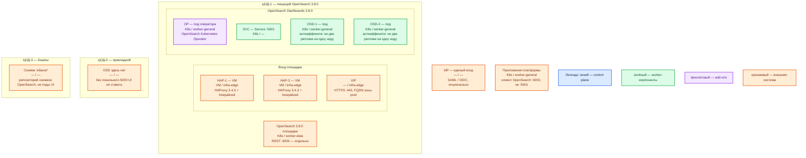

# OpenSearch Dashboards 3.8.0 — Prod

Веб-интерфейс (процесс Node.js, порт **5601/TCP**) к кластеру OpenSearch **3.8.0**. Это не поисковый движок: сохранённые объекты живут в индексах `.kibana*` / `.opensearch_dashboards*` кластера, не на диске пода.

## Допущения

- Контур: 2 прикладных ЦОДа + 1 ЦОД под бэкапы. Stretch одного кластера OpenSearch (и UI к нему) между ЦОДами **нет**: порога RTT у вендора нет.
- Пишущий OpenSearch **3.8.0** — в **ЦОД-1**, своим оператором. UI ставится **только там**, где живой **9200** этого кластера.
- ЦОД-2: отдельного UI «для HA» без локального 9200 **нет**. Свой OSD у ведомой копии (CCR, только чтение) — отдельное решение, не этот файл; URL пишущего и ведомого в одном `opensearch.hosts` смешивать нельзя.
- ЦОД-3: снимки индексов OpenSearch (включая `.kibana*`), не поды UI.
- Механизм: секция `spec.dashboards` **OpenSearch Kubernetes Operator** вместе с кластером. Helm-чарт `opensearch/opensearch-dashboards` — запасной путь, не основная инсталляция. Не Docker Compose и не один контейнер на VM.
- Kubernetes площадки уже есть (vanilla 1.36.4). На каждом прикладном ЦОДе: пара HAProxy **3.4.3** + Keepalived + VIP (ControlPlaneEndpoint `:6443` и край HTTP(S)); StorageClass `local-ssd` (RWO) и `shared-fs` (RWX, только по исключению); DNS внутри `cluster.local`, снаружи зона `prod.…`.
- Нагрузка (число аналитиков, тяжёлые Discover) **не замерена**. Ниже — минимальная отказоустойчивая топология, не «все ручки масштабирования вендора».
- Приложения платформы ходят в OpenSearch на **9200** напрямую, не через Dashboards.
- Единый вход (SAML / OpenID Connect) **опционален**. На схеме показан как внешняя система; для старта UI достаточно парольного входа Security plugin с запасным `?auto_login=false`.

## Схема инстансов

Имена — роли, не обязательные DNS. Потоков и стрелок нет. Пул нод — класс машин для планировщика, не «под на ноде 3».

ОС — свойство платформы, не пода. Один стандарт Linux на всех нодах контура.

Вендор для пути оператора/Helm отдельную ОС под Dashboards не требует (в Docker-гайде ОС тоже не фиксирует).

| Пул | Роль | Зачем выделен |
|---|---|---|
| `infra-edge` | edge-VM | Пара HAProxy + Keepalived + VIP: край HTTP(S) и ControlPlaneEndpoint Kubernetes |
| `worker-general` | general | Поды UI и оператор; локальный диск под данные поиска не нужен |
| `worker-data` | data-localdisk | Кластер OpenSearch (чужой на этой схеме): тома поиска на `local-ssd`, не NFS |

У Dashboards **нет** своей голосующей роли: синий control plane продукта на схеме не рисуется, только легенда.

## Комментарии к схеме

### HAP-1, HAP-2, VIP — вход площадки

- **Функционал.** Пара VM с HAProxy **3.4.3** и Keepalived держит VIP. Снаружи одно имя зоны `prod.…` на **443/TCP**. VIP также ControlPlaneEndpoint Kubernetes (`:6443`, TCP passthrough). Kafka `:9092` через этот HAProxy не публикуем.
- **Критично.** **5601** в интернет не публиковать: снаружи только HTTPS на VIP. TLS для человека заканчивается на краю; `opensearch_security.cookie.secure` согласовать с тем, где браузер видит HTTPS ([TLS](https://docs.opensearch.org/latest/install-and-configure/install-dashboards/tls/)). Клиенты — по FQDN, не по Pod IP. Если UI на подпути (`/logs`), у оператора поле `basePath` само включает `server.rewriteBasePath`; маршрут на краю должен совпасть ([оператор](https://docs.opensearch.org/latest/install-and-configure/install-opensearch/operator/operator-dashboards-config/)). Доверять заголовкам «уже аутентифицирован» можно только если **5601** недоступен в обход proxy.

### OP — OpenSearch Kubernetes Operator

- **Функционал.** Контроллер (add-on кластера): по `spec.dashboards` создаёт Deployment, Service и конфиг UI **рядом с кластером OpenSearch**, не второй кластер.
- **Критично.** `dashboards.enable: true`, `version: "3.8.0"` — тот же patch, что у OpenSearch. Пример вендора `replicas: 1` в бой не копировать: здесь **2**. Образ `opensearchproject/opensearch-dashboards:3.8.0`, не `latest`. Helm-чарт — запасной путь, если оператор недоступен; дефолты чарта (`replicaCount: 1`, `100m`/`512M`, `updateStrategy: Recreate`) в бой не копировать ([values.yaml](https://github.com/opensearch-project/helm-charts/blob/main/charts/opensearch-dashboards/values.yaml)). Смена Secret OIDC без рестарта подов UI не подхватывается.

### SVC — Service :5601

- **Функционал.** Стабильное имя внутри `cluster.local` перед подами UI. Это не процесс Node.js.
- **Критично.** Порт **5601/TCP**. Наружу — через VIP, не NodePort в мир. TCP-проба 5601 = «порт открыт», не «индекс `.kibana` зелёный».

### OSD-1, OSD-2 — реплики UI

- **Функционал.** Два взаимозаменяемых процесса OpenSearch Dashboards **3.8.0**: отдают браузеру Discover/дашборды и проксируют запросы на **9200** (от имени человека + служебный пользователь процесса, в учебнике `kibanaserver`, роль `kibana_server`). Выборов лидера нет. Сессия — cookie браузера (имя по умолчанию `security_authentication`); Redis вендор не требует.
- **Критично.**
  - **2 реплики**, антиаффинити: не две на одну ноду `worker-general`. Отказ одной ноды не глушит картинку, пока живы VIP, Service и **9200** ЦОД-1.
  - Одинаковый секрет cookie ≥ **32** символов на всём Deployment. Дефолт `security_cookie_default_password` общеизвестен — в бой не копировать ([TLS](https://docs.opensearch.org/latest/install-and-configure/install-dashboards/tls/)).
  - `opensearch.hosts` — ноды **одного** кластера ЦОД-1. `verificationMode: full`. Учебные `none`, demo-пароль `kibanaserver` и HTTP без края — только стенд.
  - PVC / `local-ssd` / `shared-fs` подам UI **не нужны**: объекты в OpenSearch. NFS как диск UI не используется (и не нужен).
  - Выкат: RollingUpdate + PodDisruptionBudget (чтобы не обнулить обе реплики). Дефолт Helm `Recreate` на время выката даёт **ноль** подов.
  - Ёмкость: в Docker-гайде CPU/RAM контейнера **нет**. Дефолт чарта **512M** в бой не копировать. README чарта: на ноде рекомендуется **8 ГиБ** available, минимум **4 ГиБ**, иначе deployment expected to fail ([README](https://github.com/opensearch-project/helm-charts/blob/main/charts/opensearch-dashboards/README.md)). Requests/limits пода — порядок величины **выше 512M**, в пределах available ноды; точные millicpu/MiB **уточняются замером**. `NODE_OPTIONS=--max-old-space-size` ниже memory limit. Формулы «N аналитиков = M реплик» и «хватит для терабайтов» у вендора нет.
  - Плагины UI = **3.8.0** = кластеру. `admin` ежедневно запрещён. Служебного пользователя процесса в UI людьми не пускать.

### OpenSearch 3.8.0 площадки

- **Функционал.** Обязательная чужая зависимость: REST **9200**, индексы данных и `.kibana*`. Без ответа 9200 UI — красный экран, не «устойчивость поиска».
- **Критично.** UI не владеет кластером и не слушает 9200. Бэкап дашбордов = снимок `.kibana*` **внутри OpenSearch**, не том пода. Падение UI ≠ падение поиска.

### ЦОД-2 — OSD нет

- **Функционал.** Прикладной зал без живого 9200 **этого** кластера.
- **Критично.** Реплики UI сюда «для HA» не ставить: получится ложное чувство устойчивости (красный экран при живых подах).

### ЦОД-3 — снимки

- **Функционал.** Репозиторий снимков OpenSearch (в том числе `.kibana*`), чтобы падение ЦОД-1 не убило и поиск, и единственную копию визуализаций.
- **Критично.** Это не поды Dashboards и не CSI-том UI. Нет снимка — удалили индекс тенанта → визуализаций нет при живых OSD.

### IdP

- **Функционал.** Опциональный единый вход (SAML / OpenID Connect). Настройка и в Security plugin кластера, и в конфиге Dashboards. Если типов входа больше одного — парольный обязан остаться в списке; обход авторедиректа: `?auto_login=false`.
- **Критично.** Client secret — в Secret, в yml через `${ENV}`. ACS/redirect — FQDN VIP, не Pod IP.

### Приложения платформы

- **Функционал.** Пишут и читают OpenSearch по REST **9200**.
- **Критично.** Не клиенты **5601**. Kafka, Camunda, интеграционное API ведомств в Dashboards не подключаются.

## Путь роста (не включать сразу)

1. Больше одновременных людей/вкладок → ещё реплики OSD **в ЦОД-1** на `worker-general` (тот же cookie secret, тот же `opensearch.hosts`).
2. Тяжелее Discover / агрегации / больше данных → data и coordinating **OpenSearch**, не «пятый Dashboards».
3. HPA — только после профиля нагрузки. Иначе реплики UI вырастут из-за тяжёлой агрегации, которую лечат шардами кластера.
4. Ведомый кластер в ЦОД-2 (CCR) — **отдельный** OSD только на чтение или UI там нет. Не смешивать hosts.

## Сильные и слабые места

**Сильные.** Официальный оператор вместе с кластером; короткий путь браузер → VIP → 5601 → 9200 той же площадки; реплики взаимозаменяемы без Redis; отказ одного пода/одной ноды UI не роняет поиск.

**Слабые.** Падение ЦОД-1 вместе с OpenSearch оставляет UI красным, даже если в ЦОД-2 есть машины. Нагрузка не замерена — ёмкость порядка величины. Утечка секрета cookie = подделка любой сессии.

**Критичные условия**

- Версия UI **3.8.0** = OpenSearch **3.8.0**; не `latest`.
- Не меньше **двух** реплик на **двух** нодах там, где кластер; не один Docker-контейнер.
- Не stretch UI и не «OSD в чужом зале без 9200».
- Не публиковать **5601** в интернет; не копировать учебный `verificationMode: none`, demo `kibanaserver`, дефолт cookie и Helm **512M** / `Recreate`.
- Приложения — на **9200**, не через Dashboards.
- `admin` не для ежедневной работы.

## Источники

- Установка OSD, браузеры, Node.js 22 в 3.5+: https://docs.opensearch.org/latest/install-and-configure/install-dashboards/
- Docker (учебный путь, не этот контур): https://docs.opensearch.org/latest/install-and-configure/install-dashboards/docker/
- TLS, `cookie.secure`, срок сессии 1 час: https://docs.opensearch.org/latest/install-and-configure/install-dashboards/tls/
- Плагины: major.minor.patch = OpenSearch: https://docs.opensearch.org/latest/install-and-configure/install-dashboards/plugins/
- Релиз 3.8.0 (4 августа 2026): https://docs.opensearch.org/latest/version-history/
- Оператор, `spec.dashboards`, replicas, basePath, секреты: https://docs.opensearch.org/latest/install-and-configure/install-opensearch/operator/operator-dashboards-config/
- Helm (запасной путь): https://docs.opensearch.org/latest/install-and-configure/install-dashboards/helm/
- README чарта, 4–8 ГиБ available: https://github.com/opensearch-project/helm-charts/blob/main/charts/opensearch-dashboards/README.md
- values: replicaCount 1, 100m/512M, Recreate, порт 5601: https://github.com/opensearch-project/helm-charts/blob/main/charts/opensearch-dashboards/values.yaml
- Тенанты, `.kibana*`, роль `kibana_server`: https://docs.opensearch.org/latest/security/multi-tenancy/multi-tenancy-config/
- Несколько источников (`data_source.enabled`): https://docs.opensearch.org/latest/dashboards/management/multi-data-sources/
- Карточка платформы: `Out/Поиск и аналитика/OpenSearch Dashboards/OpenSearch Dashboards.md`
- Установка (учебный контур vs бой): `Out/Поиск и аналитика/OpenSearch Dashboards/OpenSearch Dashboards.install.md`
- Состав из sample: `sample/OpenSearch Dashboards.md`

**В доке вендора нет (здесь не выдумано):** CPU/RAM контейнера OSD в Docker-гайде; формула «N аналитиков = M реплик»; порог RTT OSD → 9200; требование Redis для сессий; готовая смета «хватит для терабайтов».
