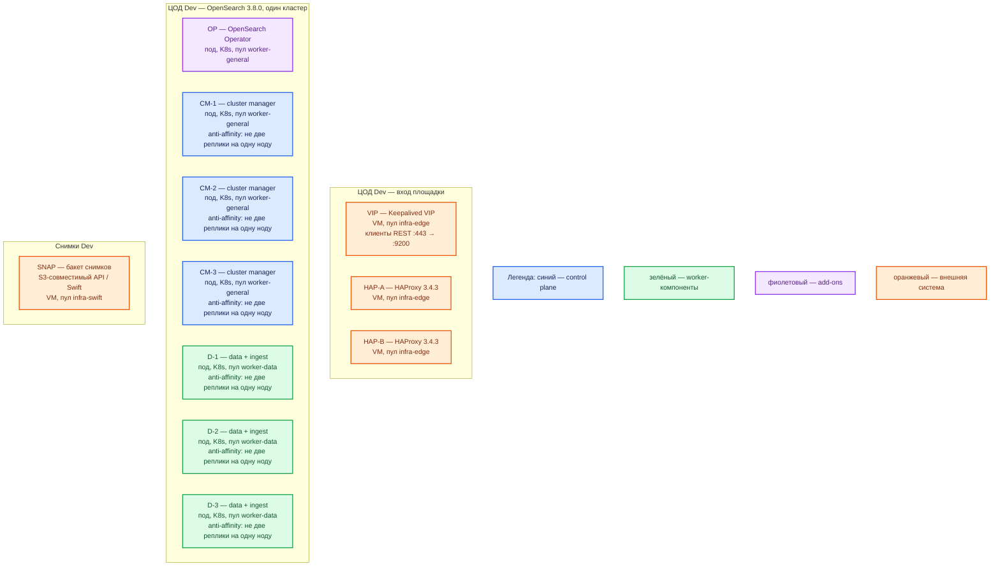

# OpenSearch 3.8.0 — развёртывание, контур Dev

Поисковый движок: JSON-документы в индексах, полнотекст, фильтры, агрегации. Это **уменьшенный Prod**, не учебный Docker single-node. Версия **3.8.0**. Не Wazuh indexer.

## Допущения

- Один прикладной ЦОД. Kubernetes, пара HAProxy 3.4.3 + Keepalived + VIP, StorageClass с теми же именами (`local-ssd`, `shared-fs`), CoreDNS / `cluster.local`, зона `dev.…` — уже есть, меньше CPU/RAM/тома.
- Способ установки и роль-модель **как в Prod**: OpenSearch Kubernetes Operator, CR `OpenSearchCluster`, три dedicated cluster manager + data+ingest. Не `docker run` + `discovery.type=single-node`, не Docker Compose, не один совмещённый процесс «на VM по квикстарту».
- Оператор **не поддерживает** single-node: минимум три узла с ролью `cluster_manager`. Схема «1 контейнер» или «2 manager» — другой класс системы (нет большинства eligible).
- Нагрузка не боевая. Уменьшаем ёмкость и размер PVC, не число голосующих и не вид инсталляции.
- Снимки — в бакет той же или отдельной СХД контура Dev, не на PVC нод. Wazuh indexer — другой кластер.

## Схема инстансов

Потоков данных на схеме нет. Состав ролей совпадает с Prod; меньше ресурсы и диски.

ОС — свойство платформы, не пода. Один стандарт Linux на всех нодах контура.

| Имя пула | Роль | Зачем выделен |
|---|---|---|
| `infra-edge` | edge-VM | Та же пара HAProxy + VIP, что в Prod; меньше CPU/RAM у VM |
| `worker-general` | general | Оператор и три маленьких cluster manager; пул ≥ 3 нод |
| `worker-data` | data-localdisk | Три маленьких data+ingest на `local-ssd`; пул ≥ 3 нод |
| `infra-swift` | vendor / object | Бакет снимков; не диск ноды |

## Комментарии к схеме

### Чем Dev упрощает Prod (и чем не упрощает)

| Меняем | Не меняем |
|---|---|
| CPU/RAM/PVC меньше | Оператор, CR, тег **3.8.0** |
| Один ЦОД, один кластер | Роли: dedicated `cluster_manager` ×3 и `data, ingest` ×3 |
| Меньше главных шардов у учебных индексов | Кворум 3 manager, не 2 и не 1 |
| Тома меньше, те же имена StorageClass | `local-ssd` RWO, не NFS, не Compose |

Так воспроизводятся ошибки вида инсталляции (накат оператора, выборы, 9300 между подами, replica на другой ноде), которые single-node Docker **не** показывает.

### VIP, HAP-A/B — вход

- **Функционал.** Как в Prod: FQDN зоны `dev.…` на VIP, HAProxy на REST 9200. Бэкенды — Service пула data, не CM.
- **Критично.** Не публиковать 9200/9300 с VIP в интернет. Не использовать VIP как advertised-адрес transport 9300. Пара HAProxy остаётся парой (отказ одной VM входа).

### OP — оператор

- **Функционал.** Тот же Helm-чарт линейки **3.0.0+**, тот же CR `OpenSearchCluster`, `version: "3.8.0"`. На старте оператор поднимает bootstrap-под для discovery, затем StatefulSet пулов.
- **Критично.** Не подменять оператор `docker run opensearchproject/opensearch:3.8.0` с `discovery.type=single-node` — это другой вид инсталляции (нет выборов manager, нет 9300 между машинами). Прогон 3.8.0 на этом стенде обязателен (сертификата «оператор N ↔ 3.8.0» у вендора нет). Demo-конфиг и учебный пароль `admin` из `OpenSearch.install.md` **не** копировать в этот контур как «почти бой».

### CM-1..3 — маленькие cluster manager

- **Функционал.** Те же dedicated manager, что в Prod: кворум 2 из 3, cluster state, без шардов данных.
- **Критично.** Три штуки, не одна и не две. Anti-affinity: не две реплики на одну ноду; в пуле `worker-general` реально ≥ 3 нод, иначе Dev снова станет «все manager на одном хосте». PVC `local-ssd`, маленький (порядок **10–20 ГиБ**). Ресурсы порядка **0.5–1 vCPU, 1–2 ГиБ RAM**, куча ≈ половина, `Xms = Xmx`. Уточняется замером. Клиентский 9200 на них не направлять.

### D-1..3 — маленькие data + ingest

- **Функционал.** Те же роли `[ data, ingest ]`. Три пода, чтобы дефолтная replica=1 куда положить и чтобы отказ одного data не обнулял индекс. Coordinating не выделяем.
- **Критично.** Не схлопывать в один data-под: тогда replica>0 даст вечный yellow (копию некуда положить) — это уже учебный single-node, не уменьшенный Prod. Диск — `local-ssd`, не `shared-fs`. На нодах пула `vm.max_map_count ≥ 262144` (оператор по умолчанию ставит init-контейнером; на хосте всё равно должно быть ≥ 262144). Порядок: **1–2 vCPU, 4 ГиБ RAM** (ориентир учебного контура / Docker Desktop ≥ 4 ГБ), PVC порядка **30–50 ГиБ**. Уточняется замером. Лимит пода выше кучи (mmap).

### SNAP — снимки

- **Функционал.** Тот же механизм `repository-s3`, что в Prod, меньший бакет. Нужен, чтобы на Dev отрабатывали snapshot/restore и плагин, а не только «индекс на PVC».
- **Критично.** Не класть единственную копию снимка на тот же `local-ssd`, что и шарды. Не считать replica бэкапом.

## Путь роста

На Dev рост не планируем как боевой. Если не хватает места — увеличить PVC / RAM **этих же** шести узлов, не переходить на single-node. Выделенный coordinating и +data кратно 3 — только если сознательно копируем Prod-эксперимент.

## Сильные и слабые места

- **Сильная сторона.** Тот же оператор и те же роли, что Prod: можно поймать сбой наката, выборов, anti-affinity и replica. Кворум 3 маленьких manager остаётся кворумом.
- **Слабая сторона.** Малая ёмкость: OOM и disk watermark наступят раньше. Один Dev-ЦОД: падение зала = нет поиска. Мягкая anti-affinity оператора при нехватке нод соберёт два manager на одном хосте.
- **Критичные условия.** Не single-node Docker. Не 2 manager. Не NFS как диск ноды. Не `latest`. Не security plugin off. Не общий кластер с Wazuh. `vm.max_map_count ≥ 262144`. 9200 не в интернет. Учебные пароли и demo-сертификаты из раздела «Учебный стенд» `OpenSearch.install.md` сюда не переносить.

## Источники

Те же, что у Prod:

- Релиз 3.8.0: https://docs.opensearch.org/latest/version-history/
- `vm.max_map_count`, порты, куча, не NFS: https://docs.opensearch.org/latest/install-and-configure/install-opensearch/index/
- 3 dedicated manager, не слать трафик на manager: https://docs.opensearch.org/latest/tuning-your-cluster/
- Оператор, запрет single-node: https://docs.opensearch.org/latest/install-and-configure/install-opensearch/operator/index/
- Node pool, heap, `setVMMaxMapCount`, снимки: https://docs.opensearch.org/latest/install-and-configure/install-opensearch/operator/operator-opensearch-config/
- Operator 3.0.0 ↔ latest 3.x: https://github.com/opensearch-project/opensearch-k8s-operator
- Учебный Docker (именно **не** этот контур): https://docs.opensearch.org/latest/install-and-configure/install-opensearch/docker/
- Replica=0 только на одной ноде: https://docs.opensearch.org/latest/install-and-configure/configuring-opensearch/index-settings/
- Карточка / install: `Out/Поиск и аналитика/OpenSearch/OpenSearch.md`, `OpenSearch.install.md`

**В доке вендора нет:** порог RTT; готовая смета ядер под Dev; сертификация патча оператора под 3.8.0.
