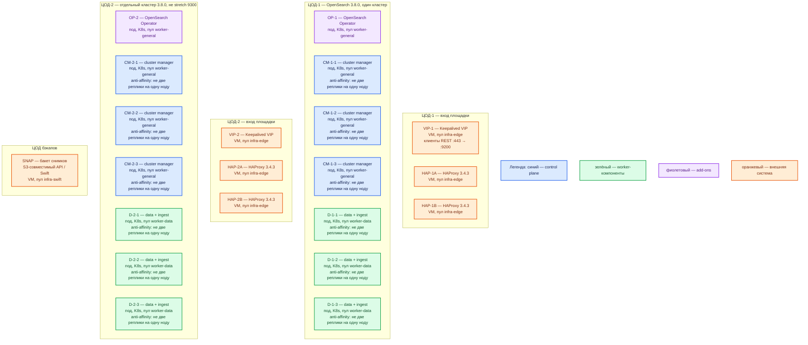

# OpenSearch 3.8.0 — развёртывание, контур Prod

Поисковый движок: JSON-документы в индексах, полнотекст, фильтры, агрегации. Это **своя** установка **3.8.0**, не Amazon OpenSearch Service и не Wazuh indexer (другой контур прав и образы `wazuh/*`).

## Допущения

- Площадки: два прикладных ЦОДа + один ЦОД под бэкапы. RTT между залами **не измерен**.
- На каждом прикладном ЦОДе уже есть Kubernetes 1.36.4, пара HAProxy 3.4.3 + Keepalived + VIP, StorageClass `local-ssd` (RWO) и `shared-fs` (RWX), CoreDNS / `cluster.local`, внешняя зона `prod.…`.
- Один живой кластер OpenSearch = **один ЦОД**. Порт **9300/TCP** (transport: узел↔узел) между ЦОДами как один кластер **не открываем**: порога допустимой задержки у вендора нет.
- Нагрузка не замерена. Ниже — минимальная отказоустойчивая топология и порядок величины ресурсов, не смета «хватит на терабайты».
- OpenSearch Dashboards, Kafka, ingest-клиенты (Data Prepper / Connect / свой consumer), СУБД/озеро — **другое ПО**. На схему ставятся как внешние, если нужны как край.
- Wazuh indexer и Elasticsearch GeoData 8.6.2 — **другие** кластеры, не этот.

## Схема инстансов

Имена — роли, не обязательные DNS. Потоков данных на схеме нет. ЦОД-2 — такой же состав, **другой** `cluster.name`, свой 9300.

ОС — свойство платформы, не пода. Один стандарт Linux на всех нодах контура.

| Имя пула | Роль | Зачем выделен |
|---|---|---|
| `infra-edge` | edge-VM | Пара HAProxy + Keepalived + VIP: край HTTP(S) площадки, не transport 9300 |
| `worker-general` | general | Оператор и поды cluster manager (маленький PVC, без поисковых шардов) |
| `worker-data` | data-localdisk | Поды data+ingest: шарды на `local-ssd` (RWO), не NFS |
| `infra-swift` | vendor / object | Бакет снимков в ЦОДе бэкапов; не CSI-диск ноды OpenSearch |

## Комментарии к схеме

### VIP-1 / VIP-2, HAP-* — вход площадки

- **Функционал.** VIP — виртуальный IP Keepalived: одно имя `prod.…` для клиентов REST. HAProxy 3.4.3 — TCP/HTTP(S) край. Клиенты (сервисы, опционально Dashboards) ходят на **9200** через FQDN VIP, не на Pod IP. Kafka `:9092` через этот HAProxy не публикуем.
- **Критично.** Бэкенды VIP — Service пула **data** (координацию берёт data-узел). На выделенные cluster manager клиентский 9200 **не** направлять. Тот же VIP **не** использовать как адрес для **9300**: transport должен видеть конкретные узлы. 9200/9300/9600 в интернет не публиковать.

### OP-1 / OP-2 — OpenSearch Kubernetes Operator

- **Функционал.** Контроллер в Kubernetes: читает CR `OpenSearchCluster` и создаёт StatefulSet + Service на каждый node pool, bootstrap-под на старте, PVC, TLS. Репозиторий `opensearch-k8s-operator`, установка Helm: `helm repo add opensearch-operator https://opensearch-project.github.io/opensearch-k8s-operator/`.
- **Критично.** Линейка оператора **3.0.0+** умеет OpenSearch 3.x; отдельного сертификата «этот релиз оператора под 3.8.0» нет — **прогон именно 3.8.0 на стенде обязателен**, затем пин chart. В CR версия **`3.8.0`**, не `3` и не `latest`. Образ узлов: `opensearchproject/opensearch:3.8.0`. Single-node оператор **не поддерживает**: минимум три узла с ролью `cluster_manager`. Docker Compose и `discovery.type=single-node` в Prod нет. Запасной боевой путь, если оператора нет: пакеты на Linux-VM (systemd), не Compose.

### CM-*-1..3 — cluster manager

- **Функционал.** Процесс OpenSearch с `node.roles: [ cluster_manager ]`. Выбирает лидера, ведёт cluster state (метаданные узлов, индексов, шардов), создаёт индексы, назначает шарды. Поисковые данные **не** хранит. Кворум: большинство eligible (2 из 3). Поисковую нагрузку добавлением manager не масштабируют.
- **Критично.** Три dedicated manager в **одном** ЦОДе — боевой ориентир вендора. Пул `worker-general` ≥ 3 нод. Anti-affinity: не две реплики на одну ноду; дефолт оператора — *preferred* (мягкий), для кворума задать *required*, иначе отказ одной ноды может снять двух manager. PVC — `local-ssd`, RWO, свой на под; `emptyDir` в бою не использовать. Клиентский 9200 сюда не слать. Ёмкость — порядок **1–2 vCPU, 2–4 ГиБ RAM**, PVC десятки ГиБ, куча Java ≈ половина RAM, `Xms = Xmx`; **уточняется замером**. Цифр «хватит N» в мануале нет.

### D-*-1..3 — data + ingest

- **Функционал.** Рабочие процессы: хранят шарды, индексируют, ищут, считают агрегации; роль `ingest` (серверный pipeline перед записью) совмещена. `node.roles: [ data, ingest ]`. Три узла — совет вендора добавлять data кратно зонам; зоны здесь — внутри одного ЦОДа, не три города. Выделенный coordinating на старте **не** вводим (опционален при тяжёлом поиске).
- **Критично.** Пул `worker-data` ≥ 3 нод, anti-affinity как у manager. Диск ноды — локальный SSD POSIX, StorageClass **`local-ssd`**, accessMode RWO; **не** `shared-fs`, **не** NFS (вендор: сеть как диск ноды даёт лаги). Дефолт OSS: 1 replica; копия уходит на другой data-под. Реплика шарда **не** бэкап: `DELETE` индекса повторится на всех копиях. На хостах пула `vm.max_map_count ≥ 262144` (даже если оператор ставит то же init-контейнером). Куча ≈ половина RAM; лимит пода **выше** кучи (mmap). Порядок старта data: **2–4 vCPU, 8–16 ГиБ RAM** (пример карточки: хост 8 ГиБ → куча 4g), PVC от сотен ГиБ; формула диска: данные × сжатие × (1+копии) × запас под merge. **Уточняется замером.** Это не обещание «хватит для терабайт». Java в бандле линии 3.6.1+: таблица 21/25/26, в бандле **25.0.4+7**.

### SNAP — репозиторий снимков

- **Функционал.** Внешнее хранилище снимков (инкрементальная копия индексов). Плагин `repository-s3`, бакет в ЦОДе бэкапов (S3-совместимый API Swift). Регистрируется через `general.snapshotRepositories` оператора; секреты — в keystore из Kubernetes Secret.
- **Критично.** Бакет **не** на дисках того же зала, что и шарды: иначе падение ЦОДа убивает и поиск, и бэкап. Файлы в бакете руками не удалять — только API снимков. `shared-fs` / NFS как диск **ноды** не используем; NFS как опция оператора для snapshot-mount — не наш путь, есть Swift.

### ЦОД-2 как второй кластер

- **Функционал.** Та же роль-модель: оператор + 3 manager + 3 data. Либо клиенты второй площадки ходят на 9200 первой по FQDN, либо ведомый индекс через плагин репликации (**CCR** — копия индекса в другой кластер, ведомый только читает).
- **Критично.** Не склеивать ЦОД-1 и ЦОД-2 в один cluster.name на 9300. Stretch-кворум manager через город запрещён.

### Чего на схеме нет специально

- Учебный Docker `discovery.type=single-node` и демо-пароль `admin`.
- Выделенный coordinating и выделенный ingest-пул (путь роста, не старт).
- OpenSearch Dashboards (другое ПО, порт 5601).
- Wazuh indexer.

## Путь роста

Не включать сразу. Когда замер покажет упор:

1. Добавить **data**-поды кратно зонам (ещё +3 в том же ЦОДе), не manager.
2. Увеличить PVC data (`diskSize` оператора, нужен `allowVolumeExpansion` у `local-ssd`).
3. При тяжёлом поиске — пара dedicated coordinating (`node.roles: []`); при тяжёлых pipeline — отдельный ingest-пул.
4. Межплощадочное чтение — CCR в кластер ЦОД-2, не общий 9300.
5. Переиндексация, если не хватает **главных** шардов (их число задаётся при создании индекса).

## Сильные и слабые места

- **Сильная сторона.** Официальный оператор, те же CR и роли, что потом на Dev. Выборы manager и копии шардов остаются внутри зала. Отказ одной data-ноды переживается репликой. Снимок живёт в другом ЦОДе.
- **Слабая сторона.** Падение прикладного ЦОДа останавливает **этот** кластер. Вторую площадку оператор сам не спасает. Ёмкость без замера неизвестна. Дефолтная anti-affinity оператора мягкая.
- **Критичные условия.** Не stretch 9300. Не клиенты на dedicated manager. Не NFS/`shared-fs` как диск ноды. Не `latest`, не demo-сертификаты и не `DISABLE_SECURITY_PLUGIN` в бою. Не один кластер с Wazuh indexer. `vm.max_map_count ≥ 262144` на нодах. Учётки сервисов — не `admin`; секреты не в git.

## Источники

- Релиз 3.8.0: https://docs.opensearch.org/latest/version-history/
- Порты, `vm.max_map_count`, куча ≈ ½ RAM, не NFS, Java 3.6.1+ / бандл 25.0.4+7: https://docs.opensearch.org/latest/install-and-configure/install-opensearch/index/
- Роли, 3 manager, зоны, не слать трафик на manager: https://docs.opensearch.org/latest/tuning-your-cluster/
- Discovery, `single-node` только учёба: https://docs.opensearch.org/latest/tuning-your-cluster/discovery-cluster-formation/
- Оператор (Helm, «single-node не поддерживается», ≥3 `cluster_manager`): https://docs.opensearch.org/latest/install-and-configure/install-opensearch/operator/index/
- Node pool, TLS, heap, `setVMMaxMapCount`, snapshot S3: https://docs.opensearch.org/latest/install-and-configure/install-opensearch/operator/operator-opensearch-config/
- Совместимость Operator 3.0.0 ↔ latest 3.x: https://github.com/opensearch-project/opensearch-k8s-operator
- User Guide: persistence `storageClass`, anti-affinity, снимки: https://github.com/opensearch-project/opensearch-k8s-operator/blob/main/docs/userguide/main.md
- Снимки: https://docs.opensearch.org/latest/tuning-your-cluster/availability-and-recovery/snapshots/snapshot-management/
- CCR: https://docs.opensearch.org/latest/tuning-your-cluster/replication-plugin/
- Replica / yellow на одной ноде: https://docs.opensearch.org/latest/install-and-configure/configuring-opensearch/index-settings/
- Карточка и учебный контур (не копировать в бой): `Out/Поиск и аналитика/OpenSearch/OpenSearch.md`, `OpenSearch.install.md`

**В доке вендора нет (не выдумано):** порог RTT на 9300 между ЦОДами; «хватит N data-нод / ядер под терабайты»; сертификация конкретного патча оператора именно под 3.8.0.
