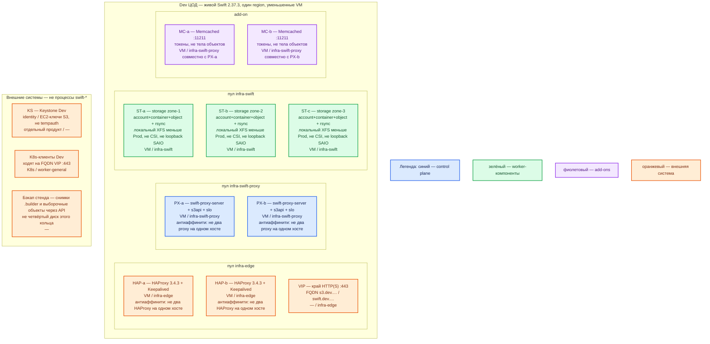

# OpenStack Swift 2.37.3 (OpenStack 2026.1) — развёртывание Dev

Dev — **уменьшенный Prod**, не другой вид инсталляции. Тот же механизм: **Linux-VM, systemd, кольца дисков, replica=3, Keystone, два proxy**. Не SAIO на одной машине, не один контейнер, не Docker Compose, не tempauth, не loopback-диск «четырёх нод на localhost».

## Допущения

1. Контур Dev: **1 ЦОД**. Второго прикладного зала и отдельного ЦОД-бэкапов **нет** — на схеме бэкапы показаны как внешнее (снимки `.builder` и выборочные объекты), не как replica-диск этого кольца.
2. Роль-модель **как в Prod**: 2 proxy-VM + 3 storage-VM (три zone, replica=3) + пара HAProxy+Keepalived+VIP + Memcached на proxy-VM + Keystone как внешний продукт. Уменьшают **CPU/RAM/объём XFS**, не число ролей и не тип кольца.
3. Identity — **Keystone**, не `tempauth`. Иначе ошибка `s3token`/EC2-ключей с Prod **не** воспроизведётся. ([Auth](https://docs.openstack.org/swift/2026.1/overview_auth.html))
4. Object **не** в Kubernetes и **не** через CSI. StorageClass `local-ssd` / `shared-fs` на Dev те же **имена**, но Swift их не монтирует.
5. Версия **2.37.3** / серия **2026.1**. Кольца **не** собирать скриптом SAIO `remakerings` (`create 10 3 1` и replica 2/6 — лаборатория). Тот же вид, что Prod: replica=3, пример `min_part_hours=24`, part_power от прогноза максимума дисков Dev (≥ 100 партиций на диск), не с потолка. ([Deployment Guide](https://docs.openstack.org/swift/2026.1/deployment_guide.html), [SAIO](https://docs.openstack.org/swift/2026.1/development_saio.html))
6. Цифр ядер для этой роли в мануале **нет**. SAIO «≥ 2 ГиБ RAM / ≥ 40 ГиБ» — чтобы **один** учебный процесс поднялся, не смета даже Dev-кластера. Ёмкость Dev — **меньше Prod на порядок томов**, уточняется замером.
7. Клиенты — S3 (`s3api`) по FQDN зоны `dev.…` на VIP. Stretch/Global Cluster нет (один ЦОД). Не склеивать с GeoData **2.29.2**.
8. Сеть в деталях вне рамок. VIP — край HTTP(S) и ControlPlaneEndpoint Kubernetes `:6443`. Kafka `:9092` через этот HAProxy не публиковать.

## Схема инстансов

Синий — управляющие роли продукта (proxy). Зелёный — data-инстансы (storage с дисками кольца). Фиолетовый — add-on (Memcached). Оранжевый — внешнее (VIP, Keystone, клиенты, бэкап `.builder`). На схеме **нет** потоков данных.

ОС — свойство платформы, не пода. Один стандарт Linux на всех нодах контура.

Исключение вендора: сервер Swift заявлен для **Ubuntu 24.04 LTS**, CentOS Stream 9, Fedora, openSUSE; **Windows как сервер не заявлен**. Тот же стандарт ОС, что Prod. ([SAIO](https://docs.openstack.org/swift/2026.1/development_saio.html))

| Имя пула | Роль | Зачем выделен |
|---|---|---|
| `infra-edge` | edge-VM | Та же пара HAProxy 3.4.3 + Keepalived + VIP, меньше CPU/RAM. |
| `infra-swift-proxy` | vendor | Два stateless proxy (минимум для балансировки и отказа одной VM). Не один SAIO-proxy на localhost. |
| `infra-swift` | data-localdisk | Три storage-VM с локальным XFS: уменьшенное **кольцо того же вида**, не четыре каталога на loopback. |
| `worker-general` | general | Клиенты в Kubernetes Dev; объекты на этих нодах не хранятся. |

Что уменьшили относительно Prod (вид инсталляции тот же):

| Параметр | Prod | Dev |
|---|---|---|
| ЦОДы со своим кластером | 2 независимых кольца | 1 кольцо |
| Proxy | 2 VM | 2 VM, меньше CPU/RAM |
| Storage / zone | 3 VM, replica=3 | 3 VM, replica=3, тома XFS меньше |
| HAProxy | пара + VIP | пара + VIP, меньше CPU/RAM |
| Identity | Keystone | Keystone (не tempauth) |
| Механизм | systemd на VM, пин 2.37.3 | то же |
| SAIO / Compose / Helm / CSI | нет | нет |

## Комментарии к схеме

### HAP-a / HAP-b и VIP

- **Функционал.** Как в Prod: HTTPS **443** → proxy **8080**; VIP также ControlPlaneEndpoint `:6443`. FQDN зоны `dev.…`. ([Deployment Guide](https://docs.openstack.org/swift/2026.1/deployment_guide.html))
- **Критично.** Пара на двух VM, даже на «маленьком» стенде: один HAProxy не доказывает отказ входа. Меньше CPU/RAM, не «один nginx на той же VM, что Swift». Kafka `:9092` сюда не вешать.

### PX-a / PX-b

- **Функционал.** Два `swift-proxy-server` **2.37.3**, тот же pipeline боя: `s3api`, `slo`, Keystone-middleware. Слушают не только localhost. ([middleware](https://docs.openstack.org/swift/2026.1/middleware.html))
- **Критично.** Stateless: минимум **2 реплики на 2 нодах** — иначе нет балансировки нужного типа и отказа одной VM. **Не** сворачивать в один процесс SAIO (`startmain` на одной машине). Одинаковые `.ring.gz` с storage. `write_affinity` не включать. Свои `swift_hash_path_*`, не `changeme` из образца SAIO, если этот контур когда-либо увидит не-учебные объекты.

### MC-a / MC-b

- **Функционал.** Memcached **11211** на proxy-VM: кэш токенов. ([Deployment Guide](https://docs.openstack.org/swift/2026.1/deployment_guide.html))
- **Критично.** Оставить **два** экземпляра. Один Memcached на Dev = другой класс отказа, чем Prod (упал кэш — auth «не пускает»). Не кэшировать тела объектов.

### ST-a / ST-b / ST-c

- **Функционал.** Три zone, на каждой account **6202** + container **6201** + object **6200** + rsync **873**, локальный **XFS** с xattr. replica=3 — три полные копии на трёх VM. ([Архитектура](https://docs.openstack.org/swift/2026.1/overview_architecture.html))
- **Критично.**
  - Это **кластер**, не эмуляция «/srv/1…/srv/4» на одном loopback 1 ГБ. Уменьшают размер тома, не число storage-ролей.
  - Кольцо того же вида, что Prod: replica=3, `min_part_hours` как в гайде (пример **24**), part_power от **меньшего** прогноза максимума дисков Dev, всё ещё ≥ 100 партиций на диск. Не копировать SAIO `create 10 3 1`.
  - Не NFS, не CSI PVC, не RAID 5/6 вместо replica. Стабильный IP в кольце. `/srv/node` — как в гайде.
  - Порты storage и 873 не публиковать. `.builder` бэкапить (оранжевый блок), не кладя backup-диск **в** это кольцо.
  - Отказ одной storage-VM должен быть воспроизводим так же, как в Prod (остаются 2 копии). Схема «1 VM со всеми процессами» этого **не** доказывает.

### KS — Keystone Dev

- **Функционал.** Внешний identity площадки Dev, EC2-ключи для S3. Не часть Swift. ([Auth](https://docs.openstack.org/swift/2026.1/overview_auth.html))
- **Критично.** Не заменять tempauth «чтобы быстрее встало»: это другой класс системы. HA Keystone — карточка Keystone. Порт в доке Swift **не** задан — не выдумывать. Учётки `test:tester` / `testing` — только закрытый SAIO, сюда не переносить.

### K8s-клиенты

- **Функционал.** Те же SDK и path-style S3, endpoint = FQDN VIP Dev. Проверка матрицы (Lifecycle/policy/tagging = нет) должна совпасть с Prod. ([s3_compat](https://docs.openstack.org/swift/2026.1/s3_compat.html))
- **Критично.** Не ходить на Pod IP и не на `:6200`. Лимит одного PUT **5 ГБ** тот же.

### Бэкап стенда

- **Функционал.** Снимки `.builder` и при необходимости выгрузка объектов через API.
- **Критично.** Не добавлять «диск бэкапа» четвёртым устройством с replica=3. В Dev нет третьего ЦОДа — это не повод упростить кольцо до SAIO.

## Путь роста

Как в Prod, на меньшей ёмкости: добавить диск/VM в кольцо и rebalance; добавить proxy за VIP; не stretch. Переход «сначала SAIO, потом размажем» **запрещён** — вид инсталляции сразу кластерный. Оптимум тестов вендора ≥ 5 zone — рост, не старт Dev.

## Сильные и слабые места; критичные условия

**Сильное:** на Dev воспроизводятся отказ одного proxy, отказ одной storage-VM, поведение Keystone/`s3api`, rsync между **разными** IP, обновление колец — то, чего SAIO на localhost не доказывает.

**Слабое:** меньше дисков ≠ меньше копий (всё ещё ×3 сырого объёма); один ЦОД не доказывает DR/container sync; ёмкость «хватит для терабайтов Prod» этот контур не обещает.

**Критично:**

- Dev ≠ SAIO и ≠ один контейнер «всё в одном».
- Тот же пин **2.37.3**, те же порты контракта (8080 / 6200–6202 / 873 / 11211), тот же replica=3.
- Не CSI для object, не NFS, не tempauth, не `latest`.
- Клиентам только VIP:443. `.builder` не терять.
- Не выдумывать ядра: в доке их нет; ставить меньше Prod и мерить.

## Источники

- Релиз 2.37.3 / 2026.1: https://docs.openstack.org/releasenotes/swift/2026.1.html
- Deployment Guide: https://docs.openstack.org/swift/2026.1/deployment_guide.html
- Архитектура: https://docs.openstack.org/swift/2026.1/overview_architecture.html
- SAIO (почему это **не** Dev-кластер): https://docs.openstack.org/swift/2026.1/development_saio.html
- Auth / Keystone: https://docs.openstack.org/swift/2026.1/overview_auth.html
- s3api: https://docs.openstack.org/swift/2026.1/middleware.html
- Матрица S3: https://docs.openstack.org/swift/2026.1/s3_compat.html
- Global Clusters: https://docs.openstack.org/swift/2026.1/overview_global_cluster.html
- Tarball 2.37.3: https://tarballs.opendev.org/openstack/swift/swift-2.37.3.tar.gz
- Kolla-Ansible, Swift снят с 2025.1: https://docs.openstack.org/releasenotes/kolla-ansible/2025.1.html
- OpenStack-Helm (K8s ≤ 1.35, не 1.36.4): https://docs.openstack.org/openstack-helm/latest/readme.html
- Карточка: `Out/БД и хранилища/OpenStack Swift/OpenStack Swift.md`, установка: `OpenStack Swift.install.md`, Prod-контур: `sample2/OpenStack Swift.prod.md`

**В доке вендора нет (не выдумано):** vCPU/RAM Dev-кластера; официальный путь «Dev = одна SAIO-VM как уменьшенный Prod».
