# OpenStack Swift 2.37.3 (OpenStack 2026.1) — развёртывание Prod

## Допущения

1. Контур Prod: **2 прикладных ЦОДа** (каждый со своим Kubernetes и своим входом HAProxy) **+ 1 ЦОД под бэкапы**. Задержка между площадками **не измерена**.
2. На каждом прикладном ЦОДе — **свой живой кластер** Swift **2.37.3**, **один region = эта площадка**. Общего кольца на два (и тем более три) ЦОДа **нет**: это была бы растяжка / Global Cluster, которой в карточке платформы нет порога RTT. ([Global Clusters](https://docs.openstack.org/swift/2026.1/overview_global_cluster.html))
3. ЦОД-бэкапы **не** входит в account/container/object ring прикладного кластера: он не «третий replica-диск» чужого кольца. Replica=3 живёт **внутри** ЦОДа. С площадки бэкапов снимают объекты через API и хранят снимки `.builder`. ([Deployment Guide](https://docs.openstack.org/swift/2026.1/deployment_guide.html), [container sync](https://docs.openstack.org/swift/2026.1/overview_container_sync.html))
4. Нагрузка **не замерена**. Ниже — **минимальная отказоустойчивая** топология, не «все ручки масштаба вендора». Цифр ядер CPU и «N дисков / M ТБ» в мануале **нет** — ёмкость это **порядок величины**, уточняется замером. SAIO «≥ 2 ГиБ RAM / ≥ 40 ГиБ» — порог «процесс на одной машине завёлся», **не** смета боя. ([SAIO](https://docs.openstack.org/swift/2026.1/development_saio.html), [Deployment Guide](https://docs.openstack.org/swift/2026.1/deployment_guide.html))
5. Object-слой **не** в Kubernetes и **не** через CSI (`local-ssd` / `shared-fs` к Swift не относятся). Кольцо хранит IP:порт и имя диска; IP пода без пересборки кольца ломает кластер. Официального оператора «как CNPG» нет. Kolla-Ansible **снял** роль Swift с 2025.1. OpenStack-Helm 2026.1 заявляет Kubernetes ≥ 1.33 и ≤ **1.35**; в платформе **1.36.4** — комбинация **не** доказана. Боевой путь: **пакеты/tarball 2.37.3 на Linux-VM, systemd**. Не Docker Compose, не SAIO, не `latest`. ([Kolla-Ansible 2025.1](https://docs.openstack.org/releasenotes/kolla-ansible/2025.1.html), [OpenStack-Helm](https://docs.openstack.org/openstack-helm/latest/readme.html))
6. Identity боя — **Keystone** (отдельный продукт площадки) + middleware `s3token` / `authtoken` / `keystoneauth`. `tempauth` и учётки SAIO (`test:tester` / `testing`) в Prod **не** используются. Memcached — кэш токенов, не тела объектов. ([Auth](https://docs.openstack.org/swift/2026.1/overview_auth.html), [middleware](https://docs.openstack.org/swift/2026.1/middleware.html))
7. Клиенты платформы ходят **S3 API** (`s3api` на тех же proxy), path-style, бакет = container. В матрице Swift **нет** AWS Lifecycle / bucket policy / object tagging — в архитектуру не закладывать. Не склеивать с GeoData Swift **2.29.2**. ([s3_compat](https://docs.openstack.org/swift/2026.1/s3_compat.html))
8. Сеть в деталях (VLAN, IP-план) **вне рамок**. Фиксируем: VIP HAProxy = край HTTP(S) и ControlPlaneEndpoint Kubernetes; клиенты Swift/S3 — по **FQDN** зоны `prod.…` на VIP, не по IP storage-ноды. Порты **6200–6202** и **873** клиентам не выдавать.
9. Виртуализация умеет создавать VM с локальными дисками. Storage-ноды — VM (или физический сервер) с **локальным XFS** и xattr; NFS как диск object-server **не** ставить. RAID 5/6 вендор **не** требует и **не** рекомендует. ([Deployment Guide](https://docs.openstack.org/swift/2026.1/deployment_guide.html))

## Схема инстансов

Синий — управляющие роли продукта (stateless proxy: клиентский API и маршрутизация по кольцам). Зелёный — data-инстансы (storage-ноды с дисками кольца). Фиолетовый — add-on (Memcached). Оранжевый — внешнее (VIP, Keystone, Kubernetes-клиенты, ЦОД-бэкапы). На схеме **нет** потоков данных.

**Кольцо** — локальные файлы-карты `account.ring.gz` / `container.ring.gz` / `object.ring.gz` на каждой Swift-VM (не отдельный сервер). **Proxy** — процесс `swift-proxy-server`: единственный клиентский API, тело объекта на свой диск не складывает. **Storage-нода** — VM, где крутятся `account-server` (:6202, списки контейнеров в SQLite), `container-server` (:6201, listing объектов в SQLite) и `object-server` (:6200, файлы + xattr) плюс фон replicator / updater / auditor.

```mermaid
flowchart TB
  subgraph DC1["ЦОД-1 — живой Swift 2.37.3, один region"]
    subgraph EDGE1["пул infra-edge"]
      HAP1A["HAP-1a — HAProxy 3.4.3 + Keepalived<br/>VM / infra-edge<br/>антиаффинити: не два HAProxy на одном хосте"]
      HAP1B["HAP-1b — HAProxy 3.4.3 + Keepalived<br/>VM / infra-edge<br/>антиаффинити: не два HAProxy на одном хосте"]
      VIP1["VIP-1 — край HTTP(S) :443<br/>FQDN s3.prod.… / swift.prod.…<br/>— / infra-edge"]
    end
    subgraph PXY1["пул infra-swift-proxy"]
      PX1A["PX-1a — swift-proxy-server + s3api + slo<br/>VM / infra-swift-proxy<br/>антиаффинити: не два proxy на одном хосте"]
      PX1B["PX-1b — swift-proxy-server + s3api + slo<br/>VM / infra-swift-proxy<br/>антиаффинити: не два proxy на одном хосте"]
    end
    subgraph STG1["пул infra-swift"]
      ST1A["ST-1a — storage zone-1<br/>account+container+object + rsync<br/>локальный XFS, не CSI<br/>VM / infra-swift"]
      ST1B["ST-1b — storage zone-2<br/>account+container+object + rsync<br/>локальный XFS, не CSI<br/>VM / infra-swift"]
      ST1C["ST-1c — storage zone-3<br/>account+container+object + rsync<br/>локальный XFS, не CSI<br/>VM / infra-swift"]
    end
    subgraph ADD1["add-on ЦОД-1"]
      MC1A["MC-1a — Memcached :11211<br/>токены, не тела объектов<br/>VM / infra-swift-proxy совместно с PX-1a"]
      MC1B["MC-1b — Memcached :11211<br/>токены, не тела объектов<br/>VM / infra-swift-proxy совместно с PX-1b"]
    end
  end

  subgraph DC2["ЦОД-2 — независимый живой кластер, то же кольцо по виду"]
    subgraph EDGE2["пул infra-edge"]
      HAP2A["HAP-2a — HAProxy 3.4.3 + Keepalived<br/>VM / infra-edge<br/>антиаффинити: не два HAProxy на одном хосте"]
      HAP2B["HAP-2b — HAProxy 3.4.3 + Keepalived<br/>VM / infra-edge<br/>антиаффинити: не два HAProxy на одном хосте"]
      VIP2["VIP-2 — край HTTP(S) :443<br/>FQDN зоны prod.… этой площадки<br/>— / infra-edge"]
    end
    subgraph PXY2["пул infra-swift-proxy"]
      PX2A["PX-2a — swift-proxy-server + s3api + slo<br/>VM / infra-swift-proxy<br/>антиаффинити: не два proxy на одном хосте"]
      PX2B["PX-2b — swift-proxy-server + s3api + slo<br/>VM / infra-swift-proxy<br/>антиаффинити: не два proxy на одном хосте"]
    end
    subgraph STG2["пул infra-swift"]
      ST2A["ST-2a — storage zone-1<br/>account+container+object + rsync<br/>локальный XFS, не CSI<br/>VM / infra-swift"]
      ST2B["ST-2b — storage zone-2<br/>account+container+object + rsync<br/>локальный XFS, не CSI<br/>VM / infra-swift"]
      ST2C["ST-2c — storage zone-3<br/>account+container+object + rsync<br/>локальный XFS, не CSI<br/>VM / infra-swift"]
    end
    subgraph ADD2["add-on ЦОД-2"]
      MC2A["MC-2a — Memcached :11211<br/>VM / infra-swift-proxy совместно с PX-2a"]
      MC2B["MC-2b — Memcached :11211<br/>VM / infra-swift-proxy совместно с PX-2b"]
    end
  end

  subgraph EXT["Внешние системы — не процессы swift-*"]
    KS1["KS-1 — Keystone площадки 1<br/>identity / EC2-ключи S3<br/>отдельный продукт / —"]
    KS2["KS-2 — Keystone площадки 2<br/>identity / EC2-ключи S3<br/>отдельный продукт / —"]
    K8S["K8s-клиенты — микросервисы, Camunda, backup-job<br/>ходят на FQDN VIP :443<br/>K8s / worker-general"]
    BAK["ЦОД-бэкапы — снимки .builder и копии объектов через API<br/>не устройство replica колец ЦОД-1/ЦОД-2<br/>—"]
  end

  LEGCORE["Легенда: синий — control plane"]
  LEGWORK["зелёный — worker-компоненты"]
  LEGADD["фиолетовый — add-ons"]
  LEGEXT["оранжевый — внешняя система"]

  classDef core fill:#dbeafe,stroke:#2563eb,color:#172554,stroke-width:2px;
  classDef worker fill:#dcfce7,stroke:#16a34a,color:#14532d,stroke-width:2px;
  classDef addon fill:#f3e8ff,stroke:#9333ea,color:#581c87,stroke-width:2px;
  classDef external fill:#ffedd5,stroke:#ea580c,color:#7c2d12,stroke-width:2px;

  class PX1A,PX1B,PX2A,PX2B,LEGCORE core;
  class ST1A,ST1B,ST1C,ST2A,ST2B,ST2C,LEGWORK worker;
  class MC1A,MC1B,MC2A,MC2B,LEGADD addon;
  class HAP1A,HAP1B,VIP1,HAP2A,HAP2B,VIP2,KS1,KS2,K8S,BAK,LEGEXT external;
```

ОС — свойство платформы, не пода. Один стандарт Linux на всех нодах контура.

Исключение вендора: сервер Swift заявлен для **Ubuntu 24.04 LTS**, CentOS Stream 9, Fedora, openSUSE; **Windows как сервер не заявлен**. Если стандарт платформы — Ubuntu 24.04 LTS, он совпадает с первым образом гайда SAIO/типичного Linux-контура. ([SAIO](https://docs.openstack.org/swift/2026.1/development_saio.html))

| Имя пула | Роль | Зачем выделен |
|---|---|---|
| `infra-edge` | edge-VM | Пара HAProxy 3.4.3 + Keepalived + VIP площадки: край HTTP(S) и ControlPlaneEndpoint Kubernetes. Не брокер Kafka `:9092`. |
| `infra-swift-proxy` | vendor | Stateless proxy Swift (и совместно Memcached). Без object-дисков; можно ближе к Kubernetes. Не пул CSI. |
| `infra-swift` | data-localdisk | Storage-ноды с **локальным XFS** и стабильным IP в кольце. Не `worker-data` Kubernetes, не StorageClass `local-ssd`/`shared-fs`. |
| `worker-general` | general | Только клиенты в Kubernetes; поды **не** хранят объекты Swift. |

## Комментарии к схеме

### HAP-1a / HAP-1b и VIP-1 (то же на ЦОД-2: HAP-2*, VIP-2)

- **Функционал.** Пара балансировщиков площадки. VIP — имя, которое видят клиенты: HTTPS **443/TCP** → backend proxy **8080/TCP**. Тот же VIP в платформе обслуживает Kubernetes `:6443` (TCP passthrough). Сами объекты и кольца HAProxy не хранит. ([Deployment Guide](https://docs.openstack.org/swift/2026.1/deployment_guide.html) — HA = несколько proxy + внешний LB; конкретный продукт LB задаёт платформа.)
- **Критично.** Две VM, не один хост. Kafka `:9092` через этот HAProxy **не** публиковать. TLS завершать здесь (или явно на proxy — в доке Swift конкретного «ставьте сертификат сюда» нет; типичный бой — TLS на LB). Health-check — жив ли `swift-proxy-server`, не object-server. Клиентам **только** FQDN VIP, не IP `ST-*`.

### PX-1a / PX-1b (то же PX-2a / PX-2b)

- **Функционал.** Клиентский Swift REST и S3 на **одном** порту **8080**. Pipeline боя: `s3api` (S3), `slo` (объект > 5 ГБ / multipart), `authtoken` / `s3token` / `keystoneauth` (Keystone). Смотрит локальную копию колец, стримит байты на object-server, при недоступном primary берёт **handoff** (запасное устройство из кольца). ([Архитектура](https://docs.openstack.org/swift/2026.1/overview_architecture.html), [middleware](https://docs.openstack.org/swift/2026.1/middleware.html), [лимит 5 ГБ](https://docs.openstack.org/swift/2026.1/api/object_api_v1_overview.html))
- **Критично.** Минимум **два** proxy на **двух** VM: один proxy = точка отказа входа. Это **не** кворум и не выборы лидера — оба stateless, кольца одинаковые. Не SAIO (`bind_ip = 127.0.0.1`). `swift_hash_path_prefix` / `suffix` задать **свои** и **не менять** потом. Версия **2.37.3**, не 2.38.x. `write_affinity` **не** включать (микросервисы читают сразу после PUT). ([Global Clusters](https://docs.openstack.org/swift/2026.1/overview_global_cluster.html), [релиз 2.37.3](https://docs.openstack.org/releasenotes/swift/2026.1.html))

### MC-1a / MC-1b (то же MC-2*)

- **Функционал.** Memcached **11211/TCP** — кэш токенов и служебных результатов proxy. Тела объектов сюда не кладут. На схеме — add-on на тех же VM, что proxy (отдельный продукт, не процесс `swift-*`). ([Deployment Guide](https://docs.openstack.org/swift/2026.1/deployment_guide.html))
- **Критично.** Без живого Memcached типичный proxy с auth «не пускает», диски при этом могут быть живы. Два экземпляра на двух proxy-VM, не один. Не публиковать 11211 наружу.

### ST-1a / ST-1b / ST-1c (то же ST-2*)

- **Функционал.** Три storage-VM = три **zone** кольца. На каждой: `account-server` **6202**, `container-server` **6201**, `object-server` **6200**, фон replicator/updater/auditor, демон **rsync :873** (только object-replicator копирует файлы rsync; account/container-replicator — по HTTP своих портов). Данные — каталоги вроде `/srv/node/…` на **локальном XFS** с xattr. Политика хранения дня 1: **replica=3** (единственное значение, которое проект называет протестированным). ([Архитектура](https://docs.openstack.org/swift/2026.1/overview_architecture.html), [Deployment Guide](https://docs.openstack.org/swift/2026.1/deployment_guide.html))
- **Критично.**
  - Кольцо собирают **не** командами SAIO `remakerings` / `create 10 3 1`. Боевой вид: `replica=3`, пример `min_part_hours=24`, **part_power** считают от прогноза **максимума** дисков (≥ **100** партиций на диск) — степень двойки **не** подставлять с потолка. Вес устройства — ориентир гайда **100.0 × ТБ**.
  - Одинаковые `.ring.gz` на всех proxy и storage этой площадки. Файлы `.builder` — **отдельный** бэкап (потеряли builder — следующее изменение топологии лотерея).
  - `/srv/node` — права как в гайде (пример: root:root 755). Стабильный IP в кольце: смена IP = пересборка кольца.
  - **Не** NFS, **не** `emptyDir`, **не** PVC CSI, **не** RAID 5/6 «вместо» replica. Три копии ≈ тройной сырой объём; `DELETE` уедет на все три: **replica ≠ backup**.
  - Порты **6200–6202** и **873** — только внутренняя сеть площадки.
  - Zone = эта VM (минимум изоляции). Две копии одной партиции на одной VM = HA на бумаге.

### KS-1 / KS-2

- **Функционал.** Внешний identity: проекты, токены, EC2-ключи для S3-подписи. Swift их не кластеризует. ([Auth](https://docs.openstack.org/swift/2026.1/overview_auth.html))
- **Критично.** Обязателен в бою. Топология HA Keystone — карточка **Keystone**, не этого файла. Учебные пароли tempauth в Prod не копировать. Секреты EC2-credentials — не в git. Порт Keystone в карточке Swift **не** зафиксирован — брать из мануала/карточки Keystone, не выдумывать.

### K8s-клиенты

- **Функционал.** Микросервисы, вложения Camunda, задания снимков: AWS SDK / boto, endpoint = FQDN VIP, path-style. Kafka везёт **факт** «файл записан», не блоб. Карточки — в СУБД, не в бакете.
- **Критично.** Клиент не ходит на storage-порты. Не ждать от Swift AWS Lifecycle / tagging / bucket policy. Один PUT ≤ **5 ГБ**, иначе SLO/multipart (`slo` в pipeline).

### ЦОД-бэкапы

- **Функционал.** Холодные копии: объекты через S3/Swift API **своего** кластера-источника и снимки `.builder` (+ рабочие `.ring.gz` как справка). Штатный мост **между независимыми кластерами** — container sync, не общая карта дисков. ([container sync](https://docs.openstack.org/swift/2026.1/overview_container_sync.html))
- **Критично.** Диски этой площадки **не** добавлять в ring ЦОД-1 или ЦОД-2 «третьей копией». Нет основания в доке вендора считать backup-ЦОД устройством чужого кольца. Container sync **eventual**; включать его в день 1 не обязательно (путь роста / DR). Три независимых кольца без политики копирования = три правды файла.

## Путь роста

Не включать в день 1.

1. **API:** добавить proxy-VM за тем же VIP (stateless).
2. **Ёмкость:** добавить **локальный** диск на storage-VM, выставить weight, `rebalance` кольца; либо добавить storage-VM как новую zone и rebalance. Не «увеличить PVC пода».
3. **Зоны:** вендор как оптимум тестов называет **≥ 5** zone при replica=3 — это расширение минимума из 3 VM, не стартовая смета. ([Deployment Guide](https://docs.openstack.org/swift/2026.1/deployment_guide.html))
4. **Между ЦОДами:** container sync независимых кластеров или регулярный холодный бэкап объектов — **не** stretch и **не** `write_affinity`.
5. **Политика EC** (erasure coding) — только **новые** контейнеры, другой фон (`reconstructor`); на старте replica=3.
6. `part_power` после создания кольца менять тяжело — считать сразу от прогноза максимума дисков.

## Сильные и слабые места; критичные условия

**Сильное:** PUT/GET и rsync не едут через город; blast radius кольца = площадка; несколько proxy за VIP переживают отказ одного процесса; replica=3 на трёх zone переживает отказ **одной** storage-VM (на практике успех записи завязан на большинство бэкендов; для трёх копий это две — отдельной главой Deployment Guide эту цифру не печает, печает «ставьте 3 replica»).

**Слабое:** падение прикладного ЦОДа останавливает **его** объектный слой, даже если вторая площадка жива; Keystone/Memcached — чужой жизненный цикл (хранилища живы, новые сессии нет); listing eventual; нет AWS-совместимости Lifecycle/policy/tagging; нет сертифицированного Helm на Kubernetes 1.36.4.

**Критично:**

- Не растягивать одно кольцо на 2–3 ЦОДа; порога RTT в доке **нет**.
- Не ставить SAIO / loopback / tempauth / `latest` / GeoData **2.29.2** в Prod.
- Не CSI/K8s для object; не NFS как диск object-server.
- Клиентам только **443** на VIP; **6200–6202** и **873** внутрь.
- ЦОД-бэкапы ≠ replica-диск чужого кольца.
- Бэкапить `.builder`. Пин **2.37.3**.

## Источники

- Релиз 2.37.3 / серия 2026.1: https://docs.openstack.org/releasenotes/swift/2026.1.html
- Архитектура: https://docs.openstack.org/swift/2026.1/overview_architecture.html
- Deployment Guide (replica=3, zone, part_power, min_part_hours=24, weight, не RAID, HA = proxy+LB, Memcached, `/srv/node`, порты 6200): https://docs.openstack.org/swift/2026.1/deployment_guide.html
- Global Clusters (default = один region; не write_affinity для GET сразу после PUT): https://docs.openstack.org/swift/2026.1/overview_global_cluster.html
- Container sync: https://docs.openstack.org/swift/2026.1/overview_container_sync.html
- SAIO (не бой; Ubuntu 24.04; ≥2 ГиБ / ≥40 ГиБ): https://docs.openstack.org/swift/2026.1/development_saio.html
- Auth (tempauth ≠ прод; Keystone): https://docs.openstack.org/swift/2026.1/overview_auth.html
- Middleware s3api / s3token / slo: https://docs.openstack.org/swift/2026.1/middleware.html
- Матрица S3: https://docs.openstack.org/swift/2026.1/s3_compat.html
- Лимит 5 ГБ: https://docs.openstack.org/swift/2026.1/api/object_api_v1_overview.html
- Tarball 2.37.3: https://tarballs.opendev.org/openstack/swift/swift-2.37.3.tar.gz
- Kolla-Ansible: роль Swift снята с 2025.1: https://docs.openstack.org/releasenotes/kolla-ansible/2025.1.html
- OpenStack-Helm, матрица Kubernetes: https://docs.openstack.org/openstack-helm/latest/readme.html
- Карточка платформы: `Out/БД и хранилища/OpenStack Swift/OpenStack Swift.md`, установка: `OpenStack Swift.install.md`

**В доке вендора нет (не выдумано):** число vCPU/RAM на proxy и storage; N дисков / M ТБ; порог RTT для растяжки; сертификация OpenStack-Helm на Kubernetes 1.36.4; обязанность включать диски ЦОД-бэкапов в боевое кольцо.
