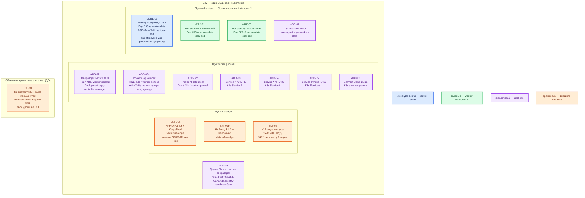

# PostgreSQL 18.6 — развёртывание Dev

Тот же вид инсталляции, что Prod: community PostgreSQL **18.6** + оператор **CloudNativePG 1.30.0** в Kubernetes, `Cluster` из **1 primary + 2 hot standby**, StorageClass `local-ssd`, Pooler, архив WAL. Уменьшена ёмкость (CPU/RAM/диск), не механизм. Это **не** `docker run` одного `postgres:18.6` и не Docker Compose: такой стенд не воспроизводит failover, anti-affinity и смену `-rw`.

## Допущения

1. Dev — **один** ЦОД, один Kubernetes (версия из матрицы оператора 1.30: **1.36 / 1.35 / 1.34**; на платформе — тот же 1.36.4, что Prod). Второго прикладного ЦОДа и отдельного ЦОДа бэкапов нет: replica cluster ЦОД-2 и бакет «за три площадки» на Dev **не** повторяем. Архив WAL — тем же Barman Cloud plugin в **меньший** бакет **этого** ЦОДа, чтобы остался тот же класс восстановления.
2. Вход: та же пара HAProxy **3.4.3** + Keepalived + VIP, меньше CPU/RAM. **5432 на VIP не публикуем.**
3. Те же имена StorageClass: `local-ssd` (RWO) для PGDATA, `shared-fs` не для Postgres. Тома меньше. NFS нет.
4. DNS: CoreDNS / `cluster.local`; снаружи зона `dev.…`. Клиенты по FQDN, не Pod IP.
5. Карточки, Grafana metadata, Camunda Identity — **разные** `Cluster`, даже на Dev. На схеме — кластер карточек; остальные — тот же шаблон, меньше тома.
6. Кворум/HA не ужимаем до двух инстансов: `instances: 3` (один primary + два маленьких standby). «Один под Postgres» — другой класс системы: нет выборов лидера и отказа ноды.
7. Ёмкость — порядок величины, допущение платформы. В мануале PostgreSQL сметы сервера нет. Не копировать учебные пароли `dev` / `dev-app` из `.install.md` в общие секреты; для Dev — свои секреты контура, не git.
8. Образ инстансов — линия **18.6** (`ghcr.io/cloudnative-pg/postgresql`), не заводской **18.4** оператора, не голый `postgres:18.6`.

## Схема инстансов

На схеме нет потоков данных. Планировщик двигает поды по пулу; конкретная нода не фиксируется.

ОС — свойство платформы, не пода. Один стандарт Linux на всех нодах контура.

Исключение вендора: Windows-хост под CloudNativePG не предполагается.

| Имя пула | Роль | Зачем выделен |
|---|---|---|
| `infra-edge` | edge-VM | Та же пара HAProxy + VIP, что в Prod; меньше CPU/RAM. Не путь к PostgreSQL. |
| `worker-general` | general | Оператор и два пулера. Без локального SSD под PGDATA. |
| `worker-data` | data-localdisk | Три маленьких ноды под три инстанса Postgres (`local-ssd`). Не схлопывать в одну VM. |
| `infra-swift` | object storage | Меньший бакет архива WAL в этом же ЦОДе. Не CSI. |

Смысл цветов: **синий** — writer; **зелёный** — standby; **фиолетовый** — оператор / пулер / сервисы / CSI / плагин копий; **оранжевый** — VIP, HAProxy, бакет.

## Комментарии к схеме

### EXT-01a/b, EXT-02 — пара HAProxy + VIP

- **Функционал:** тот же вход, что в Prod (`:6443` и HTTP(S)).
- **Критично:** меньше CPU/RAM, та же роль. PostgreSQL на VIP не слушает. Не заменять пару одним HAProxy «потому что Dev».

### ADD-01 — оператор CloudNativePG 1.30.0

- **Функционал:** тот же манифест `cnpg-1.30.0.yaml`, namespace `cnpg-system`, Deployment `cnpg-controller-manager`. Создаёт и чинит `Cluster`, переключает `-rw` внутри этого Kubernetes.
- **Критично:** не однонодовый «CNPG quickstart с `instances: 1`» из учебного раздела `.install.md` — тот YAML в бой и в этот Dev не копировать. Не Patroni рядом. Обновление оператора на Dev должно проходить тем же rolling update, иначе ошибка наката на Prod не воспроизведётся.

### CORE-01, WRK-01, WRK-02 — `Cluster` карточек

- **Функционал:** один primary (единственный writer, WAL) и два маленьких hot standby. Порт **5432/TCP**. Сервисы `-rw` / `-ro` как в Prod.
- **Критично:**
  - `spec.instances: 3`. Не 1 и не 2. Anti-affinity: не две реплики на одну ноду → **три** ноды пула `worker-data`, пусть маленькие.
  - Образ `ghcr.io/cloudnative-pg/postgresql`, тег с **`18.6`**. Проверка: `SELECT version()` → PostgreSQL **18.6**.
  - StorageClass **`local-ssd`**, тома меньше Prod. Не NFS, не `shared-fs`.
  - Sync внутри площадки как в Prod: `method: any`, `number: 1`, `dataDurability: required` — иначе Dev не покажет «запись встала без replica» и расхождение RPO.
  - Роль приложения не `postgres`. SCRAM, не `trust`. TLS как в Prod (иначе «на Dev без SSL» не поймает ошибку сертификата).
  - Клиенты — FQDN пулера / `-rw` зоны `dev.…` или `cluster.local`, не Pod IP.

Ёмкость (порядок величины, **не** из мануала, уточняется замером): под Postgres ориентир **2 vCPU / 4–8 ГиБ RAM** на инстанс; PVC `local-ssd` — **десятки ГиБ** (не терабайты). Ноды `worker-data` — три штуки этого порядка. Заводской `shared_buffers` (~128 МиБ) на Dev можно оставить ближе к заводу, пока нет замера; не переносить «25% с потолка». Цифры **2 vCPU / 2 ГиБ / 20 ГиБ** из `sample/PostgreSQL.md` — про Docker-контейнер на машине разработчика, не про этот контур.

Чего этот Dev **не** доказывает (честно): отказ целого ЦОДа и promote replica cluster на второй Kubernetes; межплощадочный лаг streaming. Доказывает: отказ одной ноды `worker-data`, смену primary, переезд `-rw`, sync `ANY 1`, anti-affinity, пулер на двух нодах, restore из архива WAL.

### ADD-02a/b — Pooler / PgBouncer

- **Функционал:** тот же ресурс `Pooler` типа `rw`, что в Prod.
- **Критично:** минимум **2** реплики на **2** нодах. Не один пулер «для экономии» — иначе нет балансировки этого слоя и отказа ноды пулера. Образ ≥ 1.19, пин тега. Имя ≠ имя Cluster.

### ADD-03 / ADD-04 / ADD-05 — сервисы

- **Функционал:** `-rw`, `-ro`, сервис пулера. Оператор сам обновляет `-rw` после failover.
- **Критично:** имена зоны `dev.…` / `cluster.local`. Не публиковать 5432 с машины разработчика на `0.0.0.0` «как в quickstart Docker».

### ADD-06, EXT-31 — Barman Cloud и бакет

- **Функционал:** тот же плагин, меньший бакет в этом ЦОДе (Swift/S3-совместимый, не CSI).
- **Критично:** не выкидывать архив WAL на Dev — иначе не воспроизвести PITR и bootstrap. Пробное restore на Dev обязательно, как проверка механизма, не как «прод-ёмкость». Replica **не** замена копии: `DROP TABLE` уедет на оба standby.

### ADD-08 — другие `Cluster`

- **Функционал / критично:** не склеивать Grafana и карточки в одну базу «на стенде так проще». Тот же оператор, `instances: 3` можно оставить или явно зафиксировать меньший домен **тем же** видом (оператор + local-ssd + отдельный `Cluster`), но не одним контейнером Docker.

## Путь роста

Сначала замер на Dev не заменяет замер Prod. Когда Dev начнёт упираться:

1. Вертикаль маленьких нод `worker-data` (не добавлять standby «чтобы писало быстрее»).
2. Больше тома `local-ssd`.
3. Больше подов `Pooler` (уже не ниже двух).
4. Если понадобится проверить DR второй площадки — это уже не Dev-контур, а отдельный стенд «как Prod ЦОД-2» (второй Kubernetes + replica cluster). В одноцодовый Dev его не втискивать и не имитировать stretch.

## Сильные и слабые места

**Сильное:** тот же оператор, те же роли, тот же кворум из трёх, тот же `local-ssd` и пулер — ошибка наката, failover и `-rw` воспроизводится. Дешевле, чем Prod, за счёт размера, не за счёт вида.

**Слабое:** нет второй площадки — не поймать баг promote/demote между Kubernetes и межЦОДовый лаг. Маленькие диски не покажут bloat/WAL на терабайтах. Одна реплика оператора (завод манифеста) — пауза автоfailover, пока под оператора переедет.

**Критичные условия**

- Не заменять этот контур учебным `docker run postgres:18.6`.
- Не `instances: 1` и не «два пода на одной ноде».
- Не NFS, не заводской образ 18.4, не `latest`.
- Не публиковать 5432 в интернет и не `trust`.
- Не stretch и не «один кластер на все приложения».
- Не Patroni рядом с CNPG.

## Источники

| Факт | Страница |
|---|---|
| PostgreSQL 18 | https://www.postgresql.org/docs/18/ |
| Релиз 18.6 | https://www.postgresql.org/about/news/postgresql-186-1711-1615-1519-1424-and-19-beta-3-released-3365/ |
| Requirements (нет CPU/RAM) | https://www.postgresql.org/docs/18/install-requirements.html |
| Порт 5432, `ssl` off | https://www.postgresql.org/docs/18/runtime-config-connection.html |
| SCRAM; MD5 deprecated | https://www.postgresql.org/docs/18/auth-password.html |
| CNPG 1.30 | https://cloudnative-pg.io/docs/1.30/ |
| Установка 1.30.0 | https://cloudnative-pg.io/docs/1.30/installation_upgrade/ |
| Матрица; завод 18.4 | https://cloudnative-pg.io/docs/1.30/supported_releases/ |
| Архитектура, local volumes, нет автоfailover между k8s | https://cloudnative-pg.io/docs/1.30/architecture/ |
| Диск | https://cloudnative-pg.io/docs/1.30/storage/ |
| Образы, не `latest` | https://cloudnative-pg.io/docs/1.30/container_images/ |
| `instances` и sync `ANY 1` | https://cloudnative-pg.io/docs/1.30/replication/ |
| Replica cluster (для Prod; на Dev нет второго k8s) | https://cloudnative-pg.io/docs/1.30/replica_cluster/ |
| Pooler | https://cloudnative-pg.io/docs/1.30/connection_pooling/ |
| Учебный Docker (не этот контур) | `Out/БД и хранилища/PostgreSQL/PostgreSQL.install.md` · https://hub.docker.com/_/postgres |
| Карточка | `Out/БД и хранилища/PostgreSQL/PostgreSQL.md` |
| Схемы HA / запрет stretch | `Out/БД и хранилища/PostgreSQL/PostgreSQL.shema.md` |
| Роль | `Out/БД и хранилища/PostgreSQL/PostgreSQL.consultant.md` |
| Стендовые 2/2/20 | `sample/PostgreSQL.md` |
| Эталон Prod, от которого ужат этот файл | `sample2/PostgreSQL.prod.md` |

**В доке вендора нет:** смета «хватит учебному контуру»; порог RTT. Учебный `instances: 1` в `.install.md` — не паритет с Prod и здесь не используется.
