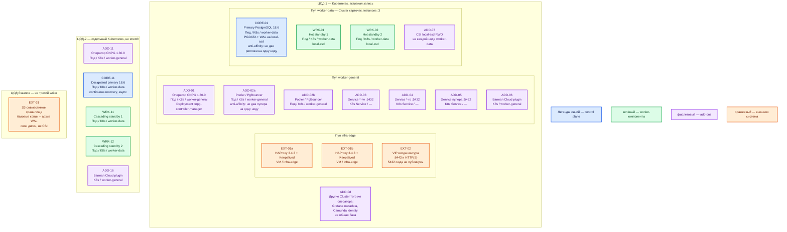

# PostgreSQL 18.6 — развёртывание Prod

Community PostgreSQL **18.6** в Kubernetes каждой прикладной площадки через оператор **CloudNativePG 1.30.0**. Это не Postgres Pro, не EDB и не Patroni. Живой набор primary + hot standby (резервные инстансы, на которых можно читать) — **внутри одного ЦОДа**. ЦОД-2 — отдельный `Cluster` в непрерывном восстановлении (async), не stretch одного кворума.

## Допущения

1. Уже есть Kubernetes **1.36.4** на каждой прикладной площадке (матрица оператора 1.30: Kubernetes **1.36 / 1.35 / 1.34**). Оператор ставится в **каждый** Kubernetes отдельно: он не управляет чужим кластером.
2. Prod: два прикладных ЦОДа + один ЦОД под бэкапы. RTT между ЦОДами **не измерен** — порога в документации PostgreSQL нет, поэтому один `Cluster` на два ЦОДа **не** собираем.
3. Сеть (VLAN, IP-план) вне рамок. Вход площадки: пара HAProxy **3.4.3** + Keepalived + VIP (ControlPlaneEndpoint `:6443` и край HTTP(S)). Порт PostgreSQL **5432/TCP** на этот VIP **не** публикуем.
4. В Kubernetes два StorageClass: `local-ssd` (RWO, локальный SSD, CSI) и `shared-fs` (RWX). Каталог данных PostgreSQL — только `local-ssd`. NFS и `shared-fs` как диск PGDATA **не** используем. Swift — на своих дисках, не через CSI.
5. DNS: внутри кластера CoreDNS / `cluster.local`; снаружи зона `prod.…`. Клиенты ходят по FQDN сервиса (`*-rw`, пулер), не по Pod IP.
6. Это развёртывание **этого продукта**, а не «одна база на все приложения». Карточки клиентов, метаданные Grafana и Camunda Identity — **разные** объекты `Cluster` (разные каталоги данных). На схеме подробно показан кластер карточек (эталон «текущая карточка»); остальные — тот же оператор, тот же шаблон, отдельные ресурсы.
7. Нагрузки нет. Цифр «хватит N ядер» в мануале PostgreSQL **нет** (страница Requirements — про сборку из исходников). Ёмкость ниже — **порядок величины**, допущение платформы, уточняется замером. Не обещание «хватит терабайтам».
8. Заводской образ инстансов у оператора 1.30.0 — PostgreSQL **18.4**. Его не оставляем: пиним линию **18.6** образа `ghcr.io/cloudnative-pg/postgresql`. Голый `postgres:18.6` с Docker Hub оператору не подходит (оператор подменяет точку входа своим instance manager).
9. Раздел «Бой» в `PostgreSQL.install.md` отсутствует (файл описывает учебный Docker-стенд). Боевой путь взят из роли консультанта, карточки, схем и официальных страниц CNPG 1.30 / PostgreSQL 18.

## Схема инстансов

На схеме нет потоков данных. Планировщик двигает поды по пулу; конкретная «нода 3» не фиксируется.

ОС — свойство платформы, не пода. Один стандарт Linux на всех нодах контура.

Исключение вендора: Windows-хост под CloudNativePG не предполагается.

| Имя пула | Роль | Зачем выделен |
|---|---|---|
| `infra-edge` | edge-VM | Пара HAProxy + Keepalived + VIP входа Kubernetes и HTTP(S). Не путь к PostgreSQL. |
| `worker-general` | general | Оператор, Pooler, плагин бэкапа: без локального SSD под PGDATA. |
| `worker-data` | data-localdisk | Поды PostgreSQL с томами `local-ssd`. Кратность **3** нод, чтобы три инстанса не делили машину. |
| `infra-swift` | object storage | Кольцо/диски объектного хранилища в ЦОДе бэкапов. Не CSI, не диск etcd/Postgres. |

Смысл цветов для PostgreSQL: **синий** — текущий (или designated) writer; **зелёный** — standby с данными; **фиолетовый** — оператор / пулер / сервисы / CSI / плагин копий; **оранжевый** — VIP, HAProxy, объектное хранилище.

## Комментарии к схеме

### EXT-01a/b, EXT-02 — пара HAProxy + VIP

- **Функционал:** вход площадки к API Kubernetes (`:6443`, TCP passthrough) и край HTTP(S).
- **Критично:** клиенты PostgreSQL **не** ходят сюда на `:5432`. Балансировщик HTTP «на все 5432» без разделения `-rw` / `-ro` отправит запись на replica. Публиковать 5432 в интернет запрещено.

### ADD-01 / ADD-11 — оператор CloudNativePG 1.30.0

- **Функционал:** Kubernetes-оператор (контроллер, который держит желаемое состояние объектов). Смотрит `Cluster` / `Pooler`, поднимает инстансы, следит за здоровьем, при отказе primary внутри **этого** Kubernetes повышает standby и переписывает Endpoints сервиса `-rw`.
- **Критично:** манифест `cnpg-1.30.0.yaml` из ветки `release-1.30`, namespace `cnpg-system`, Deployment `cnpg-controller-manager`. Завод манифеста — **одна** реплика; несколько реплик допустимы (есть leader election), это не обязательный кворум продукта. Оператор в ЦОД-2 — **свой**: автосмена главной между разными Kubernetes **не в scope**. Не ставить Patroni на тот же каталог данных. После обновления оператора по умолчанию идёт rolling update инстансов и может быть switchover (`primaryUpdateStrategy: unsupervised`).

### CORE-01, WRK-01, WRK-02 — один `Cluster` карточек в ЦОД-1

- **Функционал:** один writer (**primary** — принимает `INSERT`/`COMMIT`, пишет WAL) и два **hot standby** (получают поток WAL, могут отдавать чтение с лагом). Порт **5432/TCP** и у клиентов, и у репликации. TLS репликации оператор включает сам (`streaming_replica` + клиентский сертификат).
- **Критично:**
  - `spec.instances: 3`. Формула оператора: `replicas = instances - 1`. Схема «2 узла» — другой класс системы: нет запасного standby после отказа одного.
  - Образ инстанса: `ghcr.io/cloudnative-pg/postgresql`, тег **начинается с `18.6`**. Не `latest`, не `18`, не заводской **18.4**, не `postgres:18.6`.
  - `SELECT version()` должен показать **PostgreSQL 18.6**.
  - StorageClass **`local-ssd`**, RWO, отдельный PVC на инстанс. Репликация СХД **не** заменяет физическую копию PostgreSQL. NFS как единственный диск главной — запрещён.
  - Anti-affinity: не сажать две реплики на одну ноду. Пул `worker-data` в кратности трёх; CNPG рекомендует метку/taint `node-role.kubernetes.io/postgres` и не делить эти ноды с чужой нагрузкой.
  - Синхронная репликация **внутри ЦОД-1** (иначе завод — async, RPO внутри площадки не 0): `.spec.postgresql.synchronous.method: any`, `number: 1` → PostgreSQL `ANY 1 (...)`. `dataDurability: required` — `COMMIT` ждёт flush WAL хотя бы на одном standby; если никого нет, запись встаёт. `preferred` — запись жива без replica, окно потери. **Не** включать инстансы ЦОД-2 в этот sync-кворум.
  - Слоты репликации держит оператор. Неограниченный слот заполнит диск WAL.
  - Роль приложения — не суперпользователь `postgres`. Пароли — SCRAM-SHA-256 (MD5 в 18 устарел). TLS канала для приложений в бою включать (`ssl` у PostgreSQL завод **off**). `trust` на TCP запрещён. Секреты — Vault, не git.
  - Клиенты пишут на DNS `-rw` (через пулер), не на IP пода. Чтение с `-ro` — только если сервис переживает отставание.
  - Ещё копия **не** ускоряет запись. Один writer на кластер.

Ёмкость ноды `worker-data` (порядок величины, **не** из мануала вендора, уточняется замером): ориентир **8–16 vCPU / 32–64 ГиБ RAM** на ноду; том PGDATA+WAL — **сотни ГиБ…терабайты** на `local-ssd`. Заводской `shared_buffers` (~128 МиБ) для боя мал — поднимать **после замера**, не «25% с потолка». `max_connections` держать небольшим, перед ним — PgBouncer. Учебные **2 vCPU / 2 ГиБ / 20 ГиБ** из `sample/PostgreSQL.md` — стенд Docker, не смета Prod.

### ADD-02a/b, ADD-05 — Pooler / PgBouncer

- **Функционал:** отдельный процесс-пулер (прокси, который повторно использует мало серверных сессий для многих клиентов). Ресурс `Pooler`, тип `rw`, смотрит на сервис записи кластера карточек.
- **Критично:** минимум **2** пода на **2** нодах `worker-general` (stateless-паритет). Пример в доке CNPG — `instances: 3`; это пример, не требование «обязательно три». Образ PgBouncer **≥ 1.19** (нужен `auth_dbname`), тег пинить, не `latest`. Имя Pooler ≠ имя Cluster. Жизненный цикл Pooler и Cluster независим: удаление кластера пулер не сотрёт. Режим на старте — `session`; `transaction` — путь роста, не включать сразу все режимы. Приложения в бою подключаются к **сервису пулера**, не напрямую к поду primary.

### ADD-03 / ADD-04 — сервисы `-rw` и `-ro`

- **Функционал:** стабильные DNS-имена. `-rw` всегда указывает на текущий primary; после failover оператор обновляет Endpoints. `-ro` — hot standby.
- **Критично:** FQDN вида `*.svc.cluster.local` внутри; снаружи — имя зоны `prod.…`, если вообще нужен выход за кластер. Не Pod IP. Наружу в интернет не публиковать.

### ADD-06 / ADD-16, EXT-31 — Barman Cloud и ЦОД бэкапов

- **Функционал:** базовая резервная копия + непрерывный архив WAL (журнал изменений, который пишется раньше страниц данных) в объектное хранилище. Нужны для PITR (восстановление на момент времени). Три replica **не** вернут «вчера 15:03» и **повторят** штатный `DROP TABLE`.
- **Критично:** плагин Barman Cloud, не исполняемые файлы Barman внутри образа Postgres (в 1.30 это отдельный путь). Бакет — в ЦОДе бэкапов (Swift/S3-совместимый, свои диски). Наличие файлов в бакете ещё не доказательство: результат подтверждает **пробное восстановление**. ЦОД-3 — не третий writer.

### CORE-11, WRK-11, WRK-12 — replica cluster в ЦОД-2

- **Функционал:** отдельный `Cluster` в непрерывном восстановлении: designated primary (standby, которого можно повысить до writer) + каскадные standby. Источник WAL — streaming с ЦОД-1 и/или архив в объектном хранилище (гибрид: streaming + archive как запас).
- **Критично:** это **не** stretch и **не** второй writer. Клиенты в штате пишут только в `-rw` ЦОД-1. Автоfailover между Kubernetes оператор **не** делает: контролируемый switchover — сначала demote ЦОД-1, затем promote ЦОД-2 с `promotionToken`; без токена — failover с пересборкой бывшего primary. Симметрия `instances: 3` нужна, чтобы после promote на ЦОД-2 осталась та же HA, а не одинокий инстанс. Те же роли/секреты, что в ЦОД-1, если планируется возврат. Sync-кворум ЦОД-1 на ЦОД-2 **не** растягивать.

### ADD-08 — другие `Cluster`

- **Функционал:** Grafana / Camunda Identity и прочие платформенные БД.
- **Критично:** отдельные каталоги данных. Падение отчёта не должно валить эталон карточек. Тот же оператор, тот же образ 18.6, тот же `local-ssd`; ёмкость можно меньше, вид инсталляции — тот же.

## Путь роста

Не включать сразу. Когда замер покажет узкое место:

1. **Запись / WAL / CPU primary** — вертикаль ноды `worker-data` (CPU/RAM/диск) или **новый** `Cluster` на другой домен данных. Добавлять standby «для записи» бессмысленно: второго writer нет.
2. **Чтение** — больше standby и сервис `-ro` (клиент должен переживать лаг); тяжёлые сканы — не в этот продукт (ClickHouse).
3. **Соединения** — увеличить `instances` у `Pooler`, затем при необходимости режим `transaction`.
4. **Диск / bloat** — больше том `local-ssd`, autovacuum, вынос старья в озеро; не NFS.
5. **После promote ЦОД-2** — если replica cluster был меньше трёх инстансов, сначала довести до `instances: 3`, потом открывать запись. Здесь симметрия уже заложена, этот шаг не нужен на старте.
6. **Оператор** — при необходимости >1 реплики Deployment (leader election), taint чтобы не сидел на `worker-data`.

## Сильные и слабые места

**Сильное:** официальный оператор под наш Kubernetes; failover и перенос `-rw` внутри одной площадки без ручного `pg_ctl promote`; `COMMIT` не прибит межЦОДовым RTT; локальный SSD под WAL; отдельный архив переживает гибель живых дисков; Dev может повторить тот же вид инсталляции.

**Слабое:** смерть ЦОД-1 = простой записи до ручного/GitOps promote ЦОД-2; RPO между площадками > 0 при async; `required` sync остановит запись, если оба standby в ЦОД-1 недоступны; оператор с одной репликой: пока его нет, автоfailover внутри площадки не случится (Postgres при этом может продолжать обслуживать текущий primary); нет горизонтали записи.

**Критичные условия**

- Не stretch одного `Cluster` / кворума sync на два ЦОДа.
- Не заводской образ **18.4**, не `latest`, не голый `postgres:18.6`.
- Не NFS / `shared-fs` как диск PGDATA.
- Не публиковать 5432 на VIP/интернет; не `trust`; не суперпользователь в приложении.
- Не Patroni + CNPG на один датасет.
- Не считать replica бэкапом.
- Не одна база «на всех» сервисах.
- Не копировать учебный `docker run` в бой.

## Источники

| Факт | Страница |
|---|---|
| PostgreSQL 18 | https://www.postgresql.org/docs/18/ |
| Релиз 18.6 (13 авг 2026) | https://www.postgresql.org/about/news/postgresql-186-1711-1615-1519-1424-and-19-beta-3-released-3365/ |
| Requirements (нет CPU/RAM сервера) | https://www.postgresql.org/docs/18/install-requirements.html |
| Порт 5432, `ssl` завод off | https://www.postgresql.org/docs/18/runtime-config-connection.html |
| `shared_buffers` | https://www.postgresql.org/docs/18/runtime-config-resource.html |
| SCRAM; MD5 deprecated | https://www.postgresql.org/docs/18/auth-password.html |
| Метод `trust` | https://www.postgresql.org/docs/18/auth-trust.html |
| Streaming replication / слоты | https://www.postgresql.org/docs/18/warm-standby.html |
| Архив WAL и PITR | https://www.postgresql.org/docs/18/continuous-archiving.html |
| CNPG 1.30 (рабочий префикс `/docs/`; `/documentation/1.30/` — 404) | https://cloudnative-pg.io/docs/1.30/ |
| Установка оператора 1.30.0 | https://cloudnative-pg.io/docs/1.30/installation_upgrade/ |
| Матрица k8s и PG; завод 18.4 | https://cloudnative-pg.io/docs/1.30/supported_releases/ · https://github.com/cloudnative-pg/cloudnative-pg/releases/tag/v1.30.0 |
| Архитектура: один k8s, replica cluster, нет автоfailover между кластерами, ноды postgres кратно 3, local volumes | https://cloudnative-pg.io/docs/1.30/architecture/ |
| Диск: local vs NFS/СХД | https://cloudnative-pg.io/docs/1.30/storage/ |
| Образы оператора, формат тега, не `latest` | https://cloudnative-pg.io/docs/1.30/container_images/ |
| `instances`, sync `ANY 1`, `dataDurability` | https://cloudnative-pg.io/docs/1.30/replication/ |
| Replica cluster / distributed topology | https://cloudnative-pg.io/docs/1.30/replica_cluster/ |
| Pooler / PgBouncer | https://cloudnative-pg.io/docs/1.30/connection_pooling/ |
| Карточка, порты, состав | `Out/БД и хранилища/PostgreSQL/PostgreSQL.md` |
| Учебный стенд (не копировать в бой) | `Out/БД и хранилища/PostgreSQL/PostgreSQL.install.md` |
| HA внутри ЦОД-1, ЦОД-2 async | `Out/БД и хранилища/PostgreSQL/PostgreSQL.shema.md` |
| Роль консультанта | `Out/БД и хранилища/PostgreSQL/PostgreSQL.consultant.md` |
| Ориентир стенда 2/2/20 (не Prod) | `sample/PostgreSQL.md` |

**В доке вендора нет:** смета CPU/RAM/диска «хватит бою»; порог RTT для stretch; пароль по умолчанию (его нет).
