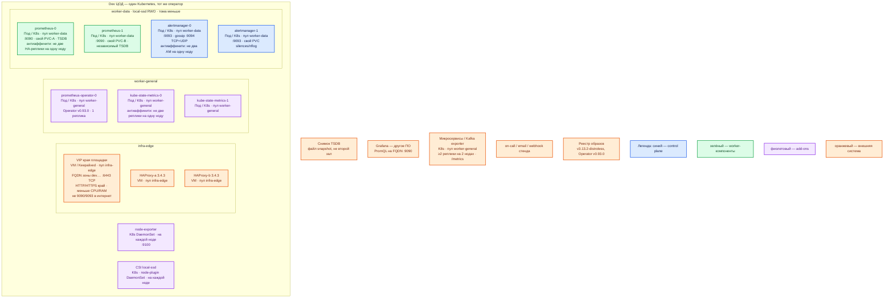

# Prometheus 3.13.2 LTS — Dev

Self-hosted метрики: scrape `/metrics`, локальная **TSDB**, PromQL, Alertmanager. Контур: **Dev**. Это **уменьшенный Prod**, не другой вид инсталляции: тот же Helm **kube-prometheus-stack 88.3.0**, тот же Operator **v0.93.0**, те же **2 независимых** Prometheus (два TSDB, не кластер) и **2** Alertmanager (gossip без кворума). Не `docker run`, не Compose, не один под «потому что Dev».

Образ: `quay.io/prometheus/prometheus:v3.13.2-distroless`. Не `latest`, не **3.14.0**.

## Допущения

1. Один прикладной ЦОД. Stretch нет. Живого «второго ЦОДа метрик» нет.
2. Виртуализация есть. Сеть в деталях вне рамок.
3. Та же пара **HAProxy 3.4.3 + Keepalived + VIP**, меньше CPU/RAM у VM входа. VIP = `:6443` TCP passthrough и край HTTP(S). Kafka `:9092` не через этот HAProxy. **9090/9093** не в интернет.
4. Те же имена StorageClass: `local-ssd` (RWO), `shared-fs` (RWX только как исключение). Тома **меньше**, имена классов те же. NFS — не диск TSDB.
5. DNS: внутри CoreDNS / `cluster.local`; снаружи зона `dev.…`. Клиенты по FQDN, не Pod IP.
6. Kubernetes **1.36.4**, тот же чарт **88.3.0**. Grafana / Thanos / Adapter / Pushgateway этот контур не ставит (`grafana.enabled: false`).
7. Уменьшают CPU/RAM/диск PVC, **не** число HA-реплик Prometheus и не механизм установки. Схема «1 контейнер на ноутбуке» доказывает `/-/ready`, но не антиаффинити, не два TSDB и не gossip AM.
8. Учебный запуск из `Prometheus.install.md` (`docker run … v3.13.2`, first steps) — **не** этот контур. Стендовые YAML и «9090 без auth» в Dev-паритет не копировать: TLS/auth как в Prod, свои секреты.
9. Нагрузка не замерена. Минимума CPU/RAM в мануале нет. Federator между ЦОДами на Dev **нет** (один зал): роль-модель локального стека совпадает с Prod без пары federator.
10. Дефолт чарта `replicas: 1` не оставляем. AM gossip без кворума: **2** реплики достаточно (не раздувать до 3 «как etcd»).

## Схема инстансов

Тот же вид, что Prod на **одном** ЦОДе: Operator, две HA-реплики Prometheus, два AM, два kube-state-metrics, node-exporter DaemonSet. Federator Prod (картина двух залов) здесь не ставится — нечего федератировать.

ОС — свойство платформы, не пода. Один стандарт Linux на всех нодах контура.

Образы — **distroless**; это не другая ОС ноды. Не подменять ноду кластера Docker Desktop «одним Prometheus».

| Имя пула | Роль | Зачем выделен |
|---|---|---|
| `infra-edge` | edge-VM | Та же пара HAProxy + VIP, меньше CPU/RAM. Иначе ошибка «UI на Pod IP / на :9090 первой VM» на Prod не воспроизведётся |
| `worker-general` | general | Operator и kube-state-metrics. Stateless на Dev — минимум 2 реплики kube-state-metrics на 2 нодах |
| `worker-data` | data-localdisk | Две маленькие ноды минимум под две HA-реплики Prometheus (антиаффинити). Практически пул платформы — **3** маленьких, как у остальных stateful. `local-ssd`, не hostPath |

Смысл цветов: **синий** — Alertmanager; **зелёный** — Prometheus со своей TSDB; **фиолетовый** — Operator / exporters / CSI; **оранжевый** — VIP, Grafana, снимки.

## Комментарии к схеме

### Чем Dev не является

Одиночный `docker run -p 127.0.0.1:9090:9090 quay.io/prometheus/prometheus:v3.13.2` из `Prometheus.install.md` — учебный ноутбук. Он не воспроизводит: две независимые TSDB, антиаффинити, PVC `local-ssd`, Operator/CRD, gossip Alertmanager, отказ ноды. Dev-контур платформы этот quickstart **не** использует.

### VIP + пара HAProxy — `infra-edge`

- **Функционал.** ControlPlaneEndpoint Dev и HTTP(S) край. FQDN зоны `dev.…`.
- **Критично.** Не упрощать до «порт 9090 на первой worker-VM». Без VIP/Ingress не проверяется тот же путь, что в Prod. 9090/9093 не в интернет. Не балансировать алерты Prometheus→AM через VIP.

### prometheus-operator

- **Функционал.** Тот же контроллер v0.93.0, те же CRD.
- **Критично.** Не заменять Operator «ручным StatefulSet на Dev» и не ставить другой minor чарта. 1 реплика контроллера, как в Prod. Падение Operator на Dev должно давать тот же эффект: scrape жив, новые ServiceMonitor нет.

### prometheus-0 / prometheus-1 — две маленькие HA-реплики

- **Функционал.** Тот же сервер 3.13.2, тот же независимый съём, свои PVC.
- **Критично.** **Две** реплики, не одна. Одна реплика — другой класс системы: выкат = дырка съёма, ошибка «вторая TSDB разъехалась» на Prod не ловится. Не три «для кворума» — кворума TSDB нет, будет лишняя нагрузка scrape. `podAntiAffinity: "hard"`. `replicaExternalLabelNameClear: false`. Образ **v3.13.2-distroless**. Retention чарта **10d** (как Prod); PVC меньше, не другой класс (`local-ssd`, не emptyDir/NFS).

Ёмкость (порядок величины, не вендор): **2 vCPU / 4–8 ГиБ RAM** на реплику; PVC **десятки ГиБ** `local-ssd`. Цифры `sample/Prometheus.md` (2/4/30) близки к маленькому стенду, но там Docker volume — здесь CSI. Уточняется замером. Формула диска та же: retention × сэмплы/с × 1–2 байта, запас 15–20% тома.

### alertmanager-0 / alertmanager-1

- **Функционал.** Тот же gossip 9094, UI 9093.
- **Критично.** **Две** реплики, не одна и не «AM выключен на Dev». Схема с одним AM не показывает fail-open и дедуп. Не 3 ради нечётности: вендор явно пишет, что odd/even не важен. Не растягивать gossip (один ЦОД). Антиаффинити hard. Алерты с **обеих** Prometheus на **оба** AM, не через LB.

### kube-state-metrics и node-exporter

- **Функционал.** Как в Prod.
- **Критично.** kube-state-metrics — **2** реплики на разных нодах (правило stateless Dev). node-exporter — DaemonSet на каждой ноде, не «один под на кластер».

### CSI и снимки

- **Функционал.** Те же классы, меньшие тома. Snapshot для проверки restore, как в Prod.
- **Критично.** Не hostPath. Не считать Dev живым federator Prod.

Чего этот контур **ещё не доказывает:** отказ целого прикладного ЦОДа Prod, иерархическую federation `/federate` через город, нагрузку кардинальности интеграционного API. Он **доказывает** то, чего нет у `docker run`: две TSDB, Operator, PVC `local-ssd`, gossip AM, отказ одной ноды `worker-data`.

## Путь роста

Совпадает с Prod, только ёмкость меньше:

1. Не схлопывать до одной реплики и не добавлять третью «для кворума».
2. Сначала labels/limits, потом RAM/диск VM `worker-data`.
3. Functional shard — когда Dev врёт из-за кардинальности, тем же приёмом, что Prod, не сменой на Compose.
4. Upgrade тем же чартом, без прыжка на 3.14.0 внутри 88.3.0.
5. Federator появится, когда появится второй зал — по схеме Prod, не «один scrape на всё».

## Сильные и слабые места; критичные условия

**Сильная сторона.** Тот же kube-prometheus-stack 88.3.0 и те же роли, что Prod: ошибка из-за вида инсталляции (один процесс, NFS, replicas: 1) на этом стенде воспроизводится. Отказ одной маленькой data-ноды оставляет второй съём.

**Слабая сторона.** Маленькие PVC быстрее упираются в compaction/retention. Один ЦОД не проверяет federation и RTT. Distroless без shell усложняет «зайти в под посмотреть».

**Критичные условия**

- Не Docker / Compose / kind «потому что Dev».
- Не 1 Prometheus и не 1 Alertmanager.
- Не NFS / `shared-fs` / emptyDir для TSDB. Не другой StorageClass «по-простому».
- Не `latest`, не 3.14.0. Не 9090 в интернет. Не учебный пароль Grafana как «пароль Prometheus» (его нет).
- Не LB перед AM. Не stretch (и не к чему).
- Не копировать first-steps YAML в бой.

## Источники

Те же страницы, что Prod; отдельного «официального маленького HA» у вендора нет.

- LTS 3.13.2: https://prometheus.io/download/
- TSDB, не NFS, формула диска, snapshot: https://prometheus.io/docs/prometheus/latest/storage/
- HA идентичные серверы: https://prometheus.io/docs/introduction/faq/
- Alertmanager gossip, без кворума, 2–3 в одном DC: https://prometheus.io/docs/alerting/latest/high_availability/
- Operator HA: https://prometheus-operator.dev/docs/platform/high-availability/
- Чарт 88.3.0, HA `replicas: 2`: https://github.com/prometheus-community/helm-charts/tree/kube-prometheus-stack-88.3.0/charts/kube-prometheus-stack
- Учебный Docker (не этот контур): https://prometheus.io/docs/prometheus/3.13/installation/ и `Out/Платформенная инфра/Prometheus/Prometheus.install.md`
- Карточка: `Out/Платформенная инфра/Prometheus/Prometheus.md`

**В доке вендора нет:** цифра «столько RAM хватит двум маленьким репликам»; разрешение собрать Dev одним контейнером; порог RTT.
