# Prometheus 3.13.2 LTS — Prod

Self-hosted метрики: процесс сам ходит HTTP на `/metrics` цели (**scrape** — съём), пишет ряды в локальную **TSDB** (база на диске этого процесса), считает PromQL и правила, отдаёт алерты в **Alertmanager**. Чарт сообщества **kube-prometheus-stack 88.3.0** (Prometheus Operator **v0.93.0**, Alertmanager **v0.33.1**, node-exporter **v1.12.1-distroless**). Образ сервера в чарте: `quay.io/prometheus/prometheus:v3.13.2-distroless`. Не `latest`, не **3.14.0**.

**HA-реплика** — второй такой же Prometheus с теми же целями и правилами, но **своим диском**. Это не шарды одной базы и не кластерный TSDB. **Gossip** Alertmanager — обмен silences и журналом уведомлений на **9094**, без голосования и без кворума.

Контур: **Prod**. Два прикладных ЦОДа — два независимых стека. ЦОД-бэкапы — снимки TSDB, **не** член gossip.

Раздел «Бой» в `Prometheus.install.md` отсутствует (файл — учебный Docker). Боевой путь: карточка, схемы, консультант и официальные страницы ниже.

## Допущения

1. На каждом прикладном ЦОДе уже есть Kubernetes **1.36.4** (чарт требует ≥ 1.25). Оператор ставится **в каждый** кластер отдельно.
2. Prod: **2 прикладных ЦОДа** + **1 ЦОД под бэкапы**. RTT между залами **не измерен**. Порога RTT у Prometheus нет; `scrape_timeout` по умолчанию **10s**. Один Prometheus на три ЦОДа и stretch gossip AM **нет**.
3. Вход площадки: пара **HAProxy 3.4.3 + Keepalived + VIP**. VIP = ControlPlaneEndpoint `:6443` (TCP passthrough) и край HTTP(S). Kafka `:9092` через этот HAProxy не публикуем. Порты Prometheus **9090** и Alertmanager **9093** в интернет **не** публикуем.
4. StorageClass: `local-ssd` (RWO, локальный SSD, CSI) под PVC каждой реплики Prometheus и Alertmanager. `shared-fs` (RWX) для TSDB **не** используем. NFS (включая AWS EFS) официально **не поддерживается**.
5. DNS: внутри CoreDNS / `cluster.local`; снаружи зона `prod.…`. Grafana и federator ходят по FQDN Service, не по Pod IP.
6. Официальный оператор есть → Kubernetes, не пакеты на VM и не Docker Compose. Grafana, Thanos/Mimir, Prometheus Adapter, Pushgateway этот контур **не** ставит (Grafana — отдельный продукт; зависимость чарта `grafana.enabled: false`).
7. Нагрузка не замерена. Минимума CPU/RAM «чтобы процесс поднялся» в мануале **нет**. Ёмкость ниже — порядок величины платформы, уточняется замером сэмплов. PVC «под терабайты озера» не считаем: озеро и TSDB метрик — разные объёмы.
8. Дефолт чарта `prometheus.prometheusSpec.replicas: 1` и `alertmanager.alertmanagerSpec.replicas: 1` — **не** HA. На старте ставим **2** независимых Prometheus и **2** Alertmanager (gossip без кворума: чёт/нечет не важен).
9. Retention чарта **10d**; без флагов у бинаря Prometheus — **15d**. На старте оставляем **10d** чарта, пока нет замера сэмплов. `retention.size` ≤ 80–85% PVC.
10. Не подмешивать образ **3.14.0** и Alertmanager **0.34.0** в чарт 88.3.0 «на глаз».

## Схема инстансов

Без потоков данных. ЦОД-1 и ЦОД-2 — две копии одной роль-модели: свой Operator, свои PVC, свой AM-gossip. Планировщик двигает поды по пулу; «под на ноде 3» не фиксируем.

```mermaid
flowchart TB
  subgraph DC1["ЦОД-1 — свой Kubernetes, свой съём"]
    subgraph E1["infra-edge"]
      VIP1["VIP-1 края площадки<br/>VM / Keepalived · пул infra-edge<br/>FQDN зоны prod.… :6443 TCP<br/>HTTP/HTTPS край; не 9090/9093 в интернет"]
      HAP1A["HAProxy-1a 3.4.3<br/>VM · пул infra-edge"]
      HAP1B["HAProxy-1b 3.4.3<br/>VM · пул infra-edge"]
    end
    subgraph G1["worker-general"]
      OP1["prometheus-operator-0<br/>Под / K8s · пул worker-general<br/>Operator v0.93.0 · 1 реплика"]
      KSM1A["kube-state-metrics-0<br/>Под / K8s · пул worker-general<br/>антиаффинити: не две реплики на одну ноду"]
      KSM1B["kube-state-metrics-1<br/>Под / K8s · пул worker-general"]
    end
    subgraph D1["worker-data · local-ssd RWO"]
      P10["prometheus-0<br/>Под / K8s · пул worker-data<br/>:9090 · свой PVC-A · TSDB<br/>антиаффинити: не две HA-реплики на одну ноду"]
      P11["prometheus-1<br/>Под / K8s · пул worker-data<br/>:9090 · свой PVC-B · независимый TSDB"]
      AM10["alertmanager-0<br/>Под / K8s · пул worker-data<br/>:9093 UI/API · gossip :9094 TCP+UDP<br/>антиаффинити: не два AM на одну ноду"]
      AM11["alertmanager-1<br/>Под / K8s · пул worker-data<br/>:9093 · свой PVC silences/nflog"]
      FED10["federator-0<br/>Под / K8s · пул worker-data<br/>Prometheus 3.13.2 · /federate агрегаты<br/>свой PVC · антиаффинити с federator-1"]
      FED11["federator-1<br/>Под / K8s · пул worker-data<br/>независимый TSDB агрегатов"]
    end
    NE1["node-exporter<br/>K8s DaemonSet · на каждой ноде<br/>:9100"]
    CSI1["CSI local-ssd<br/>K8s · node-plugin DaemonSet · на каждой ноде"]
  end

  subgraph DC2["ЦОД-2 — независимый стек, не stretch"]
    subgraph E2["infra-edge"]
      VIP2["VIP-2<br/>VM / Keepalived · пул infra-edge<br/>свой FQDN зоны prod.…"]
      HAP2A["HAProxy-2a 3.4.3<br/>VM · пул infra-edge"]
      HAP2B["HAProxy-2b 3.4.3<br/>VM · пул infra-edge"]
    end
    subgraph G2["worker-general"]
      OP2["prometheus-operator-0<br/>Под / K8s · пул worker-general<br/>свой Operator v0.93.0"]
      KSM2A["kube-state-metrics-0<br/>Под / K8s · пул worker-general"]
      KSM2B["kube-state-metrics-1<br/>Под / K8s · пул worker-general"]
    end
    subgraph D2["worker-data · local-ssd RWO"]
      P20["prometheus-0<br/>Под / K8s · пул worker-data<br/>свой PVC · независимый TSDB"]
      P21["prometheus-1<br/>Под / K8s · пул worker-data<br/>свой PVC · не общая база с prometheus-0"]
      AM20["alertmanager-0<br/>Под / K8s · пул worker-data"]
      AM21["alertmanager-1<br/>Под / K8s · пул worker-data"]
    end
    NE2["node-exporter<br/>K8s DaemonSet · на каждой ноде"]
  end

  subgraph BKP["ЦОД-бэкапы — без живого gossip"]
    SNAP["Снимки TSDB ЦОД-1 и ЦОД-2<br/>snapshot каталога, не член AM<br/>не третья HA-реплика съёма"]
  end

  GRAF["Grafana — другое ПО<br/>PromQL на FQDN :9090"]
  APP["Микросервисы / Kafka exporter / Camunda<br/>K8s · пул worker-general · /metrics"]
  RECV["on-call / email / webhook"]
  REG["Реестр образов<br/>v3.13.2-distroless, Operator v0.93.0"]

  LEGCORE["Легенда: синий — control plane"]
  LEGWORK["зелёный — worker-компоненты"]
  LEGADD["фиолетовый — add-ons"]
  LEGEXT["оранжевый — внешняя система"]

  classDef core fill:#dbeafe,stroke:#2563eb,color:#172554,stroke-width:2px;
  classDef worker fill:#dcfce7,stroke:#16a34a,color:#14532d,stroke-width:2px;
  classDef addon fill:#f3e8ff,stroke:#9333ea,color:#581c87,stroke-width:2px;
  classDef external fill:#ffedd5,stroke:#ea580c,color:#7c2d12,stroke-width:2px;

  class AM10,AM11,AM20,AM21,LEGCORE core;
  class P10,P11,P20,P21,FED10,FED11,LEGWORK worker;
  class OP1,OP2,KSM1A,KSM1B,KSM2A,KSM2B,NE1,NE2,CSI1,LEGADD addon;
  class VIP1,HAP1A,HAP1B,VIP2,HAP2A,HAP2B,SNAP,GRAF,APP,RECV,REG,LEGEXT external;
```

ОС — свойство платформы, не пода. Один стандарт Linux на всех нодах контура.

Образы сервера и exporter — **distroless** (контейнер без shell); это не другая ОС ноды и не исключение вендора для Linux-хоста.

| Имя пула | Роль | Зачем выделен |
|---|---|---|
| `infra-edge` | edge-VM | Пара HAProxy + Keepalived + VIP: ControlPlaneEndpoint `:6443` и HTTP(S) край. Prometheus сюда в интернет не публикуем |
| `worker-general` | general | Operator и kube-state-metrics: без локального SSD под TSDB |
| `worker-data` | data-localdisk | Prometheus и Alertmanager на `local-ssd` (RWO). Свой PVC на под; NFS не диск TSDB |

Смысл цветов для Prometheus: **синий** — Alertmanager (gossip-кластер алертов, без кворума); **зелёный** — серверы Prometheus / federator со своей TSDB; **фиолетовый** — Operator, exporters, CSI; **оранжевый** — VIP, Grafana, получатели, ЦОД-бэкапы.

## Комментарии к схеме

### VIP + HAProxy-a/b — `infra-edge` (каждый прикладной ЦОД)

- **Функционал.** Вход API Kubernetes и HTTP(S) край. Внутренний FQDN зоны `prod.…` на Ingress может вести к UI Prometheus/Alertmanager **из закрытой сети**.
- **Критично.** **9090** и **9093** не с интернета: кто открыл HTTP — видит все ряды (модель безопасности проекта). TLS и bcrypt/`basic_auth_users` или прокси с auth — до публикации даже внутрь. Kafka `:9092` сюда не кладём. Не балансировать Prometheus→Alertmanager через этот VIP: алерты должны идти **на все** AM, не через LB.

### prometheus-operator — `worker-general`

- **Функционал.** Kubernetes-оператор: смотрит CRD (`Prometheus`, `Alertmanager`, `ServiceMonitor`, `PodMonitor`, `PrometheusRule`) и собирает StatefulSet, конфиг scrape и правила. Не стоит в пути съёма и PromQL.
- **Критично.** Чарт **88.3.0**, образ `quay.io/prometheus-operator/prometheus-operator:v0.93.0`. Завод чарта — **1** реплика контроллера. Падение Operator: уже запущенный scrape жив; новые ServiceMonitor/Rule не применятся. Один Operator на кластер; второй ЦОД — **свой** релиз того же чарта. Не Docker Compose и не `docker run` с first steps.

### prometheus-0 / prometheus-1 — `worker-data`

- **Функционал.** Сервер 3.13.2: scrape, локальная TSDB, PromQL, правила, UI/API **9090/TCP**. Две реплики снимают одни цели независимо. Различаются `external_labels` (площадка + replica). Operator сам добавляет replica-label, пока `replicaExternalLabelNameClear: false`.
- **Критично.**
  - Это **два диска**, не репликация TSDB. Падение пода = дырка **этой** истории; вторая продолжает снимать. PromQL на A и B чуть расходятся (scrape не в один тик). Для графиков — sticky session на Service или смириться с «прыжком»; Thanos Query этот контур не ставит.
  - Чарт: `prometheus.prometheusSpec.replicas: 2`, `podAntiAffinity: "hard"` (дефолт чарта `"soft"` — не гарантия разных нод). README чарта 88.3.0 так и описывает базовый HA.
  - PVC: StorageClass **`local-ssd`**, RWO, **отдельный том на реплику**. `shared-fs` / NFS / emptyDir в бою не использовать. Потеря ноды `worker-data` ≠ «под уехал с диском»: локальный SSD привязан к ноде.
  - Образ **`v3.13.2-distroless`**, не `latest`, не 3.14.0.
  - Retention чарта **10d**. Формула диска: `needed_disk_space = retention_seconds × ingested_samples_per_second × (1…2 байта)`. Запас compaction: `retention.size` не больше **80–85%** тома. `cp` живого каталога — риск порчи; бэкап — **snapshot**.
  - Кардинальность labels (`user_id`, UUID, ИНН, `trace_id`) убивает head эффективнее, чем «мало ядер».
  - Admin API (`--web.enable-admin-api`) по умолчанию выкл — так и оставить. Заводского логина/пароля у Prometheus **нет** (`admin`/`admin` — Grafana).
  - Алерты — **каждой** репликой на **все** Alertmanager этого ЦОДа, не через Ingress/LB.

Ёмкость реплики (порядок величины, **не** из мануала вендора, уточняется замером сэмплов): **4–8 vCPU**, **десятки ГиБ RAM**, PVC `local-ssd` **сотни ГиБ** на реплику при retention 10d. Учебные **2 vCPU / 4 ГиБ / 30 ГиБ** из `sample/Prometheus.md` — Docker-стенд, не смета Prod. Не обещать «хватит терабайтам озера».

### alertmanager-0 / alertmanager-1 — `worker-data`

- **Функционал.** Приём алертов **9093/TCP**, группировка, silence, маршруты к получателям. Реплики — gossip-кластер **9094/TCP+UDP** (Memberlist). Silences и notification log копируются; сами алерты на диск не пишутся (Prometheus пересылает firing снова).
- **Критично.** Gossip **без кворума**: чёт/нечет не важен; жив хотя бы один — уведомления уйдут. Fail-open: разрыв сети = **дубли** писем, не тишина. Две реплики — минимум HA внутри ЦОДа (официальный ориентир «2–3 в одном DC»). Третий ЦОД в gossip **не** входит. Probe по умолчанию **1s**; порога RTT нет — не растягивать 9094 на другой зал. Антиаффинити hard. PVC `local-ssd` под silences/nflog (не TSDB метрик). Не публиковать 9093/9094 в интернет. TLS gossip — отдельно; по умолчанию незашифрован.

### federator-0 / federator-1 — только ЦОД-1

- **Функционал.** Отдельный Prometheus 3.13.2: scrape **`/federate`** локальных пар ЦОД-1 и ЦОД-2. Иерархическая federation: наверх — **агрегаты** (`match[]` узкий, имена вроде `job:…`), не сырые ряды через город. `honor_labels: true` на этом job — как в мануале federation.
- **Критично.** Две независимые TSDB, как у локального HA. Широкий `match[]` = второй полный TSDB чужой площадки. Чужой ЦОД детальным scrape упрётся в `scrape_timeout` **10s** → ложный `DOWN`. Federator — SPOF **картины** (не съёма площадки): его тоже пара. Не член AM-gossip ЦОД-2.

### kube-state-metrics — `worker-general`

- **Функционал.** Stateless: читает API Kubernetes и отдаёт состояние объектов как `/metrics`. Не заменяет node-exporter (CPU/диск ноды).
- **Критично.** Две реплики, разные ноды (документация Operator: HA exporter = несколько реплик за Service). Дефолт чарта — 1; поднимаем до 2. Источник данных — HA API площадки.

### node-exporter — DaemonSet, на каждой ноде

- **Функционал.** Метрики ядра/CPU/диска/сети на **9100/TCP**. Образ чарта: `quay.io/prometheus/node-exporter:v1.12.1-distroless`.
- **Критично.** По экземпляру на ноду, включая control-plane (taint — toleration чарта). 9100 только Prometheus, не интернет.

### CSI `local-ssd`

- **Функционал.** RWO том под каждый StatefulSet-под Prometheus/AM/federator.
- **Критично.** Не `shared-fs` на двоих. Не hostPath «как на учёбе». Не NFS.

### ЦОД-бэкапы (`SNAP`)

- **Функционал.** Периодические **snapshots** каталога TSDB каждой реплики + проверка restore. Официально: бэкап без snapshot рискует потерять WAL (окно порядка часов).
- **Критично.** Снимок — файл, **не** третья HA-реплика съёма и не четвёртый AM. Не `cp` живого data dir. Restore не превращает бэкап-ЦОД в live scrape ЦОД-1.

### Grafana и получатели

- Grafana читает PromQL с FQDN `:9090`; ряды не хранит. Этот чарт её **не** включает (`grafana.enabled: false`).
- Без настроенного receiver правила считаются, письма нет.

## Путь роста

Не включать сразу.

1. Сначала кардинальность: убрать UUID/ПДн из labels, `sample_limit` / `label_limit`, recording rules. Это дешевле, чем ядра.
2. Вертикаль реплики (CPU/RAM/диск) по формуле и замеру `prometheus_tsdb_*`.
3. Functional shard: второй объект `Prometheus` на другой набор ServiceMonitor (сервисы A–C vs D–F). Автошард чарта (`shards > 1`) — после замера; без Thanos Query сквозной PromQL сложнее. Данные при уменьшении shard сами не перекладываются.
4. Длинная общая история — remote write / Thanos/Mimir **отдельным** решением, не «иначе Prometheus не поставлен».
5. Не добавлять третью HA-реплику «для кворума»: кворума TSDB нет, будет третий полный съём (нагрузка на цели ×3).

## Сильные и слабые места; критичные условия

**Сильная сторона.** Официальный HA: две независимые реплики переживают падение пода и выкат. Съём локальный — авария канала во второй ЦОД не рисует `DOWN` всего. Тот же чарт 88.3.0, что будет на Dev.

**Слабая сторона.** Нет общей истории: диск ноды умер — ряды этой реплики умерли (вторая копирует только **будущий** съём). Два ЦОДа = два стека, два upgrade. Federator — отдельная картина, не DR зала. Без Thanos графики с Service «прыгают».

**Критичные условия**

- Не stretch TSDB/scrape/gossip AM на 2–3 ЦОДа и не один Prometheus на три Kubernetes.
- Не чарт с `replicas: 1` «чуть подкрученный» Docker-стенд. Не Compose. Не NFS / `shared-fs` под TSDB.
- Не `latest`, не 3.14.0 / AM 0.34.0 в чарт 88.3.0.
- Не LB между Prometheus и Alertmanager. Не 9090/9093 в интернет. Не `admin`/`admin`.
- `replicaExternalLabelNameClear: false`. Антиаффинити **hard**.
- Не класть ПДн в labels. Не Pushgateway «для всех сервисов».
- Не считать Thanos обязательным критерием поставки.

## Источники

- LTS 3.13.2 (29 июля 2026); latest 3.14.0 — другая линия: https://prometheus.io/download/
- TSDB не кластер, не NFS, 1–2 байта/сэмпл, 15d, snapshot, compaction 80–85%: https://prometheus.io/docs/prometheus/latest/storage/
- HA = идентичные серверы; tens of millions series — порядок; не логи: https://prometheus.io/docs/introduction/faq/
- `scrape_interval` 1m, `scrape_timeout` 10s: https://prometheus.io/docs/prometheus/latest/configuration/configuration/
- Federation `/federate`, `honor_labels`, `match[]`: https://prometheus.io/docs/prometheus/latest/federation/
- Alertmanager HA, gossip 9094, не LB, fail-open, 2–3 в одном DC, без кворума: https://prometheus.io/docs/alerting/latest/high_availability/
- Operator HA: две Prometheus с разными external labels; AM gossip; kube-state-metrics stateless: https://prometheus-operator.dev/docs/platform/high-availability/
- kube-prometheus-stack **88.3.0**, Operator v0.93.0, K8s ≥ 1.25, HA `replicas: 2` + `podAntiAffinity: hard`: https://github.com/prometheus-community/helm-charts/tree/kube-prometheus-stack-88.3.0/charts/kube-prometheus-stack
- values чарта: образ `v3.13.2-distroless`, AM `v0.33.1`, retention **10d**, дефолт `replicas: 1`, `replicaExternalLabelNameClear: false`: https://github.com/prometheus-community/helm-charts/blob/kube-prometheus-stack-88.3.0/charts/kube-prometheus-stack/values.yaml
- 9090 не в интернет; нет заводского пароля; bcrypt; TLS: https://prometheus.io/docs/operating/security/ и https://prometheus.io/docs/prometheus/latest/configuration/https/
- Карточка: `Out/Платформенная инфра/Prometheus/Prometheus.md`
- Учебный Docker (не копировать в бой): `Out/Платформенная инфра/Prometheus/Prometheus.install.md`
- Схемы: `Out/Платформенная инфра/Prometheus/Prometheus.shema.md`

**В доке вендора нет (не выдумано):** минимум CPU/RAM; порог RTT между ЦОДами; размер PVC под нагрузку платформы; готовый scrape Kafka/Camunda/ведомств; обещание, что две реплики переживают отказ целого ЦОДа без потери локальных рядов.
