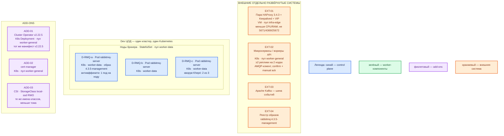

# RabbitMQ 4.3.5 — Dev-контур

Community RabbitMQ **4.3.5**, образ **`rabbitmq:4.3.5-management`**, Cluster Operator **v2.22.5**. Контур: **Dev**. Это **уменьшенный Prod**, не другой вид инсталляции: тот же оператор, те же 3 голосующие ноды, тот же `local-ssd`, не один Docker-контейнер и не Compose.

## Допущения

1. Dev — **1 ЦОД**. Stretch нет. ЦОДа бэкапов нет: definitions и снимки PVC остаются на площадке / в контурном сторедже, **вне** голосования Khepri.
2. Тот же механизм, что Prod: Kubernetes + Cluster Operator **v2.22.5**, CR `RabbitmqCluster`, **`spec.replicas: 3`**, **`spec.image: rabbitmq:4.3.5-management`**. Не `docker run` из `RabbitMQ.install.md`, не Docker Compose, не «один под потому что Dev».
3. Уменьшают CPU/RAM/диск и размер PVC, **не** число голосующих. Схема «2 ноды» — другой класс системы (нет majority). Схема «1 нода» доказывает ping, но не выборы лидера quorum queue и не отказ ноды.
4. Пара **HAProxy 3.4.3 + Keepalived + VIP** та же, меньше CPU/RAM у VM входа. VIP = `:6443` TCP passthrough и HTTP(S) край. AMQP **5671/5672** и Erlang **4369/25672** через этот HAProxy не публикуем.
5. Те же имена StorageClass: `local-ssd` (RWO), `shared-fs` (RWX только как исключение). Тома меньше. NFS / `storage: 0` / emptyDir — не этот контур.
6. DNS: внутри CoreDNS / `cluster.local`; снаружи зона `dev.…`. Клиенты по FQDN, не Pod IP.
7. cert-manager нужен оператору 2.20+, как в Prod. Совместимость оператора с Kubernetes: вендор тестировал **1.29–1.32**, заявил **1.31+**; контур **1.36.4** в списке прогона не назван.
8. Учебные учётки `app` / `dev` и публикация портов на `127.0.0.1` из install.md — **только закрытый личный стенд**, не этот контур. Здесь TLS, свои пользователи, Secret/Vault.
9. Нагрузка не замерена. Чеклист явно разрешает **более слабую** машину для QA/dev. Цифры ниже — порядок величины, уточняется замером.
10. Если AMQP-клиентов нет и всё на Kafka — кластер можно не ставить. Если ставите — тройка, не одиночка.

## Схема инстансов

Тот же вид, что Prod на **одном** ЦОДе: три маленькие ноды `worker-data`, на каждой — один под брокера.

ОС — свойство платформы, не пода. Один стандарт Linux на всех нодах контура.

Исключение вендора по ОС ноды то же, что Prod: дистрибутив задаёт платформа; в образе — Erlang **27.x**. Не подменять тройку оператора одним контейнером Docker Desktop.

| Имя пула | Роль | Зачем выделен |
|---|---|---|
| `infra-edge` | edge-VM | Та же пара HAProxy + Keepalived + VIP, меньше CPU/RAM. AMQP на VIP не публикуем. |
| `worker-data` | data-localdisk | Три **маленькие** ноды: поды брокера. `local-ssd` RWO, не NFS. Не схлопывать в одну ноду «потому что Dev». |
| `worker-general` | general | Оператор, cert-manager, клиенты. Stateless на Dev — минимум 2 реплики на 2 нодах, чтобы отказ одной ноды и балансировка были того же типа, что в Prod. |

## Комментарии к схеме

### Чем Dev не является

Одиночный `docker run -p 127.0.0.1:5672:5672 -p 127.0.0.1:15672:15672 rabbitmq:4.3.5-management` из `RabbitMQ.install.md` — учебный ноутбук. Он не воспроизводит: кворум Khepri, выборы лидера quorum queue, confirm через majority, антиаффинити, PVC `local-ssd`, отказ ноды, TLS, rolling оператора. Dev-контур платформы этот quickstart **не** использует.

Compose в Dev тоже нет: это был бы другой вид инсталляции, чем Prod.

### EXT-01 — пара HAProxy + VIP

- **Функционал.** Тот же вход, что в Prod (`:6443`, HTTP(S) край), меньшие VM.
- **Критично.** Не публиковать 5672 «на все интерфейсы, чтобы с ноутбука». Клиенты Dev — FQDN зоны `dev.…` на Service, как в Prod. Management через край HTTPS, не 15672 в интернет.

### EXT-02 — приложения

- **Функционал.** Тот же AMQP-клиент: confirm + manual ack, имена объектов из git.
- **Критично.** ≥2 реплики воркеров на 2 нодах `worker-general`. Иначе не поймаете ошибку балансировки/отказа, которая есть на Prod. Пароль `dev` из туториала сюда не копировать.

### ADD-01 — Cluster Operator v2.22.5

- **Функционал.** Тот же YAML релиза **v2.22.5**, тот же namespace `rabbitmq-system`.
- **Критично.** Не «оператор на Prod, на Dev docker run». Пин образа брокера **4.3.5-management** обязателен и здесь: иначе оператор поставит **4.3.4**. Pause reconciliation перед апгрейдом оператора — то же правило.

### ADD-03 — `local-ssd`

- **Функционал.** Тот же класс, меньший `spec.persistence.storage`.
- **Критично.** Не `storage: 0` «чтобы быстрее». Без диска не проверяется resync реплики после рестарта пода — а на Prod это основной failure mode.

### D-RMQ-a..c — ноды брокера

- **Функционал.** Те же роли, что Prod: AMQP, Khepri, quorum queue, management в том же процессе.
- **Критично.** Три маленьких пода, anti-affinity 1 под на ноду, `default_queue_type = quorum`, PDB `maxUnavailable: 1`, StatefulSet **Parallel** (это дефолт оператора — не переключать на OrderedReady). TLS и свои пользователи, не `guest`.

### Ёмкость (порядок величины)

Чеклист: для QA/dev допустима машина слабее боевого минимума 4 CPU / 4 ГиБ. Дефолт ресурсов CR оператора (**1 CPU request / 2 GiB**) ближе к Dev, чем к Prod — на Dev его можно оставить как стартовый порядок, на Prod нельзя. Дескрипторов файлов чеклист просит **≥ 50k и на разработке**.

| Инстанс | Порядок величины | Пометка |
|---|---|---|
| Под `rabbitmq-server` | **1–2 vCPU, 2–4 ГиБ RAM**; диск `local-ssd` — **десятки ГиБ** | Уточняется замером. Не 50 МБ `disk_free_limit` как в туториале — даже на Dev ставить порог порядка watermark памяти. |
| Ноды `worker-data` | **3** маленьких, не 1 | Антиаффинити кворума. |

Не обещать «хватит для терабайт». Не включать сразу 5 нод «как в бою после роста».

## Путь роста

Совпадает с Prod, только ёмкость меньше.

1. Сначала вертикаль маленькой ноды.
2. Потом 3 → 5 в том же ЦОДе, если Dev это воспроизводит. Downscale оператор не делает.
3. Отдельный кластер по контуру — если появился второй домен очередей, не «потому что не хватило одной ноды».
4. Shovel/Federation на Dev имеет смысл только как проверка моста, не как замена третьей ноды.

## Сильные и слабые места; критичные условия

**Сильное:** тот же оператор, та же тройка, тот же диск — ошибка накатки, антиаффинити и quorum на Dev выглядит как на Prod.

**Слабое:** один ЦОД; меньшая RAM раньше упрётся в watermark; учебный однонодовый путь рядом в install.md легко спутать с этим контуром.

**Критично:**

- Не один Docker / не Compose / не 2 ноды.
- Не дефолт образа **4.3.4**.
- Не копировать пароль `dev` и `-p 5672:5672` без bind на loopback «как Dev платформы».
- Не stretch (и так один ЦОД).
- 5672/15672 не в интернет.

## Источники

Те же страницы, что у Prod; отличие Dev — «lower-spec … QA and development» в чеклисте, не другой способ установки.

- Релиз 4.3.5: https://github.com/rabbitmq/rabbitmq-server/releases/tag/v4.3.5
- Production checklist (боевой минимум vs QA/dev, `disk_free_limit`, ≥50k дескрипторов): https://www.rabbitmq.com/docs/production-checklist
- Clustering / RTT / Shovel: https://www.rabbitmq.com/docs/clustering
- Cluster Operator v2.22.5: https://github.com/rabbitmq/cluster-operator/releases/tag/v2.22.5
- Установка оператора: https://www.rabbitmq.com/kubernetes/operator/install-operator
- Using Operator: https://www.rabbitmq.com/kubernetes/operator/using-operator
- Образ: https://hub.docker.com/_/rabbitmq
- Учебный одиночный контейнер (не этот контур): `Out/Бэкенд/RabbitMQ/RabbitMQ.install.md`
- Prod-инструкция (эталон роль-модели): `sample2/RabbitMQ.prod.md`
