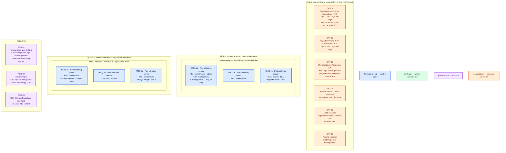

# RabbitMQ 4.3.5 — Prod-контур

Community RabbitMQ **4.3.5** (MPL-2.0, не Tanzu), образ **`rabbitmq:4.3.5-management`** (внутри Erlang **27.x**). Управление кластером — официальный **Cluster Operator v2.22.5**. Контур: **Prod**. Очередь задач / AMQP, не шина событий (это Kafka) и не эталон карточки.

**Cluster Operator** — отдельное ПО: читает объект `RabbitmqCluster` в Kubernetes и держит StatefulSet, Service и секреты. **Нода RabbitMQ** — процесс `rabbitmq-server` в Erlang VM, один под = один член кластера со своим диском. **Khepri** — встроенное хранилище метаданных на Raft (определения очередей, пользователи, права); внешнего сервера БД нет. **Quorum queue** — реплицируемая очередь: confirm клиенту, когда большинство копий записало на диск. **Shovel / Federation** — плагины асинхронного копирования между *разными* кластерами, без общего кворума.

## Допущения

1. Версия брокера **4.3.5**, оператор **v2.22.5**. Образ пинить в `spec.image`: **`rabbitmq:4.3.5-management`**. Дефолт оператора на дату релиза v2.22.5 — **4.3.4**; без пина получите не тот патч. Не `latest`, не `4-management`, не `4.3`. https://github.com/rabbitmq/cluster-operator/releases/tag/v2.22.5 · https://hub.docker.com/_/rabbitmq
2. Prod: **2 прикладных ЦОДа** + **1 ЦОД под бэкапы**. Stretch одного кластера (Khepri / quorum queue Raft) между ЦОДами **нет**: RTT не измерен. Вендор при p99 RTT **> 100 мс** или потерях пакетов кластер **не рекомендует** — тогда отдельные кластеры и Shovel/Federation. https://www.rabbitmq.com/docs/clustering
3. В каждом прикладном ЦОДе — **свой** Kubernetes и **свой** живой кластер из **3 нод**. Между площадками — независимый брокер; мост Shovel/Federation только при подтверждённом межплощадочном AMQP-потоке, не «на всякий случай».
4. Официальный оператор есть, сырые диски не нужны → **Kubernetes**, не пакеты на VM и не Docker Compose. Запасной боевой путь (если оператора/K8s нет): пакеты `rabbitmq-server` на Linux-VM (systemd), та же тройка в одном ЦОДе. Compose — не прод.
5. На каждом прикладном ЦОДе пара **HAProxy 3.4.3 + Keepalived + VIP**. VIP = ControlPlaneEndpoint Kubernetes `:6443` (TCP passthrough) и край HTTP(S). AMQP **5671/5672**, Erlang **4369/25672** и Kafka `:9092` через этот HAProxy **не** публикуем.
6. Диски: StorageClass **`local-ssd`** (RWO, локальный SSD, CSI) на каждую ноду свой PVC. **`shared-fs`** (RWX) для RabbitMQ не используем. NFS как диск ноды — нет (распределённая ФС ломает семантику `fsync`; общий каталог нескольких нод вендор запрещает). https://www.rabbitmq.com/docs/production-checklist
7. DNS: внутри CoreDNS / `cluster.local`. Снаружи зона `prod.…`. Клиенты по FQDN Service, не по Pod IP.
8. Нагрузка не замерена. Ниже — минимальная отказоустойчивая топология и порядок величины, не смета «хватит на терабайты». Терабайты озера в очередях не держат: после ack сообщения в брокере нет.
9. Если все нужные потоки уже на Kafka и AMQP-клиентов нет — кластер **можно не ставить**. Роль: очереди работ, не замена Kafka.
10. Cluster Operator **2.20+** требует **cert-manager** в кластере. Версию cert-manager страница установки оператора не пинит. https://www.rabbitmq.com/kubernetes/operator/install-operator
11. Совместимость оператора: «Kubernetes 1.31 или новее»; тестировали **v1.29–v1.32**. Контур платформы — **1.36.4**: это «новее», но в списке прогона вендора **1.36 нет**. https://www.rabbitmq.com/kubernetes/operator/install-operator
12. Сеть (VLAN, IP-план) вне рамок. Community, не Tanzu.

## Схема инстансов

Без потоков данных. ЦОД-1 и ЦОД-2 — две копии одной роль-модели, разные Erlang cookie, разные PKI, разные VIP. ЦОД-бэкапы в кворум **не** входит.

ОС — свойство платформы, не пода. Один стандарт Linux на всех нодах контура.

Отдельного требования вендора к дистрибутиву ноды Kubernetes нет: Linux задаёт платформа. Образ брокера уже содержит Erlang **27.x**; свой Erlang младше 27.0 нода не стартует. Erlang **28** на живом кластере 4.3.5 не ставить (только новые кластеры). https://www.rabbitmq.com/docs/which-erlang

| Имя пула | Роль | Зачем выделен |
|---|---|---|
| `infra-edge` | edge-VM | Пара HAProxy + Keepalived + VIP: ControlPlaneEndpoint `:6443` и HTTP(S) край. AMQP и Erlang-порты сюда не публикуем. |
| `worker-data` | data-localdisk | Три ноды на прикладной ЦОД под поды `rabbitmq-server`. Нужен локальный SSD (`local-ssd`, RWO) на каждый PVC; общий диск нескольких нод запрещён. |
| `worker-general` | general | Cluster Operator, cert-manager, прикладные AMQP-клиенты. На схему данных брокера не сажаем. |

## Комментарии к схеме

Цвета для этого продукта: **синий** — голосующие ноды брокера (Khepri и реплики quorum queue на тех же трёх подах; отдельного data-only процесса нет). **Зелёный** — на схеме пуст: рабочей роли «не голосует» у RabbitMQ нет. **Фиолетовый** — оператор, cert-manager, CSI. **Оранжевый** — VIP, другие продукты, ЦОД бэкапов, реестр.

### EXT-01 / EXT-02 — пара HAProxy + Keepalived + VIP

- **Функционал.** Вход в Kubernetes API и HTTP(S) край площадки. VIP = ControlPlaneEndpoint (`:6443`, TCP passthrough). Management UI при необходимости — HTTPS через край `:443` (Ingress/Gateway), не «сырой 15672 в интернет».
- **Критично.** AMQP **5671/5672**, epmd **4369**, Erlang distribution **25672**, репликация stream **6000–6500** через этот HAProxy **не** публикуем. Клиенты AMQP ходят на FQDN Service оператора (`ClusterIP` по умолчанию), не на VIP входа и не на Pod IP. Kafka `:9092` сюда тоже не публикуем. Порты **4369/25672** с cookie = административный доступ; в публичную сеть нельзя. https://www.rabbitmq.com/docs/networking

### EXT-03 — приложения

- **Функционал.** Публикация задачи в **exchange**, ожидание в **очереди**, competing consumers (одно сообщение — одному воркеру). Протокол AMQP 0-9-1 / 1.0, в бою порт **5671/TCP** + TLS.
- **Критично.** Publisher **confirm** и **manual ack** в коде. Без confirm клиент не знает, дошло ли. Auto-ack теряет сообщение, если воркер умер на полуслове. Имена vhost / exchange / очередей — в git; пароли — в Secret/Vault. Отдельный пользователь на приложение. Не писать бизнес-события платформы в Rabbit вместо Kafka. https://www.rabbitmq.com/docs/confirms

### EXT-04 — Kafka

- **Функционал.** Шина событий платформы. Не зависит от решения по RabbitMQ.
- **Критично.** Stream в RabbitMQ (порты 5552/5551) — не «Kafka внутри Rabbit»; на старте не включаем как замену шины.

### EXT-05 — ЦОД бэкапов

- **Функционал.** Выгрузка **definitions** (vhost, пользователи, очереди, политики — JSON) и/или снимки PVC нод **вне** живого кворума. Реплика quorum queue — не бэкап: удаление после ack тоже «успех».
- **Критично.** Не четвёртая нода Raft и не stretch. Тела сообщений брокер на диске **не** шифрует: шифрование тома (LUKS и т.п.) или на клиенте до publish. https://www.rabbitmq.com/docs/production-checklist

### ADD-01 — Cluster Operator v2.22.5

- **Функционал.** Ставит и сопровождает `RabbitmqCluster`: StatefulSet (политика подов **Parallel**), Service клиентам, headless Service нодам (`*:4369`), Secret учётки и Erlang cookie. Не хранит ваши очереди.
- **Критично.** Манифест **конкретного** релиза, не `releases/latest`: `https://github.com/rabbitmq/cluster-operator/releases/download/v2.22.5/cluster-operator.yml`. Перед апгрейдом оператора — pause reconciliation (`rabbitmq.com/pauseReconciliation=true`): апгрейд v2.22.5 **катит** существующие кластеры (rolling StatefulSet). Дефолт манифеста оператора — **1 реплика** Deployment. `spec.replicas` брокера по умолчанию **1** — в бою ставить **3**, чётное число вендор крайне не рекомендует. Downscale числа нод оператор **не** делает (кроме scale-to-zero и обратно). https://www.rabbitmq.com/kubernetes/operator/using-operator · https://www.rabbitmq.com/kubernetes/operator/install-operator

### ADD-02 — cert-manager

- **Функционал.** Сертификаты, которых ждёт оператор 2.20+.
- **Критично.** Без него установка v2.22.5 по официальной странице неполная. Версию страница не пинит — брать принятую в контуре.

### ADD-03 — StorageClass `local-ssd`

- **Функционал.** RWO, локальный SSD, CSI, один PVC на под. В CR: `spec.persistence.storageClassName: local-ssd`. Дефолт оператора — класс по умолчанию кластера и **10Gi**; оба для боя не оставлять «как вышло».
- **Критично.** `storage: 0` отключает persistence — для CI, не для Prod. Restart пода без диска = полный resync реплики. `shared-fs` / NFS не используем.

### RMQ-1a..c / RMQ-2a..c — ноды брокера

- **Функционал.** Приём AMQP, маршрутизация, хранение очередей, голос Khepri, реплики quorum queue. Management plugin (UI/HTTP API) и Prometheus plugin живут **в том же** процессе, не отдельным инстансом. Клиент **может** попасть на любую ноду; если это не лидер нужной quorum queue, внутри кластера будет лишний hop.
- **Критично.**
  - **3 ноды в одном ЦОДе**, `spec.affinity` anti-affinity по hostname: не два пода на одну ноду. Два пода в одном зале = HA на бумаге.
  - Образ **`rabbitmq:4.3.5-management`** в `spec.image`. Без суффикса `-management` нет UI/API на 15672/15671.
  - Ресурсы оператора по умолчанию (**1–2 CPU / 2 GiB**) **ниже** боевого минимума чеклиста. В бою задать **не меньше 4 CPU и 4 ГиБ RAM на ноду**, без соседства с I/O-тяжёлыми СУБД. Watermark RAM считать от **лимита контейнера**: оператор режет ~20% (макс. 2 ГиБ) через `total_memory_available_override_value`. https://www.rabbitmq.com/docs/production-checklist · https://www.rabbitmq.com/kubernetes/operator/using-operator
  - `disk_free_limit` завод **50 МБ** — для туториалов. В бою абсолютный порог **примерно как memory watermark** (пример чеклиста: watermark 4 ГиБ → `disk_free_limit.absolute = 4G`).
  - Дескрипторов файлов **не меньше 50 тысяч**; для боя чеклист называет и 500 тысяч как нормальную величину.
  - TLS клиентам: `spec.tls.secretName` + `disableNonTLSListeners: true` (иначе 5672 остаётся открыт). Inter-node TLS — отдельно, вендор рекомендует вне доверенной LAN.
  - Удалить `guest`. Не `ANONYMOUS`. Не `loopback_users = none`.
  - **`default_queue_type = quorum` до** того, как приложения насоздают classic. Classic с 4.0 **не реплицируется**: три ноды ≠ HA classic. Mirroring / `ha-mode` удалены с 4.0. Mnesia и `pause_minority` / `autoheal` удалены в **4.3**. https://www.rabbitmq.com/docs/quorum-queues
  - PodDisruptionBudget: `maxUnavailable: 1` (пример вендора). https://www.rabbitmq.com/kubernetes/operator/using-operator
  - Не переключать StatefulSet на `OrderedReady`: DIY-гайд и сам оператор ставят **Parallel**, иначе deadlock при старте/рестарте всех подов. https://www.rabbitmq.com/docs/install-kubernetes-diy · https://www.rabbitmq.com/docs/clustering
  - Erlang cookie — Secret оператора, не git. NetworkPolicy: 5671 клиентам; 4369/25672/stream-replication только между нодами.
  - Management **не** в интернет.

Оператор создаёт два Service: клиентский (`5672` / при TLS `5671`, management, метрики `15692`) и headless `*-nodes` для Erlang. Тип клиентского по умолчанию **ClusterIP**.

### Ёмкость (порядок величины, не смета «хватит»)

Цифр «хватит трёх нод на вашу нагрузку» у вендора **нет**. Минимум чеклиста — чтобы нода была *production-grade*, не оценка терабайт.

| Инстанс | Порядок величины | Пометка |
|---|---|---|
| Под `rabbitmq-server` | **≥ 4 CPU, ≥ 4 ГиБ RAM** (минимум чеклиста); диск `local-ssd` — **сотни ГиБ** с запасом (quorum queue и stream на диске живут долго) | Уточняется замером публикаций, длины очереди и WAL. Не обещать «хватит для терабайт». |
| Ноды `worker-data` | минимум **3** на прикладной ЦОД, антиаффинити 1 под на ноду | Отказ одной ноды = majority 2 из 3 жива. |
| Под оператора | 200m CPU / 500Mi RAM в манифесте вендора | Не масштабирует ёмкость очередей. |

TLS бьёт по CPU — «включили, скорость та же» неверно. Единица параллелизма **одной** очереди — потребители плюс CPU **лидера**. Больше нод ≠ линейный throughput: метаданные Khepri копируются на каждую ноду синхронно.

## Путь роста

Не включать сразу. Старт — **3 ноды в каждом прикладном ЦОДе**.

1. Упёрлись в CPU/RAM/диск **одной** ноды — сначала вертикаль (лимиты пода и диск `local-ssd`).
2. Потом нечётный шаг **3 → 5** нод в **том же** ЦОДе (`spec.replicas`). Downscale оператор не делает (кроме zero). Чётное число не брать.
3. Много независимых контуров или двузначное число нод — **отдельный кластер** по домену, не «ещё ноды в тот же Raft». Порога «хватит N очередей» в чеклисте нет; в схеме платформы есть ориентир пересмотреть топологию при очень большом числе quorum queue.
4. МежЦОДовый поток — Shovel или Federation на **уже существующих** независимых тройках, не stretch и не «ещё одна нода в чужой зал».
5. Апгрейд брокера — пин патча в `spec.image`, не прыжок через minor «потому что latest».

Добавление пода клиента ёмкость очередей не увеличивает.

## Сильные и слабые места; критичные условия

**Сильное:** официальный оператор и образ; тройка переживает отказ одной ноды при quorum queue; confirm не платит межЦОдовый RTT; тот же вид инсталляции, что будет на Dev.

**Слабое:** смерть ЦОДа = простой локальных очередей до переключения клиентов (и моста, если он был). RPO межплощадочного Shovel ≠ 0, возможны дубли. Classic на трёх нодах всё равно однонодовая. Два кластера = два cookie, два upgrade.

**Критично (даже если не спрашивали):**

- Не stretch на 2–3 ЦОДа при неизвестном RTT; при p99 > 100 мс / потерях — не кластер, а Shovel/Federation.
- Не один под и не Compose «как прод». Не 2 ноды (нет majority).
- Не дефолт образа оператора **4.3.4** — пинить **4.3.5-management**.
- Не `latest`. Не Erlang 28 на живом 4.3.5. Не NFS/`shared-fs` как диск ноды.
- 5671/15671/4369/25672 не в интернет. Не `guest` с мира.
- Не classic mirrored как норма 4.x — этой функции больше нет.
- Учебный `docker run` / пароль `dev` из `RabbitMQ.install.md` в бой не копировать.

## Источники

- Релиз 4.3.5: https://github.com/rabbitmq/rabbitmq-server/releases/tag/v4.3.5
- Матрица Erlang (4.3.5 → 27.x; 28 — только новые кластеры): https://www.rabbitmq.com/docs/which-erlang
- Clustering, таблица RTT, Shovel/Federation, «два ЦОДа недостаточно для stretch»: https://www.rabbitmq.com/docs/clustering
- Production checklist (4 CPU / 4 GiB, диск, NAS, 50k дескрипторов, `disk_free_limit`, guest, at-rest): https://www.rabbitmq.com/docs/production-checklist
- Quorum queues; mirroring удалён: https://www.rabbitmq.com/docs/quorum-queues
- Networking и порты: https://www.rabbitmq.com/docs/networking
- TLS: https://www.rabbitmq.com/docs/ssl
- Confirms / ack: https://www.rabbitmq.com/docs/confirms
- Образ `rabbitmq:4.3.5-management`: https://hub.docker.com/_/rabbitmq
- Обзор операторов: https://www.rabbitmq.com/kubernetes/operator/operator-overview
- Установка оператора (пин релиза, не latest; cert-manager 2.20+; совместимость K8s): https://www.rabbitmq.com/kubernetes/operator/install-operator
- Релиз Cluster Operator v2.22.5: https://github.com/rabbitmq/cluster-operator/releases/tag/v2.22.5
- Using Operator (`replicas`, `image`, persistence, affinity, TLS, override, PDB, pause reconciliation): https://www.rabbitmq.com/kubernetes/operator/using-operator
- DIY Kubernetes, `podManagementPolicy: Parallel`: https://www.rabbitmq.com/docs/install-kubernetes-diy
- Карточка платформы: `Out/Бэкенд/RabbitMQ/RabbitMQ.md`
- Учебный стенд (не копировать в бой): `Out/Бэкенд/RabbitMQ/RabbitMQ.install.md`
