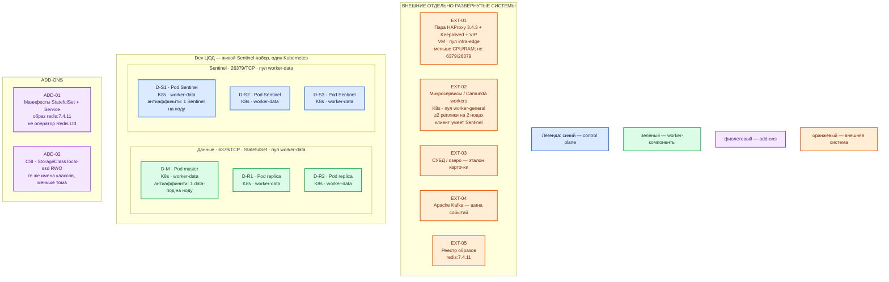

# Redis Community Edition 7.4.11 — Dev-контур

## Допущения

1. Dev — **уменьшенный Prod**, не другой вид инсталляции. Тот же механизм: Kubernetes **StatefulSet**, образ **`redis:7.4.11`**, та же роль-модель **Sentinel × 3 + 1 master + 2 replica**. Не один контейнер `docker run redis`, не Docker Compose, не «два Sentinel».
2. Один прикладной ЦОД. ЦОДа бэкапов нет: локальная копия RDB/AOF на `local-ssd` и выгрузка в контурный объектный сторедж по политике стенда, **вне** голосования Sentinel.
3. Лицензия линии 7.4.x — **RSALv2 или SSPLv1, не BSD.** Та же юридическая развилка, что в Prod: без приёмки RSALv2/SSPL не ставить 7.4.11 «потому что Dev». https://redis.io/legal/licenses/
4. Официального OSS-оператора Redis Ltd нет. Community-оператор — только если его уже прогнали на 7.4.11 и Prod идёт тем же путём. Иначе манифесты StatefulSet, как в Prod.
5. Уменьшают CPU/RAM/диск и размер PVC, **не** число голосующих и не число data-подов. Схема «1 Redis на ноутбуке» доказывает `PING`, но не failover, не антиаффинити и не клиент Sentinel — для воспроизведения боевой ошибки этого мало.
6. Учебные пароли из `Redis 7.install.md` (`dev-app` и т.п.) — **только закрытый личный стенд**, не этот контур. Здесь ACL и секреты как в Prod (Vault / Secret), свои значения.
7. Нагрузка не замерена. В доке Community 7.4 минимума CPU/RAM нет. Цифры ниже — порядок величины, уточняется замером.
8. Клиенты — FQDN зоны `dev.…`, не Pod IP. HAProxy `:6379`/`:26379` не публикует. Stretch нет (один ЦОД).

## Схема инстансов

Тот же вид, что Prod на **одном** ЦОДе: три маленькие ноды `worker-data`, на каждой — data-под и Sentinel.

ОС — свойство платформы, не пода. Один стандарт Linux на всех нодах контура.

### Пулы нод со схемы

| Имя пула | Роль | Зачем выделен |
|---|---|---|
| `infra-edge` | edge-VM | Та же пара HAProxy + Keepalived + VIP, меньше CPU/RAM. Redis на VIP не публикуем. |
| `worker-data` | data-localdisk | Три **маленькие** ноды: data-поды и Sentinel. `local-ssd` RWO, не NFS. Не схлопывать в одну ноду «потому что Dev». |
| `worker-general` | general | Клиенты Redis. Stateless на Dev — минимум 2 реплики на 2 нодах (правило платформы), чтобы отказ одной ноды и балансировка были того же типа, что в Prod. |

## Комментарии к схеме

### Чем Dev не является

Одиночный `docker run -p 127.0.0.1:6379:6379 redis:7.4.11` из `Redis 7.install.md` — учебный ноутбук. Он не воспроизводит: выборы master, кворум из трёх, антиаффинити, Sentinel-клиент, PVC `local-ssd`, отказ ноды. Dev-контур платформы этот quickstart **не** использует.

### EXT-01 — пара HAProxy + VIP

- **Функционал:** тот же вход, что в Prod (`:6443`, HTTP(S) край).
- **Критично:** меньше CPU/RAM у VM, не другая схема (не один HAProxy без Keepalived). `:6379`/`:26379` сюда не вешаем.

### EXT-02 — приложения

- **Функционал:** Sentinel-aware клиент, FQDN зоны `dev.…` на Service Sentinel.
- **Критично:** минимум 2 реплики приложения на 2 нодах. Подключение к одному Pod IP master сводит пользу Sentinel к нулю — как в Prod.

### ADD-01 / ADD-02

- **Функционал:** те же манифесты (или тот же community-оператор, если Prod на нём), те же имена StorageClass.
- **Критично:** меньше `requests`/`limits` и размер PVC. Не менять StatefulSet на Deployment из одного пода и не переносить данные на `shared-fs`.

### D-M, D-R1, D-R2 — data-поды

- **Функционал:** один writer + две async replica, порт **6379**. Persistence (RDB/AOF) включена по той же политике, что Prod: иначе не поймаете failure mode «пустой master стёр replica».
- **Критично:** три пода на три ноды, антиаффинити. Не «master+replica на одной VM». `maxmemory` меньше, чем в Prod, но **задан** (без него съест RAM ноды). Кэш и локи — по-прежнему разные наборы, если оба класса ключей есть на Dev.

### D-S1, D-S2, D-S3 — Sentinel

- **Функционал:** порт **26379**, кворум **2**, majority из трёх.
- **Критично:** **не уменьшать до 2 или 1.** Два Sentinel — другой класс системы (официально *DON'T DO THIS*), а не «маленький Prod». Docker/NAT remap на Dev тоже ломает discovery — те же Service/DNS, без проброса портов. https://redis.io/docs/latest/operate/oss_and_stack/management/sentinel/

### Ёмкость (порядок величины)

В доке Community 7.4 минимума нет. Учебный ориентир карточки `sample/Redis 7.md` (1 vCPU / 512 МиБ / 1 ГиБ) — для **одного** процесса на ноутбуке, не смета этого контура.

| Инстанс | Порядок величины Dev | Относительно Prod |
|---|---|---|
| Data-под | 1–2 vCPU; **единицы ГиБ** RAM; PVC `local-ssd` единицы ГиБ | Тот же вид, меньше том и `maxmemory` |
| Sentinel-под | доля vCPU; сотни МиБ RAM | Число подов то же: **3** |
| Ноды `worker-data` | **3** маленькие VM | Не 1 и не 2 |

Уточняется замером. Не копировать ядра/ГиБ из Redis Software.

## Путь роста

На Dev рост не планируем как отдельную ёмкость. Если на Prod уходите в Cluster — Dev повторяет **Cluster той же формы** (несколько маленьких master+replica в одном ЦОДе), а не остаётся на одиночке. Пока Prod на Sentinel — Dev на Sentinel × 3.

## Сильные и слабые места; критичные условия

**Сильное:** можно воспроизвести отказ ноды, выборы master и поведение Sentinel-клиента; те же имена StorageClass, тот же образ, та же лицензионная модель.

**Слабое:** маленький `maxmemory` быстрее упирается в eviction; нет второго ЦОДа — межплощадочный DR на Dev не доказывается (и не должен: в Prod stretch тоже запрещён).

**Критично:**

- Лицензия **RSALv2/SSPL**.
- Sentinel **× 3, не 2 и не один docker redis**.
- Нет официального OSS-оператора Redis Ltd — не делать вид, что на Dev «проще поставить оператор Enterprise».
- Не `latest`, не 6379 в сеть, не NFS, не учебный пароль из install-карточки.
- Клиент умеет Sentinel. Persistence на всех трёх data-подах.

## Источники

- Релиз 7.4.11: https://github.com/redis/redis/releases/tag/7.4.11
- Лицензии: https://redis.io/legal/licenses/
- Образ `redis:7.4.11`: https://hub.docker.com/_/redis
- Sentinel (не два, majority, Docker/NAT): https://redis.io/docs/latest/operate/oss_and_stack/management/sentinel/
- Репликация: https://redis.io/docs/latest/operate/oss_and_stack/management/replication/
- Persistence: https://redis.io/docs/latest/operate/oss_and_stack/management/persistence/
- Память: https://redis.io/docs/latest/operate/oss_and_stack/management/optimization/memory-optimization/
- Не NFS: https://redis.io/docs/latest/operate/oss_and_stack/management/optimization/benchmarks/
- `redis.conf` 7.4: https://github.com/redis/redis/blob/7.4/redis.conf
- Community-оператор (не Redis Ltd): https://github.com/OT-CONTAINER-KIT/redis-operator
- Учебный одиночный Docker (не этот контур): `Out/БД и хранилища/Redis 7/Redis 7.install.md`
- Карточка: `Out/БД и хранилища/Redis 7/Redis 7.md`
- Prod этой пары: `sample2/Redis 7.prod.md`
