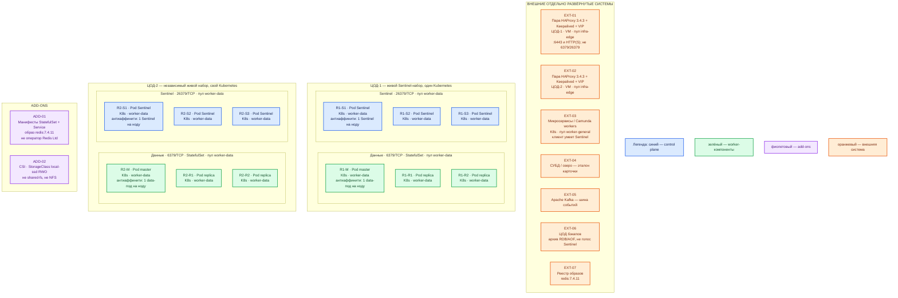

# Redis Community Edition 7.4.11 — Prod-контур

## Допущения

1. Версия **7.4.11**, официальный образ `redis:7.4.11`, не `7.4` / `7` / `latest`. Релиз: https://github.com/redis/redis/releases/tag/7.4.11
2. **Лицензия линии 7.4.x — RSALv2 или SSPLv1, не BSD-3-Clause.** Юристы контура принимают одну из двух. Если нет — не ставить 7.4 «молча»: смотреть 7.2.16 (BSD) или Valkey. AGPLv3 как третья опция относится к линии **8+**, не к 7.4. https://redis.io/legal/licenses/
3. Prod: **2 прикладных ЦОДа** + **1 ЦОД под бэкапы**. Stretch одного Sentinel-набора (и Redis Cluster) между ЦОДами **нет**: порога RTT в документации Community нет. https://redis.io/docs/latest/operate/oss_and_stack/management/sentinel/
4. В каждом прикладном ЦОДе — **свой** Kubernetes и **свой** живой набор Redis. Между площадками — независимый кэш (прогрев с эталона) или холодная копия **вне голосования** Sentinel. Replica в другом ЦОДе в кворум **не** входит.
5. Минимальная HA внутри ЦОДа — **Sentinel**, не Cluster: один writer, рабочий набор влезает в RAM одного master. Cluster — путь роста, не стартовая схема. Sentinel и Cluster на одном наборе данных **не** сочетают. https://redis.io/docs/latest/operate/oss_and_stack/management/sentinel/
6. **Официального OSS-оператора у Redis Ltd нет** (их оператор — Enterprise). Боевой путь: Kubernetes **StatefulSet** + официальный образ. Community-оператор (OT-CONTAINER-KIT) — только после прогона именно 7.4.11 на стенде, не как «официальный». Запасной боевой путь: пакеты `redis-server` на Linux-VM (systemd), та же роль-модель. Не Docker Compose. https://github.com/OT-CONTAINER-KIT/redis-operator
7. Redis — кэш, сессии, короткие локи, идемпотентность. **Не** эталон карточки (это СУБД/озеро). **Не** шина событий (это Kafka). Репликация **асинхронная**: клиент может получить OK до догона replica. https://redis.io/docs/latest/operate/oss_and_stack/management/replication/
8. Нагрузка не замерена. Цифр «хватит N ядер / N ГиБ» в мануале Community 7.4 **нет**. Ёмкость ниже — порядок величины платформы, уточняется замером ключей. Терабайты озера в Redis не кладут.
9. Кэш с вытеснением и локи «не вытеснять» — **разные** наборы (два независимых Sentinel-комплекта той же формы), не один процесс на всех. На схеме показан один комплект на ЦОД; второй заводится той же роль-моделью при появлении обоих классов ключей.
10. Сеть (VLAN, IP-план) вне рамок. Клиенты ходят по FQDN зоны `prod.…`, не по Pod IP. Порты **6379** и **26379** через платформенный HAProxy **не** публикуем: обычный TCP-балансировщик на все 6379 ломает модель (запись может попасть на replica).

## Схема инстансов

ОС — свойство платформы, не пода. Один стандарт Linux на всех нодах контура.

### Пулы нод со схемы

| Имя пула | Роль | Зачем выделен |
|---|---|---|
| `infra-edge` | edge-VM | Пара HAProxy + Keepalived + VIP на ЦОД: ControlPlaneEndpoint Kubernetes `:6443` и край HTTP(S). Redis сюда не публикуем. |
| `worker-data` | data-localdisk | Три ноды на прикладной ЦОД: поды `redis-server` и Sentinel. Нужен локальный SSD (`local-ssd`, RWO) под RDB/AOF; NFS как диск Redis не используем. |
| `worker-general` | general | Прикладные клиенты Redis (микросервисы, Camunda workers). На схему Redis-данных не сажаем. |

## Комментарии к схеме

### Как читать цвета

Синий — голосующие роли продукта (Sentinel). Зелёный — data-инстансы (`redis-server` master/replica). Фиолетовый — способ постановки и диск (манифесты, CSI). Оранжевый — внешнее: VIP, другие продукты, ЦОД бэкапов.

### EXT-01 / EXT-02 — пара HAProxy + Keepalived + VIP

- **Функционал:** вход в Kubernetes API и HTTP(S) край площадки. VIP = ControlPlaneEndpoint (`:6443`, TCP passthrough).
- **Критично:** клиенты Redis **не** ходят на этот VIP за `:6379` / `:26379`. Балансировщик «на все 6379» без Sentinel-aware клиента отправит запись на replica. Kafka `:9092` через этот HAProxy тоже не публикуем (правило платформы).

### EXT-03 — приложения

- **Функционал:** микросервис — клиент Redis (Lettuce, Jedis, redis-py, StackExchange.Redis). Спрашивает Sentinel на **26379** «кто сейчас master», затем команды на **6379**. Промах кэша → читать эталон (EXT-04), не «клиента нет».
- **Критично:** захардкоженный Pod IP / IP текущего master переживает только одиночку. После failover клиент обязан заново спросить Sentinel. FQDN зоны `prod.…` на Service Sentinel, не Pod IP. ACL-пользователь приложения с префиксом ключей; `FLUSHALL` / `CONFIG` / `EVAL` боевой роли не давать. AUTH без TLS идёт открытым текстом.

### EXT-04 / EXT-05 — эталон и шина

- **Функционал:** PostgreSQL/озеро хранит карточку; Kafka везёт события. Redis Pub/Sub и Streams платформенную Kafka не заменяют.
- **Критично:** потеря ключа, eviction, `FLUSHALL` или хвост async-failover истину не берегут.

### EXT-06 — ЦОД бэкапов

- **Функционал:** проверенные копии RDB (снимок набора) и/или AOF (журнал изменений) вне нод Redis. Реплика — не бэкап: удаление тоже копируется.
- **Критично:** не третий Sentinel и не Cluster-master кворума. Restore проверять. Пустой авторестарт master без persistence **стирает replica** — официальный failure mode. https://redis.io/docs/latest/operate/oss_and_stack/management/replication/

### ADD-01 — манифесты StatefulSet

- **Функционал:** желаемое состояние подов с стабильными именами и PVC. Образ **`redis:7.4.11`**.
- **Критично:** официального OSS-оператора Redis Ltd нет. Не подменять Compose. Community-оператор — только после стенда на 7.4.11. `latest` на Hub указывает на другую мажорную линию, не на 7.4.11. https://hub.docker.com/_/redis

### ADD-02 — StorageClass `local-ssd`

- **Функционал:** RWO, локальный SSD, CSI, для PVC data-подов. Имена классов те же, что у платформы.
- **Критично:** `shared-fs` (RWX) для Redis не используем. NFS/NAS под RDB/AOF бьёт задержку — вендор так пишет в бенчмарках. https://redis.io/docs/latest/operate/oss_and_stack/management/optimization/benchmarks/

### R1-M / R2-M — master (`redis-server`)

- **Функционал:** единственный writer своего набора. Ключи в RAM. Порт **6379/TCP**. Persistence: RDB и AOF (в Redis 7 AOF из нескольких частей). Заводской AOF выключен (`appendonly no`) — в бою включать по политике набора. https://github.com/redis/redis/blob/7.4/redis.conf
- **Критично:** `maxmemory` задать после оценки ключей; без него процесс ест свободную RAM. Политика вытеснения для кэша (LRU/LFU) и `noeviction` для локов — **разные** наборы. Persistence на master **и** replica. Protected mode не снимать «чтобы завелось» на опубликованном порту. **6379 не в интернет.** В официальном образе protected mode выключен — bind/NetworkPolicy/ACL обязательны. TLS для клиентов и репликации — отдельно, в заводе выключен.

### R1-R1, R1-R2 / R2-R1, R2-R2 — replica

- **Функционал:** асинхронная копия master (`replicaof`). Чтение с лагом; запись принимает только master. Может быть повышена Sentinel.
- **Критично:** `replica-read-only` по умолчанию yes. Две replica — чтобы после падения master осталась копия. Антиаффинити: не две data-реплики на одну ноду. Replica **другого ЦОДа** в Sentinel этого набора не добавлять.

### R1-S1..S3 / R2-S1..S3 — Sentinel

- **Функционал:** отдельные процессы на **26379/TCP**. Не хранят ключи и не стоят в пути команд. Наблюдают master/replica, голосуют, при большинстве повышают replica. Клиент спрашивает их, кто writer.
- **Критично:** минимум **3** Sentinel, кворум **2**. Два процесса официально *DON'T DO THIS*: нет majority — failover не стартует или получаете split-brain. Ставить на **три разные ноды** (`anti-affinity`). Docker/NAT с пробросом портов ломает autodiscovery Sentinel — в Kubernetes не публиковать Sentinel через NodePort/remap; Service + DNS, без смены порта. Живой набор — **один ЦОД**. https://redis.io/docs/latest/operate/oss_and_stack/management/sentinel/

Практически на ЦОД: **3 ноды `worker-data`**. На каждой — один data-под и один Sentinel (официальный ориентир «три разные машины»). Планировщик двигает поды по пулу; на схеме не фиксируем «под на ноде 3».

### Ёмкость (порядок величины, не смета вендора)

В доке Community 7.4 минимума CPU/RAM/диска «чтобы процесс поднялся» **нет**. https://redis.io/docs/latest/operate/oss_and_stack/management/optimization/memory-optimization/

| Инстанс | Порядок величины | Пометка |
|---|---|---|
| Data-под (master/replica) | 2–4 vCPU; **десятки ГиБ RAM** (рабочий набор + запас на replica и copy-on-write снимок); диск `local-ssd` — десятки ГиБ под RDB/AOF | Уточняется замером ключей. Команды в основном однопоточны; `io-threads` — сеть, не «многоядерный Redis как СУБД». |
| Sentinel-под | ~0.5–1 vCPU; сотни МиБ RAM; диск не для пользовательских ключей | Не масштабирует ёмкость данных. |
| Ноды `worker-data` | минимум **3** на прикладной ЦОД | Антиаффинити кворума и data-подов. |

Цифры Redis Software (другой продукт) на Community не переносить. Не обещать «хватит для терабайт».

## Путь роста

Не включать сразу. Стартовая схема — Sentinel внутри ЦОДа.

1. Уперелись в **чтение** — добавить replica в том же ЦОДе (ёмкость уникальных ключей не растёт).
2. Уперелись в **RAM одного master** — сначала TTL, eviction, не класть эталон. Если рабочий набор всё равно не влезает — **Redis Cluster целиком в одном ЦОДе** (16384 слота, другой клиент, Sentinel снимают). Новые шарды пустые, пока не reshard. Горячий ключ остаётся на одной ноде.
3. Уперелись в **запись** — replica не ускоряет writer. Горизонталь записи — только Cluster или **второй независимый набор** (например локи отдельно от кэша UI).
4. Второй прикладной ЦОД уже есть как независимый кэш, не как голос первого.

## Сильные и слабые места; критичные условия

**Сильное:** микролатентность из RAM; HA без шардов внутри ЦОДа (3 Sentinel переживают падение пода master); ACL из коробки 7.4; тот же вид инсталляции, что будет на Dev.

**Слабое:** не источник истины; async-потеря хвоста при failover; один writer, потолок = RAM одной машины; stretch запрещён — смерть ЦОДа = простой Redis этой площадки до ручного DR / прогрева кэша с эталона.

**Критично (даже если не спрашивали):**

- Лицензия **RSALv2/SSPLv1**, не BSD. Без юридической приёмки — не 7.4.11.
- Sentinel **минимум 3 в одном ЦОДе, не 2**.
- Нет официального OSS-оператора Redis Ltd.
- Не публиковать 6379/26379 в интернет; не `latest`; не NFS под данные; не Compose в бою.
- Клиент умеет Sentinel. Persistence на master и replica.
- Не один процесс «и кэш дашбордов, и локи платежей».
- Не растягивать кворум на 2–3 ЦОДа.

## Источники

- Релиз 7.4.11: https://github.com/redis/redis/releases/tag/7.4.11
- Лицензии (7.4 = RSALv2 или SSPLv1; ≤7.2 = BSD-3; 8+ = ещё AGPLv3): https://redis.io/legal/licenses/
- Образ `redis:7.4.11`, protected mode в образе, `latest` ≠ 7.4.11: https://hub.docker.com/_/redis
- Sentinel: минимум 3, majority, не два, Docker/NAT: https://redis.io/docs/latest/operate/oss_and_stack/management/sentinel/
- Репликация async, пустой master стирает replica, `WAIT`: https://redis.io/docs/latest/operate/oss_and_stack/management/replication/
- Persistence RDB/AOF: https://redis.io/docs/latest/operate/oss_and_stack/management/persistence/
- Память, нет заводского `maxmemory`: https://redis.io/docs/latest/operate/oss_and_stack/management/optimization/memory-optimization/
- Не NFS/NAS под persistence: https://redis.io/docs/latest/operate/oss_and_stack/management/optimization/benchmarks/
- ACL: https://redis.io/docs/latest/operate/oss_and_stack/management/security/acl/
- Безопасность, protected mode, TLS: https://redis.io/docs/latest/operate/oss_and_stack/management/security/
- Заводской `redis.conf` 7.4 (порты, `appendonly no`): https://github.com/redis/redis/blob/7.4/redis.conf
- Cluster (путь роста, не старт): https://redis.io/docs/latest/operate/oss_and_stack/reference/cluster-spec/
- Community-оператор (не Redis Ltd): https://github.com/OT-CONTAINER-KIT/redis-operator
- Клиенты: https://redis.io/docs/latest/develop/clients/
- Карточка платформы: `Out/БД и хранилища/Redis 7/Redis 7.md`
- Учебный стенд (не копировать в бой): `Out/БД и хранилища/Redis 7/Redis 7.install.md`
