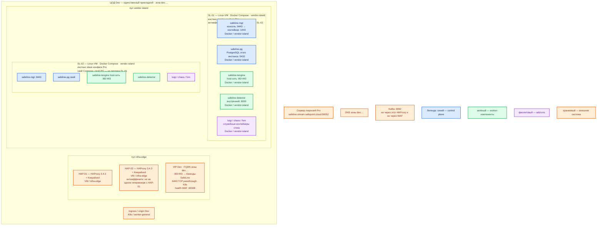

# SafeLine WAF 9.4.0 — Dev

Упрощение Prod: **тот же** вид инсталляции и та же роль-модель. Уменьшаем CPU/RAM/диск, не меняем схему «Linux x86_64 + Docker Compose на двух VM, у каждой свой Postgres».

Это **не** одна учебная VM из `sample/SafeLine WAF.md` и не Community Helm `replicas: 1`. Один инстанс на Dev не воспроизведёт отказ VM, health `:65508` на двух бэкендах и рассинхрон правил.

Обратный прокси-фильтр **HTTP/HTTPS** перед Ingress Dev-зала. Версия **9.4.0**, `REGION=-g`, образы `chaitin/safeline-*`. Контур: **Dev** (1 ЦОД).

**Явное исключение вендора (как в Prod):** официальный путь — Docker Compose, не пакеты systemd «вместо» стека и не Ingress-контроллер. [Deploy](https://docs.waf.chaitin.com/en/GetStarted/Deploy)

## Допущения

1. Контур Dev: **1 ЦОД**. ЦОДа бэкапов нет. Stretch не применим. **Не один Compose на «два зала»** — второго зала нет; на этом зале всё равно **два** независимых Compose, не один файл на две VM.
2. Stateless-шлюз: минимум **2** инстанса на **2** нодах — балансировка нужного типа (HAProxy → два tengine) и отказ одной VM. Схема «1 VM по квикстарту» — другой класс системы.
3. На ЦОДе — та же пара **HAProxy 3.4.3 + Keepalived + VIP**, что Prod (меньше CPU/RAM у пары — в карточке HAProxy). VIP = ControlPlaneEndpoint `:6443` и край HTTP(S). Kafka `:9092` не публикуем. HTTP(S) края → бэкенды SafeLine.
4. DNS — зона `dev.…`. Клиенты по FQDN, не по IP контейнера.
5. SafeLine **рядом** с Kubernetes Dev, пул `vendor-island`. Tengine в host-сети: на WAF-VM свободны **80/443**.
6. Редакция — **Pro**, как Prod: Config Auto Sync master → slave. Схлопывать Dev в Personal «потому что стенд» — другая роль-модель (нет штатного sync). Исходящий `:50052` нужен и на Dev. Offline в Install Guide нет. [License](https://docs.waf.chaitin.com/LicenseDisconnectionInstructions)
7. Ёмкость меньше Prod. Нагрузка не замерена. Минимум вендора 1/1/5 ГБ — «процесс встал», не этот контур. Ориентир FAQ &lt; 100 QPS: **2 CPU / 4 ГБ**. [FAQ](https://docs.waf.chaitin.com/en/faq/home), [sample/SafeLine WAF.md](../sample/SafeLine%20WAF.md)
8. `local-ssd` / `shared-fs` к SafeLine не относятся. Каталог `/data/safeline` — локальный диск, не NFS, меньше том, чем Prod.
9. Те же запреты тегов: не `latest`, не `manager.sh`, не ARM без Pro, не macOS/Windows, не LTS. **x86_64 + SSSE3**.
10. Эталон, который упрощаем: `sample2/SafeLine WAF.prod.md`.

## Схема инстансов

На схеме нет потоков данных. От Prod отличается **числом залов** (один) и **ёмкостью** VM. Число инстансов Compose, свой PG на каждый, host-сеть tengine, пара HAProxy+VIP, порты — те же.

ОС — свойство платформы, не пода. Один стандарт Linux на всех нодах контура. Тот же стандарт, что Prod.

Исключение вендора: хост SafeLine — **Linux x86_64** с **SSSE3**. ARM = Pro; macOS/Windows не поддерживаются. Не ставить Dev на ноутбук с Docker Desktop: вендор хост не поддерживает, и это другой вид инсталляции. [Deploy](https://docs.waf.chaitin.com/en/GetStarted/Deploy), [FAQ](https://docs.waf.chaitin.com/en/faq/home)

Цвета: **синий** — `mgt` и локальный Postgres; **зелёный** — `tengine` / `detector`; **фиолетовый** — служебные контейнеры; **оранжевый** — VIP, HAProxy, Ingress, лицензия, DNS, Kafka.

| Имя пула | Роль | Зачем выделен |
|---|---|---|
| `vendor-island` | vendor | Та же роль, что Prod: две Linux-VM с официальным Compose. Не схлопывать в одну VM и не переносить в `worker-general` как Deployment: вид инсталляции должен совпадать с Prod. |
| `infra-edge` | edge-VM | Та же пара HAProxy + VIP. WAF на эти VM не ставить (80/443). |
| `worker-general` | general | Upstream: Ingress Dev. Не пул контейнеров SafeLine. |

## Комментарии к схеме

### SL-01, SL-02 — полный инстанс Compose

**Функционал.** Как Prod: полный стек на каждой VM, свой `safeline-pg`. Два независимых процесса tengine, склеенные VIP/HAProxy. Master конфига — SL-01, slave — SL-02.

**Способ установки.** Тот же ручной Deploy, те же `.env`-поля, **`IMAGE_TAG=9.4.0`**, `REGION=-g`, `IMAGE_PREFIX=chaitin`. Не копировать в контур команды «учебного стенда» как замену второй VM. `compose.yaml` — с `waf.chaitin.com/release/latest/compose.yaml`, образы пинить тегом, не GitHub `main` как файл релиза (Postgres 15.2 vs 15.18). [Deploy](https://docs.waf.chaitin.com/en/GetStarted/Deploy)

Порты хоста — те же, что Prod: **80, 443, 9443, 65508, 65443**; **5432** не публиковать.

**Критично.** Те же условия, что Prod, в уменьшенном размере:

- Не общая БД двух Dev-VM. Не один `compose.yaml`, который описывает оба зала (второго нет) или обе VM сразу через `network_mode: host` на разных машинах из одного файла оркестрации площадки.
- Консоль 9443 — с VPN Dev, не из интернета. Даже на Dev.
- Upstream = Ingress **этого** Dev-кластера. DNS домена → **VIP**, не IP SL-01.
- PROXY Protocol / `X-Forwarded-For` настроить до банов по IP — иначе на Dev «работают баны», на Prod за HAProxy нет. [FAQ](https://docs.waf.chaitin.com/en/faq/home)
- Origin только с IP двух WAF-VM. Капча не на JSON API.
- `resetadmin` / пароль `.env` — не в git, не «стендовый admin/admin в бой потом перенесём».
- Апгрейд узла рвёт его трафик: на Dev снимать один бэкенд с HAProxy, как в Prod. [Upgrade](https://docs.waf.chaitin.com/en/GetStarted/Upgrade)

**Ёмкость (порядок, уточняется замером).** Меньше Prod, не ниже полосы FAQ для &lt; 100 QPS: порядка **2 vCPU / 4 ГБ RAM** на каждую WAF-VM и **≥ 5 ГБ** свободных на `/data/safeline` (ориентир sample — 5 ГБ; на Dev можно держать том порядка **десятков ГБ**, меньше Prod). Не душить CPU долей ядра «Dev же маленький». В мануале сметы Dev нет. [FAQ](https://docs.waf.chaitin.com/en/faq/home), [sample/SafeLine WAF.md](../sample/SafeLine%20WAF.md)

Антиаффинити: две VM **не** на одном гипервизоре. Иначе отказ хоста = отказ всего WAF, паритет с Prod ломается.

### HAP / VIP — `infra-edge`

**Функционал.** Как Prod: `:80`/`:443` → SL-01 и SL-02, health **:65508**; `:6443` — API Kubernetes Dev.

**Критично.** Не схлопывать Keepalived и не вешать домен сразу на IP одной WAF-VM «на Dev проще»: тогда не проверяются VIP, два бэкенда и drain при апгрейде.

### Ingress / origin

Как Prod, только этот зал.

### Лицензия, DNS, Kafka

Pro `:50052` с обеих Dev-VM. Kafka не через WAF.

## Путь роста

Dev не масштабируем «как бой». Если не хватает CPU детектора — слегка поднять vCPU **обеих** VM (вертикально), не добавлять третий узел «потому что в FAQ так можно» и не схлопывать обратно в одну VM. Горизонтальный рост — путь Prod.

## Сильные и слабые места

**Сильная сторона.** Тот же Compose, те же роли контейнеров, два инстанса, свой PG, host-сеть, VIP и health `:65508`, что Prod: ошибка порта 80/443, рассинхрон правил, отказ одной VM и drain на апгрейде воспроизводятся.

**Слабая сторона.** Один ЦОД: отказа зала нет чем крыть (для Dev приемлемо). Маленькие VM не доказывают CPU детектора боя. Без антиаффинити две VM на одном гипервизоре = скрытая одиночка. Master sync — тот же SPOF на правку политики.

## Критичные условия

- Не одна VM «квикстарт» и не Helm `replicas: 1` «чтобы как в кубере».
- Не уменьшать ферму до **одного** Compose: это не паритет, а другой класс (нет второго бэкенда HAProxy).
- Не один Compose-файл на две VM / два зала.
- Не `IMAGE_TAG=latest`, не открывать 9443/5432 в интернет, даже на Dev.
- Не публиковать Kafka `:9092`.
- Не копировать учебный пароль в этот контур.
- Не Dynamic Protection на машинном API.
- `:50052` нужен, если редакция Pro (как Prod).

## Источники

| Факт | URL |
|---|---|
| Linux, Docker/Compose, `.env`, консоль, `resetadmin` | https://docs.waf.chaitin.com/en/GetStarted/Deploy |
| Domain / Port / Upstream | https://docs.waf.chaitin.com/en/GetStarted/AddApplication |
| Апгрейд, бэкап каталога | https://docs.waf.chaitin.com/en/GetStarted/Upgrade |
| 9.4.0; Config Auto Sync; PROXY Protocol | https://docs.waf.chaitin.com/en/Reference/Changelog |
| FAQ: 2 CPU / 4 ГБ; порты 9443 / 65508 / 65443 | https://docs.waf.chaitin.com/en/faq/home |
| Лицензия `:50052` | https://docs.waf.chaitin.com/LicenseDisconnectionInstructions |
| Host-сеть tengine | https://github.com/chaitin/SafeLine/blob/main/compose.yaml |
| Карточка / учебный стенд | `Out/Безопасность/SafeLine WAF/SafeLine WAF.md`, `SafeLine WAF.install.md`, `sample/SafeLine WAF.md` |
| Prod (эталон) | `sample2/SafeLine WAF.prod.md` |

**В доке вендора нет:** смета ядер Dev; порог RTT; auto-promote; URL health на 65508; offline-лицензия.
