# SafeLine WAF 9.4.0 — Prod

Обратный прокси-фильтр **HTTP/HTTPS** перед приложением площадки: клиент стучится в WAF, тот проверяет запрос и либо отклоняет его, либо передаёт в **upstream** (настоящий сервер; здесь — Ingress **этого** ЦОДа). Это не Ingress-контроллер Kubernetes, не NetworkPolicy и не балансировщик VIP.

Версия **9.4.0** (релиз 17 августа 2026), международная линейка `REGION=-g`, образы `chaitin/safeline-*`. Контур: **Prod** (2 прикладных ЦОДа + 1 ЦОД под бэкапы).

**Явное исключение вендора:** официальный Install Guide — Linux **x86_64** + **Docker Compose** (программа, которая поднимает пачку **контейнеров** — изолированных процессов из **образов**). Community Helm (`replicas: 1`) в Install Guide нет; несколько replica «ломают WAF». Запасной боевой путь платформы «пакеты + systemd, не Compose» **сюда не применяется**: у SafeLine официальный путь — Compose. [Deploy](https://docs.waf.chaitin.com/en/GetStarted/Deploy)

## Допущения

1. Контур Prod: **2 прикладных ЦОДа** + **1 ЦОД под бэкапы**. Stretch одной PostgreSQL / одного Compose на 2–3 зала **нет**: у каждого инстанса свой Postgres, общей БД продукт не даёт, RTT между залами не измерен, порога RTT в доке вендора нет.
2. **Не один Compose на 2 ЦОДа.** Один инстанс = **одна** Linux-VM = **один** `compose.yaml` + свой каталог `/data/safeline` + свой `safeline-pg`. Два зала = две (и более) полные копии стека.
3. На каждом прикладном ЦОДе уже есть пара **HAProxy 3.4.3 + Keepalived + VIP**. VIP = ControlPlaneEndpoint Kubernetes (`:6443`, TCP passthrough) и край HTTP(S) `:80`/`:443`. Kafka `:9092` через этот HAProxy **не** публикуем. HTTP(S) края идёт на бэкенды SafeLine, не напрямую в Ingress.
4. Виртуализация есть. Сеть (VLAN, IP-план) вне рамок. DNS зоны `prod.…`: клиенты по FQDN, не по IP контейнера.
5. Боевые приложения — в **Kubernetes** каждой площадки отдельно. SafeLine стоит **рядом** с кластером, на выделенных Linux-VM пула `vendor-island`, не как Ingress на 80/443 worker-ноды.
6. **Tengine** (форк Nginx, контейнер `safeline-tengine`) в `network_mode: host`: порты **80/443** — порты самой VM. На этой VM нет второго процесса с теми же портами (Ingress, nginx, HAProxy).
7. Редакция боя — **Pro** на каждом узле: штатный **Config Auto Sync** (копирование конфигурации master → slave; это не репликация общей БД и не выборы лидера). Personal официального HA-sync не даёт. Публичная EN-дока не описывает автоматическое повышение slave. [Changelog 7.0.0](https://docs.waf.chaitin.com/en/Reference/Changelog)
8. Лицензия Pro: исходящий **TCP :50052** с контейнера `safeline-mgt` на `safeline.stream.safepoint.cloud`. Offline-схемы в Install Guide **нет**. Вендор из КНР: решение ИБ по телеметрии и `:50052` — **до** закупки. [License](https://docs.waf.chaitin.com/LicenseDisconnectionInstructions)
9. Нагрузка HTTP **не замерена**. Ниже — минимальная отказоустойчивая топология (два независимых инстанса на прикладной ЦОД) и порядок величины CPU/RAM из FAQ, не смета «хватит на терабайты». Терабайты озера на размер WAF не давят; диск едят логи узла.
10. StorageClass `local-ssd` / `shared-fs` к SafeLine **не** относятся: каталог данных — локальный диск VM, не CSI, не NFS (NFS как data dir в мануале **нет**).
11. macOS/Windows вендор не поддерживает. **ARM = Pro**; в этом контуре ставим **x86_64** с флагом CPU **SSSE3**. Не `IMAGE_TAG=latest`, не автоинсталлятор `manager.sh` (он ставит `latest`), не китайский `waf-ce.chaitin.cn`, не LTS (`-lts` не сопровождают с 9.1.0-LTS).
12. Выбор живой **площадки** (город) — DNS / Anycast / внешний вход. Это не функция SafeLine.

## Схема инстансов

На схеме нет потоков данных. ЦОД-1 и ЦОД-2 — две копии одной роль-модели: свой Compose, свой Postgres, свой upstream = Ingress **этого** зала.

```mermaid
flowchart TB
  subgraph DC1["ЦОД-1 — прикладной · зона prod.…"]
    subgraph EDGE1["пул infra-edge"]
      HAP1A["HAP-1a — HAProxy 3.4.3 + Keepalived<br/>VM / infra-edge"]
      HAP1B["HAP-1b — HAProxy 3.4.3 + Keepalived<br/>VM / infra-edge<br/>антиаффинити: не на одном гипервизоре с HAP-1a"]
      VIP1["VIP-1 · FQDN зоны prod.…<br/>:80/:443 → бэкенды SafeLine<br/>:6443 TCP passthrough · K8s<br/>health WAF :65508"]
    end
    subgraph VND1["пул vendor-island"]
      subgraph SL1A["SL-1a — Linux-VM · Docker Compose · vendor-island<br/>инстанс master конфига Pro<br/>антиаффинити: не на одном гипервизоре с SL-1b"]
        MGT1A["safeline-mgt<br/>консоль :9443 → контейнер :1443<br/>Docker / vendor-island"]
        PG1A["safeline-pg<br/>PostgreSQL этого инстанса :5432<br/>Docker / vendor-island"]
        TG1A["safeline-tengine<br/>host-сеть :80/:443<br/>Docker / vendor-island"]
        DET1A["safeline-detector<br/>внутренний :8000<br/>Docker / vendor-island"]
        ADD1A["luigi / chaos / fvm<br/>служебные контейнеры стека<br/>Docker / vendor-island"]
      end
      subgraph SL1B["SL-1b — Linux-VM · Docker Compose · vendor-island<br/>инстанс slave конфига Pro<br/>свой Compose, свой PG — не реплика SL-1a"]
        MGT1B["safeline-mgt :9443"]
        PG1B["safeline-pg свой"]
        TG1B["safeline-tengine host-сеть :80/:443"]
        DET1B["safeline-detector"]
        ADD1B["luigi / chaos / fvm"]
      end
    end
    ING1["Ingress / origin ЦОД-1<br/>K8s / worker-general"]
  end

  subgraph DC2["ЦОД-2 — прикладной · зона prod.… · независимый стек"]
    subgraph EDGE2["пул infra-edge"]
      HAP2A["HAP-2a — HAProxy 3.4.3 + Keepalived<br/>VM / infra-edge"]
      HAP2B["HAP-2b — HAProxy 3.4.3 + Keepalived<br/>VM / infra-edge"]
      VIP2["VIP-2 · FQDN этой площадки prod.…<br/>:80/:443 → SafeLine ЦОД-2<br/>:6443 · K8s"]
    end
    subgraph VND2["пул vendor-island"]
      subgraph SL2A["SL-2a — Linux-VM · Docker Compose · vendor-island<br/>slave конфига Pro · свой PG"]
        MGT2A["safeline-mgt :9443"]
        PG2A["safeline-pg свой"]
        TG2A["safeline-tengine host-сеть :80/:443"]
        DET2A["safeline-detector"]
        ADD2A["luigi / chaos / fvm"]
      end
      subgraph SL2B["SL-2b — Linux-VM · Docker Compose · vendor-island<br/>slave конфига Pro · свой PG<br/>антиаффинити: не на одном гипервизоре с SL-2a"]
        MGT2B["safeline-mgt :9443"]
        PG2B["safeline-pg свой"]
        TG2B["safeline-tengine host-сеть :80/:443"]
        DET2B["safeline-detector"]
        ADD2B["luigi / chaos / fvm"]
      end
    end
    ING2["Ingress / origin ЦОД-2<br/>K8s / worker-general"]
  end

  subgraph DCB["ЦОД под бэкапы"]
    BAK["Копии каталога /data/safeline<br/>после compose down · не живой инстанс<br/>не член Postgres · не пятый Compose"]
  end

  LIC["Сервер лицензий Pro<br/>safeline.stream.safepoint.cloud:50052"]
  SIEM["SIEM / syslog-приёмник · Pro"]
  DNS["DNS зоны prod.…"]
  CITY["Городской выбор площадки<br/>DNS / Anycast / внешний LB"]
  KAFKA["Kafka :9092<br/>не через этот HAProxy и не через WAF"]

  LEGCORE["Легенда: синий — control plane"]
  LEGWORK["зелёный — worker-компоненты"]
  LEGADD["фиолетовый — add-ons"]
  LEGEXT["оранжевый — внешняя система"]

  classDef core fill:#dbeafe,stroke:#2563eb,color:#172554,stroke-width:2px;
  classDef worker fill:#dcfce7,stroke:#16a34a,color:#14532d,stroke-width:2px;
  classDef addon fill:#f3e8ff,stroke:#9333ea,color:#581c87,stroke-width:2px;
  classDef external fill:#ffedd5,stroke:#ea580c,color:#7c2d12,stroke-width:2px;

  class MGT1A,PG1A,MGT1B,PG1B,MGT2A,PG2A,MGT2B,PG2B,LEGCORE core;
  class TG1A,DET1A,TG1B,DET1B,TG2A,DET2A,TG2B,DET2B,LEGWORK worker;
  class ADD1A,ADD1B,ADD2A,ADD2B,LEGADD addon;
  class HAP1A,HAP1B,VIP1,ING1,HAP2A,HAP2B,VIP2,ING2,BAK,LIC,SIEM,DNS,CITY,KAFKA,LEGEXT external;
```



ОС — свойство платформы, не пода. Один стандарт Linux на всех нодах контура.

Исключение вендора: хост SafeLine — **Linux x86_64** с **SSSE3**. ARM в Personal не поддерживается (ARM = Pro); macOS и Windows — ни в одной редакции. [Deploy](https://docs.waf.chaitin.com/en/GetStarted/Deploy), [FAQ](https://docs.waf.chaitin.com/en/faq/home)

Цвета для этого продукта: **синий** — управление инстанса (`mgt`) и локальный Postgres (состояния голосования как у etcd нет); **зелёный** — плоскость трафика (`tengine`, `detector`); **фиолетовый** — служебные контейнеры стека; **оранжевый** — VIP, HAProxy, Ingress, лицензия, SIEM, DNS, ЦОД бэкапов, Kafka.

| Имя пула | Роль | Зачем выделен |
|---|---|---|
| `vendor-island` | vendor | Выделенные Linux-VM с официальным Docker Compose SafeLine. Host-сеть tengine занимает 80/443 хоста; свой Postgres и `/data/safeline` на локальном диске. Не `worker-general`: туда нельзя ставить Ingress на те же порты и нельзя превратить стек в Deployment с несколькими replica. |
| `infra-edge` | edge-VM | Пара HAProxy 3.4.3 + Keepalived + VIP площадки. Край HTTP(S) и ControlPlaneEndpoint `:6443`. Kafka `:9092` не публикуем. WAF сюда не ставим: конфликт 80/443 с tengine. |
| `worker-general` | general | Upstream: Ingress этого ЦОДа. На схеме как внешняя система для WAF, не пул контейнеров SafeLine. |

Пулы `control-plane`, `worker-data`, `worker-kafka`, `infra-swift`, `ci-builder` на этой схеме **не** появляются: SafeLine туда не ставят.

## Комментарии к схеме

### SL-1a … SL-2b — полный инстанс Compose

**Функционал.** Один инстанс = полный набор контейнеров на одной VM. HTTP-клиент попадает на `tengine`; `detector` решает allow/deny; разрешённый запрос уходит в Ingress **этого** зала. `mgt` — HTTPS-консоль. `safeline-pg` хранит конфигурацию, логи и статистику **только этого** узла. `luigi` обрабатывает логи; `chaos` — challenge / Dynamic Protection; `fvm` есть в официальном составе, внутренняя роль в публичной доке не раскрыта.

Ожидаемые контейнеры: `safeline-tengine`, `safeline-detector`, `safeline-mgt`, `safeline-pg`, `safeline-luigi`, `safeline-chaos`, `safeline-fvm`. [compose.yaml](https://github.com/chaitin/SafeLine/blob/main/compose.yaml)

**Способ установки (боевой = официальный Compose, не «учебный чуть подкрученный»).** Ручной путь [Deploy](https://docs.waf.chaitin.com/en/GetStarted/Deploy), не `manager.sh`:

- Docker **≥ 20.10.14**, Compose v2 **≥ 2.0.0** (`docker compose`, два слова). На закрытом контуре — пакеты **вашего** зеркала, те же минимумы; `get.docker.com` ставит текущий stable, не пин.
- Каталог `/data/safeline` на **локальном** диске VM, ≥ 5 ГБ свободно «чтобы встало»; не NFS.
- `compose.yaml` скачивать с `https://waf.chaitin.com/release/latest/compose.yaml`. URL у вендора — `latest`; образы пиним **`IMAGE_TAG=9.4.0`**. Публичный GitHub `compose.yaml` ветки `main` может отставать (там тег Postgres **15.2**; changelog **9.3.11** перевёл бандл на **15.18**) — ориентир имён сервисов и host-сети, не замена файла **того** релиза.
- `.env` **не в git** (там `POSTGRES_PASSWORD`):

```bash
SAFELINE_DIR=/data/safeline
IMAGE_TAG=9.4.0
MGT_PORT=9443
POSTGRES_PASSWORD=СВОЙ_ДЛИННЫЙ_СЕКРЕТ
SUBNET_PREFIX=172.22.222
IMAGE_PREFIX=chaitin
ARCH_SUFFIX=
RELEASE=
REGION=-g
MGT_PROXY=0
```

- Подъём: `docker compose up -d` из `/data/safeline`. Учётка консоли: `docker exec safeline-mgt resetadmin` → логин `admin`, пароль из печати; сразу сменить. Учебный пароль в бой не копировать. [Deploy: Web UI](https://docs.waf.chaitin.com/en/GetStarted/Deploy#use-web-ui)

**Порты хоста VM** (свободны до старта; конфликт = `Address already in use` у tengine):

| Порт | Назначение |
|---|---|
| **80 / 443 TCP** | сайты; host-сеть tengine |
| **9443 TCP** | консоль `mgt` (`MGT_PORT` → контейнер **1443**); только VPN / jump-host |
| **65508 TCP** | health check, **не меняется** |
| **65443 TCP** | страница ошибки, **не меняется** |
| **5432 TCP** | Postgres стека; **не публиковать** |
| **8000 TCP** | detector; только внутри инстанса |

**Критично.**

- Один Compose ≠ кластер. Два инстанса в зале склеивает **внешний HAProxy** (health `:65508`), не «общий Postgres». Не шарить `safeline-pg` между VM и не выносить его в платформенный PostgreSQL.
- Config Auto Sync Pro копирует **конфиг** с master (SL-1a) на slave (SL-1b, SL-2a, SL-2b). HTTP каждого узла обрабатывается **локально**. Журналы и БД не общие. Процедуры «выбрать нового master» в EN-доке **нет**: смерть master = трафик жив, править политику некем, пока не восстановите master или не перенастроите вручную.
- Сайт в консоли: **Domain** — имя как его видит клиент; **Port** — 80/443; **Upstream** — Ingress **этого** зала, не HTTP «через город» в чужой ЦОД. [Add Application](https://docs.waf.chaitin.com/en/GetStarted/AddApplication)
- DNS публичного домена → **VIP площадки**, не IP одной WAF-VM (иначе нет отказа узла). Отличие от картинки вендора «резолвить домен на IP сервера SafeLine»: у нас перед WAF есть HAProxy.
- Реальный IP клиента за HAProxy: `X-Forwarded-For` и/или **PROXY Protocol** — настроить **до** банов по IP (`Applications → Advanced → Get Attack IP From`). Иначе в логах адрес балансировщика. [FAQ](https://docs.waf.chaitin.com/en/faq/home), [Changelog PROXY Protocol](https://docs.waf.chaitin.com/en/Reference/Changelog)
- Origin в Kubernetes принимает HTTP **только** с IP этих WAF-VM (NetworkPolicy). Иначе щит обходят.
- Сначала журнал, потом блокировка. Капчу и Dynamic Protection **не** включать на URL роботов и JSON API.
- Консоль **9443** и **5432** не в интернет и не на VIP края как «ещё один сайт». Внутри стека `sslmode=disable` — это не повод открывать Postgres наружу.
- Апгрейд **рвёт трафик** (рестарт сервиса). Катить **по одному** узлу: снять с HAProxy (health 65508), бэкап каталога, обновить, вернуть в пул. Миграция данных необратима: `compose down` + копия `/data/safeline`. Не прыгать через несколько major без бэкапа. Не `IMAGE_TAG=latest`. [Upgrade](https://docs.waf.chaitin.com/en/GetStarted/Upgrade)
- Чистить логи (Clean Data / ротация): иначе Postgres узла съест том.
- Pro: исходящий `:50052` с `safeline-mgt`. При обрыве лицензии вендор пишет, что reverse proxy и детекция продолжают работать; это не замена постоянного канала. [License](https://docs.waf.chaitin.com/LicenseDisconnectionInstructions)

**Ёмкость (порядок, уточняется замером).** Минимум «процесс встал»: **1 CPU / 1 ГБ / 5 ГБ** — не бой. [Deploy](https://docs.waf.chaitin.com/en/GetStarted/Deploy). FAQ для **одной** машины: &lt; 100 запросов/с → **2 CPU / 4 ГБ**; 100–1000 → **4 / 8**; &gt; 1000 → **8 / 16** — справка, не гарантия; «сопоставляйте с origin, тестируйте». [FAQ Recommended Configuration](https://docs.waf.chaitin.com/en/faq/home)

Вашей QPS нет. Prod считаем высоконагруженным по смыслу платформы, но **не** включаем «все узлы вендора сразу». Старт на VM: порядка **4 vCPU / 8 ГБ RAM** (полоса FAQ 100–1000 QPS) и локальный диск порядка **десятков–сотен ГБ** под `/data/safeline` (логи, не терабайты озера). Конкретные ядра — после замера CPU `detector`/`tengine` и роста диска логов. Цифры «N ядер на наш периметр» в доке **нет**.

Антиаффинити: две WAF-VM зала **не** на одном гипервизоре.

### HAP / VIP — `infra-edge` (каждый прикладной ЦОД)

**Функционал.** Край площадки. Frontend `:80`/`:443` → бэкенды SL-* этого ЦОДа; health check **:65508**. `:6443` — kube-apiserver, не WAF. FQDN зоны `prod.…` резолвится в VIP, не в Pod IP.

**Критично.** HAProxy и tengine **не** на одной VM. Не балансировать 9443/5432 на VIP с мира. Не один VIP «на два ЦОДа фичей WAF». Падение зала эта пара не лечит — городской DNS. Точный URL health на `:65508` вендор в FAQ не публикует — не выдумываем путь, только порт.

### Ingress / origin

**Функционал.** Upstream карточки сайта. WAF не заменяет маршрутизацию Kubernetes.

**Критично.** Upstream SL-1* — только Ingress ЦОД-1; SL-2* — только ЦОД-2. Не слать разрешённый трафик в чужой зал «для HA origin».

### ЦОД бэкапов

**Функционал.** Копии каталога инстансов (конфиг + данные PG узла) по процедуре Upgrade: останов стека, `cp -r`, старт. Не живой пятый WAF и не standby Postgres.

**Критично.** Копия `/data/safeline` содержит секреты (`.env`, данные PG) — в сейф/закрытое хранилище, не в git.

### Лицензия Pro, SIEM, DNS, Kafka

- Лицензия — система вендора, не наш сервис. Нужна каждой Pro-VM.
- Syslog атак — **Pro**, приёмник ставится отдельно; единого номера порта syslog в использованных страницах нет.
- Kafka WAF не фильтрует.

## Путь роста

Стартовая топология — **2 независимых Compose-инстанса на прикладной ЦОД**. Рост **не** включать сразу.

1. **Вертикально:** больше CPU/RAM той же VM, когда замер покажет насыщение `detector`/`tengine`. Ориентир полос FAQ 2/4 → 4/8 → 8/16 — после цифры QPS, не заранее. [FAQ](https://docs.waf.chaitin.com/en/faq/home)
2. **Горизонтально:** ещё одна Linux-VM + свой Compose + свой PG **в том же ЦОДе**, в пул бэкендов HAProxy (health 65508), slave Config Auto Sync. Не `replicas:` Deployment и не второй процесс tengine на той же VM (80/443 уже заняты).
3. **Межзаловый рост** — не «один Compose / одна БД на два ЦОДа». Это второй независимый инстанс во втором зале (уже заложен).
4. Диск логов: Clean Data и syslog в SIEM, не безразмерный том NFS.

## Сильные и слабые места

**Сильная сторона.** Официальный путь (Compose на Linux), совпадает с Dev. Отказ одной WAF-VM зала: HAProxy снимает её по `:65508`, второй инстанс продолжает фильтровать. Отказ целого ЦОДа по HTTP закрывает городской вход, если во втором зале свой живой стек и конфиг уже на slave. Детект локальный: межзаловый RTT на проверку запроса почти не влияет.

**Слабая сторона.** Нет кворума и нет общей БД: это ферма независимых стеков. Master Config Auto Sync — SPOF на **изменение** политики (promote в EN-доке нет). Апгрейд узла рвёт его трафик. Pro зависит от облака вендора `:50052`. Helm/K8s-оператора под наш кластер нет. Community replica&gt;1 официально не кластер.

## Критичные условия

- Не один Compose на 2 ЦОДа и не общий Postgres WAF.
- Не `IMAGE_TAG=latest`, не `manager.sh` в бой, не LTS.
- Не публиковать **9443** и **5432** в интернет.
- Не ставить tengine на VM, где уже заняты 80/443.
- Не копировать учебный пароль `resetadmin` и плейсхолдер `.env` в бой.
- Не Dynamic Protection / капча на машинном API.
- Не stretch Postgres и не «три пода Deployment».
- Не обещать «хватит N узлов для терабайт» — QPS не замерена.
- Решение по каналу `:50052` и вендору из КНР — до закупки.

## Источники

| Факт | URL |
|---|---|
| Linux, x86_64/arm64, Docker ≥ 20.10.14, Compose ≥ 2.0.0, минимум 1/1/5 ГБ, SSSE3, ручной Compose, `.env`, `REGION=-g`, ARM=Pro, отказ от LTS, консоль `:9443`, `resetadmin` | https://docs.waf.chaitin.com/en/GetStarted/Deploy |
| Сайт: Domain, Port, Upstream | https://docs.waf.chaitin.com/en/GetStarted/AddApplication |
| Апгрейд рвёт трафик; бэкап = `compose down` + копия каталога; миграция необратима | https://docs.waf.chaitin.com/en/GetStarted/Upgrade |
| Релиз **9.4.0** (17 августа 2026); Postgres 15.18 в 9.3.11; HA Config Auto Sync с 7.0.0; PROXY Protocol | https://docs.waf.chaitin.com/en/Reference/Changelog |
| FAQ: 2/4, 4/8, 8/16 от QPS; порты 9443 / 65508 / 65443; не macOS/Windows; `SUBNET_PREFIX`; 502 tengine | https://docs.waf.chaitin.com/en/faq/home |
| Лицензия Pro, `:50052` | https://docs.waf.chaitin.com/LicenseDisconnectionInstructions |
| Обзор, обратный прокси | https://docs.waf.chaitin.com/ |
| Compose: host-сеть tengine, `MGT_PORT`→1443, имена контейнеров | https://github.com/chaitin/SafeLine/blob/main/compose.yaml |
| Карточка, учебный стенд, роль | `Out/Безопасность/SafeLine WAF/SafeLine WAF.md`, `SafeLine WAF.install.md`, `SafeLine WAF.consultant.md`, `sample/SafeLine WAF.md` |

**В доке вендора нет (не угадано):** порог RTT между залами; «N запросов/с на ядро»; NFS как каталог данных; URL `compose.yaml` именно тега 9.4.0 (есть только `/release/latest/`); offline-лицензия; процедура auto-promote master; путь HTTP на порту health 65508; готовый пароль admin без `resetadmin`.
