# SonarQube Server 2026.1.5 LTA (Data Center Edition) — Dev

Сервер отчётов статического анализа: сканер в CI шлёт отчёт, сервер считает Quality Gate. Тот же механизм, что Prod: Helm **`sonarqube-dce` 2026.1.5**, образы **`2026.1.5-datacenter-app`** / **`2026.1.5-datacenter-search`**, топология **2 application + 3 search**, внешний PostgreSQL **14–18** UTF-8. Dev уменьшает CPU/RAM/диск, не меняет вид инсталляции. Это **не** Community Build **26.8** `docker run` на одной VM и не Docker Compose: такой стенд не воспроизведёт выкат DCE, Hazelcast, кворум search и отказ ноды.

## Допущения

- Контур: **1 ЦОД**. Stretch между залами нет (и некуда).
- Живая PostgreSQL **14–18** UTF-8 (отдельная база `sonarqube`, HA базы — тот же класс, что Prod: оператор CNPG, не H2 в томе контейнера). SonarQube смотрит только на **writer** 5432.
- Паритет с Prod: тот же чарт DCE, та же роль-модель (2 app на `worker-general`, 3 search на `worker-data`, край HAProxy+VIP). Учебный стенд из `.install.md` (Community 26.8 + H2) этот контур **не** описывает.
- Stateless application: **минимум 2 реплики на 2 нодах**. Search — кворум **3** маленьких, не 2: схема «2 search» — другой класс (нет большинства Elasticsearch).
- На ЦОДе: пара HAProxy **3.4.3** + Keepalived + VIP (меньше CPU/RAM, чем Prod); те же имена StorageClass `local-ssd` / `shared-fs` (search только `local-ssd`); DNS внутри `cluster.local`, снаружи зона `dev.…`.
- Нагрузка и LOC не замерены. Ёмкость — меньше Prod, порядок величины, уточняется замером.
- Сканер в GitLab CI этого контура. SSO опционален; заводские `admin`/`admin` из Try-out — только закрытый Docker-стенд, не этот Dev.
- Лицензия DCE нужна и на Dev (это Server DCE, не Community). Второй инстанс на ту же БД не поднимать.

## Схема инстансов

Имена — роли, не обязательные DNS. Потоков и стрелок нет. Пул нод — класс машин для планировщика, не «под на ноде 3».

```mermaid
flowchart TB
  subgraph DC["ЦОД Dev — DCE 2026.1.5 LTA"]
    subgraph EDGE["Вход площадки"]
      HAP1["HAP-1 — VM<br/>VM / infra-edge<br/>HAProxy 3.4.3 + Keepalived"]
      HAP2["HAP-2 — VM<br/>VM / infra-edge<br/>HAProxy 3.4.3 + Keepalived"]
      VIP["VIP<br/>— / infra-edge<br/>HTTPS :443 → :9000, FQDN зоны dev"]
    end
    subgraph SQ["SonarQube DCE — тот же вид, что Prod"]
      SVC["SVC — Service :9000<br/>K8s / —"]
      SYS["SYSCTL — initSysctl<br/>K8s / worker-data<br/>на нодах search: vm.max_map_count"]
      A1["APP-1 — application<br/>Под / K8s / worker-general<br/>Web + CE :9000<br/>антиаффинити: не две app на одну ноду"]
      A2["APP-2 — application<br/>Под / K8s / worker-general<br/>Web + CE :9000"]
      S1["SRCH-1 — search<br/>Под / K8s / worker-data<br/>Elasticsearch, PVC local-ssd меньше Prod<br/>антиаффинити: не две search на одну ноду"]
      S2["SRCH-2 — search<br/>Под / K8s / worker-data<br/>Elasticsearch, PVC local-ssd"]
      S3["SRCH-3 — search<br/>Под / K8s / worker-data<br/>Elasticsearch, PVC local-ssd"]
    end
    PG["PostgreSQL 14–18 writer<br/>K8s / worker-data<br/>база sonarqube, не H2"]
  end

  CI["GitLab CI + SonarScanner<br/>— / —<br/>SONAR_HOST_URL зоны dev"]
  IDP["IdP / каталог<br/>— / —<br/>тот же тип, что планируют на Prod"]

  LEGCORE["Легенда: синий — control plane"]
  LEGWORK["Легенда: зелёный — worker-компоненты"]
  LEGADD["Легенда: фиолетовый — add-ons"]
  LEGEXT["Легенда: оранжевый — внешняя система"]

  classDef core fill:#dbeafe,stroke:#2563eb,color:#172554,stroke-width:2px;
  classDef worker fill:#dcfce7,stroke:#16a34a,color:#14532d,stroke-width:2px;
  classDef addon fill:#f3e8ff,stroke:#9333ea,color:#581c87,stroke-width:2px;
  classDef external fill:#ffedd5,stroke:#ea580c,color:#7c2d12,stroke-width:2px;

  class S1,S2,S3,LEGCORE core;
  class A1,A2,LEGWORK worker;
  class SVC,SYS,LEGADD addon;
  class HAP1,HAP2,VIP,PG,CI,IDP,LEGEXT external;
```

ОС — свойство платформы, не пода. Один стандарт Linux на всех нодах контура.

Исключение вендора: Windows и macOS вендор поддерживает как хост ZIP/Docker, не как ноду этого Kubernetes-кластера. z/OS не поддерживается.

| Пул | Роль | Зачем выделен |
|---|---|---|
| `infra-edge` | edge-VM | Та же пара HAProxy + Keepalived + VIP, что на Prod; меньше CPU/RAM |
| `worker-general` | general | Две application-ноды; две машины, чтобы anti-affinity было куда сработать |
| `worker-data` | data-localdisk | Три search + Postgres; тома меньше Prod, те же имена StorageClass. Пул ≥ 3 нод |

Смысл цветов тот же, что Prod: **синий** — search (кворум Elasticsearch); **зелёный** — application; **фиолетовый** — Service и initSysctl; **оранжевый** — VIP, HAProxy, Postgres, CI, IdP.

## Комментарии к схеме

### HAP-1, HAP-2, VIP — вход площадки

- **Функционал.** Та же роль-модель, что Prod: пара VM, Keepalived, VIP. Снаружи FQDN зоны `dev.…` на **443** → application **9000**. VIP также ControlPlaneEndpoint (`:6443`, TCP passthrough).
- **Критично.** Не публиковать **9000** на `0.0.0.0` «потому что стенд». Не заменять пару одним HAProxy: иначе не воспроизвести отказ края. **9001–9003** и **5432** на VIP не публикуем. Клиенты по FQDN, не по Pod IP. Sticky не включать. Встроенный nginx чарта выключен.

### SVC — Service :9000

- **Функционал.** Имя в `cluster.local` перед двумя application-подами.
- **Критично.** Нужен, чтобы балансировка была того же типа, что на Prod. Один опубликованный порт контейнера Docker эту роль не выполняет.

### SYSCTL — initSysctl

- **Функционал.** Те же sysctl Elasticsearch, что Prod: `vm.max_map_count ≥ 524288` на нодах search.
- **Критично.** Не отключать bootstrap checks «как в Try-out» (`SONAR_ES_BOOTSTRAP_CHECKS_DISABLE`) на постоянной основе: на Prod так не будет. `/tmp` writable. Данные search — `local-ssd`, не NFS.

### APP-1, APP-2 — application-ноды

- **Функционал.** Два процесса **2026.1.5-datacenter-app**, Hazelcast **9003** внутри этого ЦОДа. Ставит тот же чарт **`sonarqube-dce` 2026.1.5**.
- **Критично.**
  - Минимум **2** реплики, **2** ноды, anti-affinity. Сокращать до одного пода нельзя: это уже не уменьшенный Prod, а другой класс (нет балансировки, отказа ноды, проверки JWT/Hazelcast). Не-DCE чарт `sonarqube` и Community Docker — запрещены правилом паритета.
  - Не `docker run sonarqube:26.8.0.126808-community` «для отладки рядом»: другая линейка, H2, один процесс. Ошибка выката Helm DCE на Prod так не воспроизведётся.
  - JDBC на writer Postgres, не H2. `jwtSecret` и `monitoringPasscode` — свои для контура Dev, не копия Prod и не `AdminAdmin_12$`.
  - Плагины на **обе** app-ноды. HPA на Dev не включать «чтобы было легче» — на Prod со старта его нет.
  - Ёмкость меньше Prod: не ниже дефолта чарта (память application **4096M** request=limit, CPU 400m/800m) без замера, что процесс жив; не копировать валидацию 4 vCPU/16 ГБ. Точные millicpu — замер. Sample (2 CPU / 4 ГБ / 30 ГБ) — про учебную **VM Community**, не про requests пода DCE.

### SRCH-1…SRCH-3 — search-ноды

- **Функционал.** Три маленьких Elasticsearch того же образа **2026.1.5-datacenter-search**.
- **Критично.** Кворум **3**, не 2 и не 1 «на время». Anti-affinity, пул `worker-data` ≥ 3 нод. PVC `local-ssd`, размер меньше Prod, но не дефолт **5G** как «норма навсегда» и не ниже запаса 10% свободно. Память не ниже ориентира чарта **3072M** request=limit, если замер не доказал иное. Search authentication/TLS — тот же класс, что Prod, иначе ошибка ES auth всплывёт только в бою.

### PostgreSQL 14–18 writer

- **Функционал.** Единственная БД состояния этого инстанса.
- **Критично.** Не H2 «на время». Не один под Postgres: HA базы — кворумный продукт, его не схлопывают до файла в volume SonarQube. Не общая БД с карточками даже на Dev. **5432 на VIP не публикуем.** Не два DCE на одну схему.

### GitLab CI + SonarScanner

- **Функционал.** Тот же клиент, URL зоны `dev.…`.
- **Критично.** Свой `SONAR_TOKEN` контура Dev, masked, не токен Prod и не пароль `admin`. `GIT_DEPTH: "0"`. Политика Quality Gate в pipeline — та же идея, что Prod (иначе «на Dev allow_failure» спрячет красный gate).

### IdP

- **Функционал.** Опционально. Если на Prod будет SAML/SCIM — тот же тип на Dev, иначе ошибка групп/`sonar-administrators` не воспроизведётся.
- **Критично.** Переименовать `sonar-administrators` **до** синхронизации. Redirect — FQDN VIP `dev.…`.

## Путь роста (не включать сразу)

Тот же, что Prod, в одном ЦОДе: очередь CE → workers/ещё app; индекс → диск/RAM search; тяжёлый скан → CI. Не «добавить Community Compose рядом». Не включать HPA «на Dev попробовать», если Prod идёт с `hpa.enabled: false`. Active-Cold второго зала на Dev нет — это свойство Prod из двух ЦОДов, не уменьшаемая роль-модель приложения.

## Сильные и слабые места

**Сильные.** Тот же Helm DCE 2+3, что Prod: можно поймать ошибку выката, anti-affinity, JWT, JDBC, кворума search и отказа одной app/search-ноды. Падение UI не обязано ронять Kafka.

**Слабые.** Один ЦОД: падение зала = нет и SQ, и БД. Меньше CPU/RAM — очередь Background Tasks упрётся раньше, чем на Prod; это не доказывает смету боя. Лицензия DCE на Dev — стоимость, не «бесплатный Community».

**Критичные условия**

- Не Community Docker / Compose / один процесс вместо DCE.
- Не одна application-реплика и не 2 search.
- Не H2. Postgres 14–18 UTF-8, writer, не RO-replica.
- Линия **2026.1.5 LTA**, чарт **`sonarqube-dce` 2026.1.5**; не Latest 2026.4.1.
- Не публиковать **9000**/**9001–9003** в интернет; не уносить `admin`/`admin` и `AdminAdmin_12$`.
- PVC search — `local-ssd`; `vm.max_map_count ≥ 524288`.
- Не stretch (на Dev и некуда).

## Источники

- Загрузки LTA **2026.1.5**: https://www.sonarsource.com/products/sonarqube/downloads/
- Топология DCE 2+3: https://docs.sonarsource.com/sonarqube-server/2026.1/server-installation/data-center-edition/dce-topology.md
- Требования DCE: https://docs.sonarsource.com/sonarqube-server/2026.1/server-installation/data-center-edition/installation-requirements.md
- Порты 9000–9003: https://docs.sonarsource.com/sonarqube-server/2026.1/server-installation/data-center-edition/network-security/network-rules.md
- PostgreSQL 14–18, H2 не прод: https://docs.sonarsource.com/sonarqube-server/2026.1/server-installation/installing-the-database.md
- DCE Helm, внешняя БД: https://docs.sonarsource.com/sonarqube-server/2026.1/server-installation/data-center-edition/on-kubernetes-or-openshift/installing-from-helm-repo.md
- Postgres убран из чарта в 2026.1: https://docs.sonarsource.com/sonarqube-server/2026.1/server-installation/on-kubernetes-or-openshift/before-you-start.md
- Релиз чарта **2026.1.5**: https://github.com/SonarSource/helm-chart-sonarqube/releases/tag/sonarqube-2026.1.5-sonarqube-dce-2026.1.5
- `Chart.yaml` 2026.1.5: https://github.com/SonarSource/helm-chart-sonarqube/blob/sonarqube-2026.1.5-sonarqube-dce-2026.1.5/charts/sonarqube-dce/Chart.yaml
- Linux sysctl: https://docs.sonarsource.com/sonarqube-server/2026.1/server-installation/pre-installation/linux.md
- Host requirements (учебные 2 CPU / 4 ГБ / 30 ГБ — не этот контур как вид инсталляции): https://docs.sonarsource.com/sonarqube-server/2026.1/server-installation/server-host-requirements.md
- Try-out Community (не этот Dev): https://docs.sonarsource.com/sonarqube-community-build/try-out-sonarqube.md
- GitLab CI: https://docs.sonarsource.com/sonarqube-server/2026.1/devops-platform-integration/gitlab-integration/adding-analysis-to-gitlab-ci-cd.md
- Карточка: `Out/Платформенная инфра/SonarQube/SonarQube.md`
- Установка: `Out/Платформенная инфра/SonarQube/SonarQube.install.md`
- Sample: `sample/SonarQube.md`
- Prod этого контура: `sample2/SonarQube.prod.md`

**В доке вендора нет:** порог RTT; готовая смета Dev в millicore; разрешение H2 или Community Docker как паритетный Dev к DCE боя.
