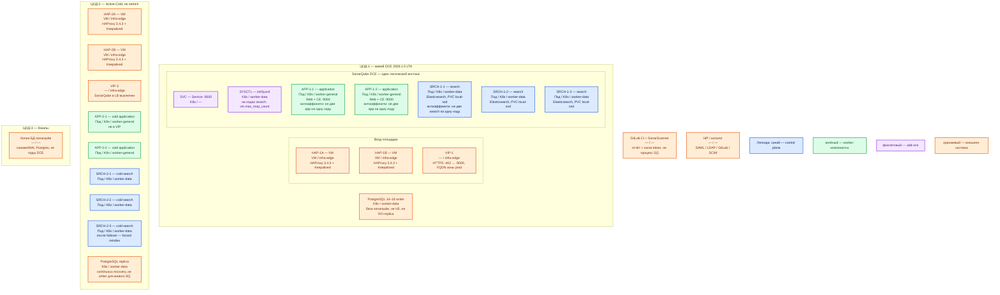

# SonarQube Server 2026.1.5 LTA (Data Center Edition) — Prod

Сервер отчётов статического анализа: **сканер** (программа в CI) смотрит исходники на агенте сборки и шлёт отчёт; сервер хранит замечания, считает **Quality Gate** (порог «можно сливать / нельзя») и отдаёт UI/API. Сам репозиторий с диска разработчика не читает. Бой — **Server 2026.1.5 LTA**, редакция **DCE** (Data Center Edition: штатный кластер application- и search-нод). Community Build **26.8.x** — другая линейка, не «бесплатный DCE». Чарт Helm **2026.4.1** ставит Latest — его не берём.

**Helm** — программа, которая по шаблону (чарт) ставит объекты в Kubernetes. **Application-нода** — процесс Web (UI/API, порт **9000/TCP**) + Compute Engine (фоновая очередь отчётов). **Search-нода** — отдельный Elasticsearch этого инстанса (индекс issues). **Hazelcast** — встроенная шина между application-нодами (**9003/TCP**), отдельный сервер не нужен.

## Допущения

- Контур: 2 прикладных ЦОДа + 1 ЦОД под бэкапы. Stretch одного DCE (порты **9001–9003**) и одного кворума Postgres между ЦОДами **нет**: порога RTT у вендора нет, RTT не измерен.
- Живой инстанс — **ЦОД-1**: Helm `sonarqube-dce` **2026.1.5**, образы `sonarqube:2026.1.5-datacenter-app` и `sonarqube:2026.1.5-datacenter-search`. ЦОД-2 — **Active-Cold** (холодный второй кластер DCE + реплика БД, трафик в LB выключен). ЦОД-3 — копии БД, не третий живой SonarQube.
- Kubernetes площадки уже есть (vanilla **1.36.4**). Чарт `sonarqube-dce` 2026.1.5: `kubeVersion >= 1.24.0-0`. На каждом прикладном ЦОДе: пара HAProxy **3.4.3** + Keepalived + VIP (ControlPlaneEndpoint `:6443` и край HTTP(S)); StorageClass `local-ssd` (RWO) и `shared-fs` (RWX, только по исключению — у SonarQube исключения нет); DNS внутри `cluster.local`, снаружи зона `prod.…`.
- HA самого приложения — **только DCE**. Без DCE честный прод — один процесс + внешний Postgres; второй под без ключа DCE — второй **инстанс** (своя лицензия, порча схемы, если оба смотрят в одну БД).
- Внешняя СУБД — **PostgreSQL 14–18** UTF-8, writer endpoint. С 2026.1 Helm **не** кладёт Postgres в чарт. **H2** (встроенная файловая БД) в бою запрещена. Живой SonarQube **не** ходит в read-only реплику как writer. HA Postgres — отдельный продукт (CNPG), не контейнер рядом с подом SonarQube.
- Нагрузка и LOC (строки кода лицензии) **не замерены**. Ниже — минимальная отказоустойчивая топология DCE (2 application + 3 search), не HPA «до 10» и не валидация вендора на 200M issues как смета этой платформы.
- Сканер живёт в GitLab CI, не на ноде SonarQube. Падение SonarQube **не** должно ронять Kafka/Camunda. Политика CI (ждать / падать / обход Quality Gate) — ваша, её нет в продукте.
- Встроенный Ingress-nginx чарта **не** включаем: край площадки — HAProxy+VIP. ArgoCD вендор помечает как *not currently fully supported*.
- Лицензия DCE — на инстанс/LOC. Второй живой инстанс = вторая лицензия; условия холодного кластера учитывать отдельно (в доке этой карточки цифры лицензии нет).

## Схема инстансов

Имена — роли, не обязательные DNS. Потоков и стрелок нет. Пул нод — класс машин для планировщика, не «под на ноде 3».

ОС — свойство платформы, не пода. Один стандарт Linux на всех нодах контура.

Исключение вендора: Windows и macOS вендор поддерживает как хост ZIP/Docker, не как ноду этого Kubernetes-кластера. z/OS не поддерживается.

| Пул | Роль | Зачем выделен |
|---|---|---|
| `infra-edge` | edge-VM | Пара HAProxy + Keepalived + VIP: край HTTP(S) и ControlPlaneEndpoint Kubernetes. **9001–9003** и **5432** сюда не публикуем |
| `worker-general` | general | Application-поды (Web + Compute Engine); локальный SSD под индекс не нужен |
| `worker-data` | data-localdisk | Search-поды: PVC индекса на `local-ssd` (RWO). Пул ≥ 3 нод из-за anti-affinity. Здесь же чужой Cluster Postgres |

Смысл цветов: **синий** — search-ноды (кластер Elasticsearch, кворум 3); **зелёный** — application-ноды (Web + Compute Engine); **фиолетовый** — Service и initSysctl; **оранжевый** — VIP, HAProxy, Postgres, CI, IdP, бэкапы. Helm — инсталлятор, не runtime-под.

## Комментарии к схеме

### HAP-1A/B, VIP-1 — вход ЦОД-1

- **Функционал.** Пара VM с HAProxy **3.4.3** и Keepalived держит VIP. Снаружи одно имя зоны `prod.…` на **443/TCP**. VIP также ControlPlaneEndpoint Kubernetes (`:6443`, TCP passthrough). Балансировщик для DCE обязателен и поставляется площадкой, не чартом. Sticky sessions **не** нужны: сессия — JWT-cookie (подписанная cookie с данными входа).
- **Критично.** Публиковать только HTTPS на VIP → application **9000**. Порты **9001** (app→search), **9002** (search↔search), **9003** (Hazelcast) — внутренняя сеть одного ЦОДа, не с мира и не между ЦОДами. Kafka `:9092` через этот HAProxy не публикуем. Health check — готовность application-ноды, не «TCP 9000 открыт». Клиенты и сканеры — по FQDN, не по Pod IP. Встроенный `ingress-nginx` чарта выключен.

### SVC — Service :9000

- **Функционал.** Стабильное имя в `cluster.local` перед двумя application-подами. Это не процесс SonarQube.
- **Критично.** Внутренний UI/API — **9000/TCP** (`sonar.web.port`). Наружу — через VIP, не NodePort в интернет. Search-порты в этот Service не кладём.

### SYSCTL — initSysctl

- **Функционал.** Init-контейнер чарта выставляет на ноде `vm.max_map_count` и лимиты Elasticsearch. Дефолт чарта: `vmMaxMapCount=524288` (не путать со старым **262144**).
- **Критично.** Нужен на нодах **search** (`worker-data`). Страница Linux 2026.1: `vm.max_map_count ≥ 524288`, `fs.file-max ≥ 131072`, `nofile ≥ 131072`, `nproc ≥ 8192`, seccomp включён, `/tmp` доступен на запись. Привилегированный initSysctl в restricted namespace можно выключить, если те же sysctl уже на нодах. Данные Elasticsearch — локальный SSD, не NFS/SMB/NAS и не `shared-fs`.

### APP-1-1, APP-1-2 — application-ноды ЦОД-1

- **Функционал.** Два одинаковых процесса **2026.1.5-datacenter-app**: Web (UI, REST, приём отчётов) и Compute Engine (очередь **Background Tasks**). Между ними Hazelcast **9003/TCP**. Вендор: при топологии 2+3 можно потерять **одну** application-ноду без влияния на пользователей. Ставит Helm `sonarqube/sonarqube-dce` **2026.1.5**, не `sonarqube` (не-DCE чарт = один процесс) и не чарт **2026.4.1** (Latest).
- **Критично.**
  - Минимум **2** реплики, anti-affinity: не две на одну ноду `worker-general`. Один application-под — уже не DCE HA.
  - Общий `applicationNodes.jwtSecret`: HS256, base64; свой, не пустой дефолт и не пример из чата. Sticky не включать «на всякий случай».
  - JDBC только на **writer** Postgres 14–18 UTF-8 (`jdbcOverwrite.jdbcUrl` / Secret). H2 запрещена. Два живых инстанса на одну схему вендор запрещает.
  - Не `admin`/`admin`. Дефолт чарта `setAdminPassword.newPassword=AdminAdmin_12$` публичен — заменить **до** боя. Force authentication оставить включённым. Группу `sonar-administrators` переименовать **до** синхронизации IdP.
  - Плагины **не шарятся** между подами: ставить на все application-ноды; выкат плагина = простой **всего** кластера.
  - HPA application (`applicationNodes.hpa`) на старте **выключен** (дефолт `enabled: false`). Включать только после замера очереди Background Tasks; на длинный апгрейд HPA выключать. Search HPA **нет**. `minReplicas` ниже 2 вендор не рекомендует.
  - Память несжимаема: request = limit. Дефолт чарта application: **400m / 800m CPU**, память **4096M** (не ниже 4G). Это «процесс поднялся», не смета боя. Валидация DCE вендора (БД на 200M issues): app **4 vCPU / 16 ГБ**. Нагрузка не замерена — порядок величины **между дефолтом чарта и этой справкой**, уточняется замером. Не обещать «хватит терабайтам озера»: лицензия и индекс — в LOC/issues, не в терабайтах карточек.
  - `monitoringPasscode` задать своим секретом (нужен для helm upgrade / мониторинга Web API).

### SRCH-1-1…SRCH-1-3 — search-ноды ЦОД-1

- **Функционал.** Три пода Elasticsearch инстанса DCE. Кворум поискового кластера: отказ **одной** search-ноды переживается. Порты **9001** (вызовы от application) и **9002** (обмен search↔search). Образ `sonarqube:2026.1.5-datacenter-search`, не внешний OpenSearch/Elasticsearch «для SonarQube».
- **Критично.**
  - Ровно **3** на старте (дефолт `searchNodes.replicaCount: 3`). Сокращать до 2 нельзя: нет большинства. Все search **одинаковые** по CPU/RAM; application и search могут отличаться (обычно search больше).
  - Anti-affinity: не две search на одну ноду `worker-data`. Пул ≥ 3 нод. Search в разных AZ **одной** площадки вендор допускает; «по одной search на ЦОД» без замера 9001–9003 — запрещённый stretch.
  - PVC: StorageClass **`local-ssd`**, RWO. Дефолт чарта **5G** — не план боя. Всегда ≥ **10%** свободно (watermark Elasticsearch ~90–95% → индекс read-only). SSD, не HDD; NFS/`shared-fs` как диск индекса запрещены.
  - Память request = limit. Дефолт чарта search: **400m CPU**, память **3072M** (не ниже 3G). Валидация DCE (200M issues): search **8 vCPU / 32 ГБ**, из них 16 ГБ heap Elasticsearch, не больше 32 ГБ heap. Порядок величины — замер; 50% RAM ноды под heap ES — рекомендация хоста, не готовая смета пода.
  - В бою включить аутентификацию/TLS search (`searchNodes.searchAuthentication`, `nodeEncryption`): пароль ES свой, не дефолт. 9001/9002 не с VIP.

### PostgreSQL 14–18 writer (ЦОД-1)

- **Функционал.** Долговременная истина: пользователи, настройки, история анализов, лицензия. Индекс Elasticsearch — **производный**, его можно перестроить из БД. На платформе — отдельный Cluster CNPG, база `sonarqube`, не общая с карточками/Grafana/Camunda.
- **Критично.** Пустая схема, пользователь с правом создавать объекты, charset **UTF-8**. JDBC с application-подов на FQDN сервиса writer (`*-rw` / пулер) в `cluster.local`, **5432 на VIP не публикуем**. Низкая задержка JDBC внутри ЦОД-1. Падение writer = нет UI и приёма отчётов, даже если поды DCE зелёные. Read-only реплика как живой SonarQube вендор **не поддерживает**.

### ЦОД-2 — Active-Cold

- **Функционал.** Холодный второй кластер **того же** чарта 2026.1.5 (2 app + 3 search) + реплика Postgres средствами СУБД. Трафик на VIP-2 для SonarQube **выключен**. После аварии ЦОД-1: вручную направить трафик, подключить холодный кластер к доступному writer, затем **принудительная переиндексация** Elasticsearch. UI может встать при живой Postgres — индекс всё равно пересобирают.
- **Критично.** Это не stretch и не active-active. Не открывать 9001–9003 между залами. Не направлять живой SonarQube на RO-replica. Холодный кластер — второй инстанс: лицензию согласовать отдельно. Не ставить в ЦОД-2 «половину search для HA».

### ЦОД-3 — бэкапы

- **Функционал.** Снимки и WAL базы `sonarqube` (процедура Postgres/CNPG). Не третий DCE.
- **Критично.** Индекс search бэкапом PVC не заменяет: после восстановления БД нужен reindex. Три живых инстанса = тройной LOC и три Quality Gate.

### GitLab CI + SonarScanner

- **Функционал.** Клиент анализа на Runner (Docker executor). Шлёт отчёт на FQDN VIP ЦОД-1 с `SONAR_HOST_URL` и `SONAR_TOKEN` (`sonar.token`, не пароль). `GIT_DEPTH: "0"` — иначе нет blame.
- **Критично.** Токен — masked CI/CD variable, не git. Сканер не ставится на application/search-ноды как единственный движок. Community-ограничение «только main» к DCE не относится (ветки/MR — Developer+; DCE это включает). Падение SQ не должно ронять шину.

### IdP

- **Функционал.** Вход людей (SAML / LDAP / GitLab; SCIM — Enterprise/DCE). Сканер ходит токеном, не паролем IdP.
- **Критично.** Redirect — FQDN VIP, не Pod IP. Секреты в Vault/Secret.

## Путь роста (не включать сразу)

1. Очередь Background Tasks растёт → сначала workers Compute Engine и heap CE, потом ещё application-нода в **ЦОД-1** (та же БД, тот же search). HPA — после профиля; на апгрейд выкл.
2. Тяжелее UI/приём отчётов → ещё application-ноды, не «ещё один Community на VM».
3. Растёт индекс issues → CPU/RAM/диск **search** в том же ЦОДе (три ноды остаются). Search HPA нет. Дефолт PVC 5G не оставлять.
4. Тяжёлый сам скан → агенты CI, не StatefulSet SonarQube.
5. Отказ зала → обкатанный Active-Cold (ЦОД-2), не stretch 9001–9003. Таблицы вендора «до 10M / 50M LOC» — единица пересчёта, не смета «терабайты».

## Сильные и слабые места

**Сильные.** Официальный путь HA приложения (DCE 2+3) в одном ЦОДе; отказ одной app и одной search не глушит пользователей; sticky не нужен; состояние в Postgres, индекс восстановим reindex; тот же механизм, что будет на Dev.

**Слабые.** Падение ЦОД-1 = нет SonarQube, пока DR; RTO включает forced reindex (минут в цитате вендора нет). Без ключа DCE горизонтального кластера нет. Нагрузка/LOC не замерены. Компрометация `admin` / JWT / JDBC = история анализов и Quality Gate.

**Критичные условия**

- Линия **2026.1.5 LTA** + чарт **`sonarqube-dce` 2026.1.5**; не Latest **2026.4.1**, не `latest`, не Community **26.8** docker вместо DCE.
- HA приложения — только DCE: **2** application + **3** search. Без DCE — один процесс + внешний PG 14–18, не «два пода Community».
- H2 в бою запрещена. Writer Postgres 14–18 UTF-8; не JDBC на read-only replica.
- Не stretch 9001–9003 / Hazelcast / кворума search на 2–3 ЦОДа.
- Не публиковать **9000** и **9001–9003** в интернет; не `admin`/`admin`; не `AdminAdmin_12$`.
- PVC search — `local-ssd`, не NFS/`shared-fs`. `vm.max_map_count ≥ 524288`.
- Память request = limit. HPA со старта не включать.
- SonarQube не Falco/Wazuh/SAST GitLab и не runtime Kafka.

## Источники

- Загрузки LTA **2026.1.5**: https://www.sonarsource.com/products/sonarqube/downloads/
- Редакции Server: https://docs.sonarsource.com/sonarqube-server/2026.1/discovering/sonarqube-server-editions.md
- Топология DCE 2+3, отказ 1 app и 1 search: https://docs.sonarsource.com/sonarqube-server/2026.1/server-installation/data-center-edition/dce-topology.md
- Требования DCE (5 серверов, пример 4 vCPU/16 ГБ app и 8 vCPU/32 ГБ search при 200M issues, LB без sticky): https://docs.sonarsource.com/sonarqube-server/2026.1/server-installation/data-center-edition/installation-requirements.md
- Порты 9000–9003: https://docs.sonarsource.com/sonarqube-server/2026.1/server-installation/data-center-edition/network-security/network-rules.md
- PostgreSQL 14–18 UTF-8, H2 не прод: https://docs.sonarsource.com/sonarqube-server/2026.1/server-installation/installing-the-database.md
- DR, forced ES reindex после failover K8s: https://docs.sonarsource.com/sonarqube-server/2026.1/server-installation/data-center-edition/on-kubernetes-or-openshift/setting-up-disaster-recovery.md
- HPA только application, дефолт выкл, min 2: https://docs.sonarsource.com/sonarqube-server/2026.1/server-installation/data-center-edition/on-kubernetes-or-openshift/setting-up-autoscaling.md
- Установка DCE Helm, внешняя БД, jwtSecret: https://docs.sonarsource.com/sonarqube-server/2026.1/server-installation/data-center-edition/on-kubernetes-or-openshift/installing-from-helm-repo.md
- Postgres убран из чарта в 2026.1; ArgoCD не fully supported: https://docs.sonarsource.com/sonarqube-server/2026.1/server-installation/on-kubernetes-or-openshift/before-you-start.md
- LTA notes, PostgreSQL 13 снят, dependency PG removed: https://docs.sonarsource.com/sonarqube-server/2026.1/server-update-and-maintenance/lta-to-lta-release-notes.md
- Релиз чарта `sonarqube-dce` **2026.1.5**: https://github.com/SonarSource/helm-chart-sonarqube/releases/tag/sonarqube-2026.1.5-sonarqube-dce-2026.1.5
- `Chart.yaml` (`appVersion` 2026.1.5, `kubeVersion >= 1.24.0-0`, образы `2026.1.5-datacenter-app/search`): https://github.com/SonarSource/helm-chart-sonarqube/blob/sonarqube-2026.1.5-sonarqube-dce-2026.1.5/charts/sonarqube-dce/Chart.yaml
- Artifact Hub (Latest-чарт **2026.4.1** не брать для LTA): https://artifacthub.io/packages/helm/sonarqube/sonarqube-dce
- Linux: `vm.max_map_count ≥ 524288`: https://docs.sonarsource.com/sonarqube-server/2026.1/server-installation/pre-installation/linux.md
- Host requirements (small 2 CPU / 4 ГБ / 30 ГБ; large 8 CPU / 16 ГБ; 10% disk; не NFS): https://docs.sonarsource.com/sonarqube-server/2026.1/server-installation/server-host-requirements.md
- GitLab CI, `SONAR_TOKEN` / `SONAR_HOST_URL`: https://docs.sonarsource.com/sonarqube-server/2026.1/devops-platform-integration/gitlab-integration/adding-analysis-to-gitlab-ci-cd.md
- Карточка: `Out/Платформенная инфра/SonarQube/SonarQube.md`
- Установка (учебный Community ≠ этот контур): `Out/Платформенная инфра/SonarQube/SonarQube.install.md`
- Схемы: `Out/Платформенная инфра/SonarQube/SonarQube.shema.md`
- Sample: `sample/SonarQube.md`

**В доке вендора нет (здесь не выдумано):** порог RTT между залами; «N ядер на ваши репозитории»; смета «хватит терабайтам»; разрешение H2 в бою; Community как HA приложения; read-only replica для живого SonarQube; HPA search-нод; минуты RTO reindex.
