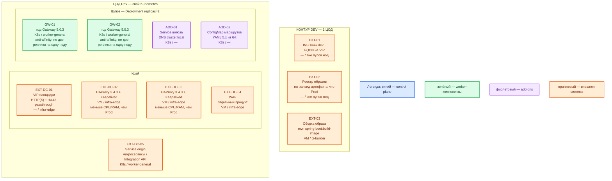

# Spring Cloud Gateway 5.0.3 — Dev

Тот же механизм, что Prod: библиотека в **вашем** Spring Boot **4.0.8** (поезд Spring Cloud **2025.1.3**, Gateway **5.0.3**, стартер `spring-cloud-starter-gateway-server-webflux`), **свой** OCI-образ, **Deployment** в Kubernetes, край — пара **HAProxy 3.4.3** + **Keepalived** + **VIP**, затем WAF. Dev **уменьшает CPU/RAM/диск**, не меняет вид инсталляции.

Это **не** учебный `mvn spring-boot:run` на одной машине и не один под. Иначе ошибка «на Prod две реплики / выкат образа, на Dev — один процесс Maven» на Dev не воспроизводится.

## Допущения

- Dev: **1 ЦОД**. Stretch не применим (и у шлюза всё равно нет кворума).
- Уже есть: VM, Kubernetes этого ЦОДа, пара HAProxy + Keepalived + VIP (меньше CPU/RAM, чем Prod), StorageClass с теми же именами `local-ssd` / `shared-fs` (шлюз PVC не берёт), зона `dev.…`.
- Паритет с Prod: тот же образный конвейер, тот же Deployment, те же роли пулов, те же YAML-префиксы 5.x, origin = Service **этой** площадки. Минимум **2 реплики на 2 нодах**.
- Не Docker Compose, не quickstart Initializr как рантайм контура, не один `ReplicaSet` с `replicas: 1`.
- Redis для общего rate limit на старте нет (как в Prod).
- Нагрузка не замерена. Цифр «хватит» у вендора нет; ниже — меньший порядок величины, уточняется замером.
- Те же запреты версии: не ≤ 5.0.2, не оба стартера, не `latest`.

## Схема инстансов

ОС — свойство платформы, не пода. Один стандарт Linux на всех нодах контура.

Исключения вендора по ОС нет: тот же JVM-контейнер, что в Prod. Сборка на `ci-builder` может идти с JDK 21 на Linux/Windows/macOS — это не ОС рабочих нод.

| Имя пула | Роль | Зачем выделен |
|---|---|---|
| `infra-edge` | edge-VM | Та же пара HAProxy + Keepalived и VIP, что в Prod; меньше CPU/RAM |
| `worker-general` | general | Два пода шлюза на разных нодах пула; PVC шлюзу не нужен |
| `ci-builder` | ci | Та же сборка своего образа, что в Prod; не замена рантайму `mvn spring-boot:run` |

Смысл цветов: синий — control plane продукта (у Gateway нет); зелёный — поды шлюза; фиолетовый — Service и ConfigMap; оранжевый — VIP, HAProxy, WAF, origin, DNS, реестр, CI.

От Prod схема отличается так: один ЦОД, нет второго зала и нет блока ЦОД-бэкапов, те же **2** рабочих пода (не «урезать до 1»).

## Комментарии к схеме

### EXT-01 — DNS зоны `dev.…`

- **Функционал.** FQDN входа на VIP этого ЦОДа, не Pod IP.
- **Критично.** Имена другие, чем `prod.…`; механизм тот же. Клиенты и интеграционные тесты — по FQDN.

### EXT-02 — реестр образов

- **Функционал.** Свой образ того же вида, что Prod (можно отдельный реестр/тег `dev`, не другой способ поставки).
- **Критично.** Не подменять образ «запуском с ноутбука». Пинить 4.0.8 / 2025.1.3 / 5.0.3.

### EXT-03 — сборка на `ci-builder`

- **Функционал.** `mvn spring-boot:build-image` (или свой Dockerfile) → реестр → pull на нодах.
- **Критично.** `mvn spring-boot:run` остаётся **локальной** отладкой разработчика (`127.0.0.1:8080`), как в `.install.md`. Контур Dev его **не** использует: иначе расходится с Prod (образ, probes, anti-affinity, край).

### EXT-DC-01 — VIP

- **Функционал.** Край HTTP(S) и `:6443` passthrough к API Kubernetes. Keepalived держит VIP на одном из двух HAProxy.
- **Критично.** Та же роль-модель, что Prod. Kafka `:9092` сюда не публикуем.

### EXT-DC-02 / EXT-DC-03 — пара HAProxy 3.4.3 + Keepalived

- **Функционал.** Балансировка на Service шлюза. Две VM, чтобы отказ одного края не был «единственной точкой», как на Prod.
- **Критично.** Меньше CPU/RAM, чем Prod, не «один контейнер Compose». Backend — Service шлюза, не origin напрямую (иначе Dev не ловит ошибки маршрутов YAML). `trusted-proxies` — IP этой пары.

### EXT-DC-04 — WAF

- **Функционал.** Тот же слой, что Prod (отдельный продукт). Нужен, чтобы фильтры края и заголовки `X-Forwarded-*` совпадали с боем.
- **Критично.** Не выкидывать WAF на Dev «для простоты», если Prod им пользуется: иначе баг заголовков/блокировок не воспроизвести.

### GW-01, GW-02 — поды шлюза

- **Функционал.** Два независимых процесса WebFlux за одним Service. Отказ одной ноды пула `worker-general` оставляет вход живым; край видит балансировку на два backend.
- **Критично.**
  - `replicas: 2` — пол, не потолок «как на ноутбуке». **Anti-affinity: не две реплики на одну ноду.** Если в Dev всего одна worker-нода — это **другой класс** стенда, не уменьшенный Prod; нужна вторая нода пула.
  - PDB обязателен и здесь: drain единственной «живой» реплики без PDB = простой входа.
  - Те же маршруты-префикс 5.x, тот же StripPrefix, тот же запрет писать маршруты через Actuator.
  - Ёмкость пода: тот же порядок «единицы vCPU / единицы ГиБ», **меньше Prod** (например ориентир sample 2 vCPU / 2 ГиБ как потолок Dev-пода, не как SLA). Уточняется замером. PVC нет; тома `local-ssd`/`shared-fs` меньше на других продуктах, шлюза это не касается.
  - Probes: `/actuator/health`, без обязательного ping origin.

### ADD-01 — Service шлюза

- **Функционал.** DNS `cluster.local` для подов и цель backend HAProxy.
- **Критично.** Не ходить на `localhost:8080` пода с машины разработчика как на «вход контура».

### ADD-02 — ConfigMap маршрутов

- **Функционал.** Git → ConfigMap, как в Prod.
- **Критично.** Можно урезать **набор** маршрутов (меньше origin), нельзя заменить Git живым `POST /actuator/gateway/routes`.

### EXT-DC-05 — origin

- **Функционал.** HTTP Service этой же площадки (можно меньше экземпляров origin, но шлюз всё равно указывает в `uri:` на DNS Service, не на Pod IP и не на `127.0.0.1` ноутбука).
- **Критично.** Не проксировать Dev-шлюз на Prod-API «чтобы были данные»: это другой RTT и другая ошибка.

## Путь роста

Как в Prod, только с меньшим потолком: добавить реплики **после** того, как две уже стоят на двух нодах; затем HPA по замеру; при необходимости — Redis для общего лимита. Не «сначала один под, потом как Prod». Второй ЦОД на Dev не добавляем.

## Сильные и слабые места; критичные условия

**Сильная сторона.** Тот же Deployment, тот же край, две реплики: воспроизводятся выкат образа, anti-affinity, PDB, `trusted-proxies`, префикс YAML 5.x.

**Слабая сторона.** Меньше ёмкость — не поймать все деградации пула HttpClient под боевым RPS. Один ЦОД — не доказывает отказ зала и переключение DNS на второй VIP.

**Критичные условия**

- Dev ≥ 2 реплики на **2 нодах**. Один `mvn spring-boot:run` или `replicas: 1` — нарушение паритета.
- Не Compose вместо Kubernetes. Не пропускать пару HAProxy+VIP.
- Те же CVE/стартер/Actuator-запреты, что в Prod.
- Порт 8080 и Actuator не публиковать в интернет (даже на Dev).

## Источники

Те же, что `Spring Cloud Gateway.prod.md` (вендор не разделяет «Dev-топологию»). Дополнительно:

| Факт | URL / файл |
|---|---|
| Учебный `mvn spring-boot:run` / localhost:8080 — не этот контур | https://docs.spring.io/spring-boot/4.0.8/maven-plugin/run.html · `Out/Бэкенд/Spring Cloud Gateway/Spring Cloud Gateway.install.md` |
| Бой = Deployment в каждом ЦОДе, сначала два пода | `Out/Бэкенд/Spring Cloud Gateway/Spring Cloud Gateway.consultant.md` · `.shema.md` |
| Нет официального образа | https://spring.io/projects/spring-cloud · `sample/Spring Cloud Gateway.md` |
| Свой образ Boot | https://docs.spring.io/spring-boot/4.0.8/maven-plugin/build-image.html |
| Паритет и файл Prod | `sample2/Spring Cloud Gateway.prod.md` |

В документации вендора **нет** отдельной схемы «Dev из одного процесса Maven». Паритет — требование этой платформы, не страница Spring.
