# Spring Cloud Gateway 5.0.3 — Prod

Библиотека HTTP-шлюза (**прокси**: принимает запрос клиента и передаёт его целевому сервису) внутри **вашего** приложения Spring Boot **4.0.8**, поезд Spring Cloud **2025.1.3** (Oakwood), стартер `spring-cloud-starter-gateway-server-webflux`. Готового сервера и официального Docker-образа нет: собираете JAR и **свой** OCI-образ, запускаете **Deployment** (контроллер Kubernetes, который держит заданное число одинаковых подов) в Kubernetes **каждого** прикладного ЦОДа.

Это не Ingress-контроллер, не WAF, не городской VIP и не `mvn spring-boot:run`.

## Допущения

- Уже есть: виртуализация (VM), Kubernetes площадки, пара **HAProxy 3.4.3** + **Keepalived** + **VIP** на каждый прикладной ЦОД, CoreDNS / `cluster.local`, внешняя зона `prod.…`. Сеть (VLAN, IP-план) вне рамок.
- Prod: **2 прикладных ЦОДа** + **1 ЦОД под бэкапы**. Stretch одного процесса/сессии шлюза между ЦОДами **нет**: у Gateway нет кворума (Raft/etcd); RTT между залами не измерен; порога RTT в доке Spring **нет**.
- ЦОД-бэкапов шлюз **не** размещает: хранить нечего (нет своего склада данных).
- На площадку — **свой** артефакт (один и тот же образ + маршруты из Git). Origin (**целевой HTTP-сервис** маршрута) — **Service той же площадки**, не API соседнего ЦОДа.
- Перед шлюзом — край HTTP(S): VIP → HAProxy (+ WAF как отдельный продукт контура). Порт приложения **8080/TCP** (завод Boot `server.port`) открыт **только** краю, не интернету.
- Вендорского оператора и Helm-чарта Gateway **нет**. Механизм боя: свой образ + Deployment Kubernetes. Не Docker Compose, не пакет «как Kafka», не один процесс на VM.
- Redis для общего rate limit **не** входит в стартовую топологию (опция; без него лимит — память **каждого** пода).
- Нагрузка HTTP не замерена. Цифр CPU/RAM «хватит» у проекта Gateway **нет**. Ниже — порядок величины и пометка «уточняется замером», не смета.
- Не смешивать стартеры WebFlux и Web MVC в одном процессе. Линия **5.0.2 и ниже** без патча **CVE-2026-47879** в бой не берём.

## Схема инстансов

```mermaid
flowchart TB
  subgraph CITY["КОНТУР PROD"]
    DNS["EXT-01<br/>DNS зоны prod.…<br/>FQDN на VIP площадок<br/>— / вне пулов нод"]
    REG["EXT-02<br/>Реестр образов<br/>свой образ Boot-приложения<br/>— / вне пулов нод"]
    CIB["EXT-03<br/>Сборка образа<br/>mvn spring-boot:build-image<br/>VM / ci-builder"]
  end

  subgraph DC1["ЦОД-1 — прикладной, свой Kubernetes"]
    subgraph EDGE1["Край ЦОД-1"]
      VIP1["EXT-DC1-01<br/>VIP площадки<br/>HTTP(S) + :6443 passthrough<br/>— / infra-edge"]
      HAP1A["EXT-DC1-02<br/>HAProxy 3.4.3 + Keepalived<br/>VM / infra-edge"]
      HAP1B["EXT-DC1-03<br/>HAProxy 3.4.3 + Keepalived<br/>VM / infra-edge"]
      WAF1["EXT-DC1-04<br/>WAF<br/>отдельный продукт<br/>VM / infra-edge"]
    end
    subgraph APP1["Шлюз ЦОД-1 — Deployment"]
      G1A["GW-DC1-01<br/>под Gateway 5.0.3<br/>K8s / worker-general<br/>anti-affinity: не две реплики на одну ноду"]
      G1B["GW-DC1-02<br/>под Gateway 5.0.3<br/>K8s / worker-general<br/>anti-affinity: не две реплики на одну ноду"]
      SVC1["ADD-DC1-01<br/>Service шлюза<br/>DNS cluster.local<br/>K8s / —"]
      CM1["ADD-DC1-02<br/>ConfigMap маршрутов<br/>YAML 5.x из Git<br/>K8s / —"]
    end
    ORG1["EXT-DC1-05<br/>Service origin<br/>микросервисы / Integration API<br/>K8s / worker-general"]
  end

  subgraph DC2["ЦОД-2 — прикладной, свой Kubernetes"]
    subgraph EDGE2["Край ЦОД-2"]
      VIP2["EXT-DC2-01<br/>VIP площадки<br/>HTTP(S) + :6443 passthrough<br/>— / infra-edge"]
      HAP2A["EXT-DC2-02<br/>HAProxy 3.4.3 + Keepalived<br/>VM / infra-edge"]
      HAP2B["EXT-DC2-03<br/>HAProxy 3.4.3 + Keepalived<br/>VM / infra-edge"]
      WAF2["EXT-DC2-04<br/>WAF<br/>отдельный продукт<br/>VM / infra-edge"]
    end
    subgraph APP2["Шлюз ЦОД-2 — тот же образ, свой Deployment"]
      G2A["GW-DC2-01<br/>под Gateway 5.0.3<br/>K8s / worker-general<br/>anti-affinity: не две реплики на одну ноду"]
      G2B["GW-DC2-02<br/>под Gateway 5.0.3<br/>K8s / worker-general<br/>anti-affinity: не две реплики на одну ноду"]
      SVC2["ADD-DC2-01<br/>Service шлюза<br/>DNS cluster.local<br/>K8s / —"]
      CM2["ADD-DC2-02<br/>ConfigMap маршрутов<br/>YAML 5.x из Git<br/>K8s / —"]
    end
    ORG2["EXT-DC2-05<br/>Service origin<br/>микросервисы / Integration API<br/>K8s / worker-general"]
  end

  subgraph BKP["ЦОД-бэкапов — не прикладной вход"]
    BK["EXT-BKP-01<br/>шлюз не размещаем<br/>нечего бэкапить<br/>— / —"]
  end

  LEGCORE["Легенда: синий — control plane"]
  LEGWORK["зелёный — worker-компоненты"]
  LEGADD["фиолетовый — add-ons"]
  LEGEXT["оранжевый — внешняя система"]

  classDef core fill:#dbeafe,stroke:#2563eb,color:#172554,stroke-width:2px;
  classDef worker fill:#dcfce7,stroke:#16a34a,color:#14532d,stroke-width:2px;
  classDef addon fill:#f3e8ff,stroke:#9333ea,color:#581c87,stroke-width:2px;
  classDef external fill:#ffedd5,stroke:#ea580c,color:#7c2d12,stroke-width:2px;

  class LEGCORE core;
  class G1A,G1B,G2A,G2B,LEGWORK worker;
  class SVC1,CM1,SVC2,CM2,LEGADD addon;
  class DNS,REG,CIB,VIP1,HAP1A,HAP1B,WAF1,ORG1,VIP2,HAP2A,HAP2B,WAF2,ORG2,BK,LEGEXT external;
```

ОС — свойство платформы, не пода. Один стандарт Linux на всех нодах контура.

У Spring Cloud Gateway нет требования иной ОС: это JVM в контейнере. Официального списка ОС у проекта шлюза нет; для сборки Boot 4.0.8 допускаются Windows / Linux / macOS с JDK — это машина CI, не ОС пода.

| Имя пула | Роль | Зачем выделен |
|---|---|---|
| `infra-edge` | edge-VM | Пара HAProxy + Keepalived и VIP (край HTTP(S) и `:6443`); WAF как отдельный продукт того же края |
| `worker-general` | general | Поды шлюза (stateless, без PVC) и origin-сервисы площадки; планировщик двигает поды по пулу |
| `ci-builder` | ci | Сборка JAR и своего OCI-образа (`spring-boot:build-image`); не рантайм боя |

Смысл цветов на этой схеме: синий — управляющие/голосующие роли продукта (у Gateway их нет: нет Raft/лидера); зелёный — рабочие инстансы шлюза (поды); фиолетовый — add-on Kubernetes этого приложения (Service, ConfigMap), не вендорский оператор; оранжевый — внешнее (VIP, HAProxy, WAF, origin, DNS, реестр, CI, ЦОД-бэкапов).

## Комментарии к схеме

### EXT-01 — DNS зоны `prod.…`

- **Функционал.** Имена входа (`gateway.prod.…` и аналоги) указывают на **VIP** живой прикладной площадки, не на Pod IP. Между двумя ЦОДами выбор зала — DNS / городской вход / Anycast (это не функция библиотеки Gateway).
- **Критично.** Клиенты ходят по FQDN. Рекламировать под шлюза наружу нельзя: под переезжает.

### EXT-02 — реестр образов

- **Функционал.** Хранит **ваш** образ приложения со стартером Gateway. Вендор образа на Docker Hub не публикует.
- **Критично.** Тег пинить (Boot **4.0.8** / Cloud **2025.1.3** / в дереве зависимостей Gateway **5.0.3**), не `latest`. Оба кластера тянут один и тот же артефакт.

### EXT-03 — сборка на `ci-builder`

- **Функционал.** Maven собирает приложение и OCI-образ. Официальный путь Boot 4.0.8: `mvn spring-boot:build-image` (Cloud Native Buildpacks). Альтернатива — свой Dockerfile; это тоже «свой образ», не образ вендора Gateway.
- **Критично.** Родитель Boot **4.0.8**, BOM **2025.1.3**, без своей `<version>` у стартера. Проверка: `mvn dependency:tree` показывает Gateway **5.0.3**. JDK **21** (легальный минимум Boot 4.0 — Java 17, цель контура — 21). Сборка ≠ рантайм: в ЦОДе процесс не запускают через `mvn spring-boot:run`.

### EXT-DC1-01 / EXT-DC2-01 — VIP площадки

- **Функционал.** Единый адрес края этого ЦОДа: HTTP(S) клиентов и ControlPlaneEndpoint Kubernetes (`:6443`, TCP passthrough). Keepalived назначает VIP одному из двух HAProxy.
- **Критично.** Kafka `:9092` через этот HAProxy не публикуем. Один VIP на три ЦОДа HAProxy не склеивает. Шлюз за VIP, не вместо него.

### EXT-DC*-02 / EXT-DC*-03 — пара HAProxy 3.4.3 + Keepalived

- **Функционал.** Балансировка и (обычно) завершение TLS. Backend HTTP — **Service шлюза этой площадки** (или его NodePort), не Pod IP и не origin в другом ЦОДе.
- **Критично.** Две VM пула `infra-edge`, не один процесс. Health check HAProxy — живость шлюза, не «пинг ведомства». Порядок WAF до или после HAProxy карточка HAProxy **не** закрепляет; для шлюза важно одно: внешний клиент не бьёт в под напрямую. В `trusted-proxies` шлюза — IP края (Java-regex), не `.*`.

### EXT-DC*-04 — WAF

- **Функционал.** Фильтр прикладного HTTP. Gateway **не** WAF (SecureHeaders / rate limit — не семантика атаки).
- **Критично.** Отдельный продукт и отдельный выкат. Не заменять WAF «ещё одним фильтром» в YAML шлюза.

### GW-DC1-01, GW-DC1-02 и GW-DC2-01, GW-DC2-02 — поды шлюза

- **Функционал.** JVM с Netty (HTTP-сервер WebFlux): предикаты, фильтры, исходящий HttpClient к origin. Два пода на площадку — **минимум**, чтобы пережить отказ одной ноды и чтобы край видел балансировку. Экземпляры равноправны: лидера нет.
- **Критично.**
  - Deployment, не StatefulSet. PVC и StorageClass `local-ssd` / `shared-fs` шлюз **не** заказывает (данных нет). NFS как диск шлюзу тоже не нужен.
  - `podAntiAffinity` / topology spread: **не две реплики на одну ноду**. Пул — `worker-general`, не конкретная «нода 3».
  - **PodDisruptionBudget** (лимит, сколько подов можно снять сразу при drain): иначе вывод одной ноды = нет входа.
  - Маршруты: `spring.cloud.gateway.server.webflux.routes`. Старый префикс `spring.cloud.gateway.routes` в 5.x **молча не биндится**. Path в `uri:` маршрута официально **игнорируется** — origin задаётся DNS Service (`http://name.namespace.svc.cluster.local`).
  - Actuator `/actuator/gateway` — **read-only** или выкл. Не `POST` маршрутов в бою; не `unrestricted` с сети. `/env` и heapdump не экспонировать. Предпочтительно отдельный management-порт, недоступный с VIP.
  - Readiness **не** делать обязательным ping origin: иначе падение бэкенда каскадно снимает весь вход.
  - Ёмкость: в доке вендора ядер и гигабайт «хватит» **нет**. Порядок величины на реплику — **единицы vCPU и единицы ГиБ RAM** (ориентир учебного стенда в `sample\`: 2 vCPU / 2 ГиБ / 5 ГиБ под JDK и кэш Maven — это машина сборки/стенда, **не** норматив боя). Диск пода — эфемерный overlay. Уточняется нагрузочным тестом (RPS, размер тела, висящие запросы), не «терабайтами озера».
  - Сессии и Local Response Cache (Caffeine) — память **этого** пода; между залами не склеивать.

### ADD-DC*-01 — Service шлюза

- **Функционал.** Стабильное DNS-имя `*.svc.cluster.local` и виртуальный адрес для подов Deployment. Край балансирует на Service, kube-proxy/CNI — на живые поды.
- **Критично.** Тип Service (ClusterIP + доступ с edge-VM vs NodePort) в доке Gateway не задан — решение площадки. Не LoadBalancer «на весь город» вместо VIP HAProxy.

### ADD-DC*-02 — ConfigMap маршрутов

- **Функционал.** YAML маршрутов из Git (ConfigMap / Helm values). Согласованность между подами и между ЦОДами — Git, не Raft.
- **Критично.** Ошибка GitOps = 404 или лишний путь **на всех** площадках с тем же манифестом. Секреты (TLS, если не только на крае; пароль Redis, если позже включите общий лимит) — в Secret/Vault, не в Git.

### EXT-DC*-05 — origin

- **Функционал.** Микросервисы и Integration API этой же площадки. Исходящие вызовы к госслужбам делает Integration API, не Gateway.
- **Критично.** «Шлюз в ЦОД-1, API только в ЦОД-2» превращает чужой RTT в деградацию всего входа. В доке Spring порога RTT нет — межЦОДовый origin не целевой. NetworkPolicy: шлюз → нужные Service; шлюз → интернет запрещён.

### EXT-BKP-01 — ЦОД-бэкапов

- **Функционал.** Для шлюза пусто: бэкапить нечего. Образ живёт в реестре, маршруты — в Git.
- **Критично.** Не строить «третий зал шлюза для HA» на бэкап-площадке и не называть это кворумом.

## Путь роста

Не включать сразу. После замера RPS и латентности origin:

1. Увеличить `replicas` Deployment на площадке (и потолок HPA, когда появится Metrics Server). Антиаффинити и PDB сохранить.
2. Поднять request/limit CPU и RAM **пода** (TLS лучше оставлять на крае, не в JVM).
3. HttpClient: в appendix 5.0.3 дефолт пула `elastic`; в бою при упирании в соединения — `fixed` + `max-connections` (иначе HPA плодит поды, которые вместе сносят origin).
4. Общий rate limit — отдельный Redis с собственной HA; без него квота × число реплик. Не тащить Redis «на всякий случай».
5. Второй прикладной ЦОД уже есть как независимый выкат; «добавить ЦОД» = такой же Deployment + край, не stretch сессий.

Цифр RPS у проекта Gateway нет.

## Сильные и слабые места; критичные условия

**Сильная сторона.** Процесс почти stateless: отказ пода переживается репликой; отказ ЦОДа — переносом DNS/городского входа на второй зал с **локальным** origin. Один артефакт на обе площадки. Тот же вид инсталляции, что потом на Dev.

**Слабая сторона.** Нет общего лидера и нет «кластера Gateway»: расхождение ConfigMap сразу ломает вход. Caffeine/лимит без Redis не общий. МежЦОДовый origin проектом не нормирован. Вендор не даёт смету железа.

**Критичные условия**

- Не `mvn spring-boot:run` и не один под как «Prod». Не Docker Compose.
- Не один Deployment на два ЦОДа и не origin через город «чтобы HA».
- Не оба стартера MVC+WebFlux. Не Boot/образ `latest`. Не Gateway ≤ 5.0.2 этой линии.
- Actuator и `:8080` не в интернет. `trusted-proxies` ≠ `.*`. `RequestHeaderToRequestUri` не на публичном маршруте.
- Retry на POST без идемпотентности = двойная заявка (особенно путь в Integration API).

## Источники

| Факт | URL / файл |
|---|---|
| Поезд 2025.1.3, Boot 4.0.8, Gateway 5.0.3, CVE-2026-47879 | https://spring.io/blog/2026/08/20/spring-cloud-2025-1-3-has-been-released |
| Текст CVE-2026-47879 | https://spring.io/security/cve-2026-47879 |
| Матрица поездов, нет готового сервера Gateway | https://spring.io/projects/spring-cloud |
| Тег v5.0.3 | https://github.com/spring-cloud/spring-cloud-gateway/releases/tag/v5.0.3 |
| YAML `server.webflux.routes` | https://docs.spring.io/spring-cloud-gateway/reference/spring-cloud-gateway-server-webflux/configuration.html |
| Path в URI игнорируется | https://docs.spring.io/spring-cloud-gateway/reference/spring-cloud-gateway-server-webflux/how-it-works.html |
| Appendix 5.0.3 (пул, таймауты, trusted-proxies) | https://docs.spring.io/spring-cloud-gateway/reference/5.0.3/appendix.html |
| Actuator `/gateway` | https://docs.spring.io/spring-cloud-gateway/reference/spring-cloud-gateway-server-webflux/actuator-api.html |
| Forwarded / `trusted-proxies` | https://docs.spring.io/spring-cloud-gateway/reference/spring-cloud-gateway-server-webflux/httpheadersfilters.html |
| Boot 4.0.8: Java 17–26, Maven ≥ 3.6.3 | https://docs.spring.io/spring-boot/4.0.8/system-requirements.html |
| Завод `server.port=8080` | https://docs.spring.io/spring-boot/4.0.8/appendix/application-properties/index.html |
| `mvn spring-boot:build-image` | https://docs.spring.io/spring-boot/4.0.8/maven-plugin/build-image.html |
| `mvn spring-boot:run` — учебный запуск, не этот контур | https://docs.spring.io/spring-boot/4.0.8/maven-plugin/run.html |
| Deployment Kubernetes | https://kubernetes.io/docs/concepts/workloads/controllers/deployment/ |
| PDB | https://kubernetes.io/docs/concepts/workloads/controllers/disruption/ |
| Anti-affinity | https://kubernetes.io/docs/concepts/scheduling-eviction/assign-pod-node/#affinity-and-anti-affinity |
| Карточка, установка, схема стыковки | `Out/Бэкенд/Spring Cloud Gateway/` (`.md`, `.install.md`, `.shema.md`) |
| Ресурсы sample (не норма боя) | `sample/Spring Cloud Gateway.md` |

В документации вендора **нет**: ядер и гигабайт «хватит на Prod», порога RTT до origin в другом ЦОДе, готового образа Gateway, Helm-оператора, встроенной учётки администратора, требования PVC.
