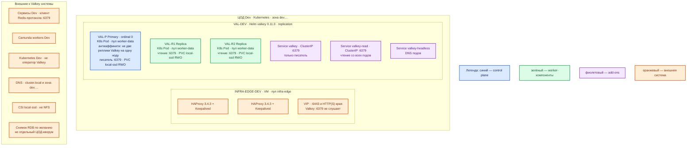

# Valkey 9.1.1 — Dev

Контур: **Dev** (1 ЦОД). Упрощение Prod: те же роли и тот же Helm, меньше CPU/RAM/диск. **Не** один контейнер Docker с ноутбука.

**Valkey** — хранилище ключ–значение в RAM (форк Redis OSS, BSD-3). Боевой и стендовый контур платформы ставят официальный Helm-чарт `valkey` **0.11.0** (`appVersion` 9.1.1): **1 primary + 2 replica**, persistence **вкл.**, StorageClass **`local-ssd`**. Чарт не даёт Cluster и Sentinel. Оператор `valkey-operator` (до v0.5.0 *not ready for production*) не ставим. Quickstart `docker run` из `Valkey.install.md` — учебный ноутбук, не этот контур.

## Допущения

1. На ЦОД Dev уже есть Kubernetes и пара HAProxy 3.4.3 + Keepalived + VIP (меньше CPU/RAM, чем Prod). Valkey **:6379** через VIP **не** публикуем.
2. Stretch нет: один набор ключей в одном Kubernetes. Второго прикладного ЦОДа нет.
3. Бэкап-зал Prod на Dev не копируем отдельным ЦОДом. Снимки RDB можно класть на ту же площадку / в учебное объектное хранилище — это не третий голосующий узел.
4. Паритет с Prod: `replica.enabled=true`, `replica.replicas=2` (три пода на **трёх** нодах `worker-data`), anti-affinity, ACL, Secret, ClusterIP. Не схлопывать в 1 под и не выключать replica «для экономии» — это другой класс системы (нет копии, не проверить лаг и отказ ноды).
5. Persistence **включена**, том меньше Prod, класс тот же: **`local-ssd`**, не NFS, не `shared-fs`.
6. Auth включён, пользователь `default` в ACL обязателен. Пароли Dev — свои Secret контура, не строки `stand-only-dev` / `dev-app` из учебного Docker.
7. Цифр CPU/RAM в мануале нет. Dev уменьшает ёмкость, не вид инсталляции. `maxmemory` задать, иначе процесс съест RAM маленькой ноды.
8. Клиенты по FQDN (`cluster.local` / зона `dev.…`), не Pod IP. Образ **`valkey/valkey:9.1.1`**, не `latest`, не 9.1.0.

## Схема инстансов

На схеме нет потоков данных. Это уменьшенный Prod одного ЦОДа, не Docker-одиночка.

ОС — свойство платформы, не пода. Один стандарт Linux на всех нодах контура.

Вендор Windows как родную серверную ОС **не** поддерживает; на контуре стандарт уже Linux. WSL/Docker Desktop из quickstart — не этот Dev. https://valkey.io/topics/installation/

Синий — **primary** (писатель). Кворума Sentinel/Cluster нет, как в Prod: два пода вместо трёх были бы не «уменьшенный Prod», а одиночка с одной копией.

| Имя пула | Роль | Зачем выделен |
|---|---|---|
| `worker-data` | data-localdisk | Три маленькие ноды под PVC `local-ssd`. Имена классов как в Prod, тома меньше. Не сажать две реплики Valkey на одну ноду. |
| `infra-edge` | edge-VM | Та же пара HAProxy + Keepalived + VIP, меньше CPU/RAM. `:6379` на VIP не вешаем. |

## Комментарии к схеме

### VAL-P — primary

**Функционал.** Писатель набора ключей Dev. Тот же Helm и те же флаги, что Prod, меньше лимиты пода.

**Критичные детали.**

- Команда того же класса, что Prod: `helm install … valkey/valkey --version 0.11.0` с `replica.enabled=true`, `image.tag=9.1.1`, persistence + `storageClass: local-ssd`. Не `docker run valkey/valkey:9.1.1` и не завод чарта (replica выкл., persistence выкл., auth выкл.) — завод это учебный ноутбук, он **не** воспроизведёт отказ пода/диска Prod.
- Service `valkey` — писатель. FQDN `valkey.<namespace>.svc.cluster.local:6379` или имя зоны `dev.…`.
- Persistence обязательна при replica. Без PVC пустой primary после рестарта съест копии: https://valkey.io/topics/replication/#safety-of-replication-when-primary-has-persistence-turned-off
- Ёмкость: в мануале нет. Порядок (оценка платформы): **1–2 vCPU**, RAM **единицы ГиБ** с явным `maxmemory`, PVC `local-ssd` порядка **10 ГиБ** (заглушка примеров чарта, не расчёт). Уточняется замером игрушечного набора Dev.
- ACL + Secret контура. Пользователь `default` обязателен при `auth.enabled`.
- `minReplicasToWrite=1` — как Prod, чтобы на Dev ловили отказ записи без replica, а не «везде пишет одиночка».
- Порты 16379 / 26379 не открываем. Оператор не ставим.

### VAL-R1 / VAL-R2 — replica

**Функционал.** Две асинхронные копии на других нодах. Нужны, чтобы на Dev воспроизвести лаг чтения, запрет записи на `valkey-read` и сценарий «нода replica умерла, primary жив».

**Критичные детали.** Одна replica на той же ноде, что primary, паритет **ломает**: отказ ноды заберёт писателя и копию сразу. Три ноды `worker-data` — требование схемы, не «роскошь Prod».

### Service valkey / valkey-read / valkey-headless

**Функционал.** Как в Prod: писатель, чтение, DNS подов.

**Критичные детали.** Успешный SET/GET с ноутбука через `kubectl port-forward` не доказывает failover и не заменяет FQDN, которым ходят сервисы.

### INFRA-EDGE — VIP Dev

**Функционал.** Kubernetes `:6443` и HTTP(S) края. Valkey через него не публикуем.

## Путь роста

Совпадает с Prod, только цифры меньше: сначала замер RAM на Dev, потом вертикаль; затем `replica.replicas`; отдельные релизы под разные префиксы ключей. Sentinel и Cluster на Dev **не** включать «на вырост», если их нет в Prod: сломается паритет вида инсталляции.

## Сильные и слабые места

| Сильное | Слабое |
|---|---|
| Тот же Helm 0.11.0, 3 пода, `local-ssd`, ACL — можно ловить ошибки вида инсталляции Prod | По-прежнему нет автоfailover (ordinal 0) |
| Меньше железо, не другой продукт | Маленький `maxmemory` легко упереться в eviction / ошибку записи |
| Не Docker-одиночка | Один ЦОД: нет проверки «два независимых кэша» |

**Критичные условия**

- Dev ≠ `docker run` и ≠ Helm без replica/PVC/auth.
- Persistence вкл., `local-ssd`, не NFS.
- Три пода на трёх нодах, не один инстанс.
- Не оператор, не Cluster/Sentinel из чарта.
- Не 9.1.0 / не `latest`.
- Не открывать 6379 с Dev в интернет.
- Учебные пароли `.install.md` не считать паролями этого контура.

## Источники

Те же, что у Prod:

- Релиз 9.1.1: https://github.com/valkey-io/valkey/releases/tag/9.1.1
- Образы: https://valkey.io/download/
- Установка: https://valkey.io/topics/installation/
- Helm 0.11.0: https://valkey.io/valkey-helm/ · https://github.com/valkey-io/valkey-helm/blob/main/valkey/Chart.yaml · https://github.com/valkey-io/valkey-helm/blob/main/valkey/README.md
- Оператор не прод: https://github.com/valkey-io/valkey-operator/blob/main/README.md
- Replication safety: https://valkey.io/topics/replication/#safety-of-replication-when-primary-has-persistence-turned-off
- Не NFS: https://valkey.io/topics/benchmark/
- `Out/БД и хранилища/Valkey/Valkey.md`, `Valkey.install.md`, `Valkey.shema.md`, `sample/Valkey.md`
- Prod этого контура: `sample2/Valkey.prod.md`
