# Valkey 9.1.1 — Prod

Контур: **Prod** (2 прикладных ЦОДа + 1 ЦОД под бэкапы). Роль продукта: **кэш, сессии, лимиты, короткие локи** в RAM. Не источник истины карточек и не шина событий.

**Valkey** — хранилище ключ–значение в оперативной памяти (форк Redis OSS, лицензия BSD-3). Клиенты ходят по TCP, протокол как у Redis (**RESP**), порт **6379**. Боевой путь: официальный Helm-чарт `valkey` **0.11.0** (`appVersion` 9.1.1) в режиме **primary + replica**. Чарт **не** ставит Cluster и **не** ставит Sentinel. Оператор `valkey-operator` (в т.ч. чарт до **v0.5.0**) в README: *not ready for production* — в бой не берём.

## Допущения

1. В каждом прикладном ЦОДе уже есть свой Kubernetes и пара HAProxy 3.4.3 + Keepalived + VIP (ControlPlaneEndpoint `:6443` и край HTTP(S)). Valkey **:6379** через этот HAProxy **не** публикуем (как и Kafka `:9092`).
2. Stretch одного набора Valkey (replication / Sentinel / Cluster bus) на 2–3 ЦОДа **нет**: RTT не измерен, порога в документации вендора нет. Два прикладных ЦОДа = **два независимых** Helm-релиза. Клиенты площадки ходят в «домашний» Valkey.
3. ЦОД бэкапов **не** член replication и **не** третий голосующий. Туда кладут снимки **RDB** (файл-снимок набора ключей) / копии **AOF** (журнал команд). Живой Valkey там не поднимаем «для кворума».
4. Топология чарта: `replica.enabled=true`, `replica.replicas=2` (завод чарта: всего **3** пода = 1 primary + 2 replica). Первый под StatefulSet (ordinal **0**) — всегда **primary** (писатель). При отказе primary replica **ждут его возврата**; автосмены роли в чарте нет. Sentinel — отдельные манифесты, в эту инсталляцию **не** входят. Источник: [README чарта 0.11.0](https://github.com/valkey-io/valkey-helm/blob/main/valkey/README.md).
5. Persistence в бою **включена** на primary и на replica. Без диска пустой primary после рестарта Kubernetes затирает replica — вендор это запрещает. StorageClass **`local-ssd`** (RWO, CSI, локальный SSD). **NFS/NAS** под RDB/AOF не используем. `shared-fs` для Valkey не исключение.
6. Auth (**ACL**) включён. Пользователь `default` в ACL **обязателен**, иначе цитата чарта: *anyone can access the database without credentials*. Пароли — Kubernetes Secret / Vault, не values в git. Учебные строки `stand-only-dev` в бой не копируем.
7. Цифр CPU/RAM «хватит для боя» в мануале Valkey **нет**. Данные живут в RAM; без `maxmemory` процесс может съесть свободную память ноды. Терабайты озера сюда не помещаются. Ёмкость ниже — **порядок величины**, уточняется замером рабочего набора.
8. Сеть (VLAN, IP-план) вне рамок. Клиенты — по FQDN Service (`cluster.local` внутри, зона `prod.…` снаружи), не по Pod IP. LoadBalancer/NodePort Valkey в интернет не открываем.
9. Образ **`valkey/valkey:9.1.1`**, не `latest`, не **9.1.0** (SECURITY: CVE-2026-56684, CVE-2026-63639).

## Схема инстансов

На схеме нет потоков данных. ЦОД-1 и ЦОД-2 — два одинаковых автономных релиза, не реплики одного набора ключей.

```mermaid
flowchart TB
  subgraph DC1["ЦОД-1 прикладной · Kubernetes · зона prod.…"]
    subgraph EDGE1["INFRA-EDGE-DC1 · VM · пул infra-edge"]
      HAP1A["HAProxy 3.4.3 + Keepalived"]
      HAP1B["HAProxy 3.4.3 + Keepalived"]
      VIP1["VIP · :6443 и HTTP(S) края<br/>Valkey :6379 не слушает"]
    end
    subgraph DATA1["VAL-DC1 · Helm valkey 0.11.0 · replication"]
      P1["VAL-P1 Primary · ordinal 0<br/>K8s Pod · пул worker-data<br/>антиаффинити: не две реплики Valkey на одну ноду<br/>писатель :6379 · PVC local-ssd RWO"]
      R11["VAL-R1-1 Replica<br/>K8s Pod · пул worker-data<br/>чтение :6379 · PVC local-ssd RWO"]
      R12["VAL-R1-2 Replica<br/>K8s Pod · пул worker-data<br/>чтение :6379 · PVC local-ssd RWO"]
      SVC1["Service valkey · ClusterIP :6379<br/>только писатель"]
      SVCR1["Service valkey-read · ClusterIP :6379<br/>чтение со всех подов"]
      SVCH1["Service valkey-headless<br/>DNS подов"]
    end
  end

  subgraph DC2["ЦОД-2 прикладной · Kubernetes · зона prod.…"]
    subgraph EDGE2["INFRA-EDGE-DC2 · VM · пул infra-edge"]
      HAP2A["HAProxy 3.4.3 + Keepalived"]
      HAP2B["HAProxy 3.4.3 + Keepalived"]
      VIP2["VIP · :6443 и HTTP(S) края<br/>Valkey :6379 не слушает"]
    end
    subgraph DATA2["VAL-DC2 · Helm valkey 0.11.0 · тот же вид, свой набор ключей"]
      P2["VAL-P2 Primary · ordinal 0<br/>K8s Pod · пул worker-data<br/>антиаффинити: не две реплики Valkey на одну ноду<br/>писатель :6379 · PVC local-ssd RWO"]
      R21["VAL-R2-1 Replica<br/>K8s Pod · пул worker-data<br/>чтение :6379 · PVC local-ssd RWO"]
      R22["VAL-R2-2 Replica<br/>K8s Pod · пул worker-data<br/>чтение :6379 · PVC local-ssd RWO"]
      SVC2["Service valkey · ClusterIP :6379<br/>только писатель"]
      SVCR2["Service valkey-read · ClusterIP :6379<br/>чтение со всех подов"]
      SVCH2["Service valkey-headless<br/>DNS подов"]
    end
  end

  subgraph DCB["ЦОД под бэкапы"]
    BAK["Снимки RDB / копии AOF<br/>живой Valkey не член replication<br/>не Sentinel и не Cluster"]
  end

  subgraph EXT["Внешние к Valkey системы"]
    APP["Микросервисы / интеграционное API<br/>клиент Redis-протокола :6379"]
    CAM["Camunda workers · лок, идемпотентность"]
    K8S["Kubernetes площадки · не оператор Valkey"]
    DNS["DNS · cluster.local и зона prod.…"]
    CSI["CSI local-ssd · не NFS"]
  end

  LEGCORE["Легенда: синий — control plane"]
  LEGWORK["зелёный — worker-компоненты"]
  LEGADD["фиолетовый — add-ons"]
  LEGEXT["оранжевый — внешняя система"]

  classDef core fill:#dbeafe,stroke:#2563eb,color:#172554,stroke-width:2px;
  classDef worker fill:#dcfce7,stroke:#16a34a,color:#14532d,stroke-width:2px;
  classDef addon fill:#f3e8ff,stroke:#9333ea,color:#581c87,stroke-width:2px;
  classDef external fill:#ffedd5,stroke:#ea580c,color:#7c2d12,stroke-width:2px;

  class P1,P2,LEGCORE core;
  class R11,R12,R21,R22,LEGWORK worker;
  class SVC1,SVCR1,SVCH1,SVC2,SVCR2,SVCH2,LEGADD addon;
  class HAP1A,HAP1B,VIP1,HAP2A,HAP2B,VIP2,BAK,APP,CAM,K8S,DNS,CSI,LEGEXT external;
```

ОС — свойство платформы, не пода. Один стандарт Linux на всех нодах контура.

Вендор Windows как родную серверную ОС **не** поддерживает; на контуре это не отдельное исключение — стандарт уже Linux. https://valkey.io/topics/installation/

Синий на схеме — **primary** (единственный писатель набора). Это не кворум etcd/Raft: голосующих Sentinel и слотов Cluster в этой инсталляции нет.

| Имя пула | Роль | Зачем выделен |
|---|---|---|
| `worker-data` | data-localdisk | Поды Valkey с PVC `local-ssd` (RWO). Локальный SSD ноды; планировщик не должен сажать две реплики этого релиза на одну ноду. Нужны **три** ноды пула на ЦОД — по одной на primary и две replica. |
| `infra-edge` | edge-VM | Пара HAProxy 3.4.3 + Keepalived + VIP площадки. Нужна Kubernetes и HTTP(S) краю. К Valkey не относится: `:6379` на VIP не вешаем. |

Пулы `control-plane`, `worker-general`, `worker-kafka` на этой схеме не несут поды Valkey.

## Комментарии к схеме

### VAL-P1 / VAL-P2 — primary (писатель)

**Функционал.** Единственный процесс, который принимает **запись** (SET и изменяющие команды) для набора ключей этой площадки. Держит рабочий набор в RAM, асинхронно копирует изменения на replica, пишет RDB/AOF на свой PVC.

**Критичные детали.**

- Установка: Helm repo https://valkey.io/valkey-helm/ , чарт `valkey/valkey` **--version 0.11.0**, `image.tag=9.1.1`. Не `valkey-operator`, не `valkey-resources`, не Docker Compose, не пакет «на одной VM».
- Service **`valkey`** чарта — писатель (ordinal 0). Запись в `valkey-read` получит ошибку на replica. Клиенты приложений для записи: FQDN `valkey.<namespace>.svc.cluster.local:6379` (внутри кластера). Снаружи кластера — имя зоны `prod.…` на тот же ClusterIP через сеть площадки, не Pod IP.
- Persistence: `replica.persistence.size` **обязателен** при `replica.enabled`. StorageClass **`local-ssd`**, accessMode RWO. Заглушка чарта **10 ГиБ** — не расчёт ваших ключей. RDB и AOF на **обоих** ролях. Не NFS: https://valkey.io/topics/benchmark/ и https://valkey.io/topics/replication/#safety-of-replication-when-primary-has-persistence-turned-off
- `local-ssd` привязывает под к ноде с томом. Упала нода ordinal 0 — чарт **ждёт возврата primary**, replica сами писателем не становятся. Это модель чарта, не Sentinel.
- `maxmemory` задать явно (для кэша — политика вытеснения LRU, не завод `noeviction`). Без лимита процесс ест RAM ноды: https://valkey.io/topics/memory-optimization/
- `replica.minReplicasToWrite`: завод чарта **0**. В бою поставить **1** (и `minReplicasMaxLag` по политике, завод 10 с) — сужает окно записи без копии, не даёт строгую согласованность.
- ACL: пользователь приложения с префиксом ключей, не `+@all`; отдельный `replicationUser` с `+psync +replconf +ping`. Пароли — Secret.
- TLS чарт умеет (`tls.enabled` + Secret с сертификатами). Порт **6379** только приложениям площадки, не интернет.
- Порты **16379** (Cluster bus) и **26379** (Sentinel) в этом релизе **не** слушаем: Cluster и Sentinel чарт не поднимает.
- Ёмкость пода: в мануале нет. Порядок (оценка платформы, **не** вендор): единицы vCPU (команды в основном на одном потоке; `io-threads` — под замер); RAM — **десятки ГиБ** под горячий набор кэша, не терабайты озера; PVC `local-ssd` — **десятки ГиБ** под RDB/AOF. Уточняется замером. `resources` чарта по умолчанию `{}`.
- Антиаффинити: не две реплики Valkey на одну ноду пула `worker-data`. PDB чарта (`podDisruptionBudget`) в replication включить, чтобы drain не снял сразу все копии.

### VAL-R*-* — replica

**Функционал.** Асинхронная полная копия primary. Может отдавать **чтение**, если клиент допускает отставание. Кандидат на **ручную** смену роли (`REPLICAOF` / процедура эксплуатации), не автоfailover.

**Критичные детали.**

- Replica — не backup: `FLUSHALL` и удаление ключа тоже копируются.
- Падение primary до досылки = потеря уже подтверждённой клиенту записи. Это модель replication, не баг: https://valkey.io/topics/replication/
- Команда `WAIT` снижает шанс потери, **не** даёт строгую согласованность.
- Persistence на replica тоже включена (тот же StorageClass `local-ssd`).
- Не путать с шардами Cluster: здесь **один** полный набор ключей, не 16384 слота.

### Service valkey / valkey-read / valkey-headless

**Функционал.** DNS и ClusterIP внутри Kubernetes. `valkey` — писатель; `valkey-read` — чтение со всех подов; headless — имена подов StatefulSet.

**Критичные детали.** Обычный TCP на один Service **не** переживает смену primary: после ручного failover клиент с захардкоженным DNS писателя пишет в пустоту, пока Service/роль не совпадут. Cluster-aware и Sentinel-aware клиенты для **этого** чарта не нужны и не помогают: Cluster/Sentinel нет.

### INFRA-EDGE — VIP площадки

**Функционал.** Вход Kubernetes `:6443` и HTTP(S) края. К Valkey не относится.

**Критичные детали.** Не публиковать `:6379` на VIP и не делать LoadBalancer Valkey в интернет. Protected mode в образе Docker выключен — это про контейнерный quickstart; в бою защиту даёт сеть + ACL, не «забытый bind».

### ЦОД бэкапов

**Функционал.** Хранение снимков RDB/AOF с прикладных площадок (объектное хранилище / файлы), не третий живой узел Valkey.

**Критичные детали.** Снимок кэша не заменяет эталон в СУБД/озере. После потери ЦОДа ключи с TTL всё равно прогреваются из источника истины. Stretch replica «в бэкап-зал» в кворум не включаем.

## Путь роста

Не включать сразу.

1. Вертикаль: больше RAM/`maxmemory` у primary после замера рабочего набора.
2. Ещё replica в том же Helm (`replica.replicas`) — чтение и запасная копия; писатель по-прежнему один.
3. Несколько **независимых** релизов Helm (кэш отдельно от локов) — разные наборы ключей, не шарды одного Cluster.
4. Автосмена primary — **отдельные** манифесты Sentinel (минимум 3 процесса, не 2) и Sentinel-aware клиент; это уже другой слой, не чарт 0.11.0. Не обещать «из чарта».
5. Шарды Cluster — **не** этим чартом (*does not and will not support cluster mode*). Оператор Valkey в прод не берём. Отдельный инсталлятор Cluster — отдельное решение, не текущий бой.

## Сильные и слабые места

| Сильное | Слабое |
|---|---|
| Официальный Helm 0.11.0 и образ 9.1.1 (закрыты CVE патча 9.1.0) | Нет автоfailover: primary = ordinal 0, replica ждут его возврата |
| Копия данных на двух replica + диск `local-ssd` | Async: OK клиенту ≠ запись на replica |
| Тот же механизм, что на Dev | `local-ssd`: отказ ноды primary = ждать ноду или руками поднимать роль |
| ACL и Secret, ClusterIP внутри площадки | Два ЦОДа = две правды кэша; сессии не общие |

**Критичные условия**

- Persistence **вкл.** на primary и replica. Иначе рестарт Kubernetes может обнулить весь набор.
- Не NFS под RDB/AOF.
- Не оператор, не Cluster «из Helm 0.11.0», не Sentinel «из чарта».
- Не `latest` / не 9.1.0.
- Не один Valkey на три Kubernetes.
- Не открывать 6379 в интернет.
- Учебные пароли из `.install.md` в бой не копировать.
- Valkey не эталон карточек: потеря кэша не должна уничтожать данные СУБД/озера.

## Источники

- Релиз 9.1.1: https://github.com/valkey-io/valkey/releases/tag/9.1.1
- Образы: https://valkey.io/download/
- Установка, порт 6379, Windows: https://valkey.io/topics/installation/
- Helm repo / чарт 0.11.0, `appVersion` 9.1.1: https://valkey.io/valkey-helm/ · https://github.com/valkey-io/valkey-helm/blob/main/valkey/Chart.yaml
- Чарт: replication, persistence обязателен, не Cluster, ACL + `default`, PDB, TLS: https://github.com/valkey-io/valkey-helm/blob/main/valkey/README.md
- Оператор *not ready for production*: https://github.com/valkey-io/valkey-operator/blob/main/README.md
- Replication и запрет пустого primary: https://valkey.io/topics/replication/ · https://valkey.io/topics/replication/#safety-of-replication-when-primary-has-persistence-turned-off
- Persistence RDB/AOF: https://valkey.io/topics/persistence/
- Не NFS/NAS: https://valkey.io/topics/benchmark/
- Память / `maxmemory`: https://valkey.io/topics/memory-optimization/
- ACL: https://valkey.io/topics/acl/
- Sentinel (не в этом релизе): https://valkey.io/topics/sentinel/
- Cluster (не этим чартом): https://valkey.io/topics/cluster-tutorial/
- Клиенты: https://valkey.io/clients/
- Карточка и установка платформы: `Out/БД и хранилища/Valkey/Valkey.md`, `Valkey.install.md`, `Valkey.shema.md`, `sample/Valkey.md`
