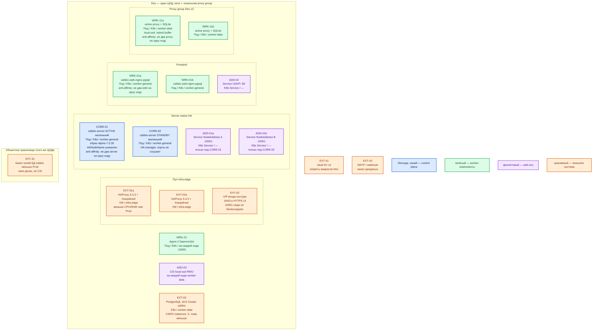

# Zabbix 7.0.30 LTS — развёртывание Dev

Тот же вид инсталляции, что Prod: линия **7.0.30 LTS**, официальные образы `alpine-7.0.30`, **наши** манифесты Kubernetes, native HA (**2** server: ACTIVE + STANDBY), frontend **≥ 2**, PostgreSQL Cluster **`zabbix`** на CNPG (**3** инстанса), proxy group **≥ 2**, Agent 2 DaemonSet. Dev уменьшает CPU/RAM/диск, не меняет роль-модель. Это **не** официальный `compose_pgsql.yaml`, не один контейнер quickstart и не одиночка server без `HANodeName`.

## Допущения

1. Dev — **один** ЦОД, один Kubernetes (тот же **1.36.4**, что Prod). Второго прикладного зала и отдельного ЦОДа бэкапов нет: proxy group «чужого ЦОД-2» как отдельный Kubernetes **не** повторяем. Чтобы вид съёма остался тем же, в этом ЦОДе оставляем **локальную** proxy group из 2 маленьких прокси (хосты — на группу, не напрямую на ACTIVE). Архив WAL БД `zabbix` — меньший бакет **этого** ЦОДа, тот же класс восстановления.
2. Вход: та же пара HAProxy **3.4.3** + Keepalived + VIP, меньше CPU/RAM. **10051** на VIP как ферма ACTIVE+STANDBY не вешаем. **5432** на VIP не публикуем.
3. Те же имена StorageClass: `local-ssd` для Postgres и SQLite прокси, `shared-fs` не для Zabbix. Тома меньше. NFS нет.
4. DNS: CoreDNS / `cluster.local`; снаружи зона `dev.…`. `NodeAddress` — FQDN зоны `dev.…` / Service, не Pod IP.
5. PostgreSQL **13–18** (платформа — **18.6**), отдельный Cluster, не SQLite «на время», не общая БД с карточками. `instances: 3`, не 1 и не 2.
6. Native HA Zabbix — **не** кворум из трёх server: на Dev тоже **2** ноды (`HANodeName`). Сжимать до одного процесса — другой класс (нет выборов ACTIVE, нет проверки `zabbix.conf.php` без адреса).
7. Stateless frontend: минимум **2** реплики на **2** нодах. Одна реплика web — не уменьшенный Prod.
8. Ёмкость — порядок величины меньше Prod, уточняется замером. Учебные `Admin` / `zabbix` из `.install.md` в этот контур **не** копировать как постоянный пароль; секреты Dev свои, не git, не секреты Prod.
9. Java gateway, PDF, Kafka connector, TimescaleDB, Community Helm «мониторинг K8s» — на старте нет, как в Prod.

## Схема инстансов

Имена — роли, не обязательные DNS. Потоков данных нет. Планировщик двигает поды по пулу.

ОС — свойство платформы, не пода. Один стандарт Linux на всех нодах контура.

Исключение вендора: Windows как хост **server / proxy / frontend** не ставим. Agent 2 на наблюдаемых Windows — допустим.

| Имя пула | Роль | Зачем выделен |
|---|---|---|
| `infra-edge` | edge-VM | Та же пара HAProxy + VIP, что Prod; меньше CPU/RAM. Не путь LB 10051. |
| `worker-general` | general | Два маленьких server и два web. Не схлопывать в одну VM. |
| `worker-data` | data-localdisk | Три маленьких ноды Postgres + две под прокси с `local-ssd`. |
| `infra-swift` | object storage | Меньший бакет копий БД в этом ЦОДе. Не CSI. |

Смысл цветов: **синий** — HA-ноды server; **зелёный** — web / proxy / Agent 2; **фиолетовый** — Service / CSI; **оранжевый** — VIP, Postgres, бакет, Vault.

## Комментарии к схеме

### EXT-01 / EXT-02 — пара HAProxy + VIP

- **Функционал.** Тот же вход, что Prod (`:6443` и HTTPS UI). FQDN зоны `dev.…`.
- **Критично.** Не заменять пару одним HAProxy «потому что Dev». Не публиковать UI/**10051** на `0.0.0.0` в интернет. Не один backend на оба server.

### CORE-01 / CORE-02 — native HA

- **Функционал.** Тот же бинарь и тег **`alpine-7.0.30`**, уникальные `HANodeName` / `NodeAddress`. ACTIVE пишет и считает; STANDBY — только HA manager.
- **Критично.** Не `docker compose -f compose_pgsql.yaml up` и не один `zabbix-server` без `HANodeName`: так не воспроизвести failover, `ha_status` и ошибку «frontend зашил адрес мёртвой ноды». Не `replicas: 2` с общим конфигом. Anti-affinity + **2** ноды. Список нод у прокси — оба имени через `;`. Мажорный апгрейд на Dev гонять тем же порядком (одна нода поднимает схему), иначе накат на Prod разъедется.

Ёмкость: ориентир вендора **Small 2 vCPU / 8 ГиБ** на процесс ACTIVE ([requirements](https://www.zabbix.com/documentation/7.0/en/manual/installation/requirements)) — это пример старта, не обещание. STANDBY меньше. Точные requests — замер. Не `resources: {}` «как стенд».

### ADD-01a / ADD-01b — Service на ноду

- **Функционал.** `NodeAddress` и список для прокси.
- **Критично.** Один под на Service. Общий Service на оба — тот же класс поломки, что на Prod.

### WRK-01a / WRK-01b — frontend

- **Функционал.** UI и API, образ `zabbix-web-nginx-pgsql:alpine-7.0.30`.
- **Критично.** **2** реплики, **2** ноды. Одна реплика запрещена паритетом. В `zabbix.conf.php` **не** address:port server. Не пароль `zabbix` из quickstart как постоянный; сменить. После 5 неудач — пауза 30 с.

### WRK-11a / WRK-11b — proxy group

- **Функционал.** Тот же active proxy + SQLite на `local-ssd` + `ProxyBufferMode=hybrid`. Версия **7.0.30**.
- **Критично.** Не выкидывать прокси на Dev «агенты сразу в server»: это другой вид съёма (нет буфера, TLS proxy↔server, failover группы). Не один прокси. Не БД server. Не `ProxyBufferMode=memory` «чтобы легче». TLS к server, если макросы из Vault.

### WRK-21 — Agent 2

- **Функционал.** DaemonSet на каждой ноде, как Prod. `Server` / `ServerActive` — прокси группы.
- **Критично.** Не ставить агента только в контейнер server (как заводской хост Compose на `127.0.0.1` внутри контейнера — там агента нет). Не root.

### EXT-03 — PostgreSQL Cluster `zabbix`

- **Функционал.** Та же правда HA и history.
- **Критично.** `instances: 3`, тома меньше. Не `postgres` из Compose рядом с server. Не один под Postgres. Не NFS. **5432 на VIP нет.**

### EXT-31 — бакет копий

- **Функционал.** Тот же класс: базовая копия + WAL, чтобы restore на Dev проверял то же, что бой.
- **Критично.** Не «снимка PVC server достаточно». Реплики server не бэкап.

### EXT-41 / EXT-42

- **Функционал.** Vault и канал дежурных того же типа, что планируют на Prod — иначе ошибка секретов/media на Prod не всплывёт.
- **Критично.** Секреты Dev ≠ Prod. В git — без значений.

## Путь роста

Тот же список, что Prod, в одном ЦОДе: вертикаль ACTIVE, члены proxy group, том Postgres, затем TimescaleDB. Не «добавить Compose рядом для отладки». Не схлопывать HA «пока нагрузка маленькая».

## Сильные и слабые места

**Сильное.** Тот же механизм и те же роли, что Prod: можно поймать ошибку выката манифестов, failover HA, anti-affinity web, буфер прокси и смену `NodeAddress`. UI≠съём: падение frontend не доказывает «мониторинг жив», если смотреть только браузер.

**Слабое.** Один ЦОД: падение зала = нет мозга и нет «чужого» буфера как в Prod ЦОД-2. Меньше CPU — раньше упрётесь в NVPS; это не смета боя. Нет второго Kubernetes — ошибку «прокси другой площадки не резолвит FQDN `prod.…`» здесь не увидеть без явной проверки DNS/сети.

**Критичные условия**

- Не Compose / не один контейнер / не один server / не один web / не Postgres `instances: 1`.
- **7.0.30**, не `latest`, не 7.4.
- Не stretch (на Dev и некуда).
- Не пароль `zabbix` в git; UI и 10051 не в интернет.
- Не общий Service 10051 на ACTIVE+STANDBY.
- Не общая БД прокси и server.

## Источники

| Факт | Страница |
|---|---|
| Релиз **7.0.30** | https://www.zabbix.com/download_sources |
| Native HA | https://www.zabbix.com/documentation/7.0/en/manual/concepts/server/ha |
| Прокси / hybrid | https://www.zabbix.com/documentation/7.0/en/manual/concepts/proxy |
| Proxy group | https://www.zabbix.com/documentation/7.0/en/manual/distributed_monitoring/proxies/ha |
| Small 2/8; PostgreSQL 13–18; порты | https://www.zabbix.com/documentation/7.0/en/manual/installation/requirements |
| Контейнеры / Compose (не этот контур) | https://www.zabbix.com/documentation/7.0/en/manual/installation/containers |
| Quickstart / вход (учебный пароль) | https://www.zabbix.com/documentation/7.0/en/manual/quickstart/basic_config/login |
| Helm K8s, не server | https://git.zabbix.com/projects/ZT/repos/kubernetes-helm/browse |
| Тег образа | https://hub.docker.com/r/zabbix/zabbix-server-pgsql/tags?name=alpine-7.0.30 |
| Карточка | `Out/Платформенная инфра/Zabbix/Zabbix.md` |
| Учебный стенд (не копировать) | `Out/Платформенная инфра/Zabbix/Zabbix.install.md` |
| Схемы 2–3 ЦОД | `Out/Платформенная инфра/Zabbix/Zabbix.shema.md` |
| Роль консультанта | `Out/Платформенная инфра/Zabbix/Zabbix.consultant.md` |
| Sample | `sample/Zabbix.md` |
| Prod этого контура | `sample2/Zabbix.prod.md` |

**В доке вендора нет:** порог RTT; разрешение Compose как уменьшенный Prod; «на Dev хватит 1 server»; готовая смета millicore.
