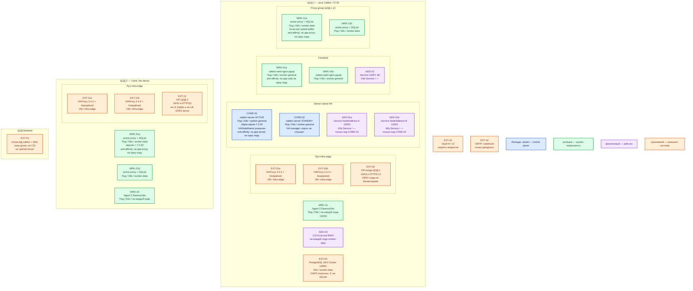

# Zabbix 7.0.30 LTS — развёртывание Prod

Self-hosted мониторинг: хост, проверка (**item**), порог (**trigger**), эскалация. Линия **7.0 LTS**, патч **7.0.30** (полная поддержка линии до 30 июня 2027). Не Zabbix Cloud, не 7.4.14. **Native HA** — встроенный active-passive: в каждый момент собирает и считает триггеры только одна нода server. Это не Raft и не «два писателя».

Механизм: официальные образы `zabbix/*` с тегом **`alpine-7.0.30`** (допустим `ubuntu-7.0.30`) и **наши** манифесты Kubernetes. Официального чарта «весь server 7.0 в Kubernetes» нет: Community Helm ставит съём Kubernetes **из уже живого** Zabbix. Официальный `zabbix-docker` / `compose_pgsql.yaml` — учебный стенд, не этот контур. OpenShift Operator линий 5/6 для 7.0 не брать. AGPLv3 с 7.0 — юридический факт.

## Допущения

1. Prod: **2 прикладных ЦОДа** + **1 ЦОД под бэкапы**. RTT между залами **не измерен**. Порога миллисекунд у Zabbix нет — **мозг** (пара server + writer PostgreSQL) живёт **только в ЦОД-1**. Stretch native HA и синхронного Postgres через город **нет**. ЦОД-2 — **proxy group** (группа прокси: буфер съёма и перераспределение хостов). ЦОД бэкапов — копии БД, не третий writer и не третья proxy group на старте.
2. На каждом прикладном ЦОДе уже есть Kubernetes **1.36.4**, пара HAProxy **3.4.3** + Keepalived + VIP (ControlPlaneEndpoint `:6443` и край HTTP(S)). Kafka `:9092` через этот HAProxy не публикуем. **10051/TCP** на VIP как один backend ACTIVE+STANDBY **не** вешаем: standby порты не слушает.
3. Диски K8s: StorageClass `local-ssd` (RWO) для PostgreSQL Zabbix и файлов SQLite прокси; `shared-fs` (RWX) для Zabbix **не** исключение. NFS не диск Postgres/прокси. Swift — свои диски, не CSI.
4. DNS: внутри CoreDNS / `cluster.local`; снаружи зона `prod.…`. Клиенты UI и прокси ходят по FQDN, не по Pod IP. У каждой server-ноды **свой** FQDN (`NodeAddress`), не общее имя «на оба».
5. База — **отдельный** Cluster PostgreSQL **13–18** (на платформе — линия **18.6**, оператор CNPG). Не общая БД с карточками / Grafana / Camunda. HA этой БД — продукт PostgreSQL, не native HA Zabbix. TimescaleDB Community на старте **не** включаем.
6. Нагрузки / NVPS (проверок в секунду) нет. Таблица Small/Medium/Large вендора — **примеры старта**, не смета «хватит терабайтам». Ёмкость ниже — порядок величины, уточняется замером.
7. Java gateway, PDF web service, Kafka connector, Elasticsearch как history — на старте **нет**. Community Helm мониторинга Kubernetes — путь роста (не установщик мозга).
8. Сеть (VLAN, IP-план) вне рамок. Windows как **сервер** Zabbix вендор не заявляет; Agent 2 на Windows-хостах — отдельно.

## Схема инстансов

Имена — роли, не обязательные DNS. Потоков данных нет. Планировщик двигает поды по пулу; «под на ноде 3» не фиксируем. DaemonSet — «на каждой ноде».

ОС — свойство платформы, не пода. Один стандарт Linux на всех нодах контура.

Исключение вендора: Windows как хост **server / proxy / frontend** не ставим (в таблице платформ server на Windows — «−»). Agent / Agent 2 на наблюдаемых Windows-машинах допустимы.

| Имя пула | Роль | Зачем выделен |
|---|---|---|
| `infra-edge` | edge-VM | Пара HAProxy + Keepalived + VIP: край HTTP(S) и ControlPlaneEndpoint Kubernetes. Не TCP-LB 10051 на ACTIVE+STANDBY. |
| `worker-general` | general | Поды server (без локального SSD под историю) и frontend. История живёт в Postgres. |
| `worker-data` | data-localdisk | PostgreSQL Cluster `zabbix` и прокси с PVC SQLite на `local-ssd`. |
| `infra-swift` | object storage | Бакет копий БД в ЦОДе бэкапов. Не CSI-диск пода Zabbix. |

Смысл цветов для Zabbix: **синий** — ноды native HA server (ACTIVE / STANDBY); **зелёный** — frontend, proxy, Agent 2; **фиолетовый** — Service / CSI; **оранжевый** — VIP, HAProxy, PostgreSQL, Vault, бэкапы, оповещения.

Native HA — **не** кворум из трёх голосующих: третий активный server не появляется. Третья standby-нода — путь роста, не минимум. Кворум «3» относится к PostgreSQL под Zabbix, не к `zabbix_server`.

## Комментарии к схеме

### EXT-01 / EXT-02 / EXT-11 / EXT-12 — пара HAProxy + VIP

- **Функционал.** Вход площадки: `:6443` TCP passthrough к kube-apiserver и HTTPS к UI Zabbix (только ЦОД-1). Снаружи FQDN зоны `prod.…`.
- **Критично.** UI и **10051** не в интернет. VIP **не** round-robin на оба server: standby не слушает рабочие порты, агенты/прокси получат отказ или зависание. Два FQDN `NodeAddress` (по одному на ноду) — отдельные backend, не одна ферма. **5432** на этот VIP не публикуем. Не заменять пару одним HAProxy.

### CORE-01 / CORE-02 — native HA server

- **Функционал.** Процесс `zabbix_server`: ACTIVE собирает (через прокси), считает триггеры, пишет историю, выполняет action. STANDBY держит только **HA manager** (процесс, который смотрит пульс в БД) и рабочие порты **не** слушает. Образ `zabbix/zabbix-server-pgsql`, тег **`alpine-7.0.30`**, не `latest`, не `alpine-7.0-latest`.
- **Критично.**
  - У каждой ноды уникальный `HANodeName` и `NodeAddress` (FQDN:порт, совпадает с IP/FQDN этой ноды). Без `HANodeName` процесс — одиночка, не кластер. Два пода `replicas: 2` с одним конфигом без имён HA = два писателя на одну БД.
  - Стабильная личность: два отдельных Deployment **или** StatefulSet из 2 с DNS `*.svc.cluster.local` **плюс** FQDN зоны `prod.…` для прокси из ЦОД-2. Не общий Service на оба пода для 10051.
  - Anti-affinity: не два server на одну ноду. Минимум **2** ноды `worker-general`.
  - Пульс в БД каждые **5 с**. Корректный stop ACTIVE → перехват ~5 с. Исчезновение без статуса — **failover delay** (завод 1 мин, диапазон 10 с–15 мин) **+ 5 с**. Потеря связи с БД дольше `failover delay − 5 с` → ACTIVE **обязан** уйти в standby. Если мертва БД — HA выбирать не из чего.
  - Frontend при HA **не** зашивает address:port server в `zabbix.conf.php` / `ZBX_SERVER_HOST`: читает активную ноду из таблицы `nodes`.
  - Прокси (active): в `Server` оба имени нод через **точку с запятой**. Агенты, если когда-либо ходят на server напрямую: `Server` через запятую, `ServerActive` — ноды через точку с запятой.
  - Мажорный апгрейд: стоп всех нод, бэкап БД, схему поднимает **одна** нода во временном standalone (`HANodeName` закомментирован), затем снова HA. Минор — сначала одна нода.
  - Третий ACTIVE не появится. Горизонтали записи триггеров нет.
  - Агент на той же машине, что server, — другим UNIX-пользователем (в K8s это другой под). `AllowRoot` не включать.

Ёмкость ACTIVE (порядок величины, **не** «хватит», уточняется замером): таблица вендора — Small **2 vCPU / 8 ГиБ** на 1 000 «метрик» (1 item + 1 trigger + 1 graph), Medium **4 / 16** на 10 000, Large **16 / 64** на 100 000. Для крупной площадки вендор советует БД на **отдельном** сервере — у нас это отдельный Cluster CNPG. Старт мозга — ориентир **Medium на процесс ACTIVE**, STANDBY меньше (только HA manager). Не копировать Small из `sample/Zabbix.md` как смету Prod. Не брать тир Very large «на всякий случай».

### ADD-01a / ADD-01b — Service на каждую server-ноду

- **Функционал.** Стабильный DNS для `NodeAddress` и для списка нод у прокси.
- **Критично.** Селектор — **один** под. Headless/общий Service на ACTIVE+STANDBY ломает модель. Снаружи — имена зоны `prod.…`, не Pod IP.

### WRK-01a / WRK-01b, ADD-02 — frontend

- **Функционал.** PHP UI и JSON-RPC API (`POST …/api_jsonrpc.php`). Историю не хранит — читает PostgreSQL. Образ `zabbix/zabbix-web-nginx-pgsql`, тег **`alpine-7.0.30`**.
- **Критично.** Минимум **2** реплики на **2** нодах, anti-affinity. Отказ UI не останавливает съём ACTIVE при живой БД. HTTPS заканчивается на VIP; путь контейнера Nginx — не обязательно `/zabbix` (это пакетный Apache). Пароль `Admin` / `zabbix` — только учебный стенд; в бою сменить в день установки, люди — SSO (SAML: Entra ID / Okta / OneLogin в мануале), автоматизация — **API-токен** (показывается один раз). После 5 неудачных логинов UI молчит 30 с — не WAF. Guest не включать. Super Admin не в CI.

### WRK-11 / WRK-31 — proxy groups

- **Функционал.** **Active proxy**: сам открывает TLS на **10051** к текущему ACTIVE, забирает конфигурацию, отдаёт буфер. Хосты площадки назначены **группе**, не одному прокси: отказ члена → перераспределение. Образ `zabbix/zabbix-proxy-sqlite3` (или `-pgsql`), тег **`alpine-7.0.30`**. Версия прокси **=** server.
- **Критично.**
  - Своя БД, **не** серверная. SQLite — файл на `local-ssd` (RWO, отдельный PVC). SQLite **in-memory** вендор для боя не предлагает. `ProxyBufferMode=hybrid` (новые установки 7.0); `memory` при рестарте **теряет** буфер; `disk` — поведение до 7.0.
  - Минимум **2** прокси на группу, anti-affinity, **2** ноды `worker-data`. «Один прокси на ЦОД» — нет failover группы.
  - Обрыв канала до мозга: данные в `ProxyOfflineBuffer`; триггеры на server в это время могут **не** считаться. Прокси не заменяет упавший server и мёртвую БД.
  - Между server и proxy при макросах из Vault **нужен TLS** (PSK или сертификаты, те же порты 10050/10051, отдельного TLS-порта нет).
  - В группе: SNMP traps **не** поддерживаются; скрипты/ODBC должны совпадать на всех членах. Агент 7.0+ должен достучаться до **всех** прокси группы (firewall).
  - Хосты ЦОД-1 тоже через **свою** группу, не напрямую на ACTIVE: иначе Dev/Prod и площадки живут разным классом съёма.

### WRK-21 / WRK-32 — Agent 2

- **Функционал.** Читает метрики ОС/приложений. Passive: к агенту стучатся на **10050**. Active: агент сам идёт на **10051** прокси. DaemonSet — на каждой ноде Kubernetes. На VM края и прочих Linux — пакет Agent 2 той же линии **7.0.30**.
- **Критично.** `Server` / `ServerActive` — **прокси группы**, не один IP ACTIVE. Не root. `system.run` по умолчанию выкл. На Windows — Agent 2 с Windows 10 / Server 2016+. Не дублировать без договора те же алерты, что Prometheus.

### EXT-03 — PostgreSQL Cluster `zabbix`

- **Функционал.** Конфигурация, history, trends, события, таблица `nodes` (пульс HA). Порт **5432/TCP**.
- **Критично.** `instances: 3`, `local-ssd`, не NFS, не stretch на ЦОД-2. Клиенты (server, frontend) — FQDN сервиса `-rw` / пулера, не Pod IP. Реплики server **не** бэкап БД. Падение writer Postgres = нет обработки и нет выбора HA. Формула диска вендора ~**90 байт** на значение history; пример 3 000 проверок раз в 60 с × 30 дней ≈ **10,9 ГиБ** истории — ориентир, не терабайт озера. Тома — сотни ГиБ…ТБ, уточняется замером (NVPS × retention). Housekeeper без партиций на большой history сам становится аварией — TimescaleDB Community (2.13.0–2.29.X на 7.0.30) как путь роста, не старт.

### EXT-31 — ЦОД бэкапов

- **Функционал.** Базовая копия + WAL Cluster `zabbix` (процедура PostgreSQL / Barman Cloud).
- **Критично.** Не третий `zabbix_server`. Наличие файлов в бакете не доказательство — нужно пробное восстановление. Proxy group сюда на старте не ставим.

### EXT-41 / EXT-42 — Vault и оповещения

- **Функционал.** Secret macros читает ACTIVE; проблема уходит SMTP или HTTPS webhook.
- **Критично.** Пароли не в открытых макросах и не в git. HA без media/action = «зелёный» мониторинг без дежурного. Падение Zabbix шину Kafka не роняет.

## Путь роста

Не включать сразу.

1. NVPS / CPU ACTIVE — реже interval, меньше LLD, затем вертикаль ACTIVE (poller / trapper / db syncer). Не второй ACTIVE.
2. Съём — ещё члены **существующей** proxy group или новая группа на новую площадку. Не «ещё один server в ЦОД-2».
3. Диск history — больше том `local-ssd` Postgres; затем TimescaleDB Community (compression, drop partition), не Elasticsearch как history.
4. Третья standby-нода server — только если нужен запас HA **внутри ЦОД-1**, не кворум.
5. Ещё реплики frontend в ЦОД-1 — больше операторов UI; съём не ускоряет.
6. Java gateway **10052**, web service PDF **10053**, Kafka connector — по факту JMX / PDF / шины.
7. Community Helm мониторинга Kubernetes — поверх **уже живого** server, не вместо мозга.
8. DR мозга: контролируемый перенос writer Postgres + server в ЦОД-2 по процедуре PostgreSQL; автоfailover между Kubernetes **нет**.

## Сильные и слабые места

**Сильное.** Мозг в одном зале: переключение server не прибито межЦОДовым RTT. Прокси буферизуют обрыв канала. Отказ одного frontend / одного прокси / одной ноды web не останавливает съём. Dev может повторить тот же вид (образы + манифесты, web≥2, HA-пара, Postgres×3), не Compose.

**Слабое.** Смерть ЦОД-1 вместе с Postgres = нет обработки и нет native HA, пока restore; остаются только буферы прокси. Один ACTIVE — нет горизонтали триггеров. Нагрузка не замерена. Standby до переключения «невидим» на 10051 — ошибка LB это ломает.

**Критичные условия**

- **7.0.30**, тег `alpine-7.0.30` / `ubuntu-7.0.30`; не `latest`; не 7.4 «новее = лучше».
- Не официальный Compose и не Community Helm как установщик server+БД.
- Не stretch server/Postgres на 2–3 ЦОДа.
- Не два server без уникальных `HANodeName`. Не TCP-LB 10051 на ACTIVE+STANDBY.
- Не пароль `zabbix` в бою; UI и 10051 не в интернет.
- Не общая БД прокси и server; не SQLite in-memory; не NFS под Postgres.
- Не один frontend и не один прокси «на площадку».
- Агент не под пользователем server.

## Источники

| Факт | Страница |
|---|---|
| Релиз **7.0.30**, не 7.4.14 | https://www.zabbix.com/download_sources |
| Жизненный цикл, AGPLv3 с 7.0 | https://www.zabbix.com/life_cycle_and_release_policy |
| Native HA, `HANodeName` / `NodeAddress`, 5 с, failover delay | https://www.zabbix.com/documentation/7.0/en/manual/concepts/server/ha |
| Прокси, своя БД, hybrid buffer | https://www.zabbix.com/documentation/7.0/en/manual/concepts/proxy |
| Proxy group, SNMP traps в группе нет | https://www.zabbix.com/documentation/7.0/en/manual/distributed_monitoring/proxies/ha |
| Small/Medium/Large; PostgreSQL 13–18; порты; ~90 байт; TimescaleDB 2.13.0–2.29.X | https://www.zabbix.com/documentation/7.0/en/manual/installation/requirements |
| Контейнеры; Compose — страница вендора (не этот контур) | https://www.zabbix.com/documentation/7.0/en/manual/installation/containers |
| Пакеты (запасной боевой путь systemd, не Compose) | https://www.zabbix.com/documentation/7.0/en/manual/installation/install_from_packages |
| Тег образа `alpine-7.0.30` | https://hub.docker.com/r/zabbix/zabbix-server-pgsql/tags?name=alpine-7.0.30 |
| Образы `zabbix/*` | https://hub.docker.com/u/zabbix |
| Вход `Admin` / `zabbix`; пауза 30 с | https://www.zabbix.com/documentation/7.0/en/manual/quickstart/basic_config/login |
| Frontend | https://www.zabbix.com/documentation/7.0/en/manual/installation/frontend |
| JSON-RPC API | https://www.zabbix.com/documentation/7.0/en/manual/api |
| Шифрование, те же 10050/10051 | https://www.zabbix.com/documentation/7.0/en/manual/encryption |
| Vault KV v2 | https://www.zabbix.com/documentation/7.0/en/manual/config/secrets |
| Helm мониторинга Kubernetes, не server | https://git.zabbix.com/projects/ZT/repos/kubernetes-helm/browse |
| Карточка, порты, состав | `Out/Платформенная инфра/Zabbix/Zabbix.md` |
| Учебный Compose (не копировать в бой) | `Out/Платформенная инфра/Zabbix/Zabbix.install.md` |
| Мозг в одном ЦОДе, другие — proxy | `Out/Платформенная инфра/Zabbix/Zabbix.shema.md` |
| Роль консультанта | `Out/Платформенная инфра/Zabbix/Zabbix.consultant.md` |
| Ориентир стенда 2 CPU / 8 ГиБ / 10,9 ГиБ | `sample/Zabbix.md` |

**В доке вендора нет (здесь не выдумано):** порог RTT между залами; готовый чарт «весь server 7.0.30 в Kubernetes»; «хватит N ядер нашей нагрузке»; обещание пережить 2 из 3 ЦОДов native HA; `host_ip: 127.0.0.1` в официальном Compose как модель боя.
