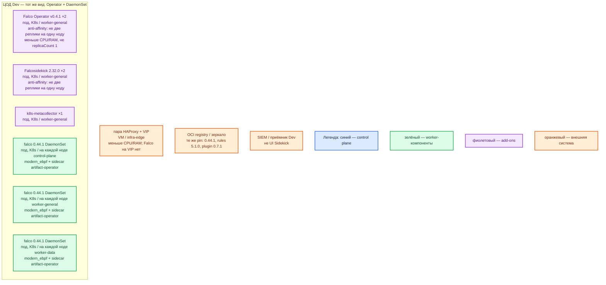

# Falco 0.44.1 — контур Dev

## Допущения

+ Контур **Dev**: 1 ЦОД. Тот же механизм установки и та же роль-модель, что Prod: Falco Operator **v0.4.1** + CR `Falco` с `type: DaemonSet` + драйвер **`modern_ebpf`**. Меньше CPU/RAM за счёт **меньшего числа нод** (меньше агентов), не за счёт смены вида инсталляции.
+ **Не** один под Falco, **не** Deployment `replicas: 1`, **не** Helm-quickstart / Docker Compose / пакет на одной VM вместо оператора. Один под на Dev не воспроизведёт «нода без агента» и параллельную работу DaemonSet.
+ Stretch не применим (одна площадка). Кворума у Falco нет — уменьшать нечего.
+ Та же пара HAProxy **3.4.3** + Keepalived + VIP, меньше CPU/RAM. Kafka :9092 через этот HAProxy не публикуем. Healthz Falco на VIP не выводим.
+ Тот же Kubernetes **1.36.4** / те же имена StorageClass (`local-ssd`, `shared-fs`). Falco PVC не берёт; тома классов на агента не влияют.
+ DNS: CoreDNS / `cluster.local`; снаружи зона `dev.…`. Sidekick — по FQDN Service, не Pod IP.
+ Stateless-доставки: Falcosidekick **≥ 2** реплики на **2** нодах (как в официальном примере Operator и как Prod). Operator — **2** маленьких реплики, anti-affinity.
+ Источник состава — `sample/falco.md`. `IT-landscape.md` не использовался. Карточки `Out/Безопасность/Falco/` — только факты по этому продукту.
+ Falco **не останавливает атаку**. Talon выключен. Windows-ноды не покрываются.
+ Учебный HTTP до Sidekick допустим **только внутри** закрытого кластера. Самоподписанный TLS Falco отвергнет. UI `admin`/`admin` — не в интернет и не в git.

## Схема инстансов

ОС — свойство платформы, не пода. Один стандарт Linux на всех нодах контура.

Исключение вендора: только Linux-ноды. Windows на Dev так же не покрывается.

### Пулы нод

| Имя пула | Роль | Зачем выделен |
|---|---|---|
| `control-plane` | control-plane | Три маленьких stacked control-plane Dev (кворум etcd платформы). DaemonSet Falco — **на каждой** из них, с tolerations. Не «Falco только на worker». |
| `worker-general` | general | ≥2 ноды: Operator и Sidekick с anti-affinity, плюс агент DaemonSet на каждой. |
| `worker-data` | data-localdisk | Те же имена классов, меньшие тома приложений. Агент на каждой data-ноде, иначе ошибка «дропы на брокере» на Dev не воспроизводится. |
| `infra-edge` | edge-VM | Та же пара HAProxy + VIP. Не ноды Kubernetes, DaemonSet их не видит. |

## Комментарии к схеме

### Почему не один под

- **Функционал:** Dev нужен, чтобы поймать ошибку вида инсталляции и ошибку «агент есть не на всех нодах».
- **Критично:** схема «1 под Falco на одну Dev-VM» — другой класс системы. Не воспроизводятся: taint control-plane, DaemonSet rolling update (`maxUnavailable`), параллельные агенты, Sidekick из нескольких реплик. Паритет: тот же CR `kind: Falco` / `type: DaemonSet` / `version: "0.44.1"`.

### Falco Operator v0.4.1 ×2

- **Функционал:** тот же Helm-чарт **0.3.0**, образ **0.4.1**, namespace `falco-operator`. Управляет объектами, не читает ядро.
- **Критично:** не схлопывать в `replicaCount: 1` «потому что Dev». Две маленькие реплики на двух `worker-general`. Не `latest`. Kubernetes Dev тоже ≥ 1.29 (у нас 1.36.4). Запасной Helm `falcosecurity/falco` 9.1.0 — только если кластер старше 1.29; здесь не выбран, иначе Dev и Prod разъедутся.

### DaemonSet falco — на каждой Linux-ноде Dev

- **Функционал:** тот же `modern_ebpf`, тот же sidecar артефактов, те же правила **5.1.0** и плагин контейнера **0.7.1** (сначала плагин, потом правила).
- **Критично:** дефолт ресурсов Operator (100m/1000m CPU, 512Mi/1024Mi RAM) уже невелик. **Не резать CPU limit** «чтобы не мешал Camunda/Kafka на маленьком стенде» — получите дропы, которых в Prod нет, или наоборот спрячете дропы Prod. Уменьшение ёмкости = меньше нод в пулах, не другой контроллер. Проверить, что драйвер реально `modern_ebpf`, а не тихий откат на `kmod`. Покрытие tainted control-plane — обязательно, иначе Dev не покажет слепоту API-нод.

### Falcosidekick ×2

- **Функционал:** приём JSON, дальше в приёмник Dev. Порт **2801**. Версия **2.32.0**.
- **Критично:** минимум 2 реплики на 2 нодах. Одна реплика не покажет потерю HTTP-алертов при выкате. На закрытом Dev допустим HTTP внутри кластера (`http://sidekick.falco.svc.cluster.local:2801`); это **не** копировать в Prod без TLS. UI **2802** / `admin`/`admin` — только закрытый стенд, не край VIP. Запасной stdout/syslog оставить включённым.

### k8s-metacollector ×1

- **Функционал:** обогащение `k8smeta`. Пример вендора — 1 реплика; на Dev не раздуваем.
- **Критично:** падение коллектора не должно считаться «Falco упал».

### Пара HAProxy + VIP

- **Функционал:** тот же ControlPlaneEndpoint и HTTP(S) края, меньше CPU/RAM.
- **Критично:** не публиковать 8765/2801/2802 на VIP «для удобства отладки».

## Путь роста

Сначала больше нод в существующих пулах (DaemonSet сам добавит агентов) и наблюдение дропов. Не переходить на Deployment и не схлопывать в один под. Буферы и overlay правил — те же ручки, что Prod. Не включать UI+Redis и Talon «пока на Dev».

## Сильные и слабые места

+ **Сильная сторона:** тот же Operator, тот же DaemonSet, тот же драйвер, что Prod — ошибка накате правил и taint воспроизводится.
+ **Слабая сторона:** Dev-кластер всё равно должен иметь несколько Linux-нод (control-plane ×3 платформы + ≥2 worker). Это дороже «одного docker run falco», и это плата за паритет.
+ **Критично:** Falco по-прежнему только алертит, не останавливает атаку. Не считать успешный `cat /etc/shadow` на nginx-поде доказательством ёмкости буферов на worker-data. Не использовать kind/minikube с одним агентом как замену этой инструкции.

## Источники

+ Релиз Falco 0.44.1: https://github.com/falcosecurity/falco/releases/tag/0.44.1
+ Operator, DaemonSet vs Deployment: https://falco.org/docs/setup/operator/
+ Operator v0.4.1: https://github.com/falcosecurity/falco-operator/releases/tag/v0.4.1
+ Матрица версий: https://github.com/falcosecurity/falco-operator/blob/main/docs/version-matrix.md
+ Дефолты DaemonSet: https://github.com/falcosecurity/falco-operator/blob/v0.4.1/docs/configuration.md
+ Getting started (Sidekick replicas: 2, `:2801`): https://github.com/falcosecurity/falco-operator/blob/v0.4.1/docs/getting-started.md
+ Учебный контур платформы (pin чарта 0.3.0, image 0.4.1, запрет Deployment для ядра): `Out/Безопасность/Falco/Falco.install.md`
+ modern eBPF: https://falco.org/docs/concepts/event-sources/kernel/
+ HTTP/HTTPS output: https://falco.org/docs/concepts/outputs/channels/
+ Триггер `cat /etc/shadow`: https://falco.org/docs/getting-started/falco-kubernetes-quickstart/
+ sample: `sample/falco.md`

**В доке вендора нет (не угадано):** отдельная «Dev-смета» ядер; разрешение схлопнуть DaemonSet в один под; порог, когда HTTP без TLS считается боем.
