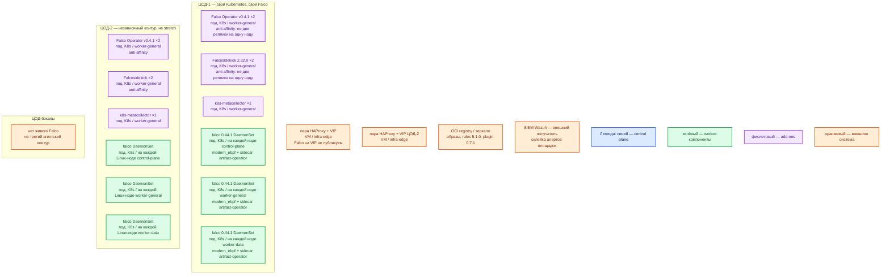

# Falco 0.44.1 — контур Prod

## Допущения

+ Контур **Prod**: 2 прикладных ЦОДа + 1 ЦОД под бэкапы (постановка Task_6). Dev в этой инструкции не описывается.
+ Stretch одного «кластера Falco» между ЦОДами **нет**: у Falco нет кворума, лидера и репликации между агентами. RTT не измерен; порога RTT в документации вендора нет. Два Kubernetes = две независимые установки Falco; склеивают алерты во внешнем SIEM, не процессы на нодах.
+ На каждом прикладном ЦОДе: пара HAProxy **3.4.3** + Keepalived + VIP. VIP = ControlPlaneEndpoint Kubernetes (**6443/TCP**, TCP passthrough) и край HTTP(S). **Kafka :9092 через этот HAProxy не публикуем.** У Falco нет клиентского порта, который нужно вешать на этот VIP.
+ Kubernetes **1.36.4** (≥ 1.29), kubeadm, CRI **containerd**; **1 кластер на прикладной ЦОД**. StorageClass: `local-ssd` (RWO) и `shared-fs` (RWX только по списку исключений). Falco **не** заказывает PVC: агенту общий том не нужен. NFS как диск Falco вендор не описывает.
+ DNS: внутри кластера CoreDNS / `cluster.local`. Снаружи зона `prod.…`. Клиенты (здесь — Falcosidekick и SIEM) ходят по FQDN Service, не по Pod IP.
+ Нагрузка syscall не замерена. Ёмкость CPU/RAM — порядок величины по **дефолту Operator**, уточняется счётчиками дропов. Не включаем «все тумблеры масштабирования вендора».
+ Источник состава ПО — `sample/falco.md`. Карточки `Out/Безопасность/Falco/` — проверенные факты по **этому** продукту. Файл `integrations/IT-landscape.md` **не** использовался.
+ Драйвер боя — **`modern_ebpf`**. Модуль ядра `kmod` — только если eBPF физически не встаёт (нет BTF или BPF ring buffer). Legacy eBPF в ветке 0.44 удалён.
+ Windows-ноды Falco **не** покрывает. Покрытие — только Linux-ноды кластера.
+ Falco **не останавливает атаку**: нет active response, Falco Talon в эту установку не входит.
+ Quickstart оператора с тегом `latest`, UI Sidekick и Redis **не** копируем в бой.

## Схема инстансов

ОС — свойство платформы, не пода. Один стандарт Linux на всех нодах контура.

Исключение вендора: Falco работает только на **Linux** (x86_64 или ARM64). Windows-ноды этой установкой не покрываются.

### Пулы нод

| Имя пула | Роль | Зачем выделен |
|---|---|---|
| `control-plane` | control-plane | kube-apiserver, etcd, scheduler, controller-manager. Taint `NoSchedule`. DaemonSet Falco сюда **обязан** сесть через tolerations — иначе control plane слепой. |
| `worker-general` | general | Stateless-поды и операторы (Falco Operator, Falcosidekick, k8s-metacollector). Anti-affinity: две реплики Operator/Sidekick не на одну ноду. |
| `worker-data` | data-localdisk | Поды с `local-ssd` (Kafka, СУБД и т.п.). Агент Falco здесь же: syscall-шум высокий, CPU агента не душить. |
| `infra-edge` | edge-VM | Пара HAProxy + Keepalived. Это **не** ноды Kubernetes: DaemonSet Falco их не покрывает. |

Если появится выделенный tainted-пул (`worker-kafka` и аналоги), его **не** исключают из DaemonSet: те же tolerations, иначе самые шумные машины остаются без датчика.

## Комментарии к схеме

### ЦОД-1 и ЦОД-2 — две установки, не один Falco

- **Функционал:** на каждой площадке свой Kubernetes и свой контур Falco. Агент читает системные вызовы (вход процесса в ядро: открыть файл, запустить программу, открыть сокет) **только своей** машины.
- **Критично:** нет глобального кластера Falco и нечего растягивать на 2 ЦОДа. Отказ ЦОД-1 = нет и нагрузки, и детекта этой площадки. ЦОД-2 продолжает свой DaemonSet независимо.

### Falco Operator v0.4.1 (add-on)

- **Функционал:** контроллер Kubernetes (процесс, который смотрит Custom Resource и сближает факт с желаемым). Ставит CRD, создаёт DaemonSet Falco, подтягивает Plugin / Rulesfile / Config. Сам системные вызовы **не** читает.
- **Критично:** Kubernetes **≥ 1.29** (native sidecar). Чарт `falcosecurity/falco-operator` **0.3.0**, образ оператора пинить **0.4.1** (`--set image.tag=0.4.1`), не `latest`. Матрица: с Operator v0.4.0 default Falco = 0.44.1; версию агента всё равно пинить в CR `spec.version: "0.44.1"`. Дефолт чарта `replicaCount` — **1**; в бою ставим **2** с anti-affinity: уже запущенный DaemonSet переживает простой Operator, ломается выкат правил. Не удалять объект `Falco` раньше Plugin/Rulesfile/Config: sidecar не снимет finalizer.

### Под falco DaemonSet — на каждой Linux-ноде

- **Функционал:** процесс `falco` + драйвер `modern_ebpf` (eBPF-программа встроена в бинарник, без сборки `.ko`) + sidecar Artifact Operator (доставка правил/плагинов из OCI). Сопоставляет события с YAML-правилами и пишет алерт.
- **Критично:** `spec.type: DaemonSet`. **Deployment с `replicas: 2` для съёма ядра не использовать** — вендор явно даёт Deployment для plugin-only (`engine.kind: nodriver`), это ложное HA и слепые ноды. Один под на ноду; второй процесс на той же ноде поток событий не делит. Образ `falcosecurity/falco:0.44.1`. На ядре: BTF и BPF ring buffer (обычно ядро ≥ 5.8, вендор не ставит жёсткую нижнюю границу). Tolerations на taint control-plane и на dedicated data-пулы. Дефолт Operator (запрос/лимит контейнера `falco`): **100m / 1000m** CPU, **512Mi / 1024Mi** RAM — это не «хватит для терабайт»; millicores «хватит агенту на брокер» в доке вендора нет. Жёсткий CPU limit «чтобы не мешал» → дроп (событие не попало из ядра в обработку) → Falco этого вызова не видел. `syscall_event_drops: ignore` в бою нельзя. PVC / `shared-fs` / NFS агенту не нужны. gRPC-выход в 0.44 удалён. Встроенного продюсера Kafka/NATS нет.

### Правила и плагин контейнера

- **Функционал:** штатные правила OCI `falco-rules` **5.1.0**; плагин контейнера **0.7.1** даёт поля `container.*`. Без плагина штатные правила с `container.*` мертвы. Порядок: сначала Plugin, затем Rulesfile.
- **Критично:** теги пинить, не `latest` из quickstart. Overlay исключений под JVM/Kafka — сужать шум, не выключать детект целиком. Тег sidecar `artifact-operator`, парный к Operator v0.4.1, в configuration.md **не** указан (дефолт образа sidecar — `latest`); в бою задать `ARTIFACT_OPERATOR_IMAGE` явно, не оставлять `latest`.

### Falcosidekick ×2 (маршрутизация, не SIEM)

- **Функционал:** отдельный сервис: принимает JSON по HTTP(S) и раздаёт получателям. В примере оператора порт **2801/TCP**, версия **2.32.0**. Официальный пример CR: `replicas: 2`.
- **Критично:** UI Sidekick (**2802**, дефолт `admin`/`admin`) в бой **не** публиковать. HTTP с самоподписанным сертификатом Falco **не** примет; в бою `http_output` только HTTPS с **валидным** сертификатом. URL/токен SIEM — Secret / Vault, не git. Запасной канал: stdout и syslog (дефолт Operator оба включены) — смерть Sidekick не должна обнулить след. Порты **8765** (healthz/метрики агента), **2801**, **2802** — не Service типа LoadBalancer в интернет и не VIP HAProxy.

### k8s-metacollector ×1

- **Функционал:** собирает метаданные Kubernetes (pod, namespace) для плагина `k8smeta`. Алерт становится понятнее.
- **Критично:** в документации оператора пример — `replicas: 1`. Это не путь детекта: если коллектор недоступен, съём syscalls своей ноды сохраняется, обогащение деградирует. Не путать с «кластером Falco».

### Пара HAProxy + VIP (`infra-edge`)

- **Функционал:** вход Kubernetes API и HTTP(S) края площадки. К Falco не относится.
- **Критично:** healthz Falco и Sidekick на этот VIP не выводить. Kafka :9092 сюда не вешать (платформенное требование, не особенность Falco).

### ЦОД-бэкапы

- **Функционал:** снимки и архивы платформы. Живого DaemonSet Falco здесь нет: нечего растягивать и некого выбирать лидером.
- **Критично:** не делать «третий агентский контур без Kubernetes». Если на площадке бэкапов появится свой Linux-кластер — это **отдельная** установка Operator+DaemonSet, не член контура ЦОД-1.

### SIEM (Wazuh) и OCI registry

- **Функционал:** SIEM хранит и ищет алерты; registry отдаёт образы, правила и плагины.
- **Критично:** Falco не заменяет SIEM. Доставка — Sidekick и/или сборщик логов ноды. Registry — зеркало закрытой сети или контролируемый pull; без сети до `ghcr.io` / `docker.io` агент встанет в idle без правил.

## Путь роста

Масштаб Falco = **число Linux-нод**, не «ещё один кластер Falco» и не второй процесс на ноду. DaemonSet сам добавит под на новую ноду.

Если растут дропы (`scap.n_drops`): сначала сузить `base_syscalls` и шум правил (overlay), затем `buf_size_preset` (больше буфер → меньше дропов, больше RAM). Ориентир troubleshooting вендора: порядка **1–1.5 тыс. событий/с на одно CPU** обычно терпимо, **> ~3 тыс./с** часто тяжело — «grain of salt», не смета боя. Терабайты озера почти не влияют; влияет syscall-шум Kafka/Java.

Не включать сразу: отдельный Falco на Deployment, Talon, UI+Redis, растяжку на два ЦОДа.

## Сильные и слабые места

+ **Сильная сторона:** официальный Operator, тот же DaemonSet и `modern_ebpf` на обеих площадках; отказ одной не слепит другую; RTT между ЦОДами на детект не влияет.
+ **Слабая сторона:** падение пода Falco = **эта нода слепая**, нагрузка жива. Без tolerations слепы control-plane и data-пулы. Ошибка ruleset в общем Git при одном выкате — сразу на всех площадках.
+ **Критично:** Falco **не блокирует** syscall, не убивает под и не заменяет WAF / NetworkPolicy / сканер образов / SIEM. Не ставить Deployment вместо DaemonSet «для HA». Не копировать quickstart `latest`. Не обещать встроенный Kafka-продюсер у 0.44. Не публиковать 8765/2801/2802 в интернет.

## Источники

+ Релиз Falco 0.44.1: https://github.com/falcosecurity/falco/releases/tag/0.44.1
+ Operator, DaemonSet vs Deployment, Kubernetes 1.29+: https://falco.org/docs/setup/operator/
+ Operator v0.4.1: https://github.com/falcosecurity/falco-operator/releases/tag/v0.4.1
+ Матрица версий (v0.4.0+ → Falco 0.44.1): https://github.com/falcosecurity/falco-operator/blob/main/docs/version-matrix.md
+ Дефолты DaemonSet (`modern_ebpf`, 100m/512Mi, webserver 8765, privileged): https://github.com/falcosecurity/falco-operator/blob/v0.4.1/docs/configuration.md
+ Getting started (Sidekick 2.32.0, `:2801`, replicas: 2; metacollector replicas: 1): https://github.com/falcosecurity/falco-operator/blob/v0.4.1/docs/getting-started.md
+ Установка Operator, Helm, порядок uninstall: https://github.com/falcosecurity/falco-operator/blob/v0.4.1/docs/installation.md
+ modern eBPF, BTF/ringbuf, capabilities: https://falco.org/docs/concepts/event-sources/kernel/
+ Дропы: https://falco.org/docs/concepts/event-sources/kernel/dropped-events/
+ Буферы и ориентир событий/с: https://falco.org/docs/troubleshooting/dropping/
+ HTTP/HTTPS, запрет invalid cert; gRPC в 0.44 нет: https://falco.org/docs/concepts/outputs/channels/
+ Helm `falco` 9.1.0 (запасной путь при K8s &lt; 1.29; здесь не выбран): https://artifacthub.io/packages/helm/falcosecurity/falco
+ sample: `sample/falco.md`
+ Карточки платформы: `Out/Безопасность/Falco/Falco.md`, `Falco.install.md`, `Falco.shema.md`, `Falco.consultant.md`

**В доке вендора нет (не угадано):** минимум CPU/RAM «чтобы процесс поднялся» сверх дефолта Operator; millicores «хватит на брокер»; порог RTT между ЦОД; NFS как том Falco; пароль у агента Falco; встроенный продюсер Kafka/NATS у 0.44; парный тег `artifact-operator` к v0.4.1.
