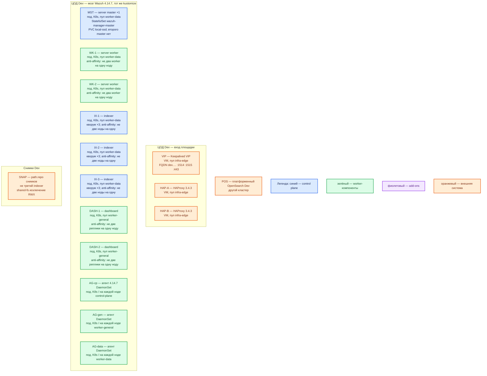

# Wazuh 4.14.7 — развёртывание, контур Dev

**Wazuh** — SIEM: агент собирает события, **server** разбирает правилами, **indexer** хранит алерты, **dashboard** — браузер. Версия **4.14.7**. Это **уменьшенный Prod**, не Quickstart all-in-one и не overlay `envs/local-env`. Indexer — **свой** (`wazuh/wazuh-indexer`), не платформенный OpenSearch.

## Допущения

1. Один прикладной ЦОД. Kubernetes, пара HAProxy 3.4.3 + Keepalived + VIP, StorageClass с теми же именами (`local-ssd`, `shared-fs`), CoreDNS / `cluster.local`, зона `dev.…` — уже есть, меньше CPU/RAM/тома.
2. Способ установки и роль-модель **как в Prod**: репозиторий `wazuh/wazuh-kubernetes` тег **`v4.14.7`**, Kustomize, overlay размера **`envs/eks/`** (3 indexer, 1 master, 2 worker) с патчами StorageClass **`local-ssd`** и Service **ClusterIP**. Не `wazuh-install.sh -a`, не Docker Compose, не `kubectl apply -k envs/local-env/` (там **replicas indexer = 1** и **worker = 1** — другой класс системы). ([kubernetes-deployment](https://documentation.wazuh.com/current/deployment-options/deploying-with-kubernetes/kubernetes-deployment.html), [local-environment.md](https://github.com/wazuh/wazuh-kubernetes/blob/v4.14.7/local-environment.md))
3. Кворум indexer на Dev — **3 маленьких** ноды, не 2 и не 1. Stateless dashboard — **минимум 2** реплики на 2 нодах. Worker — **2**, не 1 (нужна балансировка **1514** и отказ одной ноды).
4. Нагрузка не боевая. Уменьшаем CPU/RAM/PVC, не вид инсталляции и не число голосующих indexer.
5. Снимки — `path.repo` на `shared-fs` (явное исключение RWX), не NFS как диск данных. Секреты overlay GitHub (`password`, `SecretPassword`) в этот контур как «почти бой» **не** копируем.
6. Источник состава — `sample/wazuh.md`. `integrations/IT-landscape.md` **не** использовался.

## Схема инстансов

Потоков данных на схеме нет. Состав ролей совпадает с Prod; меньше ресурсы и диски. Второго ЦОДа нет.

ОС — свойство платформы, не пода. Один стандарт Linux на всех нодах контура.

Исключение вендора: server / indexer / dashboard — только Linux. Windows как хост этих ролей в списке вендора нет. Агент на Windows — пакет, если такие VM на Dev появятся.

| Имя пула | Роль | Зачем выделен |
|---|---|---|
| `infra-edge` | edge-VM | Та же пара HAProxy + VIP, что в Prod; меньше CPU/RAM у VM |
| `worker-data` | data-localdisk | Три маленьких indexer + master + 2 worker на `local-ssd`; пул ≥ 3 нод |
| `worker-general` | general | Две маленькие реплики dashboard; пул ≥ 2 нод |
| `control-plane` | control-plane | Кворум etcd платформы. Агент DaemonSet — **на каждой** из этих нод |
| `infra-swift` | vendor / object | Выгрузка снимков; не диск пода indexer |

Отдельного оператора нет (как в Prod): Kustomize применяет CI/`kubectl`.

## Комментарии к схеме

### Чем Dev упрощает Prod (и чем не упрощает)

| Меняем | Не меняем |
|---|---|
| CPU/RAM/PVC меньше | Тег **`v4.14.7`**, образы `wazuh/*:4.14.7`, Kustomize |
| Один ЦОД, один мозг | Роли: indexer ×3, master ×1, worker ×2, dashboard ×2, агент DaemonSet |
| Тома меньше, те же имена StorageClass | `local-ssd` RWO для данных; не NFS как диск indexer |
| Меньше срок ISM на учебных индексах | Кворум 3 indexer, не 2 и не 1 |

Так воспроизводятся ошибки вида инсталляции (накат kustomize, выборы indexer на **9300**, Filebeat→**9200**, VIP **1514** на два worker), которые all-in-one на одной VM и `local-env` (1+1) **не** показывают.

### VIP / HAP-A / HAP-B — вход

- **Функционал.** Как в Prod: FQDN `dev.…` на VIP. HAProxy: **1515** → Service master, **1514** → Service worker, **443** → dashboard (**5601** в контейнере). Пара остаётся парой. ([load-balancers](https://documentation.wazuh.com/current/user-manual/wazuh-server-cluster/load-balancers.html))
- **Критично.** Не подменять VIP прямым `kubectl port-forward` как единственным входом «потому что Dev» — тогда не проверяется TCP passthrough и отказ одной VM края. Не публиковать 1514/1515/443/9200 с VIP в интернет. Kafka `:9092` не вешать.

### MST — маленький master

- **Функционал.** Тот же StatefulSet `wazuh-manager-master`, **1** реплика, образ `wazuh/wazuh-manager:4.14.7`. Filebeat в том же образе.
- **Критично.** Не ставить второй master «для HA на стенде» — вендор так не умеет. Не заменять StatefulSet одним контейнером all-in-one. PVC `local-ssd`, маленький (порядок **10–20 ГиБ**). Ресурсы порядка **1 vCPU, 2 ГиБ RAM**. Уточняется замером. Ключ кластера 32 символа — свой, не эталон GitHub.

### WK-1 / WK-2 — маленькие worker

- **Функционал.** Тот же StatefulSet, **replicas: 2**. Нужны, чтобы на Dev была балансировка **1514** и отказ одного worker.
- **Критично.** Не патчить до **1**, как делает `envs/local-env/wazuh-resources.yaml`. Схема «1 worker» не воспроизведёт выкат и leastconn. Anti-affinity *required*, в пуле `worker-data` реально ≥ 2 нод (лучше 3 вместе с indexer). Не душить CPU limit до отброса событий. Порядок: **1 vCPU, 2 ГиБ**, PVC **10–20 ГиБ**. Уточняется замером.

### IX-1..3 — маленькие indexer, кворум 3

- **Функционал.** Тот же StatefulSet `wazuh-indexer`, **replicas: 3**, совмещённые роли cluster-manager + data. Выборы и **9300** между подами — как в Prod.
- **Критично.** Не `replicas: 1` из `envs/local-env/indexer-resources.yaml` и не один процесс Quickstart: нет большинства eligible, replica шарда некуда положить. Не 2 ноды (отказ одного = тупик кворума). Anti-affinity *required*, пул ≥ 3 нод — иначе три пода на одном хосте снова станут «как all-in-one». PVC `local-ssd` порядка **20–50 ГиБ**. Ресурсы порядка **1–2 vCPU, 4 ГиБ RAM**, куча **`Xms=Xmx` ≈ 2g** (половина RAM), лимит пода **выше** кучи. База манифеста **-Xms1g / limit 2Gi** здесь допустима как порядок Dev, не как смета Prod. На нодах **`vm.max_map_count=262144`**. Шаблон алертов: **1 replica** (завод 0). Не слать сюда приложения вместо платформенного OpenSearch.

### DASH-1 / DASH-2 — dashboard

- **Функционал.** Тот же Deployment, **2** маленькие реплики (эталон вендора 1 — пример, не запрет).
- **Критично.** Не `replicas: 1` «потому что Dev»: не будет балансировки HTTPS и отказа ноды UI. Anti-affinity, пул `worker-general` ≥ 2. Порядок: **200–400m CPU, 512Mi–1 ГиБ**. Учётки — не `admin`/`SecretPassword` из overlay как боевые; для закрытого стенда заменить сразу.

### AG-* — агенты

- **Функционал.** Тот же DaemonSet `wazuh/wazuh-agent:4.14.7` на **каждой** Linux-ноде Dev, имя = нода, tolerations на control-plane.
- **Критично.** Не один sidecar «на учебный под»: ошибка «taint control-plane / нода без агента» не воспроизведётся. Без томов хоста агент хост не видит. `WAZUH_MANAGER` = FQDN VIP, не Pod IP.

### SNAP — снимки

- **Функционал.** Тот же механизм Shared file system / `path.repo`, меньший объём — чтобы на Dev отрабатывали snapshot/restore, не только PVC.
- **Критично.** Не класть единственную копию на тот же `local-ssd`, что шарды. Не считать replica бэкапом. S3/Swift для Wazuh indexer в просмотренных страницах вендора нет.

## Путь роста

На Dev рост не планируем как боевой. Если не хватает места — увеличить PVC/RAM **этих же** ролей, не переходить на all-in-one и не резать indexer до 1. Добавление worker и +indexer нечётно — только если сознательно копируем Prod-эксперимент.

## Сильные и слабые места

- **Сильная сторона.** Тот же kustomize и те же роли, что Prod: можно поймать сбой наката, кворума indexer, anti-affinity и VIP 1514. Три маленьких indexer остаются кворумом.
- **Слабая сторона.** Малая ёмкость: OOM и disk watermark наступят раньше. Один ЦОД: падение зала = нет SIEM. Если в пуле меньше 3 data-нод, планировщик соберёт кворум на одном хосте.
- **Критичные условия.** Не Quickstart `-a`. Не `envs/local-env`. Не 1–2 indexer. Не 1 worker и не 1 dashboard. Не NFS как диск данных. Не `latest`. Не общий кластер с платформенным OpenSearch. `vm.max_map_count ≥ 262144`. 1514/1515/443/9200 не в интернет. Учебные пароли overlay в git не оставлять.

## Источники

Те же, что у Prod:

- Релиз 4.14.7: https://documentation.wazuh.com/current/release-notes/release-4-14-7.html
- Архитектура и порты: https://documentation.wazuh.com/current/getting-started/architecture.html
- Kubernetes, `-b v4.14.7`: https://documentation.wazuh.com/current/deployment-options/deploying-with-kubernetes/kubernetes-deployment.html
- CSI / StatefulSet / Deployment: https://documentation.wazuh.com/current/deployment-options/deploying-with-kubernetes/kubernetes-conf.html
- Overlay `envs/eks` vs `local-env` (режет до 1 indexer / 1 worker): https://github.com/wazuh/wazuh-kubernetes/blob/v4.14.7/local-environment.md
- Репозиторий: https://github.com/wazuh/wazuh-kubernetes/tree/v4.14.7
- Шарды, 0 replicas с завода, куча: https://documentation.wazuh.com/current/user-manual/wazuh-indexer/wazuh-indexer-tuning.html
- HAProxy 1514/1515: https://documentation.wazuh.com/current/user-manual/wazuh-server-cluster/load-balancers.html
- Quickstart all-in-one (именно **не** этот контур): https://documentation.wazuh.com/current/quickstart.html
- Карточка / install: `Out/Безопасность/Wazuh/Wazuh.md`, `Wazuh.install.md`

**В доке вендора нет:** порог RTT; готовая смета ядер под Dev; Helm-оператор; сертификат «local-env = уменьшенный прод» (наоборот: local-env меняет число ролей).
