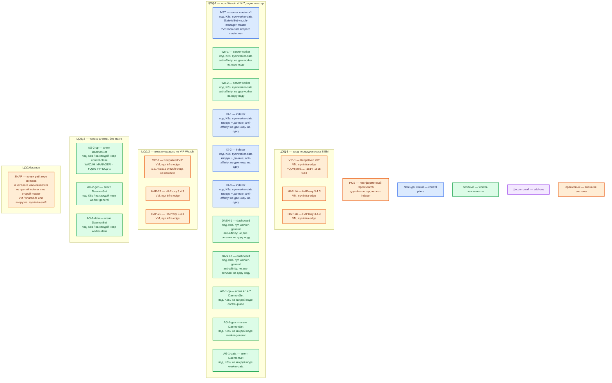

# Wazuh 4.14.7 — развёртывание, контур Prod

**Wazuh** — SIEM: агент собирает события с машины, **server** разбирает их правилами, **indexer** хранит алерты, **dashboard** показывает их в браузере. Это **своя** установка **4.14.7**, не Wazuh Cloud. Indexer — поисковый кластер **этого** продукта (образы `wazuh/wazuh-indexer`), **не** платформенный OpenSearch.

**Kustomize** — способ наложить готовые манифесты Kubernetes поверх базовых YAML (репозиторий `wazuh/wazuh-kubernetes`, тег **`v4.14.7`**). Отдельного Helm-оператора у вендора в этом гайде **нет**.

## Допущения

1. Контур Prod: **2 прикладных ЦОДа** + **1 ЦОД под бэкапы**. RTT между залами **не измерен**. Stretch одного кластера server/indexer на 2–3 ЦОДа **нет**: порога допустимой задержки у вендора нет. Мозг SIEM (indexer + один master + worker + dashboard) — **только ЦОД-1**. ЦОД-2 шлёт **агентами** на FQDN VIP ЦОД-1. Второй полный Wazuh на ЦОД-2 = второй SIEM, не HA. ([architecture](https://documentation.wazuh.com/current/getting-started/architecture.html), карточка `Wazuh.md`)
2. На каждом прикладном ЦОДе уже есть Kubernetes **1.36.4**, пара HAProxy **3.4.3** + Keepalived + VIP, StorageClass `local-ssd` (RWO) и `shared-fs` (RWX), CoreDNS / `cluster.local`, зона `prod.…`.
3. Способ установки: **`kubectl apply -k`** по репозиторию `wazuh/wazuh-kubernetes` ветка **`v4.14.7`**. База ролей — overlay размера **`envs/eks/`** (3 indexer, 1 master, 2 worker), **не** `envs/local-env/` (там 1 indexer и 1 worker) и **не** Quickstart all-in-one. StorageClass в патче — **`local-ssd`**, не `wazuh-storage`/AWS EBS из эталона. Service типа `LoadBalancer` (AWS) → **ClusterIP**; вход — VIP HAProxy. ([kubernetes-deployment](https://documentation.wazuh.com/current/deployment-options/deploying-with-kubernetes/kubernetes-deployment.html), [local-environment.md](https://github.com/wazuh/wazuh-kubernetes/blob/v4.14.7/local-environment.md))
4. Нагрузка (события/с) **не замерена**. Ниже — минимальная отказоустойчивая топология, не смета «хватит на терабайты». Overlay с кучей Java **1g** и лимитом **2 ГиБ** на indexer **в бой не копируем**. (`Wazuh.consultant.md`, [indexer-tuning](https://documentation.wazuh.com/current/user-manual/wazuh-indexer/wazuh-indexer-tuning.html))
5. Кластер **server** — не Raft: **один** master, worker сами стучатся на **1516**. Второго master штатно нельзя. Кворум большинства — у **indexer** (три ноды). ([types-of-nodes](https://documentation.wazuh.com/current/user-manual/wazuh-server-cluster/types-of-nodes.html))
6. Заводской шаблон индекса алертов: **3 primary / 0 replicas**. Для трёх нод indexer задаём **1 replica** (падение узла иначе дырявит индекс). ISM (Index State Management — политика возраста индексов) — отдельно; пример вендора **90 дней**, не ваша норма. ([indexer-tuning](https://documentation.wazuh.com/current/user-manual/wazuh-indexer/wazuh-indexer-tuning.html), [ISM](https://documentation.wazuh.com/current/user-manual/wazuh-indexer-cluster/index-lifecycle-management.html))
7. Снимки индексов вендор описывает как репозиторий типа **Shared file system** (пример NFS `/mnt/snapshots`). Это **не** диск данных indexer. PVC данных — только `local-ssd`. `shared-fs` (RWX) — **явное исключение** только для `path.repo` снимков. Отдельной страницы «repository-s3 / Swift для Wazuh indexer» в источниках **нет** — не подставляем. ([migrating indices](https://documentation.wazuh.com/current/user-manual/wazuh-indexer/migrating-wazuh-indices.html))
8. Секреты overlay (`admin`/`SecretPassword`, `kibanaserver`, API `wazuh-wui` / `MyS3cr37P450r.*-`, пароль регистрации **`password`**, ключ кластера из GitHub) **в бой не копируем**. Active Response на интеграционном контуре **выключен**. Поиск уязвимостей через CTI вендора в закрытом контуре можно не включать. ([kubernetes-deployment](https://documentation.wazuh.com/current/deployment-options/deploying-with-kubernetes/kubernetes-deployment.html))
9. Источник состава — `sample/wazuh.md` (цифры all-in-one там — ориентир железа для **другого** вида установки, не этой). `integrations/IT-landscape.md` **не** использовался.

## Схема инстансов

Имена — роли, не обязательные DNS. Потоков данных на схеме нет. ЦОД-2 **не** несёт второй indexer/master.

ОС — свойство платформы, не пода. Один стандарт Linux на всех нодах контура.

Исключение вендора: центральные роли (server / indexer / dashboard) вендор ставит на **Linux** (список пакетов: Amazon Linux 2/2023, CentOS Stream 10, RHEL 7–10, Ubuntu 16.04–24.04). Windows как хост этих ролей в списке **нет**. Агент на Windows/VM — отдельный пакет, не DaemonSet Linux-кластера. ([quickstart](https://documentation.wazuh.com/current/quickstart.html), [агент](https://documentation.wazuh.com/current/installation-guide/wazuh-agent/index.html))

| Имя пула | Роль | Зачем выделен |
|---|---|---|
| `infra-edge` | edge-VM | Пара HAProxy + Keepalived + VIP. На ЦОД-1 — край `:1514`/`:1515` (TCP) и `:443` dashboard. Kafka `:9092` через этот HAProxy не публикуем. |
| `worker-data` | data-localdisk | StatefulSet indexer и manager: PVC **`local-ssd`** RWO. Пул ≥ 3 нод под anti-affinity indexer. |
| `worker-general` | general | Stateless dashboard ×2. PVC indexer/manager сюда не сажаем. |
| `control-plane` | control-plane | etcd/API Kubernetes. Агент DaemonSet сюда **обязан** сесть через tolerations. |
| `infra-swift` | vendor / object | ЦОД бэкапов: выгрузка снимков/`/var/ossec`; не CSI-диск пода indexer. |

Фиолетовый на схеме пустой: **отдельного оператора Wazuh нет**. Add-on — манифесты Kustomize, которые применяет CI/`kubectl`, не постоянно живущий контроллер.

## Комментарии к схеме

### VIP-1 / HAP-1A / HAP-1B — вход мозга

- **Функционал.** VIP — виртуальный IP Keepalived: одно имя зоны `prod.…` для агентов и браузера. HAProxy 3.4.3 — TCP-край. Вендор рекомендует балансировщик перед кластером server (пример — HAProxy): **1515** только на master, **1514** на worker. Dashboard снаружи — **443** → Service `dashboard` (в контейнере слушает **5601**). Клиенты по FQDN, не Pod IP. ([load-balancers](https://documentation.wazuh.com/current/user-manual/wazuh-server-cluster/load-balancers.html), [kubernetes-conf](https://documentation.wazuh.com/current/deployment-options/deploying-with-kubernetes/kubernetes-conf.html))
- **Критично.** Эталон `wazuh`/`wazuh-workers`/`dashboard` — `type: LoadBalancer` под AWS; на своей площадке — **ClusterIP** + бэкенды этой пары HAProxy. **1516**, **9200**, **9300**, **55000** на VIP в интернет и на «мир» не публиковать. **1515** нельзя слать на worker: регистрация (`authd`) живёт на master. Kafka `:9092` на этот HAProxy не вешать. На VIP-2 (ЦОД-2) порты Wazuh **не** слушаем: иначе получится второй вход без мозга.

### MST — единственный master

- **Функционал.** StatefulSet `wazuh-manager-master`, образ `wazuh/wazuh-manager:4.14.7`, **replicas: 1**. Регистрация агентов **1515**, REST API **55000**, эталон правил и ключей. Filebeat (читает JSON-алерты с диска manager и отдаёт в indexer **9200**) входит в **этот же** образ на каждом узле server, отдельного пода нет. ([kubernetes-conf](https://documentation.wazuh.com/current/deployment-options/deploying-with-kubernetes/kubernetes-conf.html), [architecture](https://documentation.wazuh.com/current/getting-started/architecture.html))
- **Критично.** Второго активного master **нет**, автовыбора лидера нет. Падение master останавливает enrollment, API и синхронизацию; вендор не даёт SLA «анализ без master». Файл `ossec.conf` на worker **сам не копируется**. PVC — `local-ssd` RWO (ключи агентов в `/var/ossec`); потеря тома = флот регистрировать заново. Overlay EKS: request **1 CPU / 1 ГиБ**, limit **2 CPU / 2 ГиБ**, PVC **50 ГиБ** — ориентир манифеста, не смета боя. Порядок величины боя: **2–4 vCPU, 4–8 ГиБ**, PVC десятки ГиБ; **уточняется замером**. Цифр «хватит N» в мануале нет. Ключ кластера — **ровно 32 символа**, не строка из GitHub. ([cluster.conf](https://documentation.wazuh.com/current/user-manual/reference/ossec-conf/cluster.html), [eks wazuh-master-resources.yaml](https://github.com/wazuh/wazuh-kubernetes/blob/v4.14.7/envs/eks/wazuh-master-resources.yaml))

### WK-1 / WK-2 — worker

- **Функционал.** StatefulSet `wazuh-manager-worker`, тот же образ manager в роли worker, эталон **replicas: 2**. Приём событий **1514**, разбор (`analysisd` / `remoted`). Worker сам инициирует связь с master по **1516**. Горизонтальный рост приёма — **ещё worker**, не второй master. ([types-of-nodes](https://documentation.wazuh.com/current/user-manual/wazuh-server-cluster/types-of-nodes.html), [indexer-sts / worker-sts v4.14.7](https://github.com/wazuh/wazuh-kubernetes/tree/v4.14.7))
- **Критично.** Anti-affinity: не два worker на одну ноду. В эталоне — *preferred*; для отказа ноды задать *required*, иначе оба worker могут сесть вместе. Жёсткий CPU **limit** на worker → отброс событий (`events_dropped` / `discarded_count`). Overlay EKS: 1–2 CPU, 1–2 ГиБ, PVC **50 ГиБ**. Порядок боя: **2–4 vCPU, 4–8 ГиБ**; **уточняется замером**. Не схлопывать в 1 worker: это другой класс (нет балансировки 1514).

### IX-1 / IX-2 / IX-3 — indexer, кворум ×3

- **Функционал.** StatefulSet `wazuh-indexer`, образ `wazuh/wazuh-indexer:4.14.7`, **replicas: 3** (комментарий манифеста: «3 master nodes»). REST **9200**, транспорт нод **9300**. По умолчанию каждая нода indexer — cluster-manager-eligible **и** data/ingest/coordinating; выделенные роли — путь роста, не старт. Это **не** платформенный OpenSearch. ([indexer-sts.yaml](https://raw.githubusercontent.com/wazuh/wazuh-kubernetes/v4.14.7/wazuh/indexer_stack/wazuh-indexer/cluster/indexer-sts.yaml), [cluster-tuning](https://documentation.wazuh.com/current/user-manual/wazuh-indexer-cluster/wazuh-indexer-cluster-tuning.html))
- **Критично.**
  - Три ноды в **одном** ЦОДе. Не три indexer в трёх ЦОДах как «один кластер».
  - Anti-affinity *required*: не две ноды на один хост; пул `worker-data` ≥ 3.
  - PVC **`local-ssd`** RWO, не `shared-fs`, не NFS как диск **данных**. Эталон PVC **10 ГиБ** (EKS overlay) / **500 МиБ** (база) — стенд, не терабайты.
  - На нодах: **`vm.max_map_count=262144`**. Init-контейнер манифеста делает `sysctl` privileged — на хосте значение всё равно должно держаться.
  - Куча Java: **`Xms = Xmx`**, ориентир **половина RAM**. База манифеста `-Xms1g` при limit 2 ГиБ **в бой не копировать**. Рекомендация вендора для узла indexer (не K8s overlay): минимум **4 ГиБ / 2 CPU**, рекомендовано **16 ГиБ / 8 CPU**. Порядок старта боя: **4–8 vCPU, 16 ГиБ RAM**, куча **8g**, PVC от сотен ГиБ (события/с × срок ISM). **Уточняется замером.** Не обещание «влезут терабайты».
  - Шаблон алертов: выставить **`number_of_replicas: 1`** (завод **0**). Приложения платформы на **9200** не ходят.
  - `CLUSTER_NAME` / discovery — только эти три пода; не смешивать с платформенным OpenSearch. ([installation-guide indexer](https://documentation.wazuh.com/current/installation-guide/wazuh-indexer/index.html), [eks indexer-resources.yaml](https://github.com/wazuh/wazuh-kubernetes/blob/v4.14.7/envs/eks/indexer-resources.yaml))

### DASH-1 / DASH-2 — dashboard

- **Функционал.** Deployment `wazuh-dashboard`, образ `wazuh/wazuh-dashboard:4.14.7`. Своего склада нет: ищет в indexer, агентами управляет через API master. Эталон вендора — **replicas: 1**; это пример поставки, **не** запрет нескольких реплик на тот же indexer. Ставим **2** на двух нодах `worker-general` (отказ одной ноды UI и балансировка HTTPS). ([kubernetes-conf](https://documentation.wazuh.com/current/deployment-options/deploying-with-kubernetes/kubernetes-conf.html), `Wazuh.md`)
- **Критично.** Anti-affinity. Service эталона — LoadBalancer **443→5601**; у нас ClusterIP + VIP. Не публиковать dashboard в интернет. Учётки — свои секреты, не `SecretPassword`. Смена пароля API `wazuh-wui` без правки конфига dashboard **ломает** UI. Overlay EKS: request **200m / 512Mi**, limit **400m / 2Gi**. Порядок: **0.5–1 vCPU, 1–2 ГиБ**; **уточняется замером**.

### AG-* — агенты DaemonSet

- **Функционал.** Образ `wazuh/wazuh-agent:4.14.7`. **DaemonSet** на каждом Linux-кластере (ЦОД-1 и ЦОД-2): имя агента = имя ноды, иначе ноды сливаются в UI. Tolerations на `control-plane` и tainted data/kafka-пулы. Windows/отдельные VM — пакет той же версии. Менеджер **не старше агента наоборот**: версия manager ≥ версии агента. ([агент](https://documentation.wazuh.com/current/installation-guide/wazuh-agent/index.html), [docker-агент](https://documentation.wazuh.com/current/deployment-options/docker/wazuh-container.html))
- **Критично.** Без bind `/var/log`, `/proc` (hostPath/volumes) контейнерный агент **хост не видит**. Официальный Docker-агент — syslog-коллектор, не замена наблюдения за хостом. Агенты ЦОД-2 знают **FQDN VIP ЦОД-1**, не Pod IP worker. Пароль регистрации — длинный свой, не строка `password` из Secret эталона. **1515** не с мира. FIM — минимум путей, не каталог данных Kafka «всё подряд».

### SNAP — ЦОД бэкапов

- **Функционал.** Живого Wazuh здесь **нет**. Копии: секреты/сертификаты, PVC master (`/var/ossec` — ключи агентов), файлы snapshot repository (`path.repo`).
- **Критично.** Реплика шарда **не** бэкап (`DELETE` уйдёт на все копии). Вендорный пример снимка — NFS Shared file system; NFS **как диск данных** indexer не используем. `shared-fs` только как `path.repo`. Плагина S3 для Wazuh indexer в просмотренных страницах нет. Падение ЦОД-1 = нет SIEM для всех площадок, пока restore; очередь агента при недоступности 1514 **не** обещана бесконечной.

### POS — платформенный OpenSearch

Показан, чтобы **не** направить Filebeat/dashboard в чужой кластер. Другие права, другие индексы, другая линейка.

### Чего на схеме нет специально

- Quickstart all-in-one (`wazuh-install.sh -a`) и Docker Compose.
- Overlay `envs/local-env` (1 indexer, 1 worker).
- Второй master, stretch 9300/1516, выделенные cluster_manager/warm-ноды indexer (рост).
- Helm-оператор Wazuh (его нет в гайде).
- Active Response, CTI, syslog **514** (коллектор по умолчанию выключен).

## Путь роста

Не включать сразу. Когда замер покажет упор:

1. Приём событий: добавить **worker** (scale StatefulSet `wazuh-manager-worker`), не второй master.
2. Поиск/диск: увеличить PVC indexer (`allowVolumeExpansion` у `local-ssd`) и heap; затем добавить ноды indexer **нечётно** в том же ЦОДе и переразложить шарды. Выделенные `cluster_manager` / coordinating / hot-warm — только после замера. ([cluster-tuning](https://documentation.wazuh.com/current/user-manual/wazuh-indexer-cluster/wazuh-indexer-cluster-tuning.html))
3. Срок хранения — ISM, не бесконечный диск.
4. Межплощадочная видимость — **агенты** на VIP ЦОД-1, не второй мозг и не общий 9300.

## Сильные и слабые места

- **Сильная сторона.** Официальный kustomize `v4.14.7`, те же роли, что потом на Dev: 3 indexer, 1 master, ≥2 worker. Падение одного worker переживается VIP; падение одной ноды indexer — replica шарда. Мозг не едет по межЦОДовому RTT.
- **Слабая сторона.** Падение ЦОД-1 = нет SIEM для ЦОД-2. Master единственный. Ёмкость без замера неизвестна. Эталонные секреты и 1g heap известны как антипаттерн боя.
- **Критичные условия.** Не stretch. Не `envs/local-env` и не all-in-one как «прод». Не платформенный OpenSearch как indexer. Не `latest`, не пароль `password`/`SecretPassword`. Не NFS как диск данных. `vm.max_map_count ≥ 262144`. Replica индекса ≥ 1. 1514/1515/443/9200/9300/1516/55000 не в интернет. Dashboard не LoadBalancer в мир.

## Источники

- Релиз 4.14.7: https://documentation.wazuh.com/current/release-notes/release-4-14-7.html
- Архитектура и порты: https://documentation.wazuh.com/current/getting-started/architecture.html
- Один master, `ossec.conf` не синхронизируется: https://documentation.wazuh.com/current/user-manual/wazuh-server-cluster/types-of-nodes.html
- Агенты: балансировщик vs список: https://documentation.wazuh.com/current/user-manual/wazuh-server-cluster/agent-connections.html
- HAProxy перед 1514/1515: https://documentation.wazuh.com/current/user-manual/wazuh-server-cluster/load-balancers.html
- Шарды/копии, завод 0 replicas, куча `Xms=Xmx`: https://documentation.wazuh.com/current/user-manual/wazuh-indexer/wazuh-indexer-tuning.html
- Роли нод indexer: https://documentation.wazuh.com/current/user-manual/wazuh-indexer-cluster/wazuh-indexer-cluster-tuning.html
- ISM, пример 90 дней: https://documentation.wazuh.com/current/user-manual/wazuh-indexer-cluster/index-lifecycle-management.html
- Снимки (Shared file system / NFS): https://documentation.wazuh.com/current/user-manual/wazuh-indexer/migrating-wazuh-indices.html
- Kubernetes, clone `-b v4.14.7`: https://documentation.wazuh.com/current/deployment-options/deploying-with-kubernetes/kubernetes-deployment.html
- StatefulSet vs Deployment, минимум 2 CPU / 3 ГиБ / 2 ГиБ «поды поднялись»: https://documentation.wazuh.com/current/deployment-options/deploying-with-kubernetes/kubernetes-conf.html
- Репозиторий манифестов: https://github.com/wazuh/wazuh-kubernetes/tree/v4.14.7
- `local-env` режет indexer и worker до 1: https://github.com/wazuh/wazuh-kubernetes/blob/v4.14.7/local-environment.md
- CPU/RAM server и indexer (пакеты, не overlay): https://documentation.wazuh.com/current/installation-guide/wazuh-server/index.html , https://documentation.wazuh.com/current/installation-guide/wazuh-indexer/index.html
- Карточка / install / схема: `Out/Безопасность/Wazuh/Wazuh.md`, `Wazuh.install.md`, `Wazuh.shema.md`
- Состав sample (all-in-one — **не** этот контур): `sample/wazuh.md`

**В доке вендора нет (не выдумано):** порог RTT для растяжки 9300/1516; «хватит N ядер / M ТБ под ваш APS»; Helm-оператор Wazuh 4.14.7; repository-s3/Swift для indexer; запрет двух реплик dashboard.
