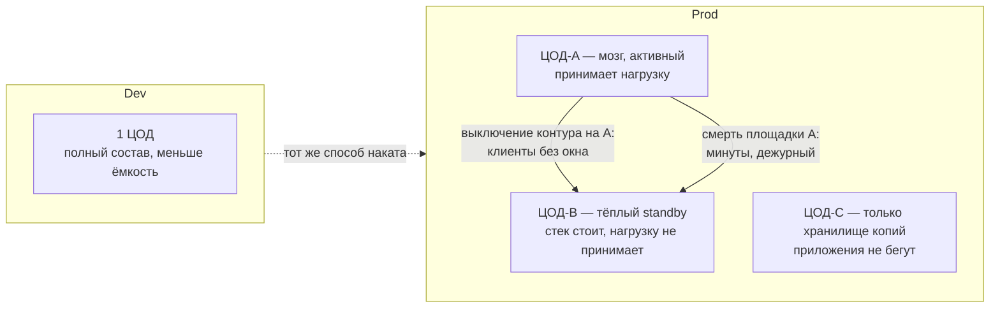

# 1. Модель сред

**Статус слоя:** закрыт. Дальше — `2. Платформа/платформа.md`.

**Контур** — изолированный экземпляр ландшафта: свой Kubernetes, свои VIP, свои имена в DNS.

---

## Картина

Stretch stateful-кластеров между ЦОДами **нет**. Каждый боевой ЦОД — свои кластеры. Между A и B — репликация и переключение клиентов, не один Kafka/etcd «на город».

VIP Keepalived живёт **внутри одного ЦОДа**. Общего VIP на A+B нет: иначе это уже растянутый вход между площадками.

---

## 1.1. Контуры и DNS

| Решение | Статус |
|---|---|
| В этой итерации описываем **Dev** и **Prod** | **ЗАФИКСИРОВАНО** |
| **Test** будет **до запуска Prod**; срок и площадка неизвестны — в карту ЦОДов этой итерации не кладём | **ЗАФИКСИРОВАНО** |
| Когда Test появится — тот же способ наката, что у Prod, не quickstart | **ЗАФИКСИРОВАНО** |
| Dev — отдельный контур: отдельный Kubernetes-кластер и отдельные VM, не namespace в Prod | **ЗАФИКСИРОВАНО** |
| Одна внешняя DNS-зона: `oreon.moskva.ru` | **ЗАФИКСИРОВАНО** |
| Имена Dev и Prod различаются внутри этой зоны. Dev: `dev.oreon.moskva.ru` | **ЗАФИКСИРОВАНО** |
| Отдельной зоны `prod.oreon.moskva.ru` нет | **ЗАФИКСИРОВАНО** |

Клиенты ходят по FQDN, не по Pod IP (Task_6). Конкретные имена сервисов (Kafka, VIP ЦОД-A vs ЦОД-B) — слой 2 и каталог.

**Допущение.** `dev.oreon.moskva.ru` — префикс имён в зоне `oreon.moskva.ru`, не вторая делегированная зона, которую надо вести отдельно. Если у сетевиков зона всё же делегирована — на состав контуров это не влияет, меняется только «кто правит записи».

---

## 1.2. ЦОДы и роли

| Площадка | Роль | Статус |
|---|---|---|
| Dev | 1 ЦОД | **ЗАФИКСИРОВАНО** |
| ЦОД-A | Мозг Prod. Активный: принимает нагрузку. Здесь SoT, Vault, GitLab и прочие «главные» инстансы, пока каталог не скажет иначе | **ЗАФИКСИРОВАНО** |
| ЦОД-B | Тёплый standby: системы **уже развёрнуты и запущены**, нагрузку клиентов **не** принимают, пока жив A | **ЗАФИКСИРОВАНО** |
| ЦОД-C | Только хранилище копий. Приложений нет. Kubernetes и HAProxy **не** ставим | **ЗАФИКСИРОВАНО** |
| Stretch | Нет | **ЗАФИКСИРОВАНО** |

Два боевых ЦОДа — не active/active и не один кластер на две площадки.

**Следствие для слоя 2.** Платформенный Kubernetes и край (HAProxy + Keepalived + VIP) — в Dev, в ЦОД-A и в ЦОД-B. В ЦОД-C — нет.

**Сильная сторона.** Мозг, тёплый standby и копии разведены по ролям.

**Слабое место (осознанно).** ЦОД-B по железу почти как второй Prod. Данные на B отстают (асинхронная репликация, пока не доказано иное). Это согласовано с 1.4: хвост можно потерять.

**Критично.** RTT между ЦОДами неизвестен. Здания (один кампус / разные площадки) не фиксировали: для ЦОД-C копии в том же здании не спасают от пожара; на состав Dev/Prod сейчас не влияет.

---

## 1.3. Паритет Dev и Prod

| Правило | Статус |
|---|---|
| Сначала Prod, потом Dev как упрощение | **ЗАФИКСИРОВАНО** |
| Тот же механизм установки и та же роль-модель | **ЗАФИКСИРОВАНО** |
| Dev уменьшает CPU/RAM/диск, не вид инсталляции | **ЗАФИКСИРОВАНО** |
| Stateless: на Dev минимум 2 реплики на 2 нодах | **ЗАФИКСИРОВАНО** |
| Кворум: на Dev обычно 3 маленьких узла, не 2 | **ЗАФИКСИРОВАНО** |
| Нагрузка не замерена: минимальный HA + путь роста отдельно | **ЗАФИКСИРОВАНО** |
| Состав на Dev полный; исключений «на Dev не ставим» нет | **ЗАФИКСИРОВАНО** |

**Кворум** — решение есть, только если живо большинство узлов. На двух узлах большинства нет (split-brain).

Типы с кворумом (не исчерпывающий список): Kafka KRaft controller, etcd / Kubernetes control plane, ClickHouse Keeper, Vault Raft, OpenSearch cluster manager, PostgreSQL с автофейловером (Patroni / CloudNativePG).

---

## 1.4. Непрерывность

Внутри ЦОД-A отказ **одного** экземпляра (под, нода) закрывается паритетом 1.3 / Task_6: реплики и кворум на площадке. ЦОД-B для этого не нужен.

Между площадками:

| Сценарий | Цель | Статус |
|---|---|---|
| Плановое или контурное выключение приложения **на всём ЦОД-A** | Клиенты идут на ЦОД-B **без окна** обслуживания | **ЗАФИКСИРОВАНО** |
| Площадка ЦОД-A недоступна целиком | Простой — **минуты**, переключает **дежурный**. Потеря последних ещё не уехавших на B данных **допустима** | **ЗАФИКСИРОВАНО** |
| Обновление ПО | Только **rolling** (по узлу/реплике, сервис на площадке не выключаем целиком) | **ЗАФИКСИРОВАНО** |

**RPO** (сколько данных можно потерять) при смерти A — не ноль. **RTO** (сколько простоя) при смерти A — минуты, человек в контуре. «Без окна» относится к уходу клиентов на уже тёплый B при выключении контура на A, не к чуду «A исчез, ни одной потерянной записи».

**Критично для края.** Переключение A→B — смена того, куда смотрят клиентские FQDN (или иной вход вне VLAN-деталей). Не общий Keepalived-VIP на два ЦОДа. Как именно дежурный «щёлкает» (какая запись в `oreon.moskva.ru`) — слой 2, без IP-плана.

Как зеркалировать Kafka/Postgres на B — не этот слой; без этого «тёплый standby» не имеет свежих данных. Каталог и способ наката.

---

## 1.5. Что сознательно не в этом слое

- IP-план, VLAN — вне рамок (Task_6).
- Операторы, пулы нод, CNI — слой 2–3.
- Число инстансов PostgreSQL — слой 5.
- Конкретные FQDN Prod в зоне `oreon.moskva.ru` — слой 2 и каталог.
