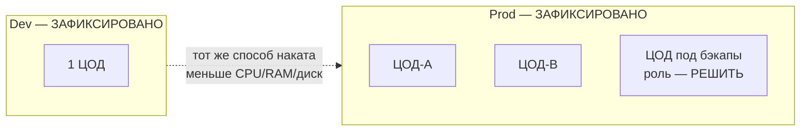

# 1. Модель сред

**Зачем слой.** Среда (контур) — это изолированный экземпляр ландшафта: свой Kubernetes, свои VIP, своя DNS-зона. Пока не ясно, сколько сред и как они делят ЦОДы, бессмысленно рисовать поды.

**Как закрыть.** Ответить на вопросы ниже. Не переходить к слою 2, пока роль ЦОДа под бэкапы и список контуров не зафиксированы.

---

## Картина, которую уже можно нарисовать

---

## 1.1. Список контуров

**Контур** — полный набор систем для одной цели (разработка, приёмка, бой). Не «namespace в общем кластере», пока вы явно не решили иначе.

| Вопрос | Статус | Черновик |
|---|---|---|
| Какие контуры делаем в этой итерации? | **РЕШИТЬ** | В постановке названы только **Dev** и **Prod**. Часто ещё бывают Test (автотесты) и Stage (генеральная репетиция боя). Без Stage первый выкат в Prod негде прогнать тем же способом. |
| Dev — отдельный контур, не «namespace в Prod»? | **ПРЕДЛОЖЕНО** | Да, **отдельный Kubernetes-кластер** (и отдельные VM для того, что не в K8s). Иначе квоты, RBAC и «уронили общий etcd» смешивают Dev и Prod. **Допущение:** изоляция кластерами, не namespace. |
| Имена DNS-зон контуров | **ПРЕДЛОЖЕНО** | Шаблон из Task_6: `dev.…` и `prod.…`. Полное имя зоны (например `dev.platform.internal`) — **РЕШИТЬ**. |

Ответ (список контуров в этой итерации): _

Ответ (DNS-зона Dev / Prod): _

**Слабое место.** Если оставить только Dev+Prod, негде безопасно прогонять «как в бою» перед релизом. Это сознательное упрощение, не ошибка — но его нужно выбрать явно.

---

## 1.2. ЦОДы и роли

| Вопрос | Статус | Черновик |
|---|---|---|
| Dev | **ЗАФИКСИРОВАНО** | 1 ЦОД |
| Prod | **ЗАФИКСИРОВАНО** | 2 ЦОДа + 1 ЦОД под бэкапы |
| Что делает «ЦОД под бэкапы»? | **РЕШИТЬ** | Варианты, которые обычно путают: (а) только хранилище копий (ленты/S3/диски), приложения там не бегут; (б) холодный DR — можно поднять контур за часы/сутки; (в) тёплый standby — часть систем уже стоит, но не принимает нагрузку. От выбора зависят Swift, GitLab, Postgres PITR и «нужен ли там Kubernetes». |
| Как работают два боевых ЦОДа? | **РЕШИТЬ** | (а) активный + пассивный: нагрузка в одном, второй ждёт; (б) активный + активный: оба принимают нагрузку. Для Kafka/Postgres/etcd «оба активны как один кластер» — это уже stretch (кластер, растянутый между площадками). |
| Stretch stateful между ЦОДами? | **ПРЕДЛОЖЕНО** | **Нет.** В `Common.txt` RTT между ЦОДами неизвестен. Stretch etcd/Kafka/Postgres при неизвестной задержке — частая причина скрытых сбоев. Каждый ЦОД — свой кластер; между площадками потом отдельно: репликация/зеркала/бэкап. **Допущение:** нет stretch. **Критично:** если руководство ждёт «один кластер Kafka на город» — это другое решение, его нужно сказать сейчас. |
| Какой ЦОД — «мозг» Prod (SoT, Vault, GitLab…)? | **РЕШИТЬ** | Нужно имя/номер: ЦОД-A или ЦОД-B. Иначе каталог инстансов некуда класть. |
| Город / одна площадка vs разные здания | **РЕШИТЬ** | Из `Common.txt`: 3 ЦОДа в одном городе. Для бэкапов важно: бэкап-ЦОД в том же здании не спасает от пожара. |

Ответ (роль ЦОДа под бэкапы): _

Ответ (два боевых ЦОДа: active/passive или иное): _

Ответ (мозг Prod): _

Ответ (подтверждаю «нет stretch» / хочу иначе): _

**Сильная сторона рамки Task_6.** Явно отделён бэкап-ЦОД: не нужно притворяться, что три одинаковых боя.

**Слабое место.** Пока не ясна роль бэкап-ЦОДа, слой 2 не знает: ставить ли туда Kubernetes и HAProxy.

---

## 1.3. Паритет Dev и Prod

| Правило | Статус |
|---|---|
| Сначала Prod, потом Dev как упрощение | **ЗАФИКСИРОВАНО** |
| Тот же механизм установки и та же роль-модель | **ЗАФИКСИРОВАНО** |
| Dev уменьшает CPU/RAM/диск, не вид инсталляции | **ЗАФИКСИРОВАНО** |
| Stateless: на Dev минимум 2 реплики на 2 нодах | **ЗАФИКСИРОВАНО** |
| Кворум (большинство голосов): на Dev обычно 3 маленьких узла, не 2 | **ЗАФИКСИРОВАНО** |
| Нагрузка не замерена: минимальный HA + путь роста отдельно | **ЗАФИКСИРОВАНО** |

Кворум простыми словами: система принимает решение, только если жив **большинство** узлов. На двух узлах большинства нет: упал один — второй не знает, можно ли быть главным (split-brain — «два главных»).

Список типов с кворумом из постановки (не исчерпывающий): Kafka KRaft controller, etcd / Kubernetes control plane, ClickHouse Keeper, Vault Raft, OpenSearch cluster manager, PostgreSQL с автофейловером (Patroni / CloudNativePG).

| Вопрос | Статус | Черновик |
|---|---|---|
| Dev уменьшаем по **составу продуктов** или только по железу? | **ПРЕДЛОЖЕНО** | Состав тот же (все продукты из `sample/`, которые решим ставить). Иначе ошибка «этого компонента на Dev не было» снова не воспроизведётся. Исключения (не ставим на Dev) — только явным списком. **Допущение:** полный состав, меньше ёмкость. |

Ответ (полный состав на Dev / список исключений): _

---

## 1.4. Ожидания непрерывности

Из `Common.txt`: 24/7 «не обсуждалось», ожидание беспрерывной работы. Нагрузка неизвестна, объём — терабайты.

| Вопрос | Статус | Черновик |
|---|---|---|
| Целевое время простоя Prod (ориентир, не SLA-договор) | **РЕШИТЬ** | Например: «пережить отказ 1 ноды без окна»; «отказ целого ЦОДа — простой до восстановления из бэкапа». Без этой фразы два боевых ЦОДа можно понять и как hot-standby, и как «второй потом». |
| Окно на обновление | **РЕШИТЬ** | Есть ли ночь, когда можно выключать, или только rolling (по одному узлу). |

Ответ (отказ ноды / отказ ЦОДа / обновление): _

---

## 1.5. Что сознательно не в этом слое

- IP-план, VLAN, модель сети ЦОД — вне рамок (Task_6).
- Выбор операторов и пулов нод — слой 2–3.
- Сколько инстансов PostgreSQL — слой 5.
